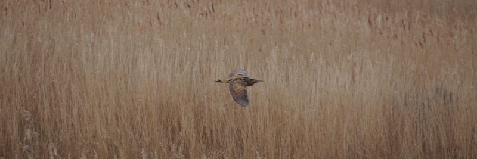

### A Change of Seasons

Winter is going. Rolled over holiday for AB1 is about to expire. It's 
probably too early for many spring birds, but let's try to find some anyway.

This post covers birding undertaken between 26th March and Sunday 3rd April, 
2022.

### Stanage Edge

Ring Ouzel should have started to arrive here by now, although they are 
secretive buggers, and we probably get to Stanage somewhat too late (11, 
rather than, say, 8) to find them. Thankfully, some Red Grouse decide to put 
on a show for us in lieu of finding an Ouzel, and the edge itself provides a 
super-scenic backdrop for a gentle trundle around.

<figure class="figure">
  
  <figcaption class="figure-caption text-center">
    Not just famous, but fabulous.
  </figcaption>
</figure>

<figure class="figure">
  
  <figcaption class="figure-caption text-center">
    Off for afternoon tea somewhere, no doubt.
  </figcaption>
</figure>

<figure class="figure">
  
  <figcaption class="figure-caption text-center">
    Stanage Edge
  </figcaption>
</figure>

### A sign of Spring

Sunday brings a visit to Attenborough, where a sign of Spring appears: can 
you find it?

<figure class="figure">
  
  <figcaption class="figure-caption text-center">
    Spot The Bird: Cetti's Warbler
  </figcaption>
</figure>

### Breckland

#### Day One

A change of location, in search of Goshawk. We start off with a quick trip 
to May Day Farm in Thetford Forest. The weather is definitely Spring; a 
t-shirt and jeans is enough to be warm.

One circuit of the Goshawk trail finds lots of littlies, but no sign of 
Goshawk or Woodlark: Siskin, Redpoll, Brambling are the highlights.

<figure class="figure">
  
  <figcaption class="figure-caption text-center">
    Uncooperative Chiffchaff (sing to chorus of Seal - Killer).
  </figcaption>
</figure>

<figure class="figure">
  
  <figcaption class="figure-caption text-center">
    A decently lit Buzzard enjoying the warmth.
  </figcaption>
</figure>

<figure class="figure">
  
  <figcaption class="figure-caption text-center">
    Yellowhammer
  </figcaption>
</figure>

A bit of a more determined explore North of the trail is made, but it only 
yields mammals, and, later, some seriously loud military aircraft coming in 
to Lakenheath.

<figure class="figure">
  
  <figcaption class="figure-caption text-center">
    A few deer (one albino, or possible leucistic).
  </figcaption>
</figure>

The resulting figure of eight leaves enough time for a quick trip to Lynford 
Arboretum. There's time for a quick explore of the lakes North of the 
arboretum itself; this is a bit of a waste of time - they hold no ducks of 
interest, despite having an excellent hide. The arboretum is full of 
Goldcrests - I find perhaps ten of them in the area nearest the carpark.

A brief phone call from my accommodation provider abruptly brings 
proceedings to a halt; apparently they've been unable to get in touch with 
the person that operates the little self-catering place I've reserved, so I 
need to find somewhere else to stay! Humph. Thankfully, second choice Swan 
Inn (in Hilborough) still has availability, and it turns out to be an 
excellent (if occasionally eccentric) choice.

#### Day Two

A bit of online research suggests there's an alternative Goshawk site quite 
near the Swan. A thick early morning mist refuses to shift, however, so a 
great deal of staring at greyness is the only result.

<figure class="figure">
  
  <figcaption class="figure-caption text-center">
    There could be hundreds of Goshawks in this picture, for all I know.
  </figcaption>
</figure>

Fine then; back to the arboretum - perhaps we'll find something in the murk 
there? The weather does brighten up in patches but it's still pretty 
miserable; a complete change from the balmy t-shirt weather of the day 
before, today it's all three layers and wondering if a fourth might have 
been a good idea.

There are fewer Goldcrests today. In the area around the bridge, a single 
Marsh Tit awaits.

<figure class="figure">
  
  <figcaption class="figure-caption text-center">
    A blurry Marsh Tit. Light conditions were mixed...
  </figcaption>
</figure>

Crossbills are nowhere to be found; in the area near the 
roost there are hundreds of Redwing, though.

On the route back to the car park, a friendly gentlemen points out a 
a place where a Tawny Owl often roosts. And, indeed, there's one there. To 
my surprise though, he struggles to get on to it, but isn't that bothered; 
he's just cheerful to have shared the secret.

<figure class="figure">
  
  <figcaption class="figure-caption text-center">
    Arse of a Tawny Owl.
  </figcaption>
</figure>

Back to the car: where next? Let's see if we can find Lesser-spotted 
Woodpecker at Santon Downham.

Initial signs look good - not only has one chap found the woodpecker, but 
several Kingfishers and three otters. I follow his directions in hope of 
picking up where he left off, and find...absolutely sod all. A couple of 
other areas that really ought to support a Little Owl and Woodlark 
respectively are also completely bereft of birds. Humph.

Unbowed by such poor results, it's time to try another site; post number 7 
on the road up from the A11 into the forest.

The light's now a bit better; we'll pay the cost of the intermittent 
drizzle that seems to have caused it. This bit of the forest is full of 
Chaffinches and Brambling, to a point where their calls start to get a bit 
tiring.

<figure class="figure">
  
  <figcaption class="figure-caption text-center">
    This slightly better lit Great Tit is a tonic.
  </figcaption>
</figure>

After a short walk the forest opens up into a big clearing - if Goshawks 
exist (evidence for this fact seems somewhat scant so far) perhaps we'll see 
them over the trees from this clearing. Presumably the best place to do that 
from is the middle of the clearing, so that's where I go.

There are several Buzzard visible from here over the next hour or so, and a 
very confiding pair of Stonechat, but of Goshawk there is no sign.

<figure class="figure">
  
  <figcaption class="figure-caption text-center">
    Stonechat in the drizzle.
  </figcaption>
</figure>

Back to the car for a brief nap.

Revived, I decide to retreat to Lakenheath, for some easier birding; a 
break from this hard-going forest nonsense. To my chagrin though, even that 
seems somewhat unbirded; on a quick circuit of the reserve the only event of note is disturbing some Greylag Geese who had taken up residence on the riverside footpath.

Thankfully, the flash opposite the reserve on the other side of the Little 
Ouse has some waders; plenty of Black-tailed Godwit, some Redshank, one or 
two Avocets. As the afternoon waxes into the evening, a Corn Bunting turns 
up, and a Kingfisher puts in a series of appearances up and down the river. 
As the light fades further, a Barn Owl appears from somewhere off to the 
East, and flops about for a few minutes. An otherwise empty day gets a let 
off at the last minute.

#### Day Three

A quick trip to Weeting; apparently our thick-kneed friends have already 
arrived there. It ends up not being a quick trip - the chap in the visitor 
centre is _exceptionally_ knowledgeable, and I leave with good instructions 
for possible Woodlark at the top of the nearby ridge.

As ever, the Stone Curlew are visible from the West hide, on the rotavated 
bit of field they can hide in so well.

<figure class="figure">
  
  <figcaption class="figure-caption text-center">
    Stone Curlews.
  </figcaption>
</figure>

A quick visit to the East hide for completeness yields some amusing Shelduck;
there's a pair that are constantly flying around the reserve; it's not clear 
why.

Now, to try the woodlark route. The instructions are to head up track 49 
until there's an option to turn slightly right out of the woodland, along a 
path between a well fenced field on the left and an area of scrub on the right.

[This pin](https://www.google.co.uk/maps/dir//52.475075,0.5787635) on Google 
Maps is the midpoint of that bit of path. There were plenty of Stonechat 
here, along Linnets, a few Yellowhammer, and, just as I was about to give 
up, a single Woodlark preening in a dead tree.

Further visits to track 7 and Santon Downham don't give up any further 
species of interest. Forest birding continues to be hard work.

#### Day Four

The sun returns! Birding still proves difficult. Lynford Arboretum continues to 
be free of Crossbill, and its crests remain golden rather than fiery.

<figure class="figure">
  
  <figcaption class="figure-caption text-center">
    There are some happy cows though.
  </figcaption>
</figure>

<figure class="figure">
  
  <figcaption class="figure-caption text-center">
    And this handsome Blackbird.
  </figcaption>
</figure>

Santon Downham _still_ won't give up a Lesser-spotted Woodpecker. A more 
extended walk through the forest to the North of the river there yields more 
Stonechats but again, of Goshawk there is no sign. Nor are there Woodlarks. 
Let's move on.

A trip to Cavenham Heath finally yields not one confiding Woodlark, but a 
pair of them.

<figure class="figure">
  
  <figcaption class="figure-caption text-center">
    Woodlarks.
  </figcaption>
</figure>

<figure class="figure">
  
  <figcaption class="figure-caption text-center">
    Woodlarks.
  </figcaption>
</figure>

There's just enough time in the day left to try one further site for Goshawk 
near Cockley Cley. Here, for the first time, something that _might_ have 
been a Goshawk occurs - an appropriate big hawk bundles itself between two 
bits of forest, but so quickly that I barely get bins on it. Definitely not 
enough for any real confidence in that bit of ID. Humph.

<figure class="figure">
  
  <figcaption class="figure-caption text-center">
    This leucistic Pheasant was easier to pick out.
  </figcaption>
</figure>

<figure class="figure">
  
  <figcaption class="figure-caption text-center">
    This hare makes things look almost Springy.
  </figcaption>
</figure>

<figure class="figure">
  
  <figcaption class="figure-caption text-center">
    Until this blizzard descended perhaps five minutes later.
  </figcaption>
</figure>

#### Day Five

An early morning visit to Santon Downham on the way to the Suffolk coast 
finds this _excellent_ Treecreeper.

<figure class="figure">
  
  <figcaption class="figure-caption text-center">
    Treecreeper
  </figcaption>
</figure>

### Suffolk Coast

Well, mostly Minsmere, to be fair.

#### Day one

After a surprisingly lengthy drive, there's enough afternoon left for a 
quick Minsmere visit. The weather's _much_ better. Good enough, in fact, for 
an edition of spot the bird.

<figure class="figure">
  
  <figcaption class="figure-caption text-center">
    Spot the Jack Snipe.
  </figcaption>
</figure>

At this point, it's time to head into Leiston to find where I'm staying 
(this time the reservation's worked, what a relief) and to locate 
appropriate sustenance. On which note: Dear Adnams, Either make better beer, 
or let more pubs in Suffolk be non-Adnams pubs. No love, AB1. (Food and 
superior ale are acquired from the nearby Co-op).

#### Day two

A more timely and better planned trip to Minsmere yields more fruit. Bittern 
is heard booming from Bittern hide. Occasionally one flaps up out of the 
reeds for a quick tour. A pair of Marsh Harriers are collecting nest material.

<figure class="figure">
  
  <figcaption class="figure-caption text-center">
    They must have had a huge mound of twigs going on somewhere.
  </figcaption>
</figure>

Further round the reserve, the Jack Snipe is still visible from the North 
hide, even if the reported Smew is still missing. There's an exceptionally 
confiding Snow Bunting on the first bit of beach; it doesn't even mind being 
interrupted by a toddler. Amazing.

<figure class="figure">
  
  <figcaption class="figure-caption text-center">
    A very friendly Snow Bunting.
  </figcaption>
</figure>

At the far end of the beach section, there's excitement. Why? There's a 
small bird darting around that looks like Stonechat to me. And another one 
next to it? Oh, no, that's actually a Black Redstart. Excellent. The 
Stonechats appear to dislike its presence and generally harangue it, until 
it eventually decides it's had enough and disappears over the sluice.

<figure class="figure">
  
  <figcaption class="figure-caption text-center">
    Black Redstart (and Stonechat escort).
  </figcaption>
</figure>

Further round, there's a big tour group in the South hide. They've got a 
decent amount to look at, too.

<figure class="figure">
  
  <figcaption class="figure-caption text-center">
    Avocet from the South hide.
  </figcaption>
</figure>

<figure class="figure">
  
  <figcaption class="figure-caption text-center">
    Barnacle Geese
  </figcaption>
</figure>

I settle down in the cafe with a hot chocolate, satisfied with a fine day 
out, only to discover there's a further Black Redstart (possibly the same 
bird?) visible from there!

<figure class="figure">
  
  <figcaption class="figure-caption text-center">
    You again?!
  </figcaption>
</figure>

Despite a jam-packed Minsmere outing, it's still only lunchtime. Let's go 
grab some fish and chips from Southwold harbour. The portions are enormous; 
a further nap is required to recover.

Fortified post fish banquet, there's still time for a quick visit to 
Westleton Heath. The book reckons this is one of the easiest places to see Dartford 
Warbler in the UK, and it is correct; once I've seen one Dartford I can't 
stop seeing them.

<figure class="figure">
  
  <figcaption class="figure-caption text-center">
    They are still uncooperative photographic subjects though.
  </figcaption>
</figure>

<figure class="figure">
  
  <figcaption class="figure-caption text-center">
    This is a good representation of what one usually sees.
  </figcaption>
</figure>

<figure class="figure">
  
  <figcaption class="figure-caption text-center">
    This one managed to stay still for two or three seconds.
  </figcaption>
</figure>

#### Day Three

There's just enough time in the morning for another trip to the Bittern hide.
The Marsh Harriers are still nest building, but today, the real highlight is 
a pair of Bitterns chasing and calling each other in flight.

<figure class="figure">
  
  <figcaption class="figure-caption text-center">
    Here they are, on a little jaunt.
  </figcaption>
</figure>

<figure class="figure">
  
  <figcaption class="figure-caption text-center">
    Here's a more traditional shot of a single Bittern.
  </figcaption>
</figure>

All in all, an excellent trip, even if the Brecks bit was short several of 
the target species (Goshawk, Lesser-spotted Woodpecker, Crossbill, Firecrest)!

