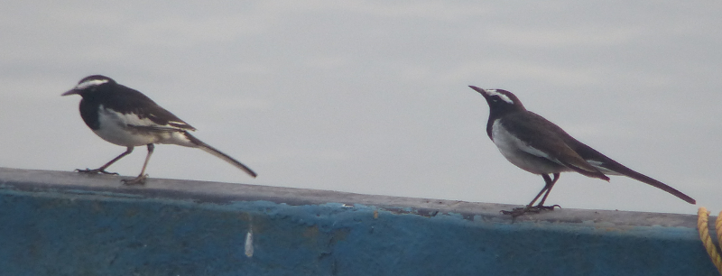

### A Winter Trip To Goa

Work's been busy for both average birders this year, and a great deal
of holiday needed spending before it was over.

Much research was done to find a warm place with respectable avifauna
in November; it's not a month for cheery birding in the UK.

After a brief fling with the idea of The Gambia (ended by the demise
of Thomas Cook), we eventually chose to go to Goa.

#### The Itinerary

We flew direct from Gatwick to Goa, spending a couple of days
acclimatising in the capital, Panaji. After that, we
travelled to North Goa, to stay on Morjim beach. Finally we travelled
to South Goa, staying in Patnem.

#### Panaji

Having done some research, we had great plans to do extensive exploring (to 
Carambolim Lake and Chorao Island) and boat trips (along the Zuari), but 
these got nixed by jetlag in favour of much easier walks around town, and a
 historical walking tour of Old Goa.

These trundles did yield a few birds. Not least kites - Black and Brahminy 
are essentially omnipresent; it's hard not to look up and see them at any
point in Goa. We were reminded of the frigatebirds in Rio.

The riverfront in Panaji found us a very friendly Common Sandpiper, as
well as Indian Pond Heron (well, it was a Squacco Heron to us, until
we looked in the book - they are different though, mind), several
Egrets (mostly Intermediate), and, in Campal Gardens, the spectacular
Indian Paradise Flycatcher (which was, in a bit of foreshadowing for
other small tree-based birds, _impossible_ to photograph).

A walk around Altinho found us our first Drongos, and our first
Barbet, which easily won the ugliest bird of the trip.

<figure class="figure">
  
  <figcaption class="figure-caption text-center">
    Who you calling ugly?
  </figcaption>
</figure>

A Red-whiskered Bulbul introduced itself to us on the way back down via a temple or
two.

<figure class="figure">
  
  <figcaption class="figure-caption text-center">
    Imagine this being one of your default birds. What a treat.
  </figcaption>
</figure>

#### Morjim

After a bargainous 80 rupee bus journey, we arrived in Morjim. Cashback.

Finally free of jetlag, we stomped off to the South end of the beach,
to see if there's anything about there. The internet reckons there
ought to be. It's a bit mixed; the sand plovers were an absolute
delight, but, apart from one fleeting Oriole (probably a female Golden
Oriole) and what we guess were Brown-headed and
Slender-billed Gulls, as well a Gull-billed Tern (which was,
unsurprisingly, a bit of a sod to ID), it definitely verged on
quiet. Perhaps we weren't there early enough, or late November isn't
the best time.

<figure class="figure">
  
  <figcaption class="figure-caption text-center">
    Sand Plovers hiding in our footprints
  </figcaption>
</figure>

We had better luck on a longer walk North to Mandrem beach; a common
sandpiper was threatened by a crab, our first bee-eaters made an
appearance (Green), and our raptor radar correctly picked out "uh,
that one isn't a kite" with enough time to clap our eyes on
White-bellied Sea Eagle (which, true to form, disappeared in _seconds_
once we took our eyes off it).

<figure class="figure">
  
  <figcaption class="figure-caption text-center">
    It didn't seem that bothered
  </figcaption>
</figure> 

On the way home, we got an even better
look, as a returning Sea Eagle landed in a giant tree, before promptly
making a few short flights...into a nest, where its mate then flew
down to join it. Great!

<figure class="figure">
  
  <figcaption class="figure-caption text-center">
    The second one is sadly out of shot :-(
  </figcaption>
</figure>

And just as we thought we were done, we finally traced the psittacine 
shrieking we'd been hearing down to a pair of delightful Plum-headed Parakeets.

<figure class="figure">
  
  <figcaption class="figure-caption text-center">
    Charming dimorphism in the head colour.
  </figcaption>
</figure>

#### Socorro Plateau

Rahul picked us up early on the 26th, and, after some brief passport
pickup shenanigans, we headed to a track up on the plateau. It doesn't
take long for things to start happening - the trees are absolutely
alive with birds, Rahul is spoilt for choice for things to show us;
the highlights are probably Golden-fronted Leafbird (there is such a
thing as a leafbird, to our dismay), Racket-tailed Drongo (such
noise!), Small Minivet and a female Black-headed Cuckoo Shrike.

Next, we drive down off the plateau into a small wetland area, getting
our first good look at White-throated Kingfisher. AB1 gets
overexcited and misidentifies a giant cloud of Black-headed Ibis as
storks. Eventually some Asian Openbills turn up to spare his
blushes.

<figure class="figure">
  
  <figcaption class="figure-caption text-center">
    Not Storks, but Ibises
  </figcaption>
</figure>

A Greater Spotted Eagle is spotted hanging around in a
distant tree.  Nearer the car, what we _think_ is Isabelline Shrike is
perched on a spiky bush. Some larger, Blue-tailed bee-eaters are also
around and are, frankly, absolutely great. Indian Roller makes a
late but fleeting appearance just before we head off. Phwoar.

<figure class="figure">
  
  <figcaption class="figure-caption text-center">
    Wire tailed swallows. On a wire.
  </figcaption>
</figure>

#### Cotigao Wildlife Sanctuary

##### Day 1

Rahul reckons that as the most Southerly and out of the way of Goa's
wildlife reserves, this is the quietest and the best. Sounds good to us.

Rahul picks us up from Patnem before 7am, and we're at Cotigao pretty quickly
 afterwards - this part of the country isn't really awake yet. The plan is 
 pretty simple - we park up next to one of those pivoting gates, and set out 
 for a trundle along a rough track into the forest.
 
Forest birding. We're less good at this; half of the game is sound here, and 
we're basically starting from zero on that front. Thankfully, Rahul is 
_excellent_ on the audio side, and is eager to share - by the end of the 
trip we start to get to grips with a few of the easier calls.
 
Even with his help though, we struggle to start with; perhaps it's the windy 
conditions, but there doesn't seem to be much about.

We reach a clearing, and things quickly improve - the clearing is as busy as 
the little track up in Socorro yesterday. Quickly, we rack up a new Sunbird 
(Crimson-backed), Scarlet Minivet, Black-naped Oriole and a surprising number
 of Fairy Bluebirds, which are great. Greenish Warbler is also a constant companion; 
amusingly, for Rahul, they are filed under "not so interesting" - he doesn't 
even hear them anymore, he says.

<figure class="figure">
  
  <figcaption class="figure-caption text-center">
    Bird of the day. This is a female; the males were even harder to 
        photograph.
  </figcaption>
</figure>

Eventually the clearing, er, clears, and we trek a bit further into the 
forest. Rahul gets excited - he can hear Crested Serpent Eagle up ahead. Its 
screechy call continues until it feels like we ought to be on top of it, and 
after a brief, intensive search, we find it off to our right. Considering the 
noise it's making, it seems very chilled. Cracking bird.

Just as we turn about, there's a rustling in the undergrowth off to our right
 again, and we catch a fleeting glimpse of Malabari Grey Hornbill. It's quite
 remarkable how easily such a large bird can disappear in the forest just by
 being still; each time we give our eyes a rest, it's a real test to find 
 the bird again. It's worth it though; there's something quite Toucan-like 
 about them in size and manner.
 
##### Day 2

Rahul gives us the option of a slightly different walk route, or the same 
again. After much consideration we decide to stick the the original route - 
it's quite interesting to bird the same place on two days to see how 
different it can be. We also get the bonus of Rahul's other half and her 
daughter coming along too; more pairs of eyes, and more enthusiasm; excellent.

And it is surprisingly different. While Malabari Grey Hornbill was a one-off 
yesterday, today they're everywhere - flying over, occasionally perching, 
calling; we even manage a not totally worthless photo of one.

<figure class="figure">
  
  <figcaption class="figure-caption text-center">
    You can see the toucan in here, right?
  </figcaption>
</figure>

We also hear Malabari Trogon. And it sounds near. Rahul is beside himself - 
he hasn't seen one on this route for quite a while. Also, it's on the front 
of our bird book, so it must be good. And we still fondly remember finding a 
stolid Trogon in the Pantanal. Alas, it isn't to be. Despite a period of 
intense focus, we can hear the bird moving away without ever seeing it.

Rahul also gets a fleeting glimpse of a Greater Flameback on a dead tree to 
the left of the track, but by the time we get to him, it's sloped off 
elsewhere. We resolve to check the same tree on our way back, it has 
woodpecker written all over it.

We reach the clearing a little later than the day before due to these 
distractions. An Asian-brown Flycatcher is there to greet us, but other than 
that, it's a little quieter than it was yesterday. There are still plenty of 
sunbirds and a few warblers, but not a lot else. An occasional appearance by an 
Oriole or a Minivet generates more excitement as a result, but it's only when
 we get up to move on that something new flies through - a pair of 
 Crimson-fronted Barbets.
 
Further on, we encounter a group of foraging birds, all in a single tree. 
And, just like a woodland flock can host a range of species back in the UK, 
so it can here. We rattle through ticks like nobody's business; Grey-headed, 
Black-crested and Yellow-browed Bulbuls (we've nearly got a full house of 
Bulbuls at this point), a Velvet-fronted Nuthatch, Brown-headed Barbet, 
and several sunbirds. The progression of these birds is quite something; just
 as one species is moving on, another turns up, and then, eventually, things 
 go quiet again.
 
We're out of time by the time our Bulbul crowd disappates, and so we turn 
back. Rahul out in front, on a Flameback mission, the rest of us dragging our
 feet, distracted by Sunbirds.
 
<figure class="figure">
  
  <figcaption class="figure-caption text-center">
    It's hard not to stop when they look this good, no?
  </figcaption>
</figure>

Rahul's mission is a success though - he finds the female Greater Flameback 
as it switches between a pair of trees either side of the track, and manages 
to signal what's going on to us without flushing it. It's making its way up 
the rear side of another dead tree perhaps ten or fifteen metres in front of us.

We wait patiently for it to show itself, but it knows the score, and decides 
instead to bail massively off to our right (its left?). But in leaving, we 
get a good view of it, at least. Barring further Sunbird distraction, there 
ends the forest excitement; Rahul drives us back to Patnem and we thank him 
for three excellent bits of birding; we wouldn't have found half of that 
stuff without him!

#### Rajbag

We've still got a solid couple of days to explore the Patnem area. We start 
by exploring the beach immediately to the South (Rajbag) - it looks 
like it is bounded on the South by the estuary of the Talpona, which flows 
through Cotigao. And there's some decent meandering as it arrives - perhaps 
there'll be a wader or two to look at. We also noticed a sizable Kite roost 
in the conifers behind the beach the night before.

We arrive a bit early for the Kite roost, but a treated to another tick in 
the form of Bank Myna.

<figure class="figure">
  
  <figcaption class="figure-caption text-center">
    Beady-eyed Bank Myna.
  </figcaption>
</figure>

We're also a bit late to get a good look at the estuary, which is a shame, as
 there's clearly a few decent waders here (and what looks like it ought to be a Terek Sandpiper), but the light's not quite good enough to tell, 
and it's hard to be sure. Tens of egrets are arriving into a heronry in the 
mangrove at the centre of the estuary; and a few Ibis also - from their 
colouration they can only be _Glossy_. The headland that pokes out from 
the estuary has a good fifty odd Kites hanging over it though, and we 
spot two further Sea Eagles and a couple of Marsh Harriers amongst them too. 

An excellent spot, which can surely only be improved by getting there a bit 
earlier.

#### Turtle Beach and Rajbag again

Encouraged by reports from friends who have stayed here, we arrange to borrow
 a scooter for the day in order to visit Turtle (or Galgibag) Beach, a little
 further along the coast. We acquire some extraordinarily good value samosas 
 from the chai shop and head out.
 
The road quality is dubious, and the navigation somewhat haphazard, but we 
make it to the beach without incident. AB1 remembers clearly now why he no 
longer owns a motorcycle, however. The beach, is, effectively, ours - other 
than a lifeguard or two, it is entirely absent of other people. And it is 
perhaps a couple of kilometres long. What an absolute treat.

It is not entirely absent of birds - there are several bee-eaters feeding 
from perches in the conifers at the top of the beach. We have a quick wander 
to the South end of the beach to check out another estuary (less good - only 
a Common Sandpiper and yet more Sand Plovers to show for it), before 
retreating to a shaded area just North of where we parked.

<figure class="figure">
  
  <figcaption class="figure-caption text-center">
    A fluffy bee-eater.
  </figcaption>
</figure>

Not a lot happens here. Which is great. We do pick up another tick from 
the trees behind - Common Tailorbird - but little else appears apart from a 
few monkeys and we resolve ourselves to the return scooter journey, in order to 
arrive at Rajbag at an appropriate time.

##### Return to Rajbag

This time we're earlier. This means we gets some excellent Kite views as we 
traverse the rocks between Patnem and Rajbag.

<figure class="figure">
  
  <figcaption class="figure-caption text-center">
    Just minding its own business
  </figcaption>
</figure>

<figure class="figure">
  
  <figcaption class="figure-caption text-center">
    Team #BlackKite
  </figcaption>
</figure>

It also means that we get an excellent seat for the evening estuary show. A 
few boat operators attempt to sell us trips we don't want - we politely 
decline, and, additionally, neglect to attempt to negotiate a trip around the
 estuary in a rowing boat. Oh for a kayak or two at this point.
 
Because there are definitely interesting waders on this estuary. And, with a 
scope, we'd be able to see what all of them are. But the scope, 
unfortunately, is back in London. So eye strain, terrible record shots and 
staring at the bird book it is. We eventually convince ourselves that we've 
got a lot of Redshanks and Sand Plovers, with an additional Terek Sandpiper, 
and a Greenshank or two.

<figure class="figure">
  
  <figcaption class="figure-caption text-center">
    Definitely Terek Sandpiper. Look at that bill. And those legs.
  </figcaption>
</figure>

Before the heronry starts filling up, we decide to see if we can get a bit 
closer - there's a road that runs along the Northern edge of the river, and 
we can see there's some places where we might be able to get down to the 
water from it.

This leads to further distractions - on the non-estuary side; there's a well 
tended golf course, and its borders harbour some extraordinarily noisy birds.
 After some work, we resolve that they're a mixture of Myna and Starling, 
 with a few Common Tailorbird and the occasional Bee-eater to keep them company.
 
After ruling out anything exciting on the golf course, we find a very sketchy
 route down to the estuary. It's worth it, though - we get excellent views of
 Striated Heron, Common and White-throated Kingfishers, and, as a bonus. 
 White-browed Wagtail.

<figure class="figure">
  
  <figcaption class="figure-caption text-center">
    Not shown: just how much bigger these are than Pied Wagtail.
  </figcaption>
</figure>
 
 We're also now in prime position to watch hordes of Egrets, Ibis and Openbill come into roost in the mangrove opposite.
 
<figure class="figure">
  
  <figcaption class="figure-caption text-center">
    A busy heronry in the Talpona estuary.
  </figcaption>
</figure>

On the way back, we've timed our arrival perfectly for the Kites to be 
gathering in the tops of the conifers behind the beach. The light's terrible,
 but it's still great to see them settling in for the evening. We decide to 
 do the same, and head back to Patnem for a belated sundowner.

#### Bogmalo beach resort

The birding here was surprisingly alright, for somewhere that was chosen 
entirely on its proximity to the airport.

We had a brief explore of the end of the beach furthest from the hotel, and 
found a very grumpy Shikra perched in some palm trees, as well as two very 
friendly Indian Pond Herons.

<figure class="figure">
  
  <figcaption class="figure-caption text-center">
    How dare you enter my small palm plantation?
  </figcaption>
</figure>

As we circuited the less touristy parts of Bogmalo though, we came across a spring that was full of birds - a few 
Greenshank, several White-breasted Waterhen, some excellent Kingfishers. In 
addition, the surrounding woodland was teeming with woodpeckers; we easily 
saw ten or fifteen. After a bit of work and some truly awful photos, we 
decided they were Black-rumped Flamebacks. Asian Koel also made a couple of 
noisy appearances, which drove us nuts, because, until we'd seen it, the 
whistly call was totally alien to us (which is usually a sign that something 
seriously interesting is about).

#### Conclusions

We'd definitely go back. Probably to South Goa, to explore more of the National 
Parks at that end. And to see Malabari Trogon. And we'll leave more time to get 
through the airport on the way home (2 hours is not enough...).