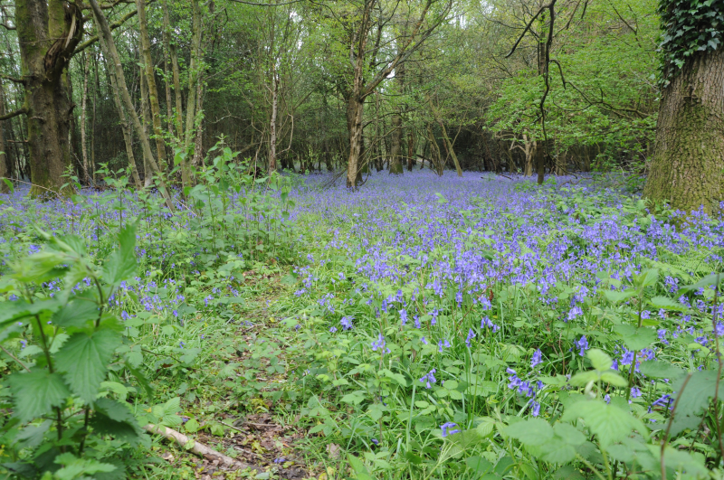

### Birds with Friends #2: Ashdown Forest

May rolls around, bringing tumultuous weather, and the second edition of birds
with friends. This time, we're off to Ashdown Forest, in Sussex.

Team average birding (definitely a hashtag in the making there) are in the
area for an extended weekend. A pair of friends are going to tag along for a
bit of birding on the Friday.

#### On the day

We've been watching the weather forecast all week with trepidation. Friday
rolls around, and it looks like we'll have a grey, blustery morning followed
by a wet, grey, even more blustery afternoon. Oh well - we don't have any
flexibility on the timings, so we'll just have to go for it.

##### Old Lodge SWT

We came here with an RSPB trip in the Spring of 2019 and it was superb. We're
hoping we'll be able to track down four species we had good views of on that
occasion: Common Redstart, Cuckoo, Tree Pipit and Dartford Warbler. The
 weather might have something to say about that, though.

Everyone ends up being rather later than we'd planned, either via faffing or
traffic. The situation is worsened mildly by our having recommended totally
the wrong parking place, and then having to mildly improvise our way into
the reserve proper. Thankfully we brought an Australian.

We make our way to the North-western extreme of the reserve where the path
gently descends through woodland. We point out some features of the area
that make it a possible Redstart haunt - lots of low down horizontal
branches for perching. In here the sound of the wind is dampened somewhat
, and we can pick out a bit of bird song; the gardens outside the reserve
have Chaffinch, Blackbird, Wren and Robin all belting it out; the wood
itself seems to be full of Chiffchaffs.

The woodland has a little gap as a power line and a pond or two interrupts
its path perhaps half way down the hill, but before we get there, I catch
a pair of interesting shapes flitting about on the edge; was that a flash
of red in the tail I saw there? Indeed! Both birds take up reasonably visible
perches and we manage to get everyone a view of them before they take off
into the slightly denser coniferous bit of woodland off to our right. Not a
bad start, and, double smug, we even predicted that a bit.

<figure class="figure">
    
    <figcaption class="figure-caption text-center">
        Redstarts were on the left hand forest edge here. Honest.
    </figcaption>
</figure>

Further on, the path descends rather more sharply down to a tiny stream
before climbing just as sharply back up to a gate. The shape of the land
here gives us a brief bit of much-needed respite from the wind, and we slow
down to take stock of what's here.

<figure class="figure">
    
    <figcaption class="figure-caption text-center">
        Steep. And mostly empty. Humph.
    </figcaption>
</figure>

We can hear a Willow Warbler somewhere nearby, but getting eyes on it proves
to be beyond us. We do manage to find a Tree Pipit singing from a Silver
Birch just below us. Getting our companions onto it is somewhat of a
challenge, but we get there in the end - just in time for it to flit off
elsewhere, singing as it goes. Not the best view, but we'll take it.

<figure class="figure">
    
    <figcaption class="figure-caption text-center">
        Tree Pipit. It's in there somewhere. Good Luck.
    </figcaption>
</figure>

After heading through the gate, we head straight on until we reach what we'd
call the back of the reserve. Here we turn left to follow the path alongside
another power line, and find our first Stonechat of the day. This is a new
bird for our guests, so this stops us for a bit as we follow it along the
gorse, and are introduced to what we guess it its other half. We talk about
the possibility of nearby escorted Dartford Warbler, but of it there is no
sign.

<figure class="figure">
    
    <figcaption class="figure-caption text-center">
        Even the Stonechats were distant and blurry.
    </figcaption>
</figure>

The protection from the wind at this particular corner of the reserve is much
reduced, and we make quick progress through areas that, on other days, we
suspect would yield more interest. We do find one or two more Stonechat and a
Goldfinch or two, but of our other quarries there is no sign. We make our
way back to our cars - we did at least time this well, rain is just starting
to decorate our windscreens.

##### Birding abandoned due to rain

We seek shelter at the nearby [Hatch Inn](https://www.hatchinn.co.uk/) which
turns out to be an even better choice we'd imagined; AB1 nearly has to order
a second portion of the raspberry and almond sponge pudding, it's so good. What
is less good is the weather - we'd rather hoped that the rain might have been
brief and light, but the longer we have tarried, the heavier it has become.
 
We abandon our hopes of further birding and retreat to [The Dorset Arms
](https://www.dorset-arms.co.uk/) where team average birding
(#teamAverageBirding) are staying instead. While our guests seem satisfied
to have seen three new species, we're a bit frustrated at how much more
they would have seen on a better day.

##### A last minute dash

Our friends disappear off on their next adventure just before dinner. 
\#teamAverageBirding have a late second trip out to Old Lodge in search of
Nightjar. We do come across a very distant Cuckoo, but of Nightjar there is
not even the faintest chur.

#### Saturday - Improved Conditions

Saturday's forecast looks better - still patchy rain, but the wind is much
calmer, and we'd guess that will bring much better birding.

##### Old Lodge again

We choose the correct car park this time, although it does contain an
enormous bump. We'll try roughly the same route as yesterday - let's see if
those Redstarts are in the same place.

Today it takes us considerably longer to get there. Despite improved parking
choices. Distractions are aplenty. A Jay picks a fight with a crow in one of
the stands of pine on the way there. Two Great-spotted Woodpeckers are very
active between the various isolated trees outside that stand, too. In the
next bunch of pines, we can see a Tree Pipit performing its parachute like
 display flight. This is more like it, already.

We exit this little clump of trees just as a noisy group of big looking
finches flies over. They're not making a sound we recognise, but by the time
we get the binoculars on them they are indistinct blobs. What could they have
been?

Yesterday's Redstarts are not present, but in the steep sided valley, we do
find some very showy Stonechats, and whilst we're admiring them, we start to
hear the determined song of a Cuckoo. Where is it? Opposite side of the
valley, we think. We stare at the opposite side for a bit, and the Cuckoo
yells at us a bit more - and we see it circling off to our right. It carries
on in this vein at some length, while we continue to dote on the nearby
Stonechats.

<figure class="figure">
    
    <figcaption class="figure-caption text-center">
        Looking a bit more cheerful today.
    </figcaption>
</figure>

<figure class="figure">
    
    <figcaption class="figure-caption text-center">
        Also looking a bit more cheerful today.
    </figcaption>
</figure>

After a few minutes of this, we hear a much nearer, louder noise, that we
initially think "angry blackbird?" but then quickly correct to "female
Cuckoo". She has another loud bubble from somewhere downstream and then
stops. A few seconds later, we see what we assume is a pair of Cuckoos
swerving off Northwards. Cool.

Climbing up the steep sided valley returns us to the crossroads by the big
gate. Another pair of birders are approaching in the opposite direction
- they look well equipped. We loaf about to see which way they go - to our
right, it turns out. And it looks like they flushed something interesting
as they did. Well, there goes my plan to ignore them.

We saunter in their general direction, and we're in luck - they're friendly
birders, and they quickly get us onto the Woodlark they just disturbed. Our
views are a bit pants, but we'll take it. After a brief share of what we've
seen, they're off on their way (back down the valley) and we on ours (along
the edge of the reserve).

A bit of rain attempts to intervene here. This makes visibility poor enough
that we almost walk over what we assume are a pair of Woodlarks hiding next
to the path. They flop into a rough bit of MOD land adjacent to the
reserve, and don their invisibility cloaks. Curses.

This path (unexplored yesterday) yields further fruit as it curves left
around a clearing. There's some tremendous piles of dead wood in the
clearing, we assume deliberately, because sitting atop it is a beautiful
male Redstart. He flops between a few perch points in the woodpile and the
trees behind it and generally looks terrific.

<figure class="figure">
    
    <figcaption class="figure-caption text-center">
        Such smart birds.
    </figcaption>
</figure>

This path eventually meets up with where we found our first Stonechats
yesterday. They're still around - there's also a hullaballoo in the woods off
to the right; the presence of a pair of Raven are making a family of Crows
deeply unhappy - there's a symphony of energetic gronks and caws, and an
occasionally harried flight whenever one of the Ravens decides to move. 
Entertaining.

Instead of following the Stonechat path, we turn back towards the crossroads
at the gate - back through a solid bit of pine forest, rather than the more
open woodland of the last few minutes. Suddenly, the noise of earlier's chunky
finches is everywhere. We spin on the spot to try to get eyes on them, and
just about pick out a flock of maybe twenty birds as they come to rest in
the pines in front of us, maybe three or four trees back.

In my head, a checklist is being assembled:

- A call we don't immediately recognise
- Chunky finch, and a flock of them, too
- Pine trees

and it's suddenly very difficult to think these birds are anything but
Crossbills. Serious efforts begin to reduce the amount of branches between us
and the flock, but we needn't have bothered - they slowly migrate back
towards the path, settling in the trees either side. All while unmistakably
being Crossbills. What a treat; might even be a life tick - definitely a
living-memory tick!

<figure class="figure">
    
    <figcaption class="figure-caption text-center">
        This silhouette spares the blushes of an otherwise terrible photo.
    </figcaption>
</figure>
<figure class="figure">
    
    <figcaption class="figure-caption text-center">
        A female crossbill attacks a cone.
    </figcaption>
</figure>
<figure class="figure">
    
    <figcaption class="figure-caption text-center">
        Attacking cones is thirsty work.
    </figcaption>
</figure>

A brief and unsuccessful trip back to Woodlark land is made. We retreat back
to the car from there - suddenly everything goes a bit quiet.

##### Airstrip

A quick stop for cake and cream tea gives us enough energy to try another
place. We opt to try the walk we were planning to do yesterday, a wander
in the Wych Cross area.
 
This starts off rather muddier than we'd like, but we squelch on regardless
. The constant chorus of Chiffchaff and Willow Warbler definitely helps. As
we climb up out of the rather wet woodland into a drier, heathier bit, we're
again greeted by displaying Tree Pipit and a Stonechat or two.

<figure class="figure">
    
    <figcaption class="figure-caption text-center">
        Hush now, Lapwing.
    </figcaption>
</figure>

Further up, crazy Lapwings squeak at nothing. Or perhaps each other. Who
knows what goes on in the mind of Lapwings? Certainly not us. Yet more
Stonechats, and these ones have obvious youngsters tagging along with them.
Lovely. This little Stonechat family travel with us along the path until the
gorse/heather mix starts to get thick, and a few spindly trees start to grow
from it.

<figure class="figure">
    
    <figcaption class="figure-caption text-center">
        This is female Stonechat, we think.
    </figcaption>
</figure>

AB2's in the middle of saying "This looks good for Dartford" when one hops up
into one of the tiny trees behind where the male Stonechat is perched. It
stays visible for long enough for us both to get a good look at it, and
then it disappears. Just as we give up looking for it and move off, it flies
across the path in front of us, to disappear rather more conclusively in some
denser gorse to our right.

We work our way round a bunch of trees and round on to what we assume all of
the local birding literature describes as the airstrip. We hope it was
flatter if that was ever used that way in the past - it's a wide path, but at
 four or five different elevations depending on which bit you're walking.

We get perhaps fifty metres down the strip before _serious_ rain arrives, and
we're forced to quickly bail over into the trees to our right for cover. An
argument ensues over whether we'll get more wet waiting in the tree drip
zone or by a run back to the car. This thankfully takes long enough that when
it resolves to the run, the rain stops shortly afterwards, and we even get a
brief bit of sun to accompany the rather soggy traipse back to the car park.

##### Hindleap reconnaissance 

A bit of intrepid Googling reckons that Hindleap might not be a bad place for
Nightjar. There's a bit of time before dinner to explore the area before
it gets dark. We take the Nightjar likelihood meter for a walk, but its
readings are unconvincing, particularly in comparison to where we just came
from! We'll perhaps try out Airstrip instead then, from a slightly less puddled
car park.

##### Nightjar attempt #2

After some delicious nachos and a Burrito each in Forest Row, we roll into
the Long Car Park next to Airstrip, and head out in hope of Nightjar.

We walk out as far the Dartford-adjacent tiny woodland, glowering at all the
isolated trees with perfectly angled branches that are utterly
devoid of the Nightjars that should be perching on them.

Slowly the light leaks out of the day, and our ears start to sharpen up. The
first thing we hear is...a steam train? Are we going mad? No, apparently
there is a heritage steam thing that runs nearby. Once we've worked that out,
our next struggle is with the road noise, which has enough vibration in it
to occasionally sound like a bit of churring.

Once or twice we pick up a more distinct hint of a churr, and we just about
agree that it's in the direction of the car park. We're maybe a couple of
hundred metres away from it when a much more obvious bit of Nightjar song
stops us in our tracks. We don't get much of a performance though - almost
as soon as we stop, the song ends, and with a brief flight call, that's
it - the show's over.

What a difference a day (and the weather!) makes - all four target birds
today, plus two terrific bonuses in the Crossbills and the Woodlark. Fab.

#### Sunday: borderline pleasant

Sunday's weather looks borderline balmy - only occasional light showers,
although that wind is starting to kick up again, and that looks like it might
wash out the evening.

We decide to visit the Ashdown Forest Centre to start with. We previously
came here in the afternoon of a trip with the RSPB Central London group, and
it was a nice walk, but a bit of a damp squib, bird wise.

<figure class="figure">
    
    <figcaption class="figure-caption text-center">
        See, nice view.
    </figcaption>
</figure>

We find the same again - a good walk, with great views to the North, but
birds somewhat limited; a lone displaying Tree Pipit, Stonechat (again with
juveniles), Linnets and a flyover Woodpecker or two.

<figure class="figure">
    
    <figcaption class="figure-caption text-center">
        It did try to rain on us a bit though.
    </figcaption>
</figure>

Well, fine then, we'll go back to Old Lodge to see if we can find that
Woodlark again - we only got a fleeting view yesterday, and a photo would be
welcome as well.

#### Old Lodge again (again)

We return to Old Lodge, and our progress is blocked by a veteran Kentish
birder who really wants to talk to us. We get a good summary of his visit to
the reserve, as well as a short guide to where he birds now, his minor
disagreements with the bird recorders where he lives, and, eventually,
some birding memories from the deep past, from when he started birding 50+ years
ago near Cliffe, with some seriously big name birders. It's only the presence
of a long-suffering acquaintance nearby, looking keen to move on that stops us
talking to him for longer. We should have poked him for contact details; I
bet there's plenty of gold lurking in those memory banks.
 
We tread roughly the same route as yesterday. The changes in sightings are as
follows. We hear but don't see the Cuckoo this time. An unbelievable
confiding Tree Pipit poses for us near crossroads gate, while a pair of
Willow Warblers provide the soundtrack. 

<figure class="figure">
    
    <figcaption class="figure-caption text-center">
        Ridiculously confiding Tree Pipit.
    </figcaption>
</figure>

An extra pair of Redstart
appear where yesterday's Woodlark was, accompanied by further Tree Pipit,
Whitethroat and Stonechat. Of the Woodlark there is no sign. 

Yesterday's woodpile perching Redstart is still there, but
this time we spy him flitting to the edge of the clearing to visit his Mrs.
Cute. We find a family of Coal Tits nesting in a hole in a tree in the
centre of the same clearing. 

<figure class="figure">
    
    <figcaption class="figure-caption text-center">
        Who, me?
    </figcaption>
</figure>

The Ravens are still present at the reserve
boundary, but this time they are unworried by Crows, and are busy tearing apart
the remains of what we guess was a rabbit. The Crossbills alight in _exactly_
the same area as they did yesterday, and our photos of them remain seriously
sketchy.

<figure class="figure">
    
    <figcaption class="figure-caption text-center">
        A Crossbill nomming on a pine cone.
    </figcaption>
</figure>

<figure class="figure">
    
    <figcaption class="figure-caption text-center">
        A Crossbill in its natural environment.
    </figcaption>
</figure>

The return trip to the car is again uneventful.

#### Airstrip again

Having discovered the considerably more convenient Long Car Park yesterday
evening, we start from there today, with the intention of exploring Chelwood
Vachery.

This plan lasts about ten minutes, but we do pick up a Woodlark in that time
- sailing down from treetop to a disturbed bit of ground, and then utterly
disappearing in the gap between us switching from binoculars to cameras. As
we reach the first turning where we'd need to commit to the longer walk, a
look at the sky tells us that might not be a great idea - ominous clouds
are approaching at speed. Instead we'll walk a shorter loop, visiting some of
the places we looked for Nightjar last night, and the place we found
Dartford Warbler yesterday.

This obviously doesn't find us a Nightjar, but we do get treated to a flypast
by a pair of Dartford Warblers just as we get to that spot. That is, of
course, the last we see of them, despite patiently hanging about for a good
fifteen minutes. 

We make a break back to the car, have a quick chat with an impressively lens
-endowed dog walker, take a few photos of a Kestrel sheltering from the wind
in a dead tree, then head off for dinner before the rain really kicks in.

<figure class="figure">
    
    <figcaption class="figure-caption text-center">
        This Kestrel looked like this was one of the few days where the wind was not its friend.
    </figcaption>
</figure>

#### Monday

We decide we can cram in a bit of birding before breakfast on Monday morning
- a read of the forecast last night suggests we've got until 9 or so. This
turns out to be optimistic, but we don't mind - picking up a traditional
Goldcrest and Nuthatch in the nearby churchyard, and, rather more
excitingly, a family of Kingfishers and a Yellowhammer in the nearby stream.

<figure class="figure">
    
    <figcaption class="figure-caption text-center">
        Little bit of bread and no cheese!
    </figcaption>
</figure>

Post-breakfast we decide we've really only one mission left: to get a photo
 of Woodlark. And for that, to Long Car Park we shall return.

##### Chelwood Vachery

Same deal as yesterday, but this time the weather looks like it might look
more kindly on our plans for a longer walk. First though: is that Woodlark
visible?

Remarkably, yes! This time it even sings for us on the way out of the tree
and on to the ground, and it doesn't totally disappear. A good start!

<figure class="figure">
    
    <figcaption class="figure-caption text-center">
        Woodlark!
    </figcaption>
</figure>

The diagnostics for Woodlark are quite neatly captured in that image - note
the clear eye stripe, and the white-black-white pattern on the wing. A good
chunk of a bird it is too.

Things improve further from there - we find a Cuckoo in some distant trees
off to the right of the path. A flock of noisy, chunky finches that we now
know are Crossbills give us a flyover too.

<figure class="figure">
    
    <figcaption class="figure-caption text-center">
        A distant Cuckoo.
    </figcaption>
</figure>

The path eventually heads into some lovely bluebell woods and, after a bit
more walking, descends into an ornamental garden with a flowing stream. 

<figure class="figure">
    
    <figcaption class="figure-caption text-center">
        Bluebells.
    </figcaption>
</figure>

A pair of Grey Wagtail are noisily feeding near it. AB2's ears pick up the
sound of juvenile Great-spotted Woodpeckers. We think we've found them when
we see a bird dart on to a tree, hop in, then hop out again, but it turns out
to be a Nuthatch. Handily though, the woodpecker turns up a few seconds later on a hole no
more than a metre away on the same tree, Wow!

<figure class="figure">
    
    <figcaption class="figure-caption text-center">
        Female Great-spotted Woodpecker returns to her nest hole.
    </figcaption>
</figure>

<figure class="figure">
    
    <figcaption class="figure-caption text-center">
        Love a Grey Wagtail.
    </figcaption>
</figure>

We pick our way around the back of the Vachery until the path leaves the
woods. Here we cross back over the artificial stream, and heads back towards
the Airstrip. The landscape opens back up into heathland, and the trees are
reduced to an isolated stand or two. We take a break for a snack in one that
features a bench.

This turns out to be an auspicious snack - a very noisy Blackcap (or maybe
Garden Warbler?) delays our exit for long enough for an even more talkative
Cuckoo to arrive, perching atop the same tree our _Sylvia_ was in. It then
flops off in the direction of some other, more isolated trees, and we can
see it making the occasional trip to the ground to feed. The views are, for
Cuckoo, borderline spectacular - helped no small amount by the sun finally
starting to come out.

<figure class="figure">
    
    <figcaption class="figure-caption text-center">
        Cuckoo singing its heart out.
    </figcaption>
</figure>

<figure class="figure">
    
    <figcaption class="figure-caption text-center">
        This one is just after the 'koo' of Cuckoo.
    </figcaption>
</figure>

We eventually tear ourselves away from the Cuckoo for one further missed
appointment with the Dartford Warblers, and after that, it's time we were on
our way home...