### Black-browed Bempton

We made a rapid trip up to Bridlington to get our annual fix of cliff-birds. It 
was only once we'd decided to go that we realised there might be the possibility 
of a Black-browed bonus bird.

Pronoun guidance: the M18 has always got AB1's back. This post covers the
 events of July 11th and 12th, 2021.

#### An early evening tick

We set off for Bridlington on the afternoon of the 11th and returned early on
 the 13th.

We made excellent progress (the M18 is yet to betray me on any journey - long may this continue) and to our surprise arrived with sufficient remaining daylight to pay Bempton a brief evening visit.

This turned out to be a solid plan - as we walked down to the cliffs a steady stream of grinning birders were returning to the car park, and one couldn't contain himself, blurting "the albatross is showing well from the first viewing station if you turn right" unbidden as we passed. We accepted his news with great excitement and our pace noticeably increased.

We reached the first viewing point and found it busy but not full. After the
usual brief awkward few moments of trying to work out if everyone else here
is already on the bird or not, another recent arrival starts asking
questions. It turns out that, yes, everyone here is already on the bird
, and has been for long enough that they've calmed down. They give
excellent directions as to where it is sitting, and, indeed, there's a
Black-browed Albatross sitting amongst all the Gannets. What a sight he
is too, a rangy giant all awkwardly folded up amongst the riff-raff.

<figure class="figure">
    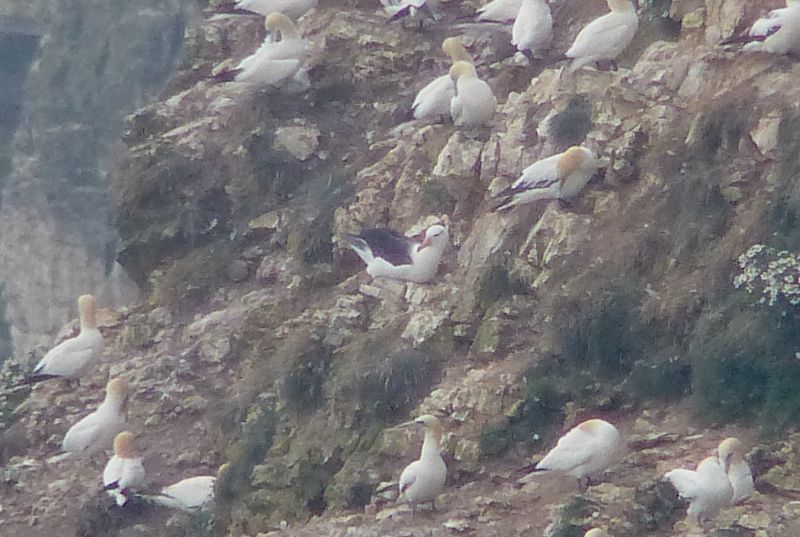
    <figcaption class="figure-caption text-center">
        The most record shot of record shots.
    </figcaption>
</figure>

This is excellent - it takes all the possible stress out of tomorrow; we can have a much more relaxed meander around the cliffs instead of a hyper focussed semi-twitch starting at silly 'o' clock. Having found this bird though, we are mugged by feelings of ambivalence. What's it doing here? Does it feel alone, or is it happy enough on its tod? One always feels this way about a lost bird, and this one is certainly far from home, probably the only member of its species in the Northern hemisphere. It is, unlike many other vagrants, surviving rather well (it has apparently been touring the North Sea for some years), and it doesn't look demonstrably sad (although could we tell?), so we decide to stop anthopomorphising the poor beast and to return to our hotel to subject ourselves to the remaining football. This removes any ambivalence.

#### A proper Bempton visit 

The next day, we're back at Bempton to enjoy its more standard fare - a menu
 of Gannets, Guillemots, Razorbills, Kittiwakes, Fulmars and Puffins, perhaps with a daily special or two if we're lucky. We discuss our plans with the RSPB greeting crew. We also accidentally assault a bumble bee just as we leave them, which is embarrassing. Thankfully the bee survives.

Heading out into the meadow we are reminded that Bempton is gifted with Tree Sparrows - they are feeding all around us in the thick, long grasses that surround the path. There's also a Common Whitethroat or two scratching about.

<figure class="figure">
    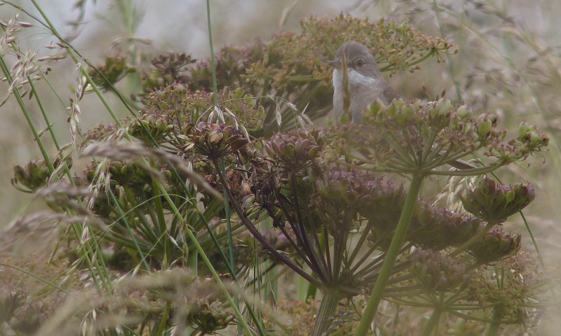
    <figcaption class="figure-caption text-center">
        Skulking, as ever.
    </figcaption>
</figure>
<figure class="figure">
    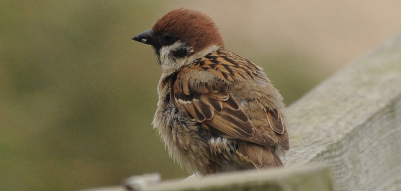
    <figcaption class="figure-caption text-center">
        Love that warm brown cap of a Tree Sparrow.
    </figcaption>
</figure>

It's not long before we reach the first viewing area, and this one is predominantly in a Kittiwake area. Several Kittiwakes are on nests, with young. Others fly to and from the cliffs with food, reminding us of who they are with their call as they do. Kitty-way-ache, kitty-way-ache, kitty-way-ache. We're still not sure if we'd here that name unless someone had told us about it beforehand.

<figure class="figure">
    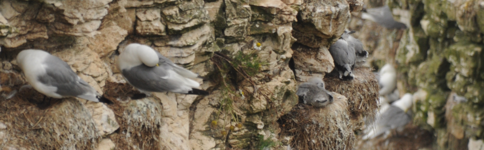
    <figcaption class="figure-caption text-center">
        Kittiwakes
    </figcaption>
</figure>

We venture further west to the next viewing area, and this one is great too - more Kittiwakes, a few more Razorbills and Guillemots, both with young, a Puffin or two flying in and out, but from perches we can't see. There are one or two Gannets nearby as well, and, offshore, a fishing fleet of them jetting themselves into the water.

<figure class="figure">
    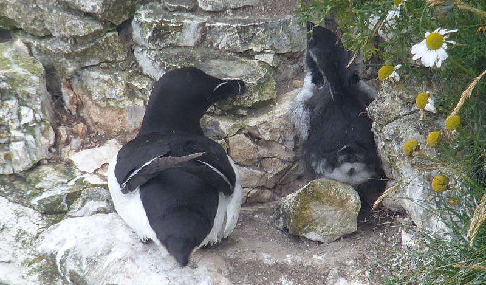
    <figcaption class="figure-caption text-center">
        Parent Razorbill doing a good job of blocking the way here.
    </figcaption>
</figure>

<figure class="figure">
    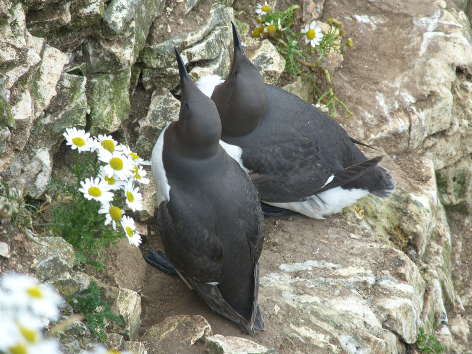
    <figcaption class="figure-caption text-center">
        Not looking as chocolatey as usual here.
    </figcaption>
</figure>

We pass one further viewing area. It is amazing too. The same species are present, but you don't mind, the sensory experience of hearing, seeing and, let's be honest, smelling this huge number of birds is an unbelievably vivid experience. That they're all sizable beasts helps too - their awkward shuffling on small cliff spaces adds yet more personality to the equation. The Gannets in particular seem unable to sit still - any sign of activity anywhere near a Gannet triggers stereotypically-Italian levels of gesturing, vocalisation and general showing off. It's everywhere here, and it's tremendous.

<figure class="figure">
    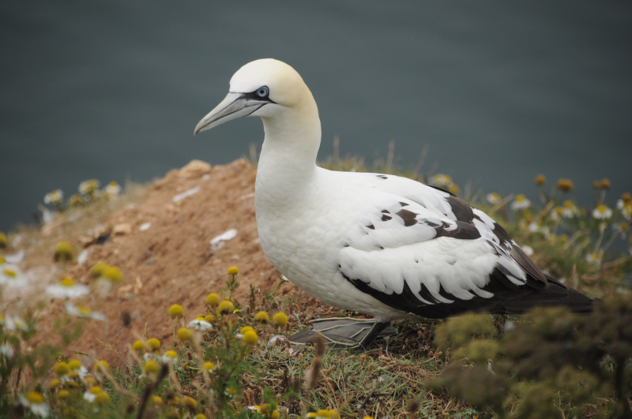
    <figcaption class="figure-caption text-center">
        Gannets are fabulous.
    </figcaption>
</figure>

<figure class="figure">
    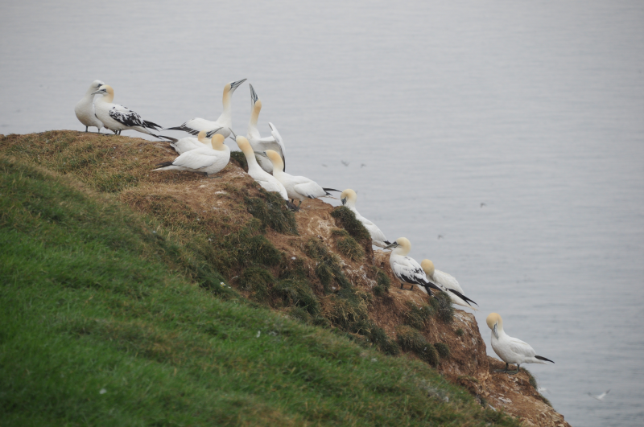
    <figcaption class="figure-caption text-center">
        A pastoral Gannet scene.
    </figcaption>
</figure>

We soon realise that is the last viewing platform, as the well maintained RSPB path gives way to a significantly trickier to trace but still official coastal path. While we do fancy a walk to Filey, there's still a good chunk of reserve in the reverse direction for us to explore, so we turn about and head back towards the visitor centre.

<figure class="figure">
    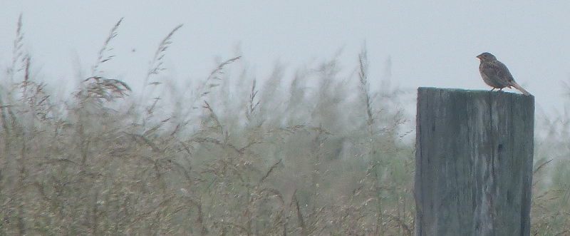
    <figcaption class="figure-caption text-center">
        Corn Bunting shouting from a post. Not actually shouting in this photo though sadly.
    </figcaption>
</figure>

This turns out favourably - we come across a vociferous, shouty Corn Bunting
on a distant fencepost. It holds our attention for quite some time. This
brings further fortune, because, er, what is that? That can't be a Barn Owl
, can it? Uh, folks, Barn Owl? Barn Owl! At two in the afternoon, Barn Owl
, over the disused and rather mysterious looking military buildings!

<figure class="figure">
    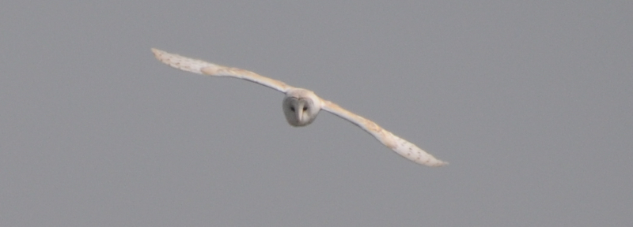
    <figcaption class="figure-caption text-center">
        A pale specimen.
    </figcaption>
</figure>

A very pale individual it is too, and this (we claim) wrecks many of our early photographs. Thankfully the owl shows no sign of camera-shyness and makes several quartering circuits of the area - we're able to walk all the way back to the visitor centre (the weather's improved enough for us to need to pick up sun-cream from the car) while keeping it in sight. We're a bit weirded out that no-one seems as excited about this as we are. Does it happen every day? Do Bempton visitors all get Barn Owl in their back gardens most afternoons? We think we should be told.

The Eastern end of the reserve is much the same as the West half, with perhaps more of a Gannet tendency - certainly this is where we spend more of our time gawping as Gannets fly next to us along the cliff top.

<figure class="figure">
    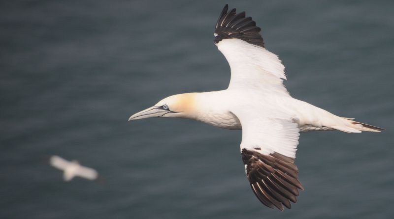
    <figcaption class="figure-caption text-center">
        We could watch this all day, and we basically do.
    </figcaption>
</figure> 

There's a promontory from the cliffs out into the sea that is covered in them. The noise continues to be unbelievable.

<figure class="figure">
    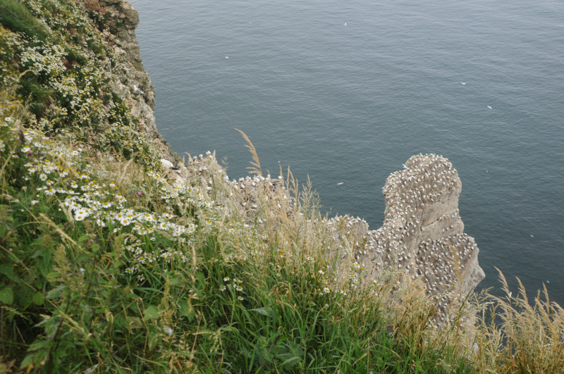
    <figcaption class="figure-caption text-center">
        A city of Gannets.
    </figcaption>
</figure>

As we pass the final viewing point on this side of the reserve an unbelievably confiding Fulmar repeatedly flies around us as well, and, for the first time ever, a not totally terrible photograph of Fulmar in flight is achieved.

<figure class="figure">
    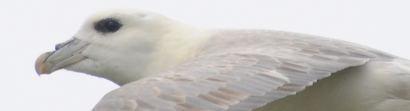
    <figcaption class="figure-caption text-center">
        It's so good, I'm going to stylishly crop it to show it off.
    </figcaption>
</figure>

We continue beyond the final viewpoint out on to the public footpath for a while, because we remember getting some of our best Gannet views from here last time; perhaps, though, our memories have betrayed us, because the views are very quickly obscured, and the previous accessibility of the cliff edge is replaced by rather more dangerous scrambles. We gentle wend our way back to the visitor centre cheered by yet another brilliant Bempton visit; we'll be back in 2022, we'd wager.

<figure class="figure">
    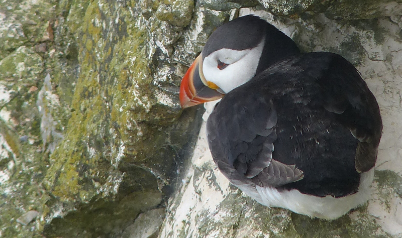
    <figcaption class="figure-caption text-center">
        Bonus puffin.
    </figcaption>
</figure>