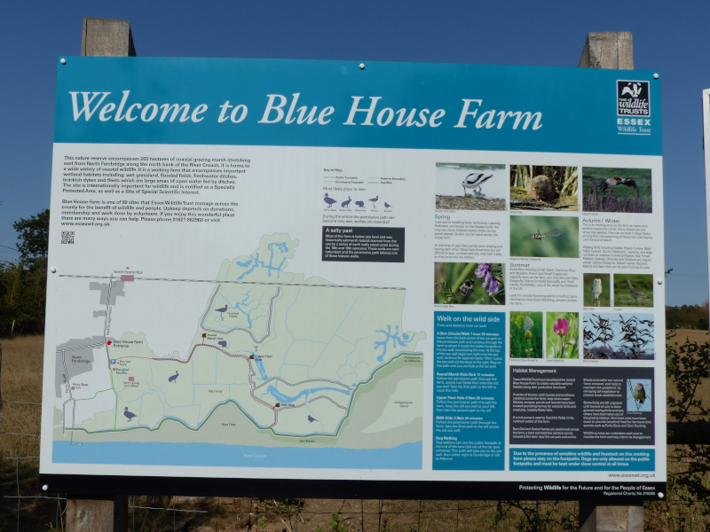
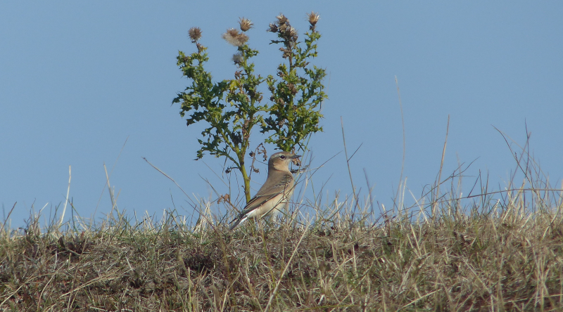
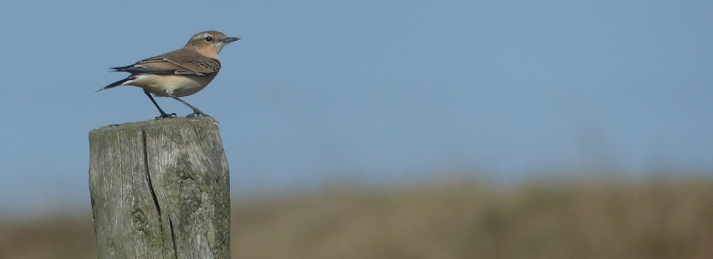
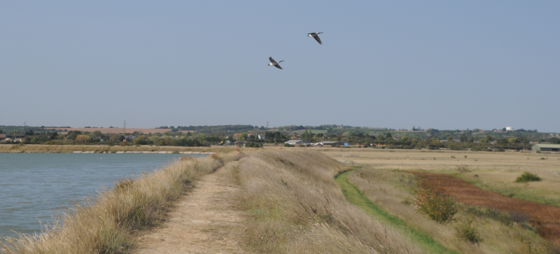
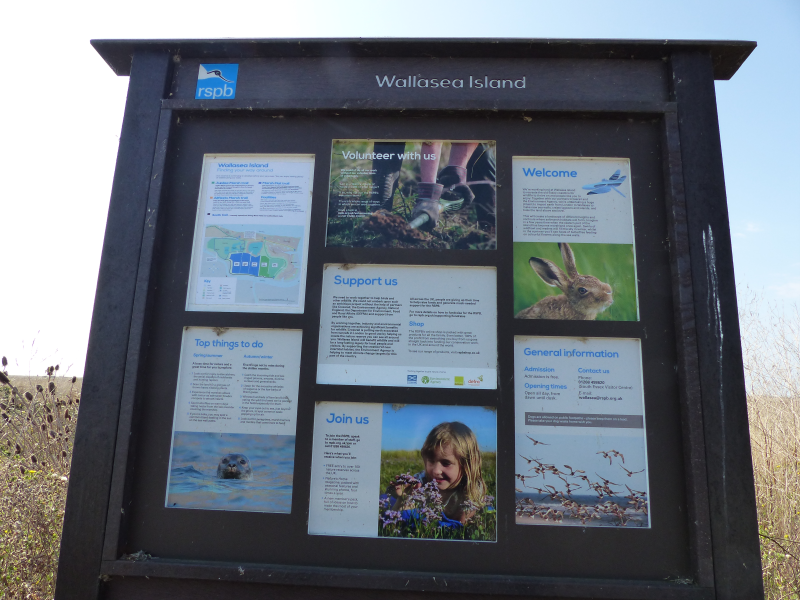
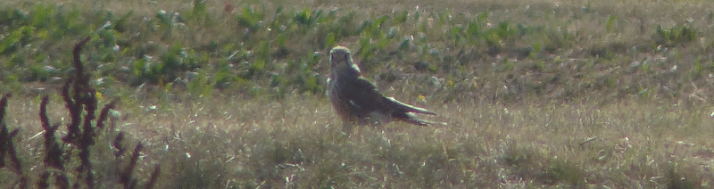
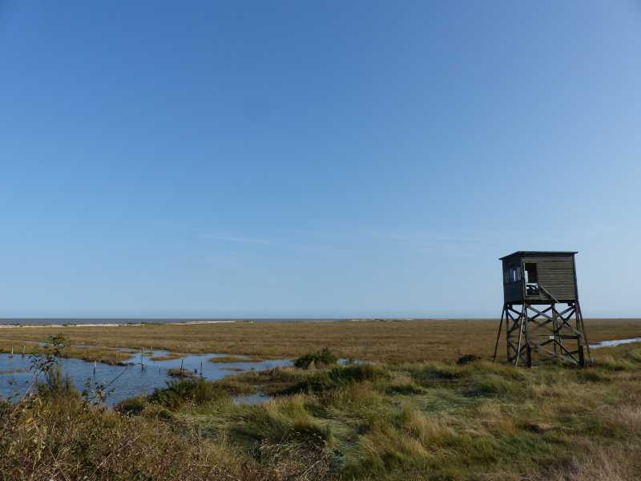

### Essex Reconnaissance

Fresh back from our Wales trip, we miss being outdoors and on holiday. Let's go
camping in Essex for a weekend escape.
 
...and while we're there, let's visit a few birding places. We're mid-September;
a bit of a dead zone, but with a bit of luck we might catch up with a migrant
or two on their way back to Africa.
 
Pronoun guidance: AB1's the cricketer.

#### On the way: Blue House Farm EWT

<figure class="figure">
  
  <figcaption class="figure-caption text-center">
    Blue House Farm panel. Sadly, the hides are shut.
  </figcaption>
</figure>

AB1's prior knowledge of [Blue House](https://www.essexwt.org.uk/nature-reserves/blue-house-farm)
extends to playing a cricket team of the same name. We've no idea whether
there's any link between the two.

Getting here is somewhat exciting - we're into enough of an extremity of
Essex that the roads start to get a bit tight, and the track down to the car
park is rough enough to encourage caution.

We exit the car; the weather is all over the place. Hot but also super windy.
A recipe for a sunburnt AB2; we'll need to do the sunblock dance before we
go any further. While we do, a flock of goldfinches raid the bird feeders at
the other end of the car park.

We head out into the reserve, and the immediate impression is one of extreme
parchedness; the ground is hard, dusty and cracked. The satellite images of
the reserve from Google maps suggested there was wetland here; and while
there are reedbeds, dykes, and a nearby river, vast tracts that we guess are
usually watercourses are bone dry.

The reedy borders of the remaining watery bits are decently productive though
- we quickly find Stonechat, as well as Reed Bunting. A few flighty Yellow
Wagtails make a brief appearance as well. Our best bird on the way out to
the sea wall path though is a very friendly Northern Wheatear.

<figure class="figure">
  
  <figcaption class="figure-caption text-center">
    Very friendly.
  </figcaption>
</figure>

<figure class="figure">
  
  <figcaption class="figure-caption text-center">
    Northern Wheatear.
  </figcaption>
</figure>

Once we're on the sea wall, mostly all we've got is gulls (Black-headed) and
geese (Canada); there is still an occasional Reed Bunting in the watery reedy
bit on the landward side of the wall.

<figure class="figure">
  
  <figcaption class="figure-caption text-center">
    Honk if you're a goose.
  </figcaption>
</figure>

We finish our circuit and head off in search of somewhere to camp; we
eventually pitch up [here](http://www.greenlanecampingandcaravanning.co.uk/).

There's still plenty of daylight left, so we head out to Stow Maries. We
settle on this plan because, firstly, [the Prince of Wales](https://www.prince-stowmaries.net/)
is there, providing a convenient place to park the car and, on completion of
the circuit, ourselves and, secondly, because we fancy a walk around the
nearby aerodrome; several TV programmes have made promises about the owls
here, which commands our interest.

Navigating the route proves trickier than anticipated; almost as soon as we're
on the footpath we encounter hard to parse "footpath diversion" signs.
We eventually manage to traverse the perimeter of the aerodrome; the internals
appear to be off-limits for today - there's some sort of model aircraft event
happening. It looks quite entertaining - the models are flightworthy; one
in particular really tests our "is that small, or far away?" sensors before
it lands, when we see that any pilot would need to be terrier-sized.

The walk doesn't turn up any owls (we're none-the-wiser as to what the status
of birding is at the Aerodrome; next time we'll ring ahead), but the footpath
does take us through a surprise vineyard on the way back.

The pub more than makes up for it; a raucous herd of gents provides an
indomitable background hubbub, the beer is _superb_ and the food isn't far
behind. We watch the highlights of a very exciting Tour de France time trial,
where Tadej Pogacar surprisingly outdoes his (rather poorly TT-helmeted) 
countryman, Primoz Roglic.

We return to the campsite for a closing pint and a hilariously Essex
conversation with who we deduce is the proprietor and an acquaintance of
his.
 
#### Wallasea

We've made a brief visit to Wallasea before, and it rather whet our appetites;
the place had serious atmosphere. AB1 has been itching to try out getting to
Wallasea via the [Burnham Ferry](http://www.burnhamferry.co.uk/) and the time
has come to give this a try.

We miss the first ferry thanks to the unhurriable acquisition of two bacon
butties, but adding thirty minutes of sitting in the sun on the waterfront
is no real hardship. We eventually board the second crossing with four serious
-looking cyclists (and their bikes), who have a tricky time getting down the 
jetty in their road shoes.

The river crossing is uneventful and we alight at the marina on the other
side of the Crouch. Wow. There are some sizeable boats here. Where do the
owners live? Do they all rely on the ferry, or do they drive up from Southend
whenever they fancy a jolly? We guess the latter.

Our plan takes us out along the sea wall; or at least, it does until AB1 works
out that the grassland at the base of the sea wall is sheltered from the
devil wind holding us up on the top. An age passes before we enter the
reserve properly. Sadly, the Corn Bunting security guard that greeted us at
the car park [last time](/features/a-200-bird-year/part-10-an-excuse-for-essex.html) 
is on duty elsewhere.

<figure class="figure">
  
  <figcaption class="figure-caption text-center">
    Wallasea panel; you'll note the significant differences between the tiny map and the shortly linked one; a reserve still in the making
  </figcaption>
</figure>

We've got a lot more time to play with on this visit, and...it looks like
more of the reserve is ready for visiting. We plot a decently ambitious
circuit around [the reserve](https://www.rspb.org.uk/globalassets/downloads/documents/reserves/wallasea-island-trail-guide.pdf),
out to the Half Moon viewpoint via the Allfleets marsh trail, and then back
via the Beagle viewpoint. Perfect!
 
Until we make a start, and, having picked up a few more Yellow Wagtails in
one of the ditches, discover that the Allfleets marsh trail is temporarily
off-limits. We rejig our plans (the New Pool trail wasn't a thing when we
visited, or we couldn't find it) to just do the Marsh Flats trail instead.
 
We see lots of Shelduck, and a Kestrel, and some very lost-looking tourists, and
that's about it. It's a nice walk in the sun though, and we find a shortcut
back to the road to save doubling back from the car park, to the relief of a
still complaining knee.

<figure class="figure">
  
  <figcaption class="figure-caption text-center">
    Kestrel through the heat haze
  </figcaption>
</figure>

The only remaining action before catching the ferry back to Burnham is to
hear the long list of complaints a nearby resident has about the RSPB, the
finances of the nearby marina, and several other important local issues. AB1
eventually blurts out that we urgently need lunch and we escape. We ponder
the relationship between living in an isolated location and being loquacious.

#### Bradwell and the Dengie

We pick up two _superb_ bagels from [Peaberries](https://www.peaberriescoffee.co.uk/)
and head out for Bradwell, on the basis that anywhere with a nuclear power
station tends to be pretty good (evidence: [Dungeness](/features/a-200-bird-year/part-37-dungeness.md),
Sizewell, Wylfa). There's also some historical nonsense that AB2 is broadly
 interested in. And a [bird observatory](https://www.ebws.org.uk/birdsites/bradwell-bird-observatory-bbo)!
 
Bird wise, this is, again, a bit of a dead zone. The dry wit of the
inhabitants of the observatory is the best bit of the visit. "There's not
much about now, the tide's in" "What are you expecting to see once the tide's out?"
"More mud". Heh. "You want to come back in about a month; then things will start
to happen" - sage advice that we will heed in a non-COVID year!

<figure class="figure">
  
  <figcaption class="figure-caption text-center">
    An extinct bird hide - shame, bet it was good.
  </figcaption>
</figure>