### Frampton Marsh

A late August Bank Holiday weekend brings an opportunity to explore a reserve
 we've not visited before on the East coast.
 
This post covers events of Aug 30th 2021.

#### A speedy recce

We arrive at Frampton slightly later than planned and then become later
 still, thanks to some of our party urgently needing a snack to keep
 them sensible, and one briefly underdeployed in the membership card department.

With these issues addressed we hop out for a quick walk around the main lake and
 scrapes behind the visitor centre. Our first quarry is, predictably, sleeping 
 on a mud island at the centre of the lake - a party of twenty or so
  Spoonbill. There's an additional Common Sandpiper or two kicking about a
 bit closer to us. Nice.

<figure class="figure">
  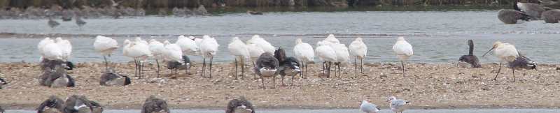
  <figcaption class="figure-caption text-center">
    I know I am sneaking, but I am asleep.
  </figcaption>
</figure>

What else can we find? The sightings board suggests
 Little Stint, Hobby, Curlew Sandpiper and Black Tern are all possibilities
nearby. A walk out to the sea wall later might find us a Short-eared Owl or
a Merlin.

<figure class="figure">
  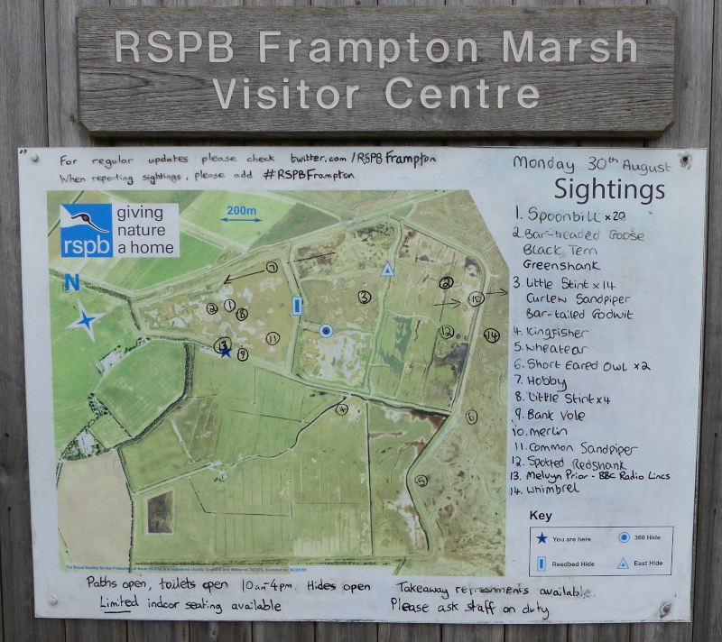
  <figcaption class="figure-caption text-center">
    The sightings board is pregnant with possibilities.
  </figcaption>
</figure>

Our route takes us to the 360 hide, where we find plenty of waders - Ruff, 
Bar-tailed Godwit, a few Common Snipe and an isolated Golden Plover, still
looking reasonably handsome. We try to find Little Stint, but the best
candidates are some distance away - we'll perhaps catch up with them from
the East Hide later. On exiting the hide we spot a collection of Avocets
hiding on one of the closer watery areas - they're almost completely
obscured by foliage between us and them though!

<figure class="figure">
  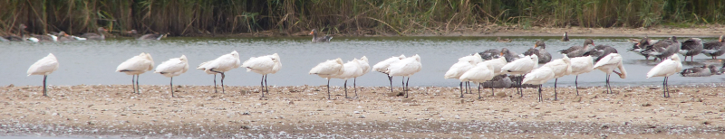
  <figcaption class="figure-caption text-center">
    Definitely asleep now.
  </figcaption>
</figure>

We move briefly on to the Reedbed hide which offers a different Spoonbill
view, with the addition of more Godwits, and a little posse of Greenshank
looking aloof. This time of year is seemingly excellent for Greenshank - it
seems to be easier to catch them on the way down than on the way up; I can't
remember the last time we found one in the Spring. No, wait, [I can
](/features/a-200-bird-year/part-15-cuckoo.html). 

We get almost to the end of this path before we run out of time - we need to
head back to the car to rescue our lunch before it gets driven away. Just as
we're deciding though, we spot several keen-looking birders transfixed in
the distance. Following their binoculars, we find a tern of some sort fishing
in a channel off to our right, and with a bit of squinting it's clear to us
this is the sightings' board's Black Tern. Victorious, we start on our return
to the car, but on the way we have further joy - a Little Stint is
associating itself closely enough with some Dunlins that we can pick it out.

#### A post-prandial tour

After a proper meal the group proceeds at a more leisurely pace. Potentially
verging on dawdling. We try walking around the lake behind the visitor
centre clockwise this time - discovering more Godwits and another Common
Sandpiper (probably) as we go. At the back of that lake, there's a flock of a
hundred or so Goldfinches in a bush. Just after this we get our best view of
the Spoonbill flock.

<figure class="figure">
  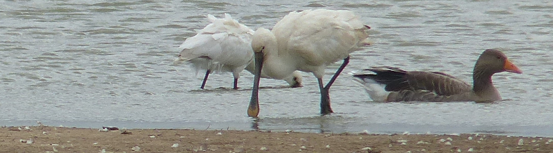
  <figcaption class="figure-caption text-center">
    In this one, a goose. And the bill of a Spoonbill, for once.
  </figcaption>
</figure>

<figure class="figure">
  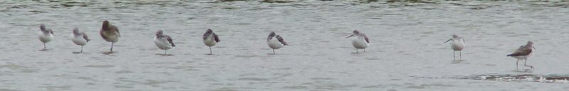
  <figcaption class="figure-caption text-center">
    Those Greenshanks, now with intruding Godwit.
  </figcaption>
</figure>

We're frequently distracted by raptor movement over The Haven - its just far
enough away to make each bird interesting, which is frustrating, because
every single one of them eventually slows up and hovers into Kestreldom. We
stop looking after a while and concentrate on matters closer to hand. After
circuiting three sides of the lake, we're now back to where the Black Tern
was earlier.

<figure class="figure">
  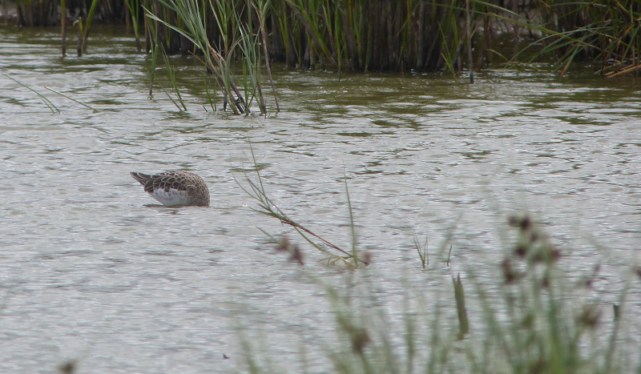
  <figcaption class="figure-caption text-center">
    This is one of ~30 photos of headless Ruff we took.
  </figcaption>
</figure>

Despite a brief distraction by some very hungry Ruff, we can't fail to miss
the single Black Tern continuing to fish on this lake. We take in excellent
views on our way around to the East hide, keen to see if the little waders
we could see near it earlier were of interest.

<figure class="figure">
  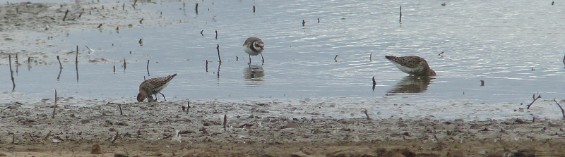
  <figcaption class="figure-caption text-center">
    Little Stint, Ringed Plover and Dunlin here.
  </figcaption>
</figure>

<figure class="figure">
  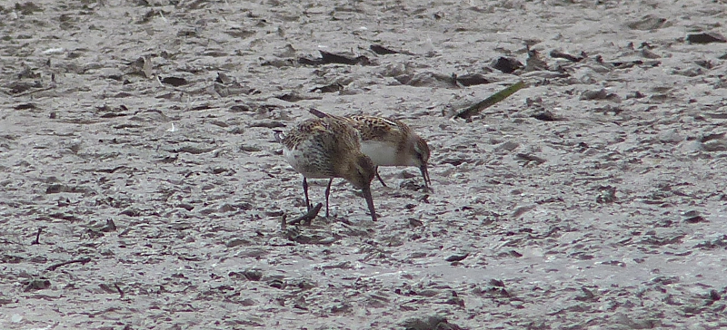
  <figcaption class="figure-caption text-center">
    A nice size comparison between Little Stint and Dunlin.
  </figcaption>
</figure>

Here we find a further Little Stint, but are unable to filch out a Curlew
Sandpiper from the Dunlins. Through a bit of reading I discover this is
harder than I thought - I've only ever found them in July at Oare, when the
adults return in plumage that is _much_ easier to identify them in. The
birds here now will be juveniles and, according to the internet, our best
hopes of distinguishing them are considerably more subtle.

We've interrogated just about every bird we can see from the East hide when
suddenly they're all up in the air - a raptor must be inbound! We manage to
get a bead on it as it rockets through from left to right - a young
Peregrine Falcon, we think. Its arrival is our advent - we have an
 appointment with the sea wall.

Despite our enthusiasm for seeing one, no Short-eared Owl makes an appearance
. We continue to find an abundance of Kestrels, and, in the channel to our
right, a nice Ringed Plover or two. Further round, a few of the Spoonbills
fly over us. And then, to trump them, a B-17 Flying Fortress flies over as
well. OK then. Are parts of Lincolnshire still at war, we wonder?

<figure class="figure">
  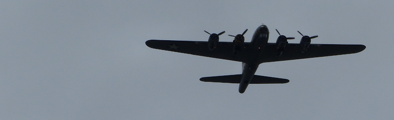
  <figcaption class="figure-caption text-center">
    If it's possible to take a record shot of an aircraft, this is one.
  </figcaption>
</figure>

We eventually reach a gate that signifies the end of this part of the circuit
. We still have half an hour or so to use, so more deliberate scanning for
 owl occurs. It is fruitless. In a nearby field, cattle are rounded up, and
some egrets are emitted from the area where the cows were. We are too slow to
get them in the scope. A brief foray North to where they landed doesn't find
them either. Little Egrets they will stay. The foray does, however, put us on
 to a little flock of Yellow Wagtails poking about in the marshy stuff on the
  seaward side of the wall.

Eventually though, our time comes, and we must return to the car. Only a last
 minute close up of Common Snipe delays us, and then we are off.

<figure class="figure">
  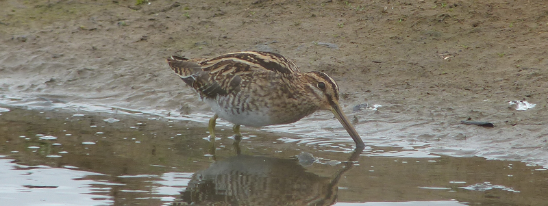
  <figcaption class="figure-caption text-center">
    Having a good poke about in the mud.
  </figcaption>
</figure>

#### Thoughts

What a place. Full of birds, and full of action. Each time we thought we'd
 run out of things to look at, a further surprise was in store. We'll be back!
 
<figure class="figure">
  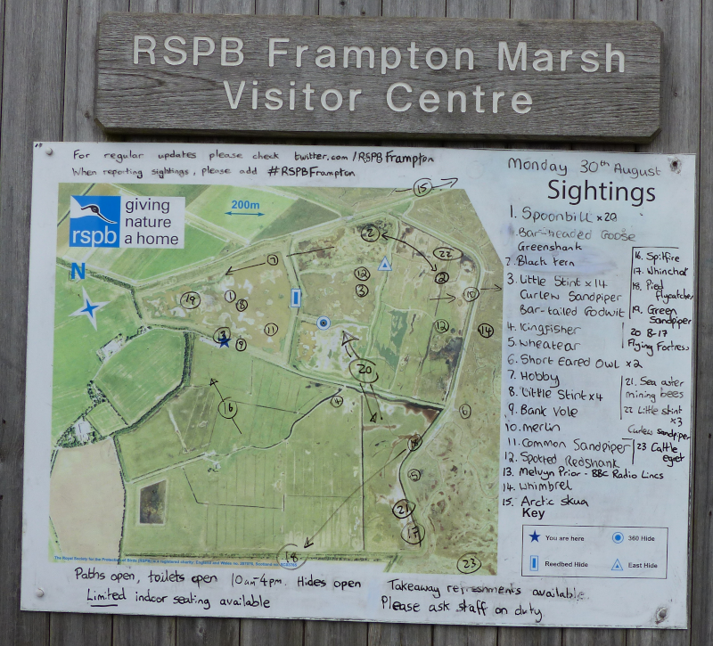
  <figcaption class="figure-caption text-center">
    And they keep the board up to date too.
  </figcaption>
</figure>