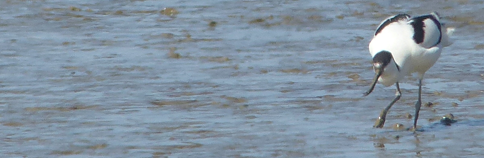

### Birds with Friends #1: Cliffe Pools and Northward Hill RSPB

We've planned a series of three little trips where we think we know roughly
enough about a particular site to be able to give a meaningful tour to
some enthusiastic but green birding friends.

Our first trip is to the Isle of Grain - we're off to [Cliffe Pools
RSPB](https://www.rspb.org.uk/reserves-and-events/reserves-a-z/cliffe-pools/) to
try to find Nightingale (amongst other things). On the
assumption that we inevitably fail to find a Nightingale at Cliffe,
we've a backup plan of a little walk around nearby [Northward Hill
RSPB](https://www.rspb.org.uk/reserves-and-events/reserves-a-z/northward-hill/).

#### Rehearsal

We go for a dry-run of the trip the Sunday before, and it goes...sort
of OK, such that when it comes to the Friday with actual friends, turning up
we're nervous, but confident; we should hopefully be able to
deliver _most_ of the birds the programme promised.

#### Cliffe Pools RSPB

On the day, we're up considerably earlier than the dry-run, and this
causes amusing strife between AB1 (driving) and AB2 (instructing
Google to navigate to a place on the reserve which is inaccessible to
cars). After some minor wrangling, we're still fifteen minutes
 early; and brilliantly our guests are fifteen minutes late.

This does give us a bit of time to orientate ourselves. We realise
that the gate to the RSPB parking is open (it wasn't on rehearsal
day), so we mosey on down there, because it's...a nice place to park?

This is a good decision, because as soon as we're out of the car we
can hear a Nightingale - it's perhaps thirty or forty metres North-East of us.
We're pretty confident we'll walk past it once we start out on a circuit
 of the reserve; here's hoping it can hang on until our friends arrive!

Which they do, after a brief false start where they visit
[Nationwide Platforms](https://www.nationwideplatforms.co.uk/en-gb/find-a-depot/kent).
We cut short the introduction to the reserve in favour of going to find this
Nightingale. It is belting its song out from a bushy thicket perhaps two or
three metres from the path - we get right next to the sound and can't
believe we're unable to see the bird.

I explain that this is standard Nightingale behaviour - the skulky
little sods always sound like they ought to be visible, but they often
aren't, singing from impossibly opaque brambles that permit no
viewing. This bird decides to prove me wrong though, exiting its bush
stage left at speed, giving us our first look at the famously rufous
Nightingale behind. Well, that's a good start - I only saw my first
Nightingale in 2018, and now this lot are picking one up on their first
proper birding outing!

<figure class="figure">
    
    <figcaption class="figure-caption text-center">
        A look along the path
    </figcaption>
</figure>

We trundle around the boundary of the reserve (also the boundary of
Nationwide platforms) until we reach the point where the Saxon Shore
Way meets it. There, we turn left - the path splits the reserve neatly
in two, heading between the Radar and Crystal Pools.

We make a brief stop on the right-hand side of this path to examine
the gull colony - picking out a Mediterranean Gull or two on the
ground (we've already pointed at the sky when we've heard its
distinctive barking call). We also point out a couple of larger gulls
- some Herring Gulls, and a singular Lesser Black-backed Gull for
completeness. We explain that the nice glossy black head of the Mediterranean Gull
is worth being able to tell apart from the frankly more chocolatey brown head
of Black-headed Gull.

<figure class="figure">
    
    <figcaption class="figure-caption text-center">
        Here come the gulls
    </figcaption>
</figure>

We move on down the causeway, discovering Dunnocks in the brambles,
and a duo of Great-crested Grebe pair-bonding off to the right. As we
come to the transition between the Radar Pool and the Flamingo Pool
(named for...what precisely?), we slow our pace a little - the scrubby
brambly stuff gets a bit wider here, and this is _exactly_ where I've
found Nightingale in the past.

Somewhat unbelievably, mere seconds after we stop to listen, the
unmistakable sound of Nightingale invades our ears. It's somewhere off
to our left, but again, invisible...until I take a few side steps
right, and suddenly the bird is obvious, sitting in a thin tree at the
back of the scrub. I quickly summon everyone else to stand where I am,
so they can see it, and all but one of us manages to actually do
so.

I'm somewhat tickled at this point - in the test run we only picked up
Nightingale at the last moment at Northward Hill, and we've found two
in under an hour... we're at risk of making this birding lark look a
little easy at this point. Bemused, we plough on, uncertain as to how to
make the rest of the day as good as the start.

<figure class="figure">
    
    <figcaption class="figure-caption text-center">
        This is the bird we saw on the dry-run; views on this trip were
        closer but briefer
    </figcaption>
</figure>

Thankfully, the birds are willing to lend a hand. As we get towards
the end of the causeway, a Sedge Warbler starts bouncing up and down
out of the trees on the right, flycatching. Lovely. Nearby, a shouty
Cetti's Warbler gives us the opportunity to explain its noisy
invisibility. A scratchy Whitethroat makes its way along the left hand
side of the path; a distant singing Chiff-chaff is found to join up
its song with its appearance.

<figure class="figure">
    
    <figcaption class="figure-caption text-center">
        A not-so distant Chiffchaff from the dry-run, having a sing
    </figcaption>
</figure>
<figure class="figure">
    
    <figcaption class="figure-caption text-center">
        Common Whitethroat having a squawk
    </figcaption>
</figure>

Exiting the causeway and heading on to the path towards the Thames, we
find a collection of sleeping Shelduck on the mud on the far side of
the Flamingo pool. Also over there are thirty or forty dozy
Avocets. One or two are poking about though, and we get the telescope
set up so we can all have a good look at them. Two or three groups of
Avocet also manage a timely fly-by while we do.

<figure class="figure">
    
    <figcaption class="figure-caption text-center">
        Avocet poking about
    </figcaption>
</figure>

We also get a bonus Black-tailed Godwit (totally absent during the
dry-run; we're just a tad late to see more of them at this point,
they're on their way to breed back in Iceland) and some seriously
distant Redshank. After promising that we really were done at this
point, a couple of Lapwings pop up and are just too gorgeous to ignore
- their breeding plumage with its petroleum shine is irresistible.

We're just tearing ourselves away from the sandy end of the Flamingo
Pool when every bird on it goes absolutely bonkers - all the Avocet
and Shelduck are suddenly very awake; quite a lot of them are in the
air, the previously placid Lapwing are making their bizarre electronic
squeaks as they battle with an imagined predator - oh, no, for once,
there is actually a predator - a Peregrine Falcon making its way
across the reserve. It doesn't seem imminently interested in eating
anything that it's frightened and calmly carves off into the
distance.

<figure class="figure">
    
    <figcaption class="figure-caption text-center">
        Shelduck in flight
    </figcaption>
</figure>

We finally make our way to the Thames (AB1 apparently completely misses
the passage of a tiny grass snake across the path), accompanied by our
first Linnets of the day. We briefly crest the sea wall, get blown
about by a pretty aggressive Easterly wind and quickly descend back
into its lea to eat a snack.

<figure class="figure">
    
    <figcaption class="figure-caption text-center">
        A snake!
    </figcaption>
</figure>

Further along the wall, we pick up Sedge Warbler #2 in a bush -
_exactly_ the same bush we found it in during the dry run - rehearsing
is always worth it, kids. As a bonus, we also get a Nightingale
singing in the denser scrub behind it. I've not heard them all the way
out here; interesting. We don't manage to clap eyes on it - a pair of
Chaffinches briefly pretend to be it, but we're not falling for it.

<figure class="figure">
    
    <figcaption class="figure-caption text-center">
        Sedge Warbler having a sing
    </figcaption>
</figure>

Onward, directly into the wind, with several stops where a larger
bush, tree or shrub provides a bit of shelter. AB1 accidentally builds
a bit of a lead and catches a brief sighting of a Cuckoo's backside. This
is widely disbelieved, probably correctly - it was a very brief view.

As the reedbed grows in height to the right of this path, so does the
scratchy clamour of a Reed Warbler's song. Once again, a reliable
bird, found in (or under) the same bush as during the dry run. We eye
up the first viewpoint for lunch, but decide that the next one along
might be better.

<figure class="figure">
    
    <figcaption class="figure-caption text-center">
        Viewpoint One
    </figcaption>
</figure>

Hunger drives us to that point speedily, and we find, to collective
relief, an area of grass just below the viewpoint that has all of the
sunlight and none of the wind. It also has excellent nearby frogs! We
eat some sandwiches and catch up on some non-bird related
events. There's a smattering of ducks around that we should probably
get the scope on, but we decide that the relative attractions of
Gadwall and Shoveler are potentially overkill after three hours of
everything being very new. We do get another fly-by from our previous
Godwit though.

<figure class="figure">
    
    <figcaption class="figure-caption text-center">
        This is a Marsh Frog, we think
    </figcaption>
</figure>

An unbelievably tanned birder has taken up residence on the viewpoint's
bench with a scope and has been keeping a close eye on
things. "Anything of note?" he asks as we pass. We give an account of
our birding day so far, and have most of it confirmed back to us. In
addition to our count, this chap's also seen two Cuckoos (as opposed
to just the behind of one).

We complete our circuit, briefly taking in the pinnacle viewpoint
(it's hard to choose between the view of the reserve and Nationwide
platforms) and a few showy Blackcaps mucking about in the brambles.

<figure class="figure">
    
    <figcaption class="figure-caption text-center">
        View from the Pinnacle
    </figcaption>
</figure>

Well. Not bad. Not bad at all.

#### Northward Hill RSPB

With the motivation for this extra stop now somewhat nullified, we can now
have a trundle around the woodland trail there with no pressure to find
anything in particular. "This is now much more about having a nice walk, with
the opportunity of a bird or two, rather than a birding mission" we say. A
singing Cuckoo off to our right threatens to make this statement immediately
false, but it's so far off that mounting a search for it is an immediate non-starter.

We run into a Green Woodpecker as we reach the Sweeney viewpoint
(which is, it must be said, a better viewpoint than we deserve for
immediately singing The Sweeney theme tune at it (particularly when
the only lyrics we know are "The Sweeney, The Sweeney"
etc.)). Numerous Dunnocks and Linnets hop and skip between the bushes.

We head up towards the woodland viewpoint; there's a Nightingale
bubbling away some distance to our left. We try following a little
path in that direction but it goes nowhere, and the singing stops. Ok,
can't win 'em all, back we go (one of us still quietly humming the
theme from The Sweeney).

<figure class="figure">
    
    <figcaption class="figure-caption text-center">
        Looking West from Woodland viewpoint
    </figcaption>
</figure>

As we climb the hill past the viewpoint, we come across another birder
who is staring deeply into the trees in the direction of...yes,
another singing Nightingale. We briefly exchange general birder
small-talk "well, that's an unmistakable song" before going our
separate ways.

At the top of the hill we're surrounded by the usual suspects; singing
Blue and Great Tits, and more Chiffchaffs too. We also find some
dappled bluebell pastures and some gnarly, charming, and apparently
climbable old trees.

<figure class="figure">
    
    <figcaption class="figure-caption text-center">
        Bluebell woods
    </figcaption>
</figure>

The remainder of the woodland circuit is not entirely without event -
we manage to continually disturb a yaffling Green Woodpecker. Further
around we hear a Great Spotted Woodpecker drumming on a hollow tree;
it moves off before we can get a proper bead on it though. As we link
back up to the part of the loop we originally climbed, we hear yet
another Nightingale. That's the sixth, and we saw two. Mad.

We descend the hill back to the car park, and, barring an extended
debrief in a nearby pub, are done for the day.