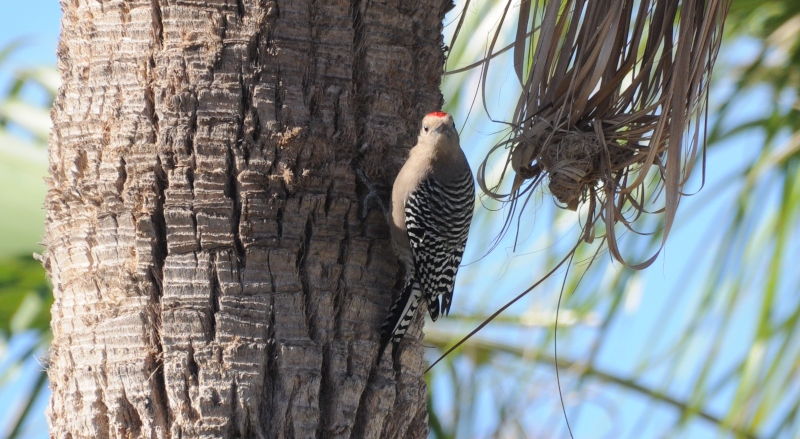
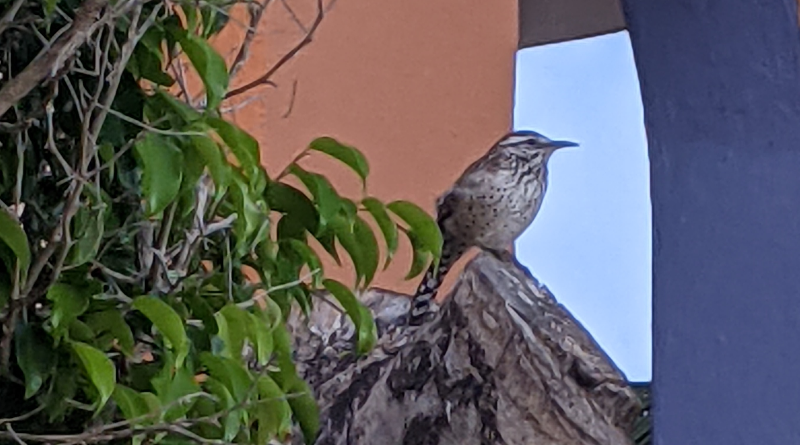

### Mexico 2021

A good friend of AB2 is getting married in Mexico, and our presence has been 
requested. The stars align, and a way to attend without violating any COVID restrictions appears. A trip taking in Mexico City and some sites near the wedding (in San José del Cabo) is hastily arranged.

### Mexico City

We arrive in Mexico City just in time for Dia de los muertos. The city is 
absolutely jam packed full of people. What are we doing here again? Eating a 
lot of delicious food and having access to 24h churros, apparently.

We don't find a lot of birds in this bit of the break, but this hummingbird 
(from our hotel room window, no less) was a decent find.

<figure class="figure">
  
  <figcaption class="figure-caption text-center">
    Hotel Hummingbird.
  </figcaption>
</figure>

A coach trip out to Teotihuacán gets us a bit more into nature, and we find 
a nice pair of Vermilion Flycatchers. They're spectacularly dimorphic!

<figure class="figure">
  
  <figcaption class="figure-caption text-center">
    Vermilion Flycatcher (female).
  </figcaption>
</figure>

<figure class="figure">
  
  <figcaption class="figure-caption text-center">
    Vermilion Flycatcher (male).
  </figcaption>
</figure>

### Los Cabos

After our city break, it's off to Los Cabos, where there's a bit more hope 
of finding things. We're in a resort on the coast that's a short walk along 
the beach from [Estero San José](https://goo.gl/maps/MpeFh2gdXKuFVXim7).

And the estuary delivers - wall to wall Ospreys and Pelicans, with 
occasional visits from Hen Harriers, American Kestrel and kingfishers.

<figure class="figure">
  
  <figcaption class="figure-caption text-center">
    This Osprey just sat at the top of this palm yelling at any other 
Osprey that flew upriver.
  </figcaption>
</figure>

On the beach itself, we found several plover and wader species, some of which 
were _exceptionally_ confiding.

<figure class="figure">
  
  <figcaption class="figure-caption text-center">
    Jawdroppingly tame Sandpiper (Least?)
  </figcaption>
</figure>

<figure class="figure">
  
  <figcaption class="figure-caption text-center">
    Killdeer
  </figcaption>
</figure>

<figure class="figure">
  
  <figcaption class="figure-caption text-center">
    Three Black-necked Stilts.
  </figcaption>
</figure>

<figure class="figure">
  
  <figcaption class="figure-caption text-center">
    Piping Plover.
  </figcaption>
</figure>

<figure class="figure">
  
  <figcaption class="figure-caption text-center">
    Turkey Vulture.
  </figcaption>
</figure>

<figure class="figure">
  
  <figcaption class="figure-caption text-center">
    Black Phoebe.
  </figcaption>
</figure>

We also pick up our first endemic of the trip in the form of Belding's 
Yellowthroat.

The hotel grounds themselves aren't bad either, with near constant Gila 
Woodpecker and Cactus Wren.

<figure class="figure">
  
  <figcaption class="figure-caption text-center">
    Gila Woodpecker notices it's being watched.
  </figcaption>
</figure>

<figure class="figure">
  
  <figcaption class="figure-caption text-center">
    Cactus Wren is huge!
  </figcaption>
</figure>

If that weren't enough, it turns out baby turtles from a hatching program 
are released on this beach too.

<figure class="figure">
  
  <figcaption class="figure-caption text-center">
    Tiny Turtle.
  </figcaption>
</figure>

We embark on a bird tour from here and it's...alright...but also a bit crazy, as
we spend several hours being driven between sites that will, in fact, be 
much nearer to one of our next stops.

We do see some good birds though.

<figure class="figure">
  
  <figcaption class="figure-caption text-center">
    Gray Thrasher - another endemic.
  </figcaption>
</figure>

<figure class="figure">
  
  <figcaption class="figure-caption text-center">
    Western Scrub Jay is no scrub.
  </figcaption>
</figure>

<figure class="figure">
  
  <figcaption class="figure-caption text-center">
    Pelicans on the shore.
  </figcaption>
</figure>

<figure class="figure">
  
  <figcaption class="figure-caption text-center">
    These ibises were great.
  </figcaption>
</figure>

Wedding complete, and San Jose explored (the best place to eat is [here](https://goo.gl/maps/gftBYKhpBzGS65Ap6), by the way), we head North to La 
Paz, via an overnight stay near Cabo Pulmo to facilitate a bit of 
snorkelling (so many fish! Jacques Cousteau's moniker of "The Aquarium of 
the World" is well-deserved).

La Paz is more our sort of place. We spend a lot of time ruminating over 
whether to go on a boat tour to Espiritu Santu - really, it hinges on "Will 
there be Blue-footed Boobies"? All the websites are obsessed with swimming 
with `<insert marine creature here>` - what about our little Patas Azul? 
Eventually, we get someone on the phone who assures us that we'll find them.

On a boat we get. And we were not lied to; there's an island about half an 
hour into the trip that's got a very active colony living on it. Great!

<figure class="figure">
  
  <figcaption class="figure-caption text-center">
    Blue-footed Boobies. Life goal achieved.
  </figcaption>
</figure>

Even if their feet aren't _quite_ that blue at this time of year, we'll take 
it. What we will not take quite so well is the remainder of the boat trip, 
which AB1 spends either feeling like he ought to throw up, throwing up, or 
later, wondering why it took him so long to throw up.

On returning to the shore, we're greeted by a very photogenic pelican.

<figure class="figure">
  
  <figcaption class="figure-caption text-center">
    Pelican.
  </figcaption>
</figure>

This Osprey also perched handily with the moon.

<figure class="figure">
  
  <figcaption class="figure-caption text-center">
    Osprey and Moon.
  </figcaption>
</figure>

A good trip, given how little control we had over the itinerary, and how 
long we had to plan it.