### Mid-Wales part one: Llandovery

The first in a series of posts detailing a trip to mid-Wales in August/September
2020.

#### Context

All of our research says that Mid-Wales is best visited in the Spring. I find
one older book that suggests Flycatchers are almost the default bird in some
forests of the region at that time. Why try in late August/early September then?

Well, there's a pandemic on, and during the Spring, a full on lockdown put a
swift end to any idea of a trip at that time of year. Perhaps we can catch up
with some of these species as they begin their journey South? Neither average
birder has had more than a couple of days off since March in any case, so
even if we spend two weeks in Wales walking around bird-free forests and
hillsides we should probably get out there.

#### Llandovery

Will be our base of operations for our first five days, from August 28th
'til September 1st. We're staying in the Castle Hotel, which is...functional
. Our room also provides an excellent place from which to listen to the
nearby bustling livestock market. We've never seen so many sheep change hands.

Primarily though we're wanting to explore to the North of here, up the River
Towy; there are two reserves in particular we're hoping to visit - the RSPB's
Gwenffrwd-Dinas reserve, and Alt Rhyd-y-groes NNR nearby. In between we
might have an explore of some walks from Llandovery itself.

#### Gwenffrwd-Dinas

Heading up towards Llyn Brianne from Llandovery is effectively travelling
from the edge of nowhere into the middle of nowhere. As such, we're
expecting the roads to be of the hairy single track variety, full of locals
doing 90mph because they've been doing it since birth.

Thankfully, our expectations are off. Other drivers seem, mostly, to be being
as careful as we are, and the road to Gwenffrwd in particular is mostly
single carriageway with only occasional squeezes where more care is
required. We guess the continued maintenance on the dam at the top means
the road up there also gets well looked after.

<figure class="figure">
    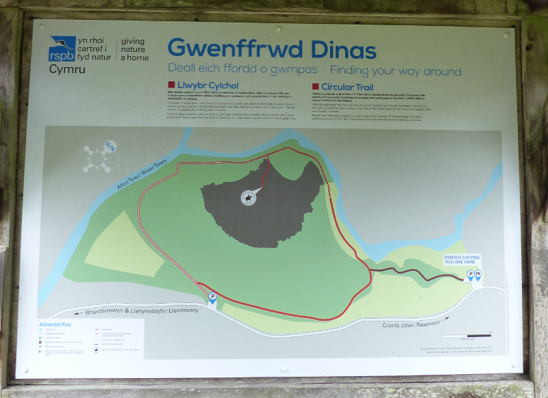
    <figcaption class="figure-caption text-center">
        This should be easy, then?
    </figcaption>
</figure>

We make it up here twice; first a solo visit from AB1 (AB2 hasn't quite left
 work behind), and a second in tandem.
 
<figure class="figure">
    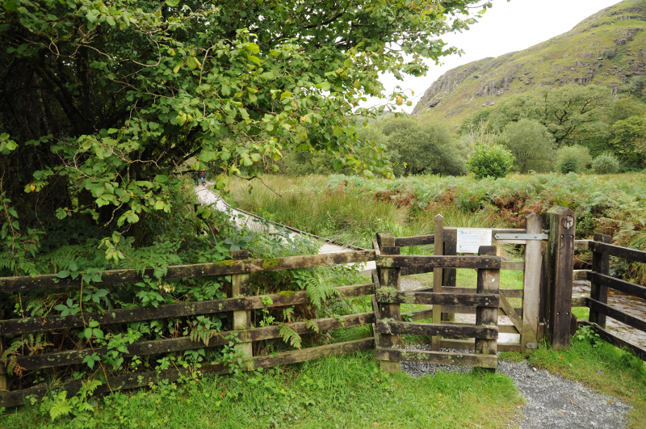
    <figcaption class="figure-caption text-center">
        The reserve entrance
    </figcaption>
</figure>

Arrival at Gwenffrwd is punctuated by some excellent interpretive panels
and a boardwalk. Two of our favourite things. The boardwalk threads its way
through a wet woodland, with a branch of the Towy off ~100m or so to the
right of it (as you walk from the car park into the reserve). 

<figure class="figure">
    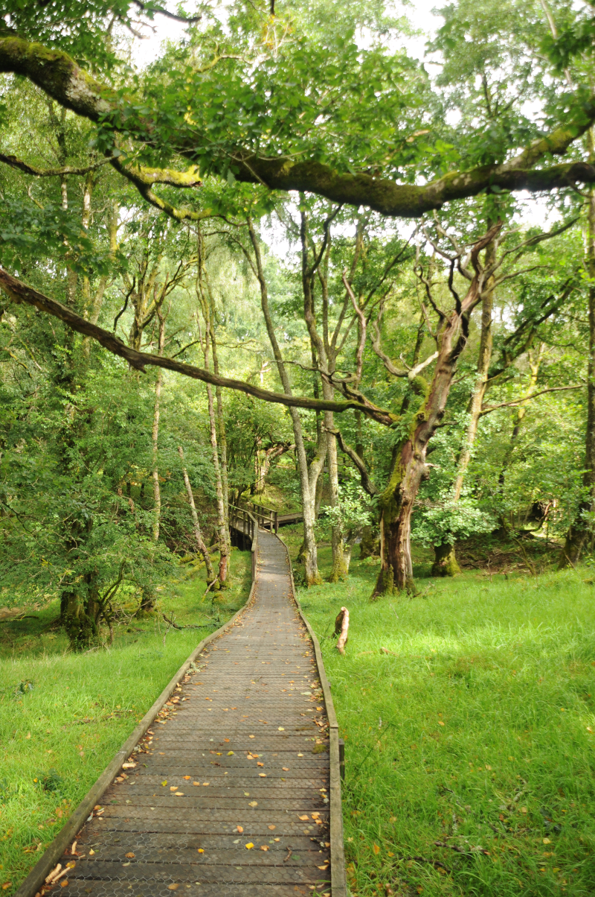
    <figcaption class="figure-caption text-center">
        Undulating boardwalk; wonderful
    </figcaption>
</figure>

The boardwalk is delightful - alive with birdsong with a backdrop of
trickling water. We had four very different experiences here. First time
, everything was a Chaffinch. On the way back, Treecreepers, everywhere
. Third: dead as a doornail. Fourth: huge woodland flock of everything - all
four common tit varieties, Goldcrest, Nuthatch, Treecreeper, Great-spotted Woodpecker.

On leaving the boardwalk, Covid guidelines demand the circular walk be
attempted clockwise (yes, really). This takes us alongside the river - which has
got Dipper written all over it. Or would do, if those people would keep
their dog out of it. Oh well. Everyone's got to be somewhere.

<figure class="figure">
    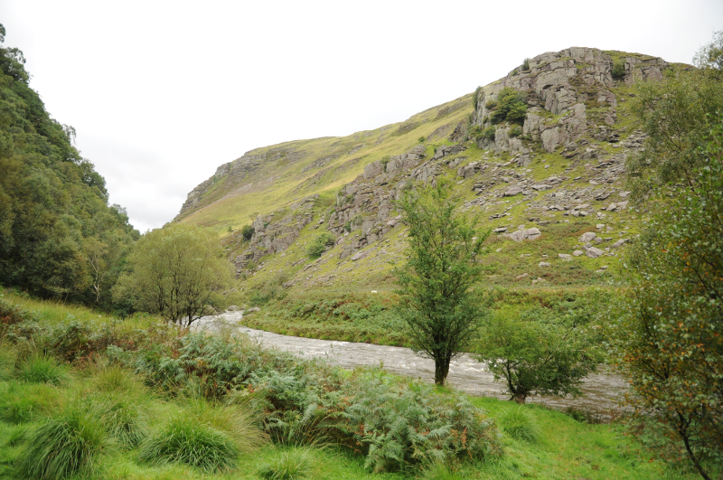
    <figcaption class="figure-caption text-center">
        There was briefly a Dipper at the far end, here.
    </figcaption>
</figure>

After a couple of hundred metres of being followed by a muddy grass path, the
 river has had enough, and dives downhill via some pretty impressive rapids. 
 The path holds on to the edge, but is hard work - we spend more time
keeping our feet than looking for Dippers in this section, with only a few
stops to admire the scenery behind and above the rapids. The woods to the
left could well be full of life, but our usual mechanism for detecting them
is drowned up by the roar of the river.

Roughly halfway along the rapids part of the walk, there's an option to climb
 up to visit the [Ogof Twm Sion Cati](https://www.rhandirmwyn.net/twmsioncati.html)
 - I ignore this on our first visit, but completionist AB2 insists on a visit
the second time around. It's a reasonably decent hideout, and the climb
probably earns you a snack, so why not?

<figure class="figure">
    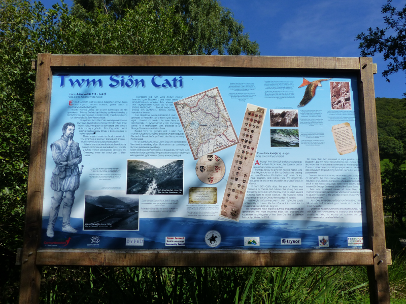
    <figcaption class="figure-caption text-center">
        The Twm Sion Cati panel from the car park
    </figcaption>
</figure>

After a few more minutes of careful foot placement, the path starts to move
away from the river - irritatingly, just as it starts to calm enough to be
Dipper-friendly again. In particular, the section where the two Towy
branches join looks like it could be a Dipper hotspot - the sanctioned path
 has no intention of offering us a view though.

<figure class="figure">
    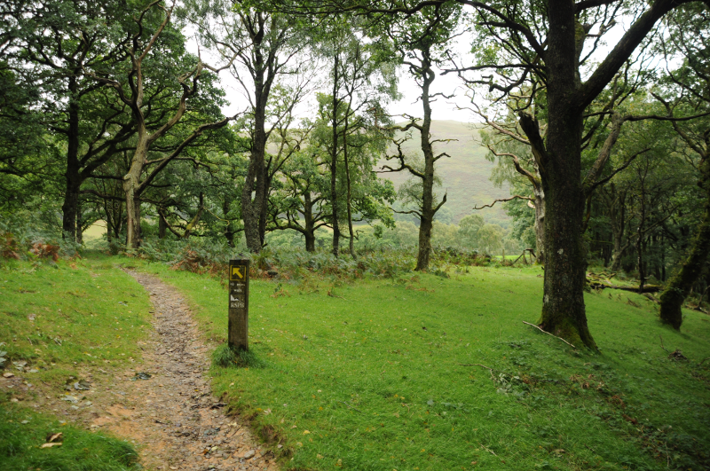
    <figcaption class="figure-caption text-center">
        Redstart central. Not seen: any Redstarts.
    </figcaption>
</figure>
 
As the sound of the river begins to fade, there's a bench, and a fence, and
by goodness it's the most Redstarty place you've ever seen in your life. 
Tellingly, though, no sign of Redstart is seen on either occasion. There is
 an ideal bench for a sit down and a snack (already? -Ed), though.

The path turns a corner at this point and pivots away from the river entirely. 
We're now in rich Oak woodland. We found it full of Song Thrush, Wren, 
Nuthatch and Treecreeper.

<figure class="figure">
    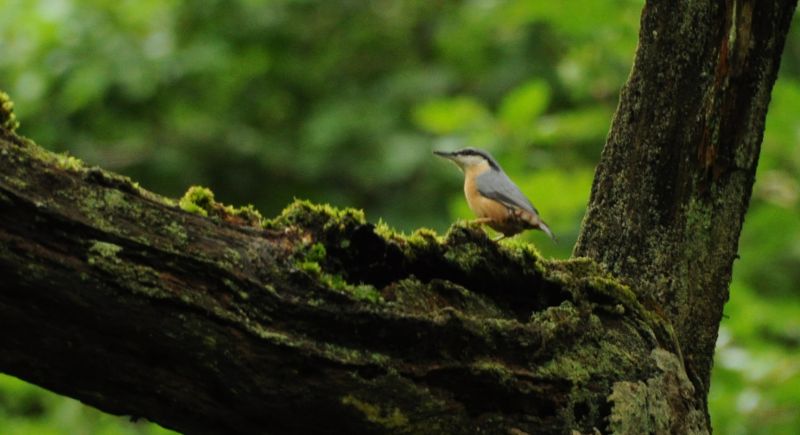
    <figcaption class="figure-caption text-center">
        Who, me?
    </figcaption>
</figure>

<figure class="figure">
    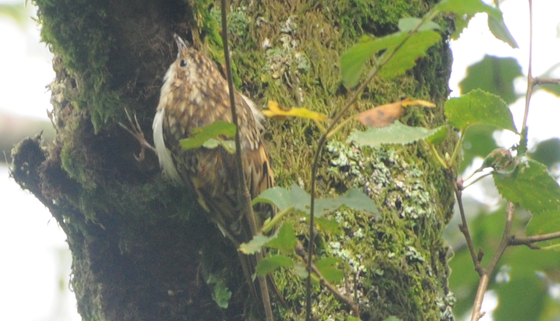
    <figcaption class="figure-caption text-center">
        This is a pretty healthy-looking Treecreeper
    </figcaption>
</figure>

After a short walk, the path starts to approach the access road. The RSPB map
marks the road here as featuring parking; we wouldn't recommend it unless the
 main car park is full; it's not much more than an enlarged passing place. 

A tiny watercourse flows from the road to the Towy off to our right that
looks Dipper-tastic but is, again, free of Dippers. We give up after a while
and continue on our circuit.

The next arc-section has a couple of dead trees blocking the way; not a
problem, we think, until giant invisible brambles grab at both of us as we
attempt to circumvent them. Much swearing follows. A Nuthatch joins in from a
tree somewhere to our left. At this point the path is tracing the woodland's
edge, and there are nice views across the road to the hills opposite. There
are some big birds up near the tops - one or two Ravens enjoying a gronk
and a Buzzard or two trying not to look bothered.   

<figure class="figure">
    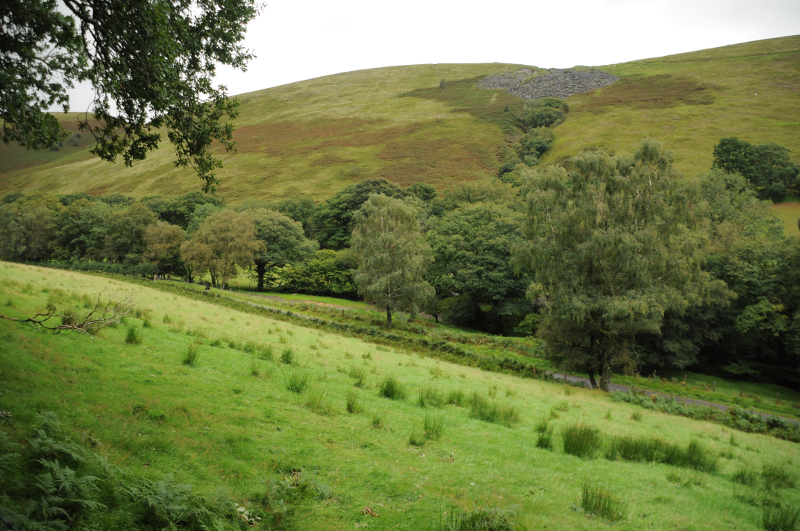
    <figcaption class="figure-caption text-center">
        Meeting you, with a view, to the hills.
    </figcaption>
</figure>

The path cuts back into the woodland just in time to complete its circuit and
deliver us back to the boardwalk. Delightful reserve. Looking forward to
visiting it when its specialties are a bit more visible (I suspect we're
 going to be saying that a lot).
 
Oh, and before moving on - don't leave without visiting the tiny church next
door. Quaint, and full of even more birdlife; we found Nuthatches foraging
on the floor, another Great-spotted Woodpecker and plenty more.
 
#### Allt Rhyd y Groes

We had real difficulty finding any documentation on this reserve at all
. [This page](https://www.first-nature.com/waleswildlife/sw-nnr-alltrhydygroes.php) 
on the First Nature website is pretty good. [This page](https://naturalresources.wales/about-us/news-and-events/blogging-from-our-special-places/take-a-walk-on-the-wild-side) 
on the Natural Resources website isn't bad either. But neither have much of a
 trail map!
 
We try to follow the directions from the First Nature website. We do not
succeed. We try to park on the far side of the wrong bridge, and immediately
anger a very small dog. There is much better parking on the other side of the
bridge, so we drop the car there instead. For future explorers, here's an
[exact pointer](https://gridreferencefinder.com/os.php?x=277290&y=245922&lt =52.097984&lg=-3.7928072).

We cross the bridge and follow the single track round around - it's a
pleasant 4 or 5km walk to the reserve from there that follows the path of
the river. On our left we have delightful Oak woodland with occasional bits
of field, and to our right, intermittently fabulous view of the river.

We pick up a smart-looking Male Redstart in one of the field/woodland
boundaries on the left. He hangs about on a fencepost just long enough for us
to consider moving for a camera, and then darts back into the woodland never
to be found again.

As we approach the reserve the road hews ever closer to the river, and then
crosses it just as the reserve track veers uphill. We realise, belatedly
, that it's this bridge we were supposed to drive to and cross - there are
several parking opportunities on the other side.

<figure class="figure">
    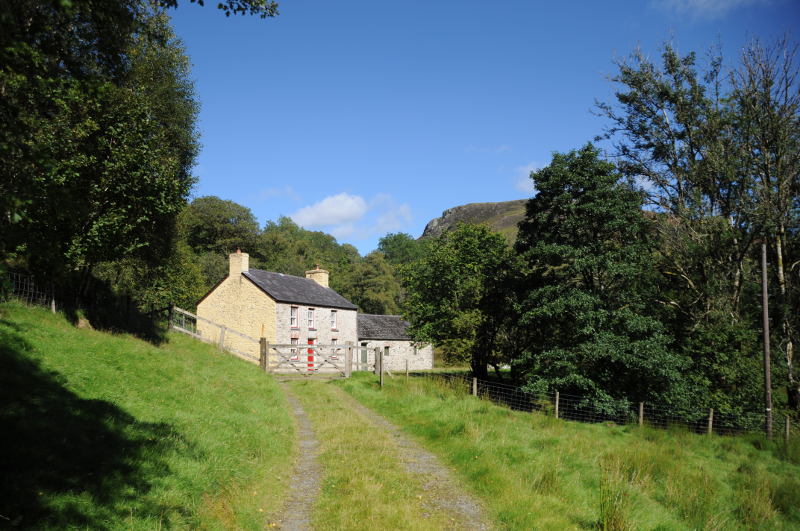
    <figcaption class="figure-caption text-center">
        Nice-looking place!
    </figcaption>
</figure>

The path leaving the road takes the walk from pleasant to full on delightful, 
and as we pass the old house at the border of the reserve we realise we won't
mind too much if that Redstart is the only thing we see.

We work our way past the house and finally a sign tells us we have made it to
the reserve proper. We'll try the slightly longer path that zigzags up the
hillside, then we'll see if we can use footpaths from the OS map to link up
 to the shorter one.

<figure class="figure">
    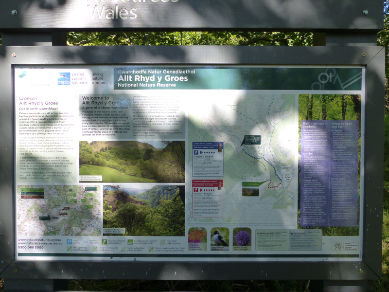
    <figcaption class="figure-caption text-center">
        Excellent panel.
    </figcaption>
</figure>
 
Just beyond the sign we start seeing bird boxes; we guess for Pied Flycatchers. 
It's remarkable how near the path they are; what an experience it must be
to come here in the Spring! The woodland as we find it now is quiet but
beautiful, and the views over the valley make up for the lack of
obvious avian activity.

This path is not for the faint-hearted - there's a tricky crossing of a tiny
stream that involves a hand rail and quite a lot of care. Once you're across
there, the gradient of the zigzag path is also pretty aggressive.

Once the gradient starts to ease, the woodland thins too, going from shady
Oak to much sunnier scrub. The path has clearly not been heavily walked for
some time, and we have to fight our way through quite a lot of foliage, and
even more flies. It's a relief as the landscape changes again into what we
guess is a commercially managed forest and the flies buzz off.

<figure class="figure">
    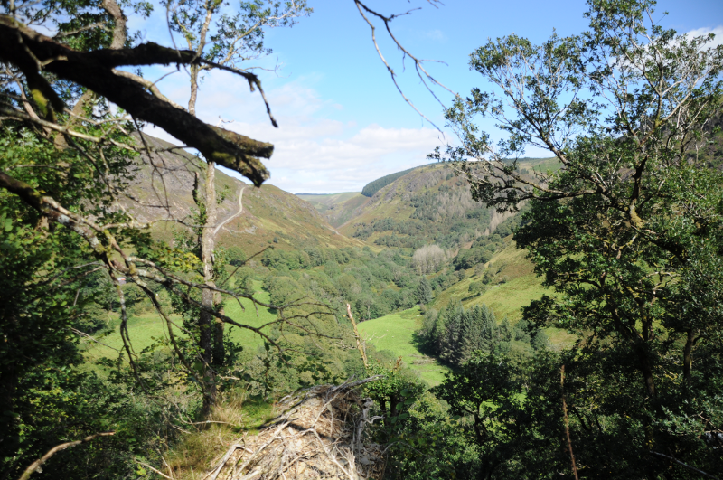
    <figcaption class="figure-caption text-center">
        Looking North from the higher slopes of the Allt.
    </figcaption>
</figure>

Here's where we want to improvise a route back to the other path. Our
immediate hopes of a quick forest cut are prevented by the forest being
rather too thick (and wet!). We continue through the forest until the road
heads out onto open moorland, instead. Here our map reckons a track should
take us down to the end of the other reserve trail.

<figure class="figure">
    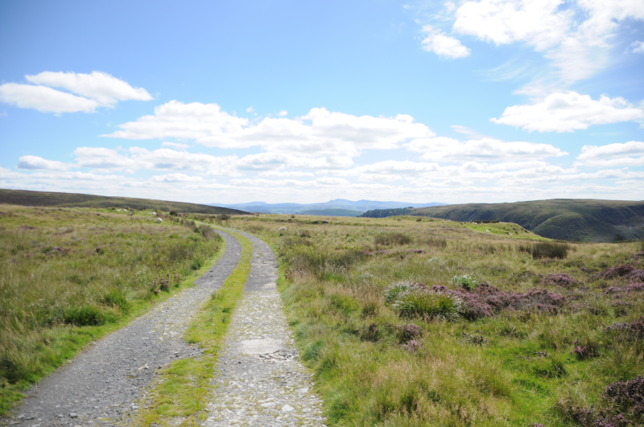
    <figcaption class="figure-caption text-center">
        Moorland view towards Pen-y-fan.
    </figcaption>
</figure>

There's definitely a track leaving the road at the point where we leave it. 
At some point though, it disappears, and we end up having to improvise our
way to where we think the real footpath is. Which, even after some GPS based
cheating, it really isn't. After a rather energetic half hour of improvised
bracken-scrambling, we do find our way to that trail. But we make a mental
note to trust the OS map a bit less for our next plan; it would have been
more sensible for us to continue on the track down to the river Gwenffrwd
and then circuit back to the car from there.

The short return trail is even steeper than the one we chose; 
steep enough to warn me that I have overestimated how much walking/climbing
/bracken scrambling my left knee can manage in a day. We quickly find
ourselves back at the original reserve information panel, from whence we
retrace our steps back to the car. What a place!
 
#### In and around Llandovery

We struggled a bit here. A walk around the town's many rivers didn't deliver
much joy. On a solo walk on the first day, AB1 did encounter a pair of
Common Sandpipers, though.
 
#### National Botanic Garden

<figure class="figure">
    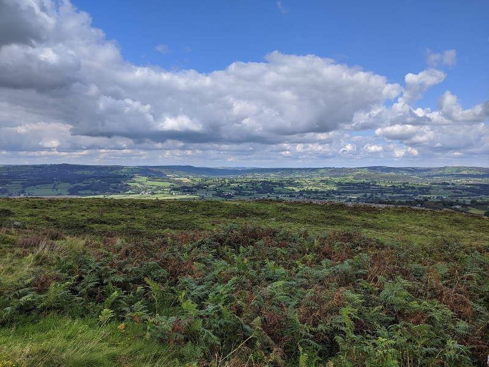
    <figcaption class="figure-caption text-center">
        We approve of the placement of this hill fort.
    </figcaption>
</figure>

We haven't seen _that_ many birds, and AB1's knee could do with a day off. 
Unfortunately, there's no chance of that, a hill-fort full of Meadow Pipit
needs to be walked around (good views, constant Green Woodpecker yaffling
from nearby woods), and by the time we've got there, well, we might as well
visit the [National Botanic Garden](https://botanicgarden.wales/), a few
miles further down the Towy valley. In a strange coincidence, the same
attraction also hosts [The British Bird of Prey Centre](https://www.britishbirdofpreycentre.co.uk/),
I guess we'll have no choice but to go and have a look at that as well. 

We arrive _just in time_ for the early afternoon bird of prey show, and our
mild misgivings about the zoo-like nature of raptor collections are
destroyed instantaneously by giant birds of prey flying no more than a
couple of feet over our heads. The commentary from the team looking after the
birds is excellent, too. The interaction of the bigger birds of prey and
local wild raptors was also great. During the show, a couple of nearby
Buzzards decided that the presence of a Golden Eagle motivated them to become
faraway Buzzards at some speed. Visiting the aviary afterwards, we followed
the rapt stares of birds we'd just seen in the show to a wild Peregrine Falcon
that was overflying.

Rather than try to describe how good the views were, let's say it with some photos.
 
<figure class="figure">
    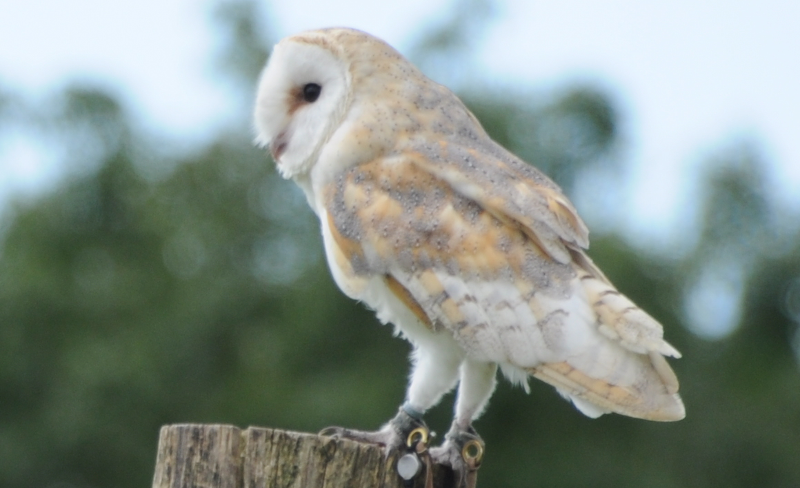
    <figcaption class="figure-caption text-center">
        Barn owl.
    </figcaption>
</figure>

<figure class="figure">
    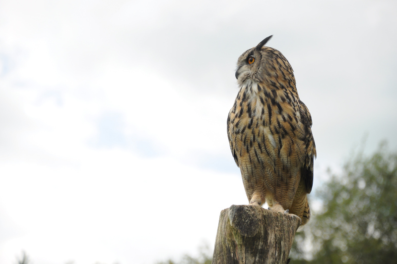
    <figcaption class="figure-caption text-center">
        Eurasian Eagle Owl. Oh my.
    </figcaption>
</figure>

<figure class="figure">
    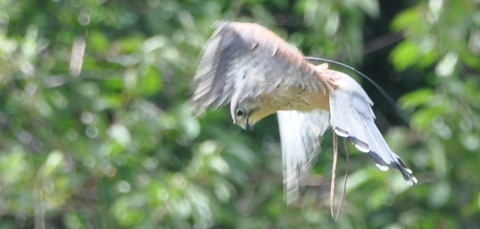
    <figcaption class="figure-caption text-center">
        Kestrel, hovering
    </figcaption>
</figure>

<figure class="figure">
    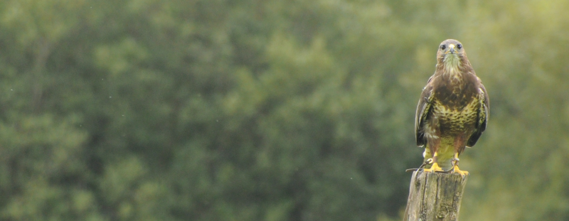
    <figcaption class="figure-caption text-center">
        A patient Buzzard.
    </figcaption>
</figure>

<figure class="figure">
    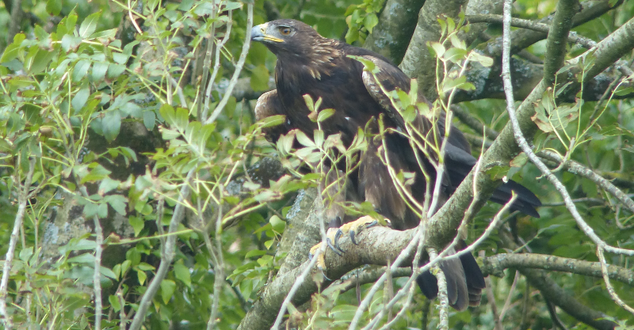
    <figcaption class="figure-caption text-center">
        Occasionally one of the birds decided it preferred sitting in
        the nearby trees to sitting in the open, and that was also great.
    </figcaption>
</figure>

