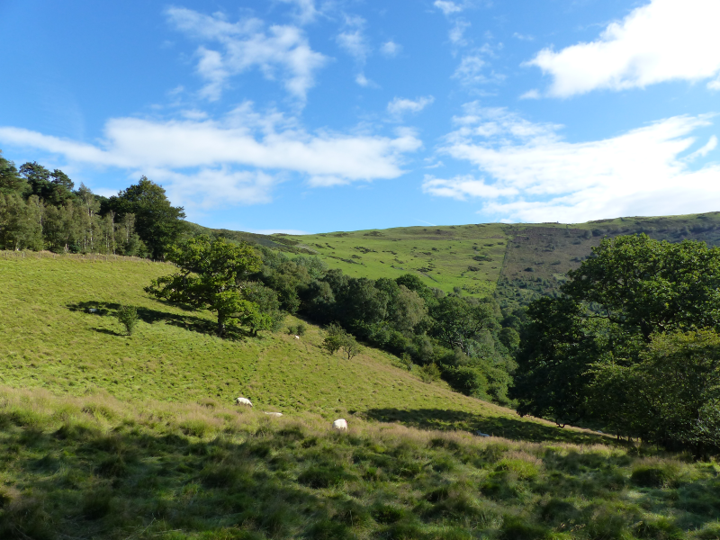
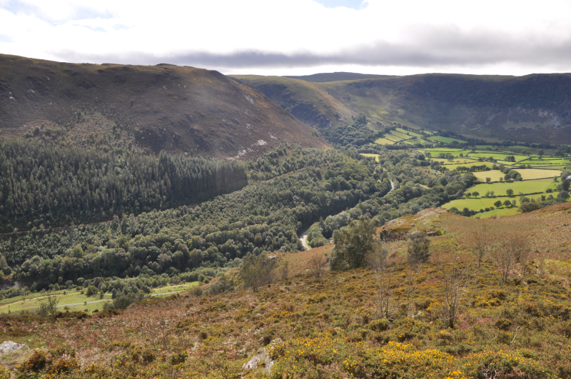

The third in a series of posts detailing a trip to mid-Wales in August/September
2020.

#### The story so far

We've visited two _excellent_ Oak woodland reserves near Llandovery. And we've 
had some tremendous Dipper encounters, along with some distant Whinchats and
flighty Flycatchers near Sugarloaf. 

Now, however, we've setting up camp in a self-catered cottage in Rhayader
for a week. Will we find anything more? We doubt it, but we'll know where to
go come next Spring.

#### To Rhayader

We drive to Rhayader from Celyn Farm, stopping in Llandrindod Wells for lunch,
a visit to the National Cycle Museum and a bit of laundry. Our keenness for
cleanness is unneeded though - there's a laundrette not two minutes walk
away from our Rhayader residence. Oh well. 

Rhayader's easily our favourite base of operation. It's self catered, so we
can cook an evening meal. The town's full of pubs for a pre-dinner pint or
two, and there's walks we can do from the doorstep. Finally, we've got an
extra Sophie coming along for this bit, and she's bringing an adorable
little Spaniel named Spoon.

<figure class="figure">
    
    <figcaption class="figure-caption text-center">
        Spoon.
    </figcaption>
</figure>

This part of the trip is a bit different - we don't explore as many places as
we perhaps could, but instead pretend we live in Rhayader full time, and
treat the nearby places like our local patch.

We find one particularly special reserve nearby, and a few other spots that
 are worthy of a trundle around if you want to play the same game we did.
 
Let's start with our favourite find: [Gilfach Nature Reserve](https://www.rwtwales.org/nature-reserves/gilfach). 

#### Gilfach #1: Afon Marteg

I think we ended up coming here on two separate occasions in the end. If we
didn't have so much FOMO about missing other things we could easily just
have come here every day!

Gilfach is nestled in the Marteg valley just to the North of Rhayader; it's
barely a five minute drive out of town; we wouldn't even mention it but for
the daily excitement of trying to navigate around the clock tower junction
in Rhayader's centre. What a nightmare.

You can park in a couple of official places - just as you leave the A470, or,
if you prefer, you can drive up to the visitor centre. If you're feeling
indecisive, there's also an opportunity to park off to the side of the road
half way between the two; this doesn't appear to be officially sanctioned
though!

<figure class="figure">
    
    <figcaption class="figure-caption text-center">
        This view, from near the old farm car park, is a great start.
    </figcaption>
</figure>

We dropped the car off in the visitor centre for both visits; the trails we
were initially interested in started there. This might not be a wise idea if
you're not a reasonably confident driver - it's a single track road with
some fairly serious gradients involved.

<figure class="figure">
    
    <figcaption class="figure-caption text-center">
        More excellent panel work.
    </figcaption>
</figure>
 
The reserve has a few different options for walks. On our first visit
, we explore a trail that goes along the North side of the Afon Marteg.
Before we get there though, we must first descend from the car park - and
my goodness, the views are fantastic. We pass by the Dipper hide as we cross
the river; it seems aptly named, this river looks built for Dipper. And we
have, in Sophie, someone for who the existence of Dipper (and non-rubbish
binoculars) is quite new.

Remarkably, I think I've got a Dipper from the bridge, but it flits before I
can get either AB2 or Sophie onto it. It doesn't go far though - we refind it
from the first field of our trail down the river. This is a more popular
find than I expected; if only we'd been here in Spring, we could probably
have found Sophie a few more life-ticks.

Ambling down the path takes us through a few places that look like they ought
to be favourites of some of our previous target species; a post or two that
could easily have had a Redstart on them; some scrub that could be a fine
perching point for either Stonechat or Whinchat. Remarkably though, they
are empty.

The river itself demands some attention - it plunges down a couple of noisy
rapids that are potentially worthy of the name of waterfall, and there's a
bit of the path that acts as a viewing area. Very nice indeed.

We follow the river until we reach a point where we can either decide to have
a much longer walk, or cut back along similar but different river friendly
path. We choose the latter, and it works well; we come across two or three
foresting flocks of littlies that provide us with the usual Great, Blue
, Coal and Long-tailed Tits, and, bringing up the rear, Nuthatch and
Treecreeper. Also very nice.

We start to climb back up to the car park, and it's clear that a pesky knee
is still present; irksome, but in the plan. We have a brief explore towards
the Oak woodland part of the reserve but cut it short in favour of starting
to think about lunch.

#### Gilfach #2: Oak Wood and Hill walks

We return a few days later, sadly sans Sophie/Spoon. Our aim here is to cover
most of the trails we missed last time. We start with the Oak Wood Walk,
which is shorter than we thought - we'd have been done in less than ten
minutes, but on our way there, we come across someone who looks like they
might know what they're doing, and end up having a cracking chat about this
reserve, reserves nearby, reserves we went to last week that this person
also knows about because they're one of the people that's been involved in
conservation for ages, and the enthusiasm is bubbling off them (and us) about
how great Gilfach (and in general this part of the world) is. We forgive the
Oak walk for being, in comparison, a bit dead (we're definitely too late for
flycatchers - even our local expert's only seen one female since mid-August).

Post Oaks, we head down and across the river to try out the Hill walk. We get
stopped a lot by an area of the hillside that's just sitting out of the wind, 
where a number of young birch trees have managed to take root. There are
several littlies making interesting noises in that area; definitely some
Goldfinches, but some others as well - maybe Siskins? The sun's in an
unhelpful place, though, so all we get is distant silhouettes. We march
onward, confident that we'll get a better view of that area from further up
the hill.

After a solid first bit of climbing we do indeed get an improved angle of
attack, but, of course, everything that was previously there has now gone
silent, and all the exciting movement that was distracting before has ceased.
Even adding patience doesn't work - whatever that flock was has moved on.

We continue uphill. Our only accompaniment here is Ravens. Oh, and, if our
ears don't deceive us, Stonechats, although unusually they do a superb job
of staying out of sight.

<figure class="figure">
    
    <figcaption class="figure-caption text-center">
        Looking South-East on the way up. 
    </figcaption>
</figure>

We eventually reach the top of the hill, although it's less of a summit and
more of a table - the moor stretches away from us without losing too much
height to the North. The views down the Marteg and Wye Valleys are worthy of
letters home though. We cheat and take photos instead. And then eat
victorious cheese and pickle sandwiches. This is the life.

<figure class="figure">
    
    <figcaption class="figure-caption text-center">
        Looking North up the Wye valley.
    </figcaption>
</figure>

<figure class="figure">
    
    <figcaption class="figure-caption text-center">
        Looking South down the Wye valley, along the A470.
    </figcaption>
</figure>

On a tricky descent back down to what the trail map names the "Welcome
Gateway" (is that like a Welcome Break services?), we finally clap eyes on
our Stonechats - they were substantially below us; we'd have needed to
nearly fall off a cliff to see them from where we were. As we reach the
gateway, there's an interesting little exhibit about the reserve, and some
picnic tables. The trees and scrub nearby are choc-a-bloc with Chaffinches
; what is it with Wales and Chaffinches? Can't remember when I last saw
enough Chaffinches to call them a flock in England.

From here we can either walk back up along most of our first visit's Marteg
Trail, or we can try its Southern equivalent. This involves us leaving the
reserve, and we can't help but notice the existence of a tiddly footbridge
across the Wye just across the road. Unable to resist the temptation of such
a bridge, we risk life and limb crossing the A470 (not actually that bad
- it isn't too busy) to go and have a look.
  
There's not a lot on the river, but again it's painfully scenic. After a bit
of hanging about we manage to discern a Red-breasted Merganser dabbling
just upstream, but of our usual Dipper and Grey Wagtail expectations there is
only disappointment.

We head back to the reserve, entering via a small gate to the North of the
road entrance. A lost looking woman is there. "Is it far back to the car
park from here?" "You're literally a couple of minutes away - once you're
through that gate, turn right twice and it's right there"; "Oh, what a
relief, I thought I was totally lost"; "Heh, well, you're alright, not far
now!"

After that exchange, we're wondering if this part of the walk is more
difficult than advertised. After ten minutes of walking along what we later
discover is the old Marteg Valley railway line, all we're sure about is that
it is very muddy. It isn't lose-your-boots muddy though.

After passing up on an opportunity to die young (the old railway bridge isn't
just disused but actively condemned; do not go near) we start to climb away
from the river up the hill we've just had such a nice view of from the hill
walk. On this side though, we're much closer to the river, and just as
importantly, the trees that follow it. We take a brief break on a further
picnic bench with a view over a mostly open field that backs on to the wet
woodland; pleasant but a bit dead, more Chaffinches is all we clap eyes on.

Eventually the path brings us back to the car park, and we head out again
satisfied that we've found an absolute gem of a reserve.

#### RSPB Carngafallt. Maybe.

One further thing our friendly encounter at Gilfach tells us: every attempt
we've attempt to say the name of this place, we've been a long way off.

We think we visit Carngafallt twice - assuming the reserve is roughly the
area marked Carn Gafallt on our OS map.
 
We're not exactly sure what the boundaries of the reserve are - there's
little indication on [the RSPB website](https://www.rspb.org.uk/reserves-and-events/reserves-a-z/carngafallt/) 
which also has no trail maps, or really any useful information other than that
the Elan Valley visitor centre is the nearest place to park.

On our first visit we take that advice, and find an RSPB person inside the
visitor centre. Unsurprisingly he is rather swamped with folks wanting to ask
him questions. We decide we'll be able to work it out. How hard can it be?

We head out in the hope of using our OS map's footpaths as a rough guide for
getting around what we think is part of the reserve. Although if we go by
the OS Map, most of the nearby hillside and a substantial tract of the land
between here and Rhayader is "Carn Gafallt".

We end up crossing the reservoir's outflow and heading towards Elan village
on a path that's at the edge of Cnwch Wood. This slowly curves around to the
right; we choose not to cross a small watercourse to intersect with the
nearby road.

Shortly we arrive at a big sign. It coincides with where we think the path
ought to go; but the sign is clear - it doesn't any more. You must go right,
and further upwards. OK - we're not going to argue (although, you know, we
could - OS footpaths need defending), we sort of wanted to go that way
anyhow. This path continues steeply, but starts to take us towards
the edge of the wood, which is, handily, also the ridge of this little hill.
Excellent views towards, er, Carn Gafallt, and some accompanying meadows
are obtained.

<figure class="figure">
    
    <figcaption class="figure-caption text-center">
        From the top of Cnwch wood.
    </figcaption>
</figure>

We plough on through the wood and eventually reach an official looking stile.
Oh, how exciting, we've managed to reverse our way on to an actual trail. Even
better, the trail features a collection of information panels about the
wildlife of Cnwch Wood.

<figure class="figure">
    
    <figcaption class="figure-caption text-center">
        We greatly enjoyed these, albeit not in the intended order.
    </figcaption>
</figure>

We don't see much of the wildlife other than the trees - even our usual
flocks of friendlies are absent. The panels seem pretty confident that we'd
see Redstart, Pied Flycatcher and even Lesser-spotted Woodpecker (with the
tit flocks), but they are old; we can tell by the sheer amount of text on
them, and the density of the language within. Reading them is like watching an
early David Attenborough series, where if you don't pay attention for a couple
of minutes you miss some seriously important steps of how life evolved on
earth, and you're now stuck forever with Coelacanths. Dear panel makers
everywhere: more like these, please!  

<figure class="figure">
    
    <figcaption class="figure-caption text-center">
        A nice reminder that the Tour de France is on.
    </figcaption>
</figure>

The panel collection more than occupies us as the path switchbacks its way
down through the hill-wood. Is this an Allt, we wonder? We then enjoy a
pleasant walk along the river at the bottom; no Dippers, no Grey Wagtails.
Good amounts of noise and spray from the dam though, and some excellent
milling around of sheep. A few footsteps more and we're back to the car. Did
we visit the reserve or not? We'll never know.

<figure class="figure">
    
    <figcaption class="figure-caption text-center">
        ...though we did find this next to the river, which rather suggests we did.
    </figcaption>
</figure>

We enter the reserve again (maybe) a couple of days later on a longer walk.
We've followed the Wye Valley Walk out of Rhayader to the South. It's taken
us through some woodland, across the _Afon Elan_ and up the side of quite a
steep hill. It's also delivered us some beautifully lit Nuthatch, Treecreeper
and Goldcrest in some trees along the Wye, and a forest flock that I'm
confident had something more interesting in it than we actually managed to
see.

<figure class="figure">
    
    <figcaption class="figure-caption text-center">
        These sheep were reliable guides.
    </figcaption>
</figure>

<figure class="figure">
    
    <figcaption class="figure-caption text-center">
        Is this really a photo of Wales?
    </figcaption>
</figure>

<figure class="figure">
    
    <figcaption class="figure-caption text-center">
        A constant companion.
    </figcaption>
</figure>

As we reach the top of the steep hill, there's a windmill, some other hikers
and an opportunity to continue to follow the Wye Valley Walk East, which we
decline. We instead head West towards Carngafallt along what seems like a
decently maintained track through near featureless moor. The long-dashed
crimson line on the OS map isn't lying, for once. Progress here is speedy
but for distractions from Stonechat (sitting in bracken that could be Whinchat
territory) and lunch.

<figure class="figure">
    
    <figcaption class="figure-caption text-center">
        The lunch view, with bonus blurry Meadow Pipit.
    </figcaption>
</figure>

<figure class="figure">
    
    <figcaption class="figure-caption text-center">
        Panorama looking South from the moorland top.
    </figcaption>
</figure>

<figure class="figure">
    
    <figcaption class="figure-caption text-center">
        ...and back into the woods. Is _this_ an Allt?
    </figcaption>
</figure>

This track eventually takes us through the halo (or possibly a palmares) of Oak
woodland that rests on the slopes of the hill. This woodland is full of bird
noise; we hear several Great-spotted Woodpecker, Nuthatch and there's an
occasional Song Thrush blasting out something electronic as well.

The path eventually reaches the road that connects Elan Village with
Llanwrthwl - we follow this until the bridge over the Elan. From there it's
wall to wall Red Kites. Before we even cross there's a field with perhaps
twenty Kites poking about in it - afterwards, almost every bird we see is a
Kite, with occasional exceptions for Raven and Buzzard, who seem almost
apologetic not to be part of the crowd.

<figure class="figure">
    
    <figcaption class="figure-caption text-center">
        They're everywhere.
    </figcaption>
</figure>

<figure class="figure">
    
    <figcaption class="figure-caption text-center">
        Everywhere, look you.
    </figcaption>
</figure>

A short walk through the pleasant Rhayader Tunnel reserve and we're back into
town, ready for a pint.

Carngafallt. We think we visited it. We'd definitely have another go at it in
the Spring.

#### Honorable Mentions

Rhayader town itself is not without a pleasant walk or two; both sides of the
river have excellent paths, even if feels like it's one bridge short. Remarkably
we didn't find a Dipper anywhere along the Wye, but if we had to guess, we'd
point at where `Nant Gwynllyn` empties into it just North of the bridge.

<figure class="figure">
    
    <figcaption class="figure-caption text-center">
        A view from Bridge Street
    </figcaption>
</figure>

<figure class="figure">
    
    <figcaption class="figure-caption text-center">
        Looking up to the bridge from skimming area.
    </figcaption>
</figure>

<figure class="figure">
    
    <figcaption class="figure-caption text-center">
        Surely a Dipper hotspot?
    </figcaption>
</figure>

The Elan reservoirs are beautiful...but, like many reservoirs, a bit dead - I'm
not sure we saw a single bird on or over any of the reservoirs; not
even a Mallard!

<figure class="figure">
    
    <figcaption class="figure-caption text-center">
        A dam and its outflow.
    </figcaption>
</figure>

We did enjoy two tours around them - once on a bike, once in a car. There
were good birds of prey along the ridges, but not a lot else. In particular, the
views from the upper Claerwen Dam car park are spectacular. We picked up
more birds of prey there, the best being a Sparrowhawk doing an excellent
impression of a Hen Harrier.

We'll definitely be back, even if it's only to have dinner at [The Triangle Inn](http://triangleinn.co.uk/).