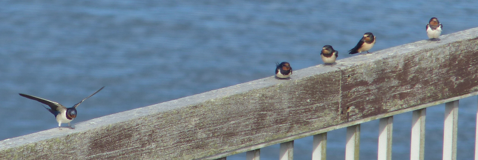
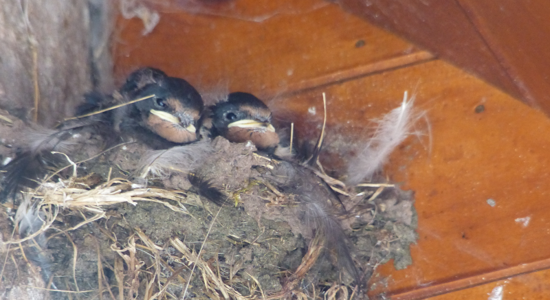

The second in a series of posts detailing a trip to mid-Wales in August/September
2020.

#### The story so far

We've visited two _excellent_ Oak woodland reserves near Llandovery. The
birding's not been bad, but it's been overshadowed by the views. Our hopes of
picking up the area's specialities haven't quite been met, but there's still
time. Will our luck improve? We doubt it.

For the second part of the trip, we've got a short stay in [Celyn Farm B&B](https://celynfarm.co.uk/), which
is roughly where "Forest Coal Pit" is on the map.

#### To Celyn Farm

We spend most of September 1st traversing from Llandovery to the farm, with a
few stops along the way.
 
First, we head up to take a look at Llyn Brianne proper. It meets our
expectations - reservoirs always seem to be completely dead, and this one is
no different. It does manage some good hirundines on some of the dam building,
 though.

<figure class="figure">
    
    <figcaption class="figure-caption text-center">
        Ready to go.
    </figcaption>
</figure>

Secondly, we visit Llangorse Lake. The cafe does an excellent Fish Finger
sandwich, albeit with occasional wasp interruption. AB1 does a fine job of
choosing the wrong shoes, and getting cross about the fact that his leg
hurts. Before the walk around the lake is curtailed (too wet) we do pick up a
Yellow Wagtail messing around in the fields near the carpark. Jolly.

<figure class="figure">
    
    <figcaption class="figure-caption text-center">
        Panel in considerably brighter mood than AB1.
    </figcaption>
</figure>

We make one final stop in Crickhowell to take in the town, and finally pick
up a Dipper for AB2. A pair, we think - probably with a nest up a little
trickle that heads off somewhere near the South side of the bridge across
the Usk.

<figure class="figure">
    
    <figcaption class="figure-caption text-center">
        There was a Grey Wagtail as well, but the shot with both of them in is sadly rubbish.
    </figcaption>
</figure>

From here it's a short but fraught journey along some of the tiniest roads we've
ever seen to Celyn Farm. We're extremely relieved to arrive alive and with
car intact. We're even happier when we find Swallows nesting right next to
the front door, and we're cheered yet further when we are shown our living quarters.
Our room has excellent views over towards Sugarloaf to the South, and fields
heading up the hill to the North.

The field to the North is full of Buzzards - we count 13 when we arrive, hopping
about in search of a beetle snack, we guess. In addition, there are loads of
Pied Wagtails, with an occasional Grey visitor. The gronk of Raven is never
far away, and now and again a Red Kite tries to join in with the beetle party.

This is already much better than the Castle hotel! Our room and the offered
breakfast (_delicious_ bacon and avocado sandwiches) are also superior.

#### Coed y Cerrig

We originally planned to head up Pen-y-Fan today, we'll postpone that until
we have four working knees between us. Instead, a gentler day, pootling
around in the car. Our first stop is the tiny but beautiful Coed y Cerrig
nature reserve.

<figure class="figure">
    
    <figcaption class="figure-caption text-center">
        Whoever did the budget proposal for these panels did well.
    </figcaption>
</figure>

The reserve has two walks; one on each side of the road. Opposite the car
park, a boardwalk weaves around a very wet bit of forest (I
think this is Alder carr). From the car park, an alternative short but
very steep walk explores the hillier (but still forested) side of the reserve.

We focus on the boardwalk side; we can hear a lot of bird chat coming from
over there. Indeed, there's a lot happening - lots of roaming flocks of the
usual suspects - we quickly pick up all the usual woodland species. There's
definitely a hint of something a bit different though - an occasional flit
that looks...just a bit different? Instinctively I'd say flycatcher, but we
really struggle for more than a glimpse; never seeing the bird sit down and
stay still.
 
We finally get a grip on what this only after doing a complete circuit of the
boardwalk. Now the mystery flitter comes to a stop on a branch we can see
, and yes, it is a flycatcher; _probably_ of the spotted variety. This view
lasts for a couple of seconds before it shoots off into the distance
, followed shortly afterwards by two or three other specimens - we guess a
pair and their offspring? That was seriously cryptic for flycatchers; jeez.

We return to the car, and a Great-spotted Woodpecker tempts us into a quick
exploration of the steeper side - that's about the only thing we see there
though. 

We spend the middle of the day on a mostly bird free walk from Llanvihangel
(nice lunch at the Skirrid Mountain Inn, though), a rain soaked trip to
Llanthony Priory (good Dipper spot (with bonus Guineafowl) on the river
there though), and another set of terrifying roads to visit Ian Hislop's
favourite chapel. Which is shut, because COVID.

<figure class="figure">
    
    <figcaption class="figure-caption text-center">
        Finally some typically Welsh weather!
    </figcaption>
</figure>

<figure class="figure">
    
    <figcaption class="figure-caption text-center">
        Always a bit of a double-take when you see these.
    </figcaption>
</figure>

<figure class="figure">
    
    <figcaption class="figure-caption text-center">
        Ian Hislop's favourite chapel.
    </figcaption>
</figure>

#### Mynydd Du

The last action of the day could be a bit more interesting. We're going to
head up into Mynydd Du forest to see if we can catch up with the Nightjars
that we've read might be findable there.

We're there and parked up for half past six. This is perhaps a little
early. Sunset is around 8pm, and we wouldn't expect to hear churring much
before then. We have a look at a nearby map panel - it looks like there's a
recently cleared area we can walk to by retracing the path of the road, and
then turning off on a track to the right.

As we return to the road we spot a Dipper on the river. After much sneaking
, we have an excellent view, and the Dipper, mysteriously, has not
 immediately drilled off; they're usually quite easily scared. We spend a
  while trying to photograph it. We don't do a very good job.

<figure class="figure">
    
    <figcaption class="figure-caption text-center">
        Dipper.
    </figcaption>
</figure>
<figure class="figure">
    
    <figcaption class="figure-caption text-center">
        Blink and you'll miss it.
    </figcaption>
</figure>
<figure class="figure">
    
    <figcaption class="figure-caption text-center">
        Close-up Dipper.
    </figcaption>
</figure>

We eventually leave the Dipper alone (it gets collected by a friend who it
disappears off down river with) and head up into the forest. We eventually
climb up enough that we have an excellent view over the road, a bit of
forest below us, and a decent view across a recently cleared area of
forest. Nightjars apparently like a clearing, so we'll give this place a go.

The wait for sunset isn't an impatient one - the scenery is excellent and we
are completely alone, except for a small cloud of Sand Martins scouring the
forest edge of insectile food. As the light fails, they're slowing replaced
by bats. We give the Nightjars a solid opportunity to turn up and chur for us
, but with nothing doing by half past eight, we need to get back to the car
 before it's pitch black. The journey back to Celyn Farm is thankfully
  uneventful - the only living thing we encounter is a frog crossing the road.

#### Craig-y-Cilau: The Secret Valley

<figure class="figure">
    
    <figcaption class="figure-caption text-center">
        Celyn Farm's resident swallow nest.
    </figcaption>
</figure>

A colleague from work grew up in Crickhowell, and recommends we try a walk up
near the Llangattock escarpment that is often known as the secret valley.

We ditch the car in a handy spot just beyond a cattle grid on the road up the
hill out of Llangattock and we're immediately on the path. Unfortunately, we
immediately lose it, distracted by a "this is not a bridleway sign" that we
interpret as a "but it is the footpath". A Peregrine Falcon barrels down the
hillside while we work out our error though, so all is not lost.

<figure class="figure">
    
    <figcaption class="figure-caption text-center">
        Not the path; nice Usk valley view though.
    </figcaption>
</figure>

We do eventually find the path, and we can see where the name comes from
; before we know it, we're in the secret valley, hemmed in on one side by the
escarpment to the South, and by another unnamed ridge to the North. Cool!
The landscape's pretty exciting too - we go through some small fields
bordered with scrubby plants, and then circuit a wet meadow at the bottom
- it bizarrely has one Redpoll messing about in it. I nearly come a cropper
 on some wet rocks for added entertainment.
 
After some seriously muddy wooded areas, the path heads up the side of the
escarpment to meet up with an old tramway, and the views are spectacular
. Once again the birds are a bit limited - we had a good mixed flock of the
usual suspects in the muddy woodland, but up here we're back to a diet of
distant Raven. We stop on a handy stone to have lunch before beginning the
 route back.
 
<figure class="figure">
    
    <figcaption class="figure-caption text-center">
        In the secret valley, looking up to the escarpment.
    </figcaption>
</figure>

After another close call route mistake, we decide to download the OS maps app
; it immediately stops one further route error, which is great given
continuing complaints from the knee area. The path back falls steeply back
down the side of the valley into the aforementioned muddy (but charming
) woodland. We're feeling mildly unlucky to have not come across any further
flocks as our path slowly leaves the woods, dropping us in a field adjacent
to the wet meadow from earlier (circular walks are the best).

Now, this field is half grass, and half bracken. The field border is fenced
, with numerous trees, bushes etc. along the fenceline. There's a tiny
shape perched on the bracken perhaps half way in. It's a Whinchat. As ever
, being a Whinchat, its comfortable-human-distance is roughly twice its
reasonably-photographable distance. Despite our attempts to stay low, and hew
close to the wall on the field's other side, it flits back away from us
repeatedly. This draws our attention to the trees that make up the field's
far border, and the second Whinchat perching in there.

<figure class="figure">
    
    <figcaption class="figure-caption text-center">
        This was as good as we got. Whinchats are impossible.
    </figcaption>
</figure>

We spend a lot of time not moving in the hope that the birds will get used to
us and go about their business, but it...totally doesn't work. Following the
path over the stile into the field where they have fled sends them into
deeper cover; the occasional trees on the previous fields fence line are now
a contiguous mini-wood of darkness. The movement of the Whinchats does lead
us to a Redstart hopping about just behind that fence, though, and a
Greater-spotted Woodpecker poking about at a long dead trunk even further
into the murk. The views are fleeting, but still - not a bad haul from one
 tiny bit of habitat.
 
A quick five minutes further and we're back in the car; two further stops
(for cake in Crickhowell and a beer next to the canal in Gilwern) we rock up
for a quick evening visit to Coed y Cerig, and then it's back to Celyn Farm
for a well-earned sleep.

<figure class="figure">
    
    <figcaption class="figure-caption text-center">
        View of Sugarloaf from Celyn Farm's front lawn.
    </figcaption>
</figure>

<figure class="figure">
    
    <figcaption class="figure-caption text-center">
        Two of Celyn Farm's backyard Buzzards.
    </figcaption>
</figure>

