### Migfest 2021 - Part One

It's September, the nights are drawing in, and many birds are sensibly
 starting to get the hell out of the UK. Or, in some cases, return to it
 . It's time for us to go to [Migfest](https://www.spurnmigfest.com/).

Pronoun guidance: AB1 is betrayed by previously reliable motorways. This post
 covers the events of 10th-11th September, 2021.
 
#### What even is Migfest?

It's a collaboration between [Spurn Bird Observatory](https://www.spurnbirdobservatory.co.uk/) 
and the [BTO](https://www.bto.org/) that combines:

* One of the best places to catch migratory birds in the UK
* Enough experts to run a programme of guided walks
* A set of nature talks by professionals, e.g scientists
  and this year, birding illustrator extraordinaire Killian Mullarney
* Lots of enthusiastic birders

It's also unbelievably good value: tickets were £30 each, and we paid an
 additional £48 between us to camp at the festival site.

#### Let's go to Migfest

We're driving up from Beeston on the Friday. Our only goal is to get there
early enough to not have to pitch the tent in darkness; setting off at half
past two should surely guarantee this.

For once though, the trusty pairing of M1/M18 betray us - some incident has
triggered the smart motorways into full on hate mode, and we crawl all the
way from Tibshelf to the M62. Once we're on the road to Hull though, things
improve. Although Google Maps decides that we aren't worth speaking to, so I
have to guess my way through Hull, and then spot the appropriate turns to
reach the festival site itself.

We arrive, finally, at around half past six. Enthusiastic volunteers direct
us to the camping area. The field is dry, its grass freshly mown and the sun is
out. I open the door to the car to be greeted by the sound of
Curlews on the estuary. As I'm getting the tent out of the boot, a Hobby
carves around the edge of the field the campsite is in. I rub my hands
together with glee - what a start!

We pay a visit to the festival's marquee to obtain our wristbands and listen
to the official kick off, before a speedy relocation to the nearby pub, the
[Crown & Anchor](https://www.facebook.com/TheCrownandAnchorKilnsea/).
Unfortunately they haven't got room to feed us, so between pints we fetch a
 spare sandwich from the comfortably nearby campsite.

It gets dark. An early start beckons. We go to bed.

#### A long walk to the point

I'm up with the sunrise somewhere after six and head out for an explore of
the nearby area while AB2 snoozes. Another Hobby makes an appearance. The
Curlew voices have been replaced by constant passerine cheeps - a few
Goldfinches, some Linnet, but mostly an unbelievable volume of Meadow Pipit.
A pair of Yellow Wagtail fly over as I return to the tent.

We're off on the biggest walk on the programme - all the way to the end of
Spurn Point. And then back, obviously. The walk departs from outside the YWT's
[Discovery Centre](https://www.ywt.org.uk/spurn), which we arrive at _just in
time_; thankfully the walk's organiser spotted us from afar looking
purposeful and waited for us.

We've got three experts for nine walkers; that's an excellent ratio. We're
off without too much further ado - we need to get across a particular part
of the walk before high tide, or the sea will get in the way.

The walk takes us out past a previous incarnation of the bird observatory. It
sits on an extended bank of land that obscures of view of the sea behind. To
our right, though, we have uninterrupted views of the Humber estuary. Which
, for the record, is _enormous_. A big group of Swallows are feeding over the
 vegetation that's growing at the edge of the water, and a Curlew or two are
poking about too. Meadow Pipits are a constant presence overhead; apparently
 a Southwesterly wind is often a trigger for this sort of visible migration
(or VizMig, as we'll refer to it henceforth).

That in itself is interesting - are the birds being pushed out of the centre
of the UK by the wind, and then using the lee of the coast to continue
South? We ask them but receive no answer.

The walk heads on to the beach. There once was a road that traversed this
area, but it was washed away in 2013, and there do not appear to be plans to
rebuild it. Getting to the point speedily now is best done by a fat-tyred 
e-bike, or on the YWT's [Unimog Safari](https://www.ywt.org.uk/events/2021-09-08-spurn-safari-multiple-dates).

We're on foot though, so the game of "walk on the wet sand without the sea
washing your shoes" is, aha, afoot. It comes with the added twist of birding
- can you keep your bins on something _and_ remember to avoid the sea? I
, apparently, cannot, and after several warnings from other members of the
group I give up. The clouds of birds in the distance over the headland will have
 to be identified later.

<figure class="figure">
  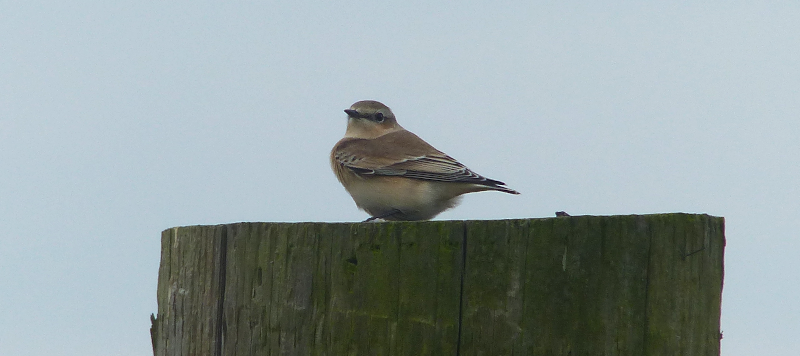
  <figcaption class="figure-caption text-center">
    Brace yourself. Wheatears are coming.
  </figcaption>
</figure>

We climb back off the beach onto a more solid footing some time later. More
Meadow Pipits join us. Further on, the day's first Wheatear sits waiting
for us on some giant rocks. This sequence repeats: Meadow Pipits fly over,
and the next visible perch point for a Wheatear always has a Wheatear on it. 
Lovely.

<figure class="figure">
  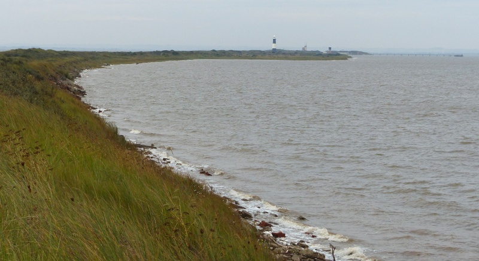
  <figcaption class="figure-caption text-center">
    The walk isn't circular, but at least it's got a nice curve to it.
  </figcaption>
</figure>

Some variety is added by a Mediterranean Gull (an unspeakably good bit of ID
from one of our experts) and a Tree Pipit hiding out on the rocks on the
Humber side of our path. An impressive effort is made to get everyone on this
- the bird is sitting on rocks significantly below the path, so we have to
jink back a bit, climb down some fairly hairy areas and then wait for it to
move out to an appropriate perch point.

We've seen Tree Pipit decently this year, so after our first view we have a
little explore - there's a little cut into the bank between us and the seaward
side - and, oh my goodness, there's an unbelievable number of waders sitting
there at the water's edge. Knot, Grey Plover, Ringed Plover, Dunlin,
Sanderling, all sitting perhaps ten metres away. I mention this to Nathan (who
has also lost interest in the Tree Pipit), but of course he already knows, but
isn't confident we can show them to everyone without disturbing them. A secret
bird pact it is, then.

<figure class="figure">
  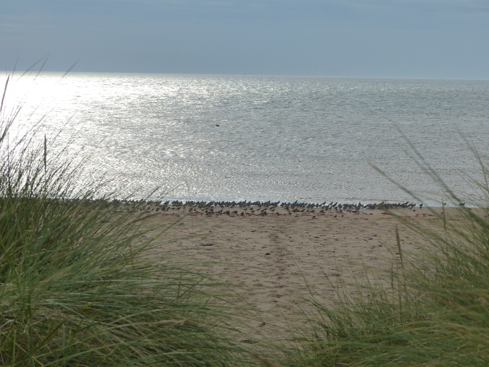
  <figcaption class="figure-caption text-center">
    Secret bird pact evidence file #1.
  </figcaption>
</figure>

<figure class="figure">
  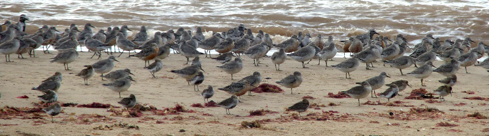
  <figcaption class="figure-caption text-center">
    Secret bird pact evidence file #2.
  </figcaption>
</figure>

Nathan is an unstoppable fount of bird and Spurn knowledge. We eagerly accept
both. AB2's noticed occasional sections of railway line in the path: "Ah
yeah - they built that to help fortify the peninsula, people used to
zip up and down it on trucks powered by sails". 
[True Story](http://www.skeals.co.uk/Articles/Spurn%20Railway.html), and
, amusingly the [Wikipedia page for sail trolleys](https://en.wikipedia.org/wiki/Sail_bogey)
informs us that another place we like, Cliffe, was a former site for these
things too.

The discussion continues into "fortifying it for what reason?" until a sign
(and another expert) tells us we are now arriving in Chalk Bank. Here the
headland has been bolstered artificially by the addition of chalk, hence the
name. There's a hide looking over a sandy spit here; hopefully it will have more
public waders? There's a Wheatear on top of it, at least!

<figure class="figure">
  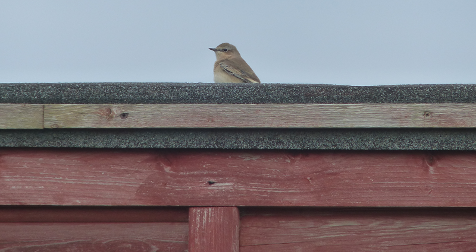
  <figcaption class="figure-caption text-center">
    Wheatear! Hide!
  </figcaption>
</figure>

We spend too long looking photographing the Wheatear and are last in - I end
up wedging myself into the far right hand corner of the hide. Amusingly this
ends up offering the best view of the end of the spit, where all the good
stuff is. The end is covered in Curlew - forty birds or so? Among them there
are a few Bar-tailed Godwit, and one or two Knot. There's plenty of
Oystercatchers here too, and, accompanying them, some Turnstones poking
about. To the left of the spit several Cormorants sit drying their wings. A
solitary Eider duck floats around in the estuary behind them. Further out, a
lost looking Guillemot's floating about too. Very nice.

We exit the hide and continue towards the point. Here the headland widens and
the path enters a grassy meadow that must be fabulous on the right day. For
us though, it just brings more Meadow Pipits. Mad. 

We exit the meadow into a more undulating area; this is Spurn Warren. A
raptor carves its way along the seaward edge of the headland. Excitingly, it's 
a Merlin. Given they primarily eat Meadow Pipit this perhaps should not be
too surprising, but still, nice to catch up with one. We trace it all the
way to the lighthouse, where it turns around, then drops below the bank
between us and the sea. It turns up for one final peek above the parapet
immediately to our left before swiftly making its disappearance. 

Speaking of swifts - we see one heading in the opposite direction. That's almost
certainly the last Swift we'll see this year (he says, suppressing a sob).
Another bit of obscenely good bird id occurs - someone picks
out a Tree Pipit from two Meadow Pipits as they fly by some 25m away. 

News of inbound Honey Buzzard from the radio (another Migfest walk bonus - the
experts all talk to each other) has the team (definitely a team now) marching
past the lighthouse and up to the top of the dunes to its left. No Honey
Buzzard is found - apparently it went inland after briefly considering a
trip South (and was later found to be Common Buzzard anyway!). The secret 
birding pact notes the continued bird gravel on the now distant sand; there's
even more waders in the roost now than when we sneaked a look earlier.

<figure class="figure">
  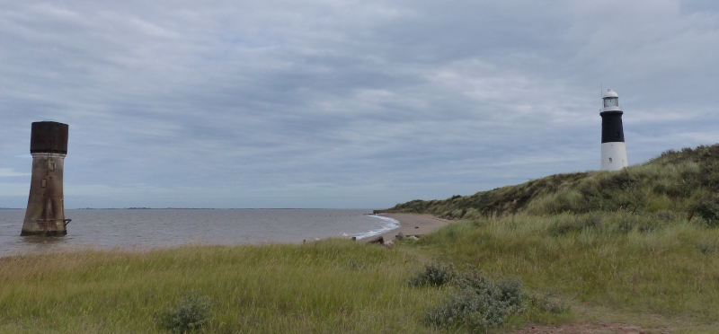
  <figcaption class="figure-caption text-center">
    Lighthouses new and old. Sanderlings were on the beach below.
  </figcaption>
</figure>

Having passed the lighthouse, we start to approach Spurn Point proper. Just
before we get there we look back down a beach on the Humber side where a
collection of Sanderlings are scampering around. Lovely.

Entering the RNLI area of the point, more Wheatears greet us in Wheateary
places, and we pay a visit to a most welcome loo. We're just starting to look
at the Ternery (definitely a thing) gathered on the extensive lifeboat jetty
when we realise we've left the giant bridge camera lens somewhere between here
and the Chalk Bank hide. Well, it's not a very wide peninsula, and we haven't
strayed too far from paths, so with a bit of luck we'll find it on our way
back.

<figure class="figure">
  
  <figcaption class="figure-caption text-center">
    One might say this was a tern up for the books. *gets coat.
  </figcaption>
</figure>

A bit on the RNLI station here - it's still the only permanently manned
station in the UK. There are houses here for the lifeboat crew; previously
their families lived here too; but now there's a one week on/one week off rota
- the lack of road connection has rather limited access to the site. 

<figure class="figure">
  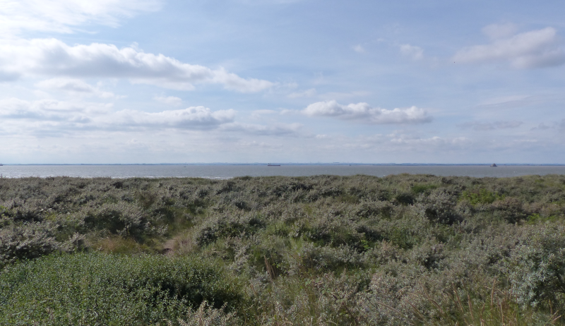
  <figcaption class="figure-caption text-center">
    Lincolnshire Ahoy!
  </figcaption>
</figure>

We make a solid exploration of the point itself here in hope of finding
migrants. A terrific amount of hard work yields next to no results
- there's almost no movement in these bushes and trees at all. We do find
what we guess is a young Cetti's Warbler (it is still singing rather than
shouting) and a probable Lesser Whitethroat.

<figure class="figure">
  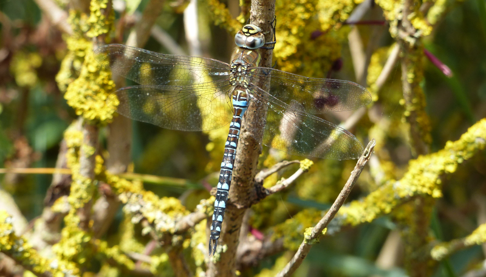
  <figcaption class="figure-caption text-center">
    Is this a very confiding Migrant Hawker? We think it is.
  </figcaption>
</figure>

Soon though, it's time to start the journey back - not least to find that bit
of glass we've put down somewhere.

<figure class="figure">
  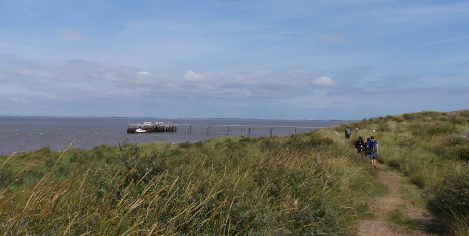
  <figcaption class="figure-caption text-center">
    Back we go.
  </figcaption>
</figure>

<figure class="figure">
  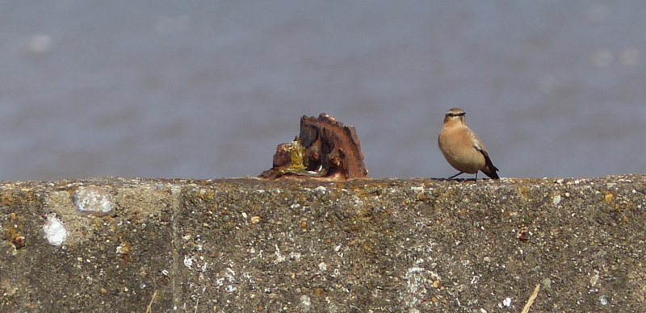
  <figcaption class="figure-caption text-center">
    More Wheatear.
  </figcaption>
</figure>

We don't find it near the lighthouse, or on the sandy knoll we watched for
the not-Honey Buzzard from. Curious - that's where I'd have guessed it might
have falled out of an errant side pocket. Nathan disappears into the
lighthouse to ask if it's been handed in. We explore a few off path areas
where the group forayed into earlier, and, thankfully, a giant bit of glass
is clearly visible in a tuft of grass. How did that get there?

We give a distant Nathan a victory wave and wait for him to catch up. We
spend the walk back swapping bird stories (though I think the net information
flow is strongly biased in the direction of Nathan to us!). We have a check
through the hole in the bank to see if the wader gravel is still present
- they're all gone, the tide's dropped enough for them to be able to feed
again. Nathan's originally from Hull (ish) (which explains how he knows
everything, and our inability to split his accent from North-East and North-West
), but is now based in North Norfolk and so of course has, to hand, videos of
wader spectaculars from Snettisham, which are, if you haven't been, well
described.

He also adds further information to the secret birding pact, by revealing
what he believes to be the best place to watch Nightjar in Norfolk. We'll
have to give that a try next year. We do manage a bit more birding, too - an
unexpectedly high count of Sanderling on the Humber mud, and a good collection
of Ringed Plovers being the highlights.

We eventually rejoin the mainland, where denizens of the seawatching hut have
been hard at work. Our arrival is timely - they've got a Long-tailed Skua
flying in front of one of the offshore wind farms. We have a crack at finding
this with binoculars, but it's impossible. One very helpful chap proffers a
scope, and, yes, there are enough pixels in it say "yes, Skua with
a long tail", which is probably enough for a life-tick. Only Pomarine to go.

One final surprise awaits us on the journey back to the campsite - four
Whinchats on the fence just North of the seawatching hut. Nathan tries to
radio them in, but his transmitter is apparently out of battery. 

<figure class="figure">
  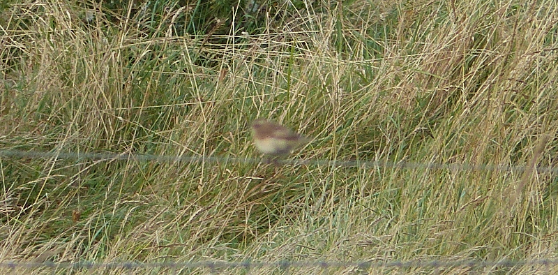
  <figcaption class="figure-caption text-center">
    Whinchat. Sigh.
  </figcaption>
</figure>

We ferret one last piece of information out of him: apparently we should head up
Beacon Lane to the wetlands this afternoon. No, one more - is he doing the
same walk tomorrow? Yes. Well, we'll send anyone who asks what they should
do his way then. "Oh no" he replies, waving his hands as if to wave future
hordes of questioning newbies away.  

#### Beacon Lane & Kilnsea Wetlands

We have a brief pit stop back at the campsite, claiming the last available
ortions of vegetable curry from the canteen. We join a thronging horde of
birders waiting for the afternoon guided walk up to the wetlands. Hrmm. There's 
more than twenty folks here, will this finally break through the faff
-resistance of birding groups?

A little bit - progress is a bit slow, not least because the path is quite
tight, and there are folks coming the other way. Progress is not much
hampered by birds, however - we're very much in bird snooze time, and we make
it to the beach without getting eyes on basically anything. On the beach
though: more Wheatears. Lovely. We have a toddle up the beach beyond the path
into the wetlands. I forget precisely why, but it's an excellent beach and
being near the sea is delightful. We have a good chat about Little Tern nest
protection as well - having totally missed the day's talks we're feeling
rather ignorant.

<figure class="figure">
  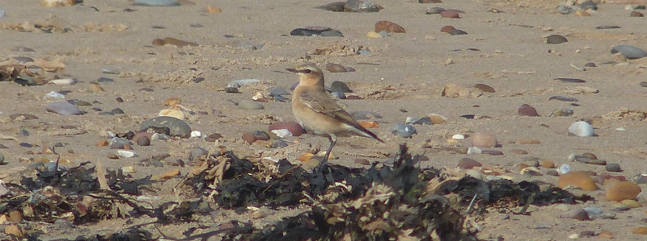
  <figcaption class="figure-caption text-center">
    Beach Wheatear
  </figcaption>
</figure>  
 
After a bit we turn back for alternative views of Wheatears, and its into the 
wetlands we go. We hang back to let the group disperse a bit, and pick up
 _even more_ Wheatears on the edge of a stubbly field. Finally, we arrive at
the actual wetlands and the birding density increases dramatically.

<figure class="figure">
  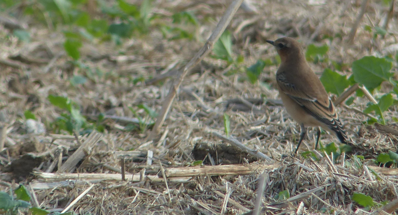
  <figcaption class="figure-caption text-center">
    We did warn you.
  </figcaption>
</figure>

There are obscene numbers of Redshank here, with frequent Greenshank mixed in
for good measure too. If only they were a bit closer. A bit more looking
around yields several Dunlin. A nearby person (who may or may not be the CEO
of the BTO) reckons they've got some Godwits as well - we get the scope out 
to have a look, and they're quite right - there are five or six Barwits off
at the back right-hand side of the pool from this viewpoint.

We move to the next viewpoint and there's a few other small waders that need
examining - I'm looking at something I'm convinced is not Dunlin but small,
but it disappears out of view before I can be sure what that is. Two other
small birds are found off to the right; perhaps they're more interesting? I'm
in the middle of getting the scope on them when a nearby radio crackles:
 
<blockquote class="blockquote text-center">
Eleven Short-eared Owls in the second paddock
<footer class="blockquote-footer"><cite>A nearby radio.</cite></footer>
</blockquote>

The group is agog at this news. Where even is the second paddock? Regardless
of their features, the two small waders (which I've now found) are going to
be Dunlin forevermore now, as the realisation that we're going to need to try
to find those owls washes over us.

<figure class="figure">
  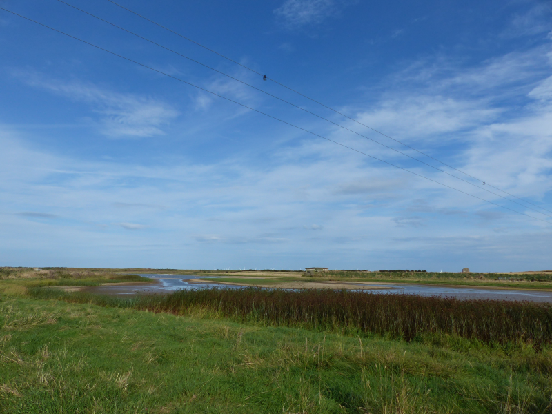
  <figcaption class="figure-caption text-center">
    Kilnsea Wetlands
  </figcaption>
</figure>

This site has other ideas, though - the nearby hide offers even better views of 
waders that were, from our previous stops, much further away, and a final
viewing area just before the car park has Little Stint and a great many Ruff
poking about in it. Surely not all eleven of those owls can instantly
disappear?

#### Owl quest

We reconnect with our previous team at a bridge over a ditch - they're
staring over fields towards the sea wall that's between the fields and the
estuary. One chap has the clue - he led a walk over there this morning. "The
paddocks are on this side of the sea wall, so if there were Short-eared Owl
, we should be able to see them from here", he opines. We stare across the
fields as well, but none of us see an owl.

What a conundrum! There's little consensus on what to do now and the group
slowly splits up as we walk back towards the pub. We consult the Migfest map
and find that there should be a path from this road out to the sea wall and
on to Sammy's Point, which is where twitter is directing us for owls. We don't
see this path, but we do find several deer, and a giant flock of Linnet
distract us.

Reaching the pub, our choice is clear - there's plenty of time between now
and the Migfest barbeque, we can either spend them drinking or trying a bit
harder to find these owls. Bizarrely, the latter choice wins, and we're soon
heading back up the road in search of the path we missed earlier.

Amazingly, we miss it _again_! It's only with the advice of another expert
"You've gone too far, it's right there by that post" he points out. We blame
the Linnets. We can even see the group that we guess originally spotted the
owls heading this way. At an appropriate pinch point, we block their path. We
shall not let them pass unless they tell us their owl news. They are happy to
surrender their information "yes, this way, with the light going the way it
is they might be in the air by the time you get there". Curious. We stomp off
along the sea wall in search of paddock two.

<figure class="figure">
  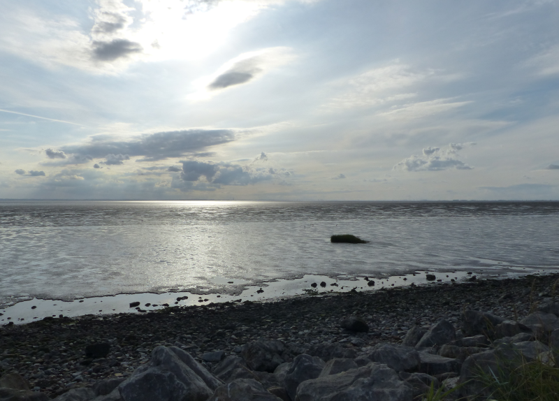
  <figcaption class="figure-caption text-center">
    Are these big skies?
  </figcaption>
</figure>

What seems like hours go by. We try the usual trick of spotting the bunch of
birders rather than the bird. There is a little cluster of enthusiastic
looking people further along this path. We head in their general direction.

On arrival signs are not good - some people can see _an_ owl, but many
cannot. The instructions we get are accurate but insufficient. After a look
through another scope I can see why - only the head of the bird is visible,
and it's hiding on the side of a watery ditch that's mostly obscured by
foliage between us and it. I have a guess at where on the sea wall we might
get a better perspective from, and I'm not too far wrong; I can even pick out
a second owl when someone mentions it's there.

We spend a few minutes sharing our scope view - this is seriously tricky,
because a.) the scope isn't stable and b.) neither is the place you need to
stand to use it. It's worth it though - a few folks get a glimpse that turns
them from righteous unbelievers into happy spectators. Even these mildly
average views of Short-eared Owl can't hide the personality of the birds
- their pale facial border and eyes glowing from the darkness of the ditch's
bank.

<figure class="figure">
  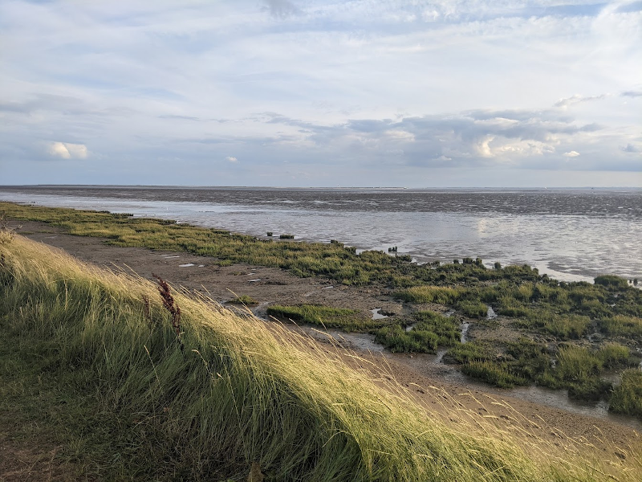
  <figcaption class="figure-caption text-center">
    Lovely evening light towards the peninsula.
  </figcaption>
</figure>

Owl quest complete, we return along the sea wall to the pub. The views out on
to the estuary are superb, not least due to the Shelduck on the mud. There's
time for a swift pint at the Crown and Anchor before returning to the marquee
for the barbeque and quiz. Any idea of returning to the pub is disregarded;
having birded the living daylights out of Saturday, we're both asleep by 9pm. 

 

  
 

 