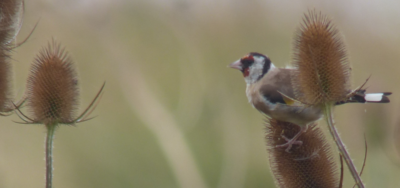
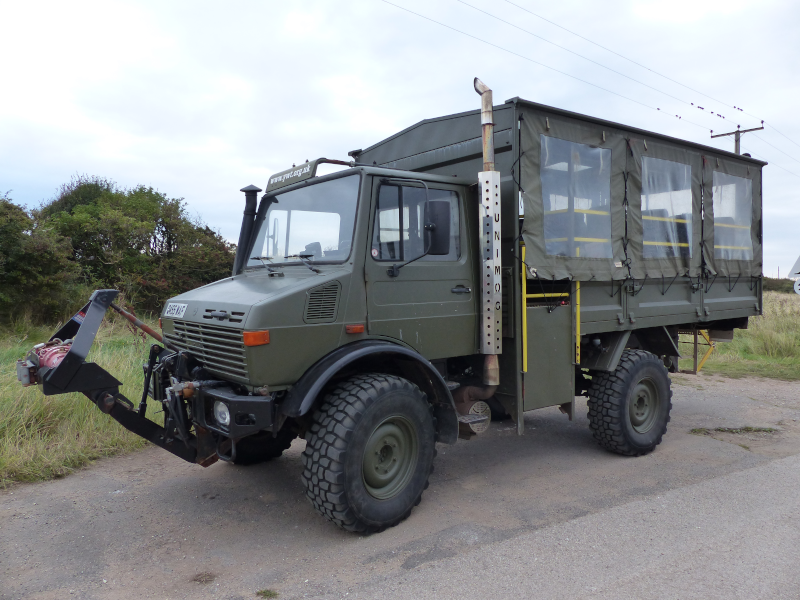

### Migfest 2021 - Part Two

We made it to Spurn for Migfest 2021, and day one was spectacular. How will
day two go? And will there be much of a day three?

#### A cooler start

The wind's changed overnight from a warming Southwesterly to a cooler
Northerly. We're shocked to discover that yesterday's two layers and shorts
outfits are now totally insufficient; trousers, coats and hats are now
required.

We're off on a gentler walk this morning around the triangle of Easington
Road, the sea wall and the road back from the Discovery centre. This is
billed as a migration walk, but much like yesterday's exploration of Spurn
Point, it's not the right day for it; in the way of migrants we hear and see
very little.

We do pick up a Whimbrel when we turn left to walk alongside the estuary.
There's some nice Shelduck here and there as well. One of our experts
attempts an intrepid trip down into a reedy area and returns with a Common
Whitethroat - a migrant! At last.

Our luck improves further when we flush a Short-eared Owl from the vegetation
between the sea wall and the rising tide. It gives us a quick show, but is
really only interested in hiding slightly further away from us. We note
where it lands - we'll be near there soon.

<figure class="figure">
  
  <figcaption class="figure-caption text-center">
    Short-eared Owl
  </figcaption>
</figure>

The landing area, as we approach, appears to be made entirely of Curlews
. Their camouflage, in this somewhat autumnal light, has made them invisible
until we were opposite them. The Short-eared Owl's is even better - we still
don't see it until it decides, once again, that a big group of birders is not
something it wants to be anywhere near. It flies back up the estuary,
sensibly. To mark its passage, a Water Rail sharms somewhere behind us,
in the damp looking area between us and the discovery centre.

<figure class="figure">
  
  <figcaption class="figure-caption text-center">
    Goldfinch on a teasel
  </figcaption>
</figure>

We reach the road and turn left towards the discovery centre. There's a rough
patch here where Common Rosefinch has been spotted, but for us it is again
somewhat dead. A joyful little flock of Goldfinches feeding on teasels and
another consolatory Common Whitethroat is all we get.

A brief investigation is made into the scrape hide at the centre - there's
one excellent Common Snipe poking about, but not a lot else. No sign of that
Water Rail, sadly. It's a short walk from here back to the campsite, where 
we pick up a snack and a hot drink before deciding that despite the cold, 
we're going to choose birding over talks again.

<figure class="figure">
  
  <figcaption class="figure-caption text-center">
    Common Snipe
  </figcaption>
</figure>

Where shall we go? Well, we hear positive noises about Curlew Sandpipers up 
at Kilnsea Wetlands, so we'll try there.

### Kilnsea Wetlands

This is much as it was yesterday - loads of waders and gulls. We scour all 
of the edges for suitable Curlew Sandpiper and find a few candidates, but we 
struggle to convince ourselves - the birds are just too far away. We do 
manage to pick out one or two Little Stint on some of the nearer islands though.

<figure class="figure">
  
  <figcaption class="figure-caption text-center">
    It's pretty busy at the wetlands.
  </figcaption>
</figure>

We have a much easier time of it in the hide - it's full of people, and one 
is explaining exactly which of the Dunlins in front of us are actually 
Curlew Sandpiper; it's a bit bigger, has a clearer eye-stripe, and, as a 
Peregrine Falcon bombs through, two of them demonstrate that when they stop 
slouching, they're noticeable leggier. Useful knowledge.

<figure class="figure">
  
  <figcaption class="figure-caption text-center">
    We're pretty confident the bird in the middle is Curlew Sandpiper.
  </figcaption>
</figure>

Outside the hide, a man with an impenetrable accent wants to tell us 
something. We eventually twig that he's trying to get us on to a Little Owl 
over by the farm buildings at the opposite side of the field. Lovely.

We reach the end of the wetlands and wonder what to do with the rest of the 
day. There's a path on the festival map that we're yet to explore that would 
take us around to Sammy's point and back along the river. We give that a go, 
and it does a great job of filling up the afternoon, without necessarily 
adding anything of note to the birding experience. It does, handily, deliver 
us to the pub in time to enjoy a pint or three to celebrate the official 
closure of the festival.

### Monday morning

We noted with alarm that almost everyone upped sticks and left last night. 
Are we not allowed to stay into Monday? We check and find that it's not 
explicitly disallowed. A few other campsite dwellers do hang about and that 
gives us enough confidence to do the same, which is excellent, because we 
fancy another quick explore out towards the point to try and find the 
subjects of Saturday's secret bird pact.

<figure class="figure">
  
  <figcaption class="figure-caption text-center">
    UNIMOG
  </figcaption>
</figure>

We pack up the tent into the car, then drive it down to the YWT visitor centre 
and park. With the car safely stowed we walk out towards the point, past a 
sleeping UNIMOG.

This time, we're not pursued by thousands of Meadow Pipits; the first birds 
we come across area a mixed bag of Reed Buntings and Dunnocks as we climb 
off the beach. A lone Pipit peeps at us from some giant rocky detritus. As 
we reach chalk bank, a showy Kestrel makes an appearance.

<figure class="figure">
  
  <figcaption class="figure-caption text-center">
    Kestrel on a sign.
  </figcaption>
</figure>

We cannot find the little gap in the bank from Saturday. Have 
we gone past it without noticing? We guess so. We make a few experimental 
forays up the bank up what appear to be reasonable well worn paths for a 
peek over the top, and eventually find a place where we can spy on the 
subject of the secret bird pact without us disturbing them.

There are altogether too many birds here to count - easily thousands of Knot 
and Dunlin, and hundreds of Ringed and Grey Plover. Some are still showing 
remnants of summer plumage. A shame it's such a grey day!

<figure class="figure">
  
  <figcaption class="figure-caption text-center">
    Cute Knots and some friends.
  </figcaption>
</figure>

Mission accomplished, we return to the car. A trip to Fairburn 
Ings (for Spoonbill) and another short trip out to Attenborough (for a 
surprise Pectoral Sandpiper) to neatly round off a terrific weekend.

<figure class="figure">
  
  <figcaption class="figure-caption text-center">
    Pectoral Sandpiper - very much a record shot!
  </figcaption>
</figure>
