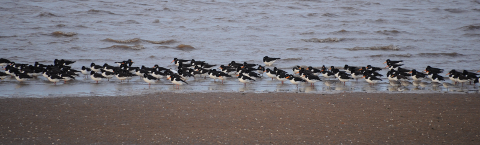

### Norfolk Advent

We're out of lockdown, and we've got what we suspect is a tiny window
of opportunity where we're in tier two. Let's go to Norfolk.

Pronoun guidance. AB1's on holiday, AB2's working from (holiday) home. This post
covers the events of December 12-19, 2020.

#### The Journey There

We eventually locate the instructions for where we're going, and in a surprise
development we're going to arrive more than two hours before we can check in.
An emergency birding stop is called for, and in one of the 2020s only strokes of
luck, we're fifteen minutes from Welney. In a further, larger stroke of luck, a
couple of minutes on the detour towards Welney, a small brownish falcon zips
across the road just in front of us. That can only have been Merlin; nothing
else is that small, that colour, and still a falcon. That might even be a life
tick.

That's the end of our luck. We're informed by the chap on the front desk that
only the observatory is reachable without wellies. We've also just missed the
half twelve feeding of the wintering ducks, geese and swans. And we definitely
aren't going to stay long enough to see the half three feed! We're also arriving
hungry, but not quite hungry enough to sign up for any of the pale-looking
pastry-in-a-bag options offered by the canteen.

We get out on the bridge. It is cold. And we cannot see; two temperature
transitions added to a mask and glasses and the world is suddenly enveloped in 
fog. We take a seat in the observatory having made attempts at defogging, 
adjusting masks, and experimenting with breath control to see precisely how 
possible birding in the time of COVID-19 is. Our answers are not too bad - we 
take in excellent views of Pochard, Wigeon, Whooper Swan and Black-tailed Godwit.

<figure class="figure">
  
  <figcaption class="figure-caption text-center">
    View from the observatory.
  </figcaption>
</figure>

We recall half an explanation of why nearly all the Pochards are male. No, not 
even that - we just notice that almost all of them are male, we can remember no 
details as to why. Occasionally a Marsh Harrier swoops over, and the whole world
goes mad; hundreds of Lapwings take to the air and do their finest Starling 
murmuration impression, even the ducks mysteriously back away from the area the
Harrier emanates from.

We sit there for quite a while. It's very soothing. We enjoy the informational
panels explaining how the water levels on the reserve are managed. Despite all
of the cleverness being deployed managing this bit of the Great Ouse, it's not
enough - floods in Spring and Summer are increasing in frequency and strength,
threatening the breeding success of ground nesting birds. A number of different
entities charitable, private and public are collaborating on the creation of
further wetlands on the borders of the current flood management system, with
some success. Interesting.

We make our way out via the appropriate door, check that wellies really are required (we've spelunked around rumoured puddles before, but these are the real deal), and head back up to the bridge. We can see this time, and the first thing we see is an extensive team of sheep making their way down one of the dyke walls on the opposite side, and amongst them...egrets. Now. These egrets. Are they confused? They have the look of Cattle Egret to me. What sort of look is that? Well, it's a bit more sidling, there's more neck and shoulder involved in how they move around. AB2 puts it better - they're just more furtive than Little Egret, which, in contrast, moves with intent. And they are, indeed, Cattle Egret, and there are plenty of them, too - probably double figures, but I count at least eight. That's not a bad find.

The rest of the journey is uneventful, bar a visit to an excellent Co-op (Co-op is the best small supermarket by _miles_), and a surprise Barn Owl flyby just outside Heacham.

#### Titchwell

AB2 is working during the week, so we'd best get out there while the sun shines. Which, in Norfolk, in December, it probably won't, and so when the forecast shows even a hint of not raining, we're out of our temporary abode as fast as we can on the Sunday morning, and we pull into the Titchwell car park around quarter to ten (it's just not possible to get AB2 to go faster than that without the promise of thousands of overflying geese).

The car park is mysteriously free of unexpected hooting family members, and we proceed without incident to the visitor centre, where I am accused of brandishing membership cards at the volunteer waiting therein. Look, my hands are cold, organising items that require removal of gloves is painful, and I want to get back to a safe space where no-one can ask me for any further mask/card/map/car/phone permutations that require me to expose any skin to the cold.

<figure class="figure">
  
  <figcaption class="figure-caption text-center">
    Brent Geese on the Freshmarsh.
  </figcaption>
</figure>

We convince the volunteer that we don't need too much guidance and head out onto the track to the beach. We're immediately surrounded by Blue Tits and what can only be described as a Welsh like quantity of Chaffinches. Cracking. We keep moving; it's too cold not to. We ignore the first hide - we can see everything on the Freshwater Marsh from here, and the birds we can't see well will only be seen better from Parrinder South. As we saunter towards it, we can't help but notice several pipity things occasionally flapping up from the edges of the pool. What are they? We're not sure - the light's too muted to pick out any diagnostics in flight, and they tend to land in cover. Maybe we'll get lucky at some point and pick up some details.

From Parrinder, we get a better view of some of the exposed mud at the back of the marsh. It's alive with Lapwings, and, from a first glance, Golden Plover. After a further look with the scope though, it turns out what I thought were the plovers are in fact female Teal. There are one or two Golden Plover in there but they're in the minority. Even with the scope it's difficult - I have quite a lot of difficulty getting anything into sharp focus. Hrmm. Is that the glass of the hide, or have we managed to give it a bash in transit? Hopefully the former!

<figure class="figure">
  
  <figcaption class="figure-caption text-center">
    Teal from Parrinder South.
  </figcaption>
</figure>

We make an exit and take a peek over the dyke into the Volunteer Marsh - a
 very confiding Redshank peers back at us, before continuing on its mud-poking circuit of the marsh. Good luck to it. We return to the beach path, picking up further Redshank in the adjacent mud. More of the pipity things flap at us. We ignore them. As we switch to the Tidal Marsh, two Little Egrets croak angrily at us for disturbing their examinations of the perimeter of the marsh. A few more Redshanks are less bothered by our presence, but the angry egrets ruin it for everyone, pushing everything that was on the near banks towards the mud in the middle of the marsh, far away. This does put us on to a lone Avocet in that area too, though, so we don't complain.

<figure class="figure">
  
  <figcaption class="figure-caption text-center">
    Oystercatchers on the shore.
  </figcaption>
</figure>

And it's on to the beach! And the tide is... out. And the sea is almost completely empty. Well, boo, here I was hoping for rafts of scoters. Cursed Southerly wind, blowing them all offshore. We toddle down towards the sea, and the rocky, muddy, sandy, pooly section is _alive_ with waders. Wherever we look, there are Curlew, Oystercatcher, Dunlin, Turnstone, and in among them there's an occasional Grey Plover and Bar-tailed Godwit. Very nice. We particularly enjoy the speed at which one particular Dunlin moves around a rock pool. Do Dunlins feel cold? Do birds in general? We think we ought to be told.

<figure class="figure">
  
  <figcaption class="figure-caption text-center">
    Is this Dunlin cold?
  </figcaption>
</figure>

<figure class="figure">
  
  <figcaption class="figure-caption text-center">
    Love those yellow feet.
  </figcaption>
</figure>

We head back up the beach to visit parts of Titchwell we've previously ignored due to bad weather, and to check a useful fact from our visitor centre welcome - decent views of Kingfisher from the Fen hide. Before we get there though - is that the world's most obvious Spotted Redshank on the Tidal Marsh? That beak looks like it has the standard droopy bit even without the binoculars. Yep - unmistakable. We manage to get close enough for a record shot or two before the bird remembers it's supposed to make things difficult and barrels off to the rear of the marsh.

<figure class="figure">
  
  <figcaption class="figure-caption text-center">
    Gotcha.
  </figcaption>
</figure>

<figure class="figure">
  
  <figcaption class="figure-caption text-center">
    Quite pleased with this one of it booking it to a hiding place.
  </figcaption>
</figure>

We take a little time to work our way to the Fen hide, but one Brambling and a Willow trail circuit later, we're walking into the Fen hide, and...oh, is that the Kingfisher, flying off around the corner into the reedbed, never to be seen again? Oh great. We take this as a signal that an otherwise excellent Titchwell trip is coming to an end. We return to the car, and to our surprise discover we've been here for more than three hours. It feels more like one. Time flies...

#### Holkham

Is our next stop. The Titchwell/Holkham pairing is well established - Titchwell's dense, with many a habitat squished together into a small area. Holkham's similarly diverse, but less squished; there's still a grazing marsh, a substantial coniferous woodland, kilometres of beach, dunes, saltings (?) and an unpleasantly expensive car park. There's also a posh new coffee stop named the Lookout, which we'd visit in less coviddy time. Instead, we head for the beach for a walk.

There's a couple of flocks of small passerines floating around the muddier areas of the beach. The first is maybe seventy or eighty birds, and doesn't appear to be too bothered by humans. They sit down in an area of short, rough vegetation off to our right. Then they take off again, flying over us, and picking up enough sunshine to make it clear they are Linnets. Which, given where they are, and what they landed in, they couldn't really not be.

The other flock prefer the beach itself, and are must flightier - the nearest we see other humans get to them is maybe forty or fifty metres! We don't get any closer, but we do maneouvre ourselves such that when they next decide to flit, the sun is behind us, and we can pick out the pale wing patterns of Snow Bunting. There's a good thirty of them - not a bad find.

Just as traditional as the Titchwell/Holkham pairing is that it always rains when we go to Holkham. This time is no exception. The walk along the beach becomes somewhat of a trudge - we're both well dressed for this weather, but it doesn't do much for the scenery, or the birding; we see nothing else from the beach. We shortly take a cut through the dunes into the forest, which provides limited (but not sufficient) shelter from the rain. The forest is full of tit flocks, but we're now too wet (and too blind, in my case; my glasses are saturated) to pay them much heed. We return to the car with just enough daylight left to grouse at the lack of special offers in the nearby Adnams shop.

#### Day two - Titchwell again

Having missed a Kingfisher yesterday, AB2 is keen for another go. We're
 out of the door significantly earlier to fit in with her working schedule as a result, and we're into the reserve bit of Titchwell just before 8am; result! We flip yesterday's ordering and visit the Fen hide and Willow Trail first this time, but of the Kingfisher there is no sign!
 
 <figure class="figure">
   
   <figcaption class="figure-caption text-center">
     Dawn at Titchwell Marsh RSPB.
   </figcaption>
 </figure>
 
With only an hour to spend, we then hotfoot it to the beach. The tide's considerably further in today, but there's still not a lot on the sea; from my scan only a Goldeneye or three, and a couple of Great-crested Grebes. On the sand, in addition to yesterday's collection we now add Sanderling and Ringed Plover. What a delight.

<figure class="figure">
  
  <figcaption class="figure-caption text-center">
    Sanderling with Ringed Plover escort.
  </figcaption>
</figure>

#### Ringstead Downs and the Lestrange Estate

There's a nature reserve not far from where we're staying, and it looks like
 it may be possible to turn a walk around it into a circular route, returning via the village shop (which has a specialist local beer aisle; what a treat). After a quick stop for breakfast, I head out, leaving AB2 to her busy schedule. The path through the nature reserve is most pleasant - following a shallow tree-sided valley that is a non-stop symphony of tit, Chaffinch, and (later on) Goldfinch flocks. I'm also treated to a flyover or two from some geese that really cannot decide where they want to go.

<figure class="figure">
  
  <figcaption class="figure-caption text-center">
    Nice place this.
  </figcaption>
</figure>

As I exit the nature reserve part of this walk, the path becomes a farm track. My first hope of making this a circuit is quickly stymied by a not particularly permissive path through the Lestrange Estate - it only permits access by foot on Thursdays between 9am and dusk. And today is Monday. I'll need to follow this track around a bit further, and hope another right turn will work. There is a little bit of bird action - a foursome of Yellowhammers provide a bit of colour. The fields bisected by this track are full of Red-legged Partridge, and, at the crest of one of them, a pair of Pink-footed Geese are quietly sitting. Where are the rest of them, I wonder?

<figure class="figure">
  
  <figcaption class="figure-caption text-center">
    If only they were both in focus. What a miss.
  </figcaption>
</figure>

The next right turn does better - it's permissive every day of the week. The one after that, though, is Thursdays only again, and so the last leg will unfortunately have to be road bound. This is as eventful as it sounds - a lone Pied Wagtail and a couple of Buzzards are the only birds of note before we reach the village store.

#### Thornham Harbour

The rain puts paid to afternoon plans for a walk around Stiffkey. It eventually thins out by around three; leaving an awkward hour or so before it gets dark. Time to try somewhere new? Or perhaps pay a dusk visit to Titchwell? I opt for the former, and ten or so minutes later, I'm parking up at Thornham harbour. This looks pretty good for a bit of last minute birding - there are some excellent waders in the creek heading out to sea (I count Curlew, Grey Plover, Knot, Bar-tailed Godwit, Redshank and Oystercatcher almost as soon as I exit the car), and frequent arrivals of huge skeins of Brent Geese. There's an excellent view over the marshes towards Titchwell, and over the waterlogged fields towards Holme as well.

<figure class="figure">
  
  <figcaption class="figure-caption text-center">
    Thornham Harbour view.
  </figcaption>
</figure>

Things get darker. Several Marsh harriers make their way from where they were
 towards where they'd prefer to roost; several towards Titchwell, others somewhere else inland. Some incredibly slippery boards nearly end me as I attempt to discover what tiny bird species is squeaking at me from near the creek. As the light fails, there's a Barn Owl right on the edge of what I can see; irritatingly near Titchwell; I can just about pick out a couple of birders looking at it from the beach path. Oh well - plenty of time left in the week for that to be us.

#### Titchwell Morning #2

We decide to reverse yesterday's choice and visit the beach first. 

<figure class="figure">
  
  <figcaption class="figure-caption text-center">
    A Bar-tailed Godwit looking for some breakfast.
  </figcaption>
</figure>

The tide's even further in; we're earlier, and it is later. 

<figure class="figure">
  
  <figcaption class="figure-caption text-center">
    It's really nice light as well.
  </figcaption>
</figure>

This means there are even more waders on the shoreline than previously - plenty of Godwits, Curlew, Grey and Ringed Plover, Sanderling, Redshank, Oystercatcher. Delightful. Will the sea have anything more on offer? Well, a little. There are more Goldeneye, and off to the right, I think a single Black-throated Diver. Three Red-breasted Merganser also make an appearance. 

<figure class="figure">
  
  <figcaption class="figure-caption text-center">
    The view back towards Thornham from the beach path.
  </figcaption>
</figure>

On the way back, we visit the Fen Hide to check on Kingfisher availability. We find only a pair of people, who were there at seven thirty, and they saw it then, but not since. Curses.

#### Thornham Harbour #2

This time in bright, wintry sunshine! And with it, hordes of people. The harbour's a reliable place to find Twite; and the [reports from the bird observatory](http://www.holmebirdobs.co.uk/) confirm that this is still the case. I also have a new toy - a little adapter that will mate my smartphone to the telescope to make it easier to take pictures with the two. And so a quest is on - can I take photographs of the Thornham Harbour Twite with such an arrangement?

First I have to find them. After a further speight of blundering around in the mud near the carpark, I eventually return to solid ground for long enough to notice four other birders are all rapt on some little birds perching on some of the harbour furniture. Twite! I get a good view in the scope - and it looks like they're going to play ball. I start affixing the adapter, but by the time I'm done...someone's decided to walk over to them and flush them away.

There's not even a hint of Twite for the next half hour - I have a play with the new phonescope setup, and convince myself it isn't too bad. It's relatively simple to attach this contraption, but doing so without moving the scope is tricky, and refinding a mobile bird via a phone screen is strangely much trickier than doing it by eye. What we really need is a lens with roughly the same focal length as my eye, and a much bigger screen.

I decide the only way to make the Twite reappear is to go for a walk - I cross over the sluice gated channel on to the sea wall path, and within seconds, I can see they've returned to the same piece of harbour furniture they were sitting on before. Was it me that was disturbing them? I wasn't even the fourth nearest person when they got spooked, but possibly I was standing somewhere particularly thick. I am far more cautious on my return, hiding behind a parked car to give myself as good a chance as possible. One bird poses long enough for me to get everything in order, you can judge the results for yourselves.

<figure class="figure">
  
  <figcaption class="figure-caption text-center">
    Twite on harbour furniture, phone scoped.
  </figcaption>
</figure>

#### Choseley

There are famed drying barns here that are apparently a good place to stop between actual birding visits. I read somewhere that a stand of Oak to the West of the them could be a place to find Little Owl; and a bit of satellite recon finds an enlarged passing place next to the coastal path's route might fit our tiny vehicle in it without blocking the road.

I park up, and my theory is immediately put to the test; mysteriously three vehicles appear from nowhere and need to use the passing place, and indeed, they can. Ok, good, I can proceed without fear of getting shouted at. I take a quick walk around the Oaks and find not a lot; no, tell a lie, there's a Kestrel perched in the shade on the Northern side of them. It is photo-resistant; it knows it is terribly lit, and will only be a silhouette. I attempt to make Kestrel like squeaking noises at it to ruffle its feathers, but it just ignores me.

<figure class="figure">
  
  <figcaption class="figure-caption text-center">
    With my secret cloak, of invisibility, I can see you but you can't see me. <a href="https://www.mikartistik.com/">(c) Mik Artistik</a>
  </figcaption>
</figure>

There's a much louder squeaking, honking, and general noisemaking approaching from the North. A team of geese numbering a hundred or so are circling. No, landing. They are beautifully lit - I can see their feet are bright pink as they stretch their legs out to land. They potter about in the field, poking at what I assume are morsels of tasty crop leftover. Their presence slowly attracts further groups, and after perhaps forty minutes of this, we've got a goose army in this field; more than a thousand, but by how much, I'm not sure; I stopped counting. 

<figure class="figure">
  
  <figcaption class="figure-caption text-center">
    What a lot of geese.
  </figcaption>
</figure>

<figure class="figure">
  
  <figcaption class="figure-caption text-center">
    The geese look on as a noisy tractor drives by.
  </figcaption>
</figure>

The fun game of "is there a Bean Goose in there too?" (made more difficult by constant arrivals of new candidates) continues to yield "no" as an answer, but I do find one interloping Canada Goose. Now - is this a standard Canada Goose, or one of the posh subspecies I've heard about? I've no idea what the differences are so I take a picture to examine later.

<figure class="figure">
  
  <figcaption class="figure-caption text-center">
    Todd, is this your Canada Goose?
  </figcaption>
</figure>

After a quick and rather uninspiring visit to the barns themselves, it's back to Titchwell for sundown.

<figure class="figure">
  
  <figcaption class="figure-caption text-center">
    These partridges were quite nicely lit, though.
  </figcaption>
</figure>

#### Titchwell evening

Titchwell's got a big reed-bed, so presumably it has a Harrier roost? I ask at the visitor centre, and I'm directed towards a blind overlooking Patsy's reedbed on the East Trail. On the way I drop into the Fen hide to see if I can catch a Kingfisher in action. To my surprise, the same two people who we found there in the morning are present. "Have you been here all day?" I ask, surprised. "No no, we've been all over the place, honest". "Ok, I'll believe you, thousands wouldn't". I take a pew a safe social distance from them, and have what I think is the first bit of bird hide chat since this COVID nightmare began.

The Kingfisher remarkably does put in an appearance, but we're so busy chatting we nearly miss it. It sits on a dead tree towards the rear of the pond. It takes a dive into the water, but emerges unsuccessful. It chooses to retreat to a perch on the reeds behind the dead tree, perhaps disgruntled at its poor aim. It returns to the dead tree after a bit, and almost instantly dives in for a second attempt, from which it emerges with a fish! Quite a large fish as well, at least compared to the size of the bird - that should keep it going for a fair old while.

<figure class="figure">
  
  <figcaption class="figure-caption text-center">
    A terrible photo, but you get the impression.
  </figcaption>
</figure>

With that success I bid my Kingfisher companions a good evening and head out for the roost-watch. There perhaps isn't too much to tell here - lots of Marsh Harriers turn up (probably thirty or so), have a bit of a dance with each other, and then flop down into the reeds, knackered. The only punctuation is a Sparrowhawk sneaking across the top of the reedbed, and occasional Little Egrets returning to their heronry just to the North. No Hen Harriers - probably a bit too early in the season.

#### Titchwell Morning #3

Fen hide first this time, after Kingfisher companions reported early success yesterday. We don't replicate it, but we do enjoy a very peaceful fifteen minutes watching not very much happen. 

<figure class="figure">
  
  <figcaption class="figure-caption text-center">
    Peaceful fen hide view.
  </figcaption>
</figure>

Right. To the beach! The tide's right in today; perhaps that will have brought some sea-dwellers close enough in for us to see them? Remarkably, yes - directly offshore we quickly pick up a Slavonian Grebe. There's an identifiable Great Northern Diver visible, too (albeit intermittently, as ever). Finally, off to the extreme left are three superb male Long-tailed Ducks. With continuing apologies to Chris Packham, I think these are better than Smew - the touch of pink on the beak just sets the whole ensemble off. Whether they're also better than Goosander, well, the jury's still out. We also get a bonus Peregrine Falcon, the passage of which totally ruins our attempt to name all the waders on the shoreline.

<figure class="figure">
  
  <figcaption class="figure-caption text-center">
    Looking towards the Parrinder hide.
  </figcaption>
</figure>

#### Holkham

Can we get a photo of the Snow Buntings from Sunday? The weather's ideal, so
if we can find the little blighters, it might be worth the effort.

<figure class="figure">
  
  <figcaption class="figure-caption text-center">
     First though, some Wigeon from the car park.
  </figcaption>
</figure>

I pick the two hour parking ticket; that should be enough to get out to the
beach and back. Ominously, there's no sign of any flocks of _anything_ as I
walk out to the gap; but perhaps they're in the little cordoned off area? I
take a right turn to have a look.

No immediate dice - just a small group of incredibly obliging Knot in the
cordoned area. I elect to get on to the beach proper at this point; probably
a mistake in retrospect.

<figure class="figure">
  
  <figcaption class="figure-caption text-center">
    Would you mind posing for a photo? Knot at all.  
  </figcaption>
</figure>

<figure class="figure">
  
  <figcaption class="figure-caption text-center">
    Phwoar.  
  </figcaption>
</figure>

Once through the dunes, I'm greeted with a pretty spectacular view.
Excitingly, it contains several people standing with telescopes on the
shoreline. I wonder what they've got? Quite a respectable collection - a few
Common Scoters scattered here and there. A few more Red-breasted Merganser,
and, further to my left, another Great Northern Diver is fishing. If I
look further out towards the wind farms, there's evidence of some serious
Scoter rafts, but I've got no hope of interrogating them at this range.

I make an attempt at phone scoping the G-N-D, but it's impossible; finding it,
getting the adapter on and taking a photo just doesn't fit into the twenty
second windows it spends floating on the top. After twenty minutes of trying
I give up, and head back in the direction of the gap.

Before I head back inland; a good stare up and down the beach with the scope.
No evidence of Snow Buntings. I bet they're at the far end of the cordoned
area, the little gits. 

<figure class="figure">
  
  <figcaption class="figure-caption text-center">
    Archive photo of Snow Buntings from Swalecliffe in 2014.
  </figcaption>
</figure>

Oh well, onward to Cley...

#### Cley

...where the visitor centre is resolutely shut. A shame - it's usually warm
, and providing of hot drinks; an amenity I would dearly appreciate at this
time. The car park view is also rubbish. Should have parked at the beach
instead! I try an alternative car park further around the coast road, and it
is similarly unviewed. All hopes of a scenic nap are foiled - just going to
have to sleep without a view.

I wake up in time to catch the last of the light, and, resultingly, another
harrier roost event. I tentatively walk out towards the sea; it'll be easier
to pick up features with the land behind the birds rather than the sky in
this light. Unfortunately, the further I go, the less shelter I get, and
the more I'm exposed to an increasingly unpleasant wind. And, shortly, in
addition, some pretty insistent drizzle. Hatted and hooded I just about
survive to see twenty odd Marsh Harriers pop on their pyjamas and bed down in
the reeds for the evening.

#### Peddars Way

There's a bit of this [long distance footpath](https://www.nationaltrail.co.uk/en_GB/trails/peddars-way-and-norfolk-coast-path/)
near the place we're staying - it'd be rude to ignore it.

Rude, perhaps, but from a birding point of view, there's not a huge amount to
recommend it - until I get back to the Ringstead-Burnham road, all I see is
a couple of Buzzards. Along that road though, there's a sizeable mixed flock
of Chaffinches, Reed Buntings and Yellowhammers, and I suppose that just
about justifies the expedition.

#### Snettisham

No visit to Norfolk at this time of year is complete without an early morning
visit to Snet to watch the geese come in. We know this is worth the effort
from previous visits, and despite a crappy forecast and needing to pack the
car to go home, we're still in the car park by 0720 or so. With sunrise at
8, high tide around 9 and a Southerly wind, that should be enough.

We don't know how long we've got, so we make the traverse through the pretty
lifeless angling lakes speedily. Before we know it, we've got a view over a
very dark Wash. One or two geese are flapping about, but otherwise not a lot
is happening. A quick glare through the binoculars finds uncountable numbers
of blobs on the muddy horizon, and, just as good, an anticipation filled
group to our North. We've definitely not missed it!

It doesn't take long before things start to happen. A cloud of birds takes
off in the distance, and sets off in our direction. By the time it reaches
us, the Pink-foots have got themselves into their V formations, and
, despite the harsh wind, are determinedly off to find some choice sugar-beet
tops, honking and squeaking all the way.

There's something unspeakably cheering about this - is it the sheer numbers of
geese? The noise? The craziness of getting up early for what, really, are
terrible, unphotographable silhouette views of a bird much better viewed
inland later in the day? We don't know what the trigger is, but just like
[last time](/features/a-200-bird-year/part-05-north-norfolk-surprise.html)
we find we're grinning like children at Christmas after the first couple of
skeins fly over.

<figure class="figure">
  
  <figcaption class="figure-caption text-center">
    This really doesn't do the experience justice.
  </figcaption>
</figure>

More and more flocks rise from the mud and fly over; each time I confidently
declare "surely that's it" an undiscovered further group mystically appears
. It's an hour or so before things start to calm down, and we set off back for
 the car along the seaside footpath.

There's still plenty on offer despite the exit of the geese - the still
available mud harbours incredible numbers of Shelduck, Dunlin, Grey Plover
and Knot. At the termination of the mud we can see a small murmuration of
waders floating in the air - these turn out to be Knot as well. Further
North, on a beach accessible from the path, an unspeakable number of
Oystercatchers are roosting. Wow! We spend a while looking through the scope
at the mud-inhabitants for a while, but those Oystercatchers; what an
opportunity to see that many - even from the path that'll be an amazing view.

Unfortunately, an utter chump with a giant lens (and no binoculars; _NEVER_ a
good sign) decides to ruin it for everyone before we get there; descending
from the sea wall path on to the beach, and getting close enough to the
birds that they start flying off. He backs off once, but then gets close
enough to frighten more away - by the time we're next to the beach (but
notably still on the path), he's frightened all but a couple of hundred
away.

<figure class="figure">
  
  <figcaption class="figure-caption text-center">
    What could possibly be disturbing these birds?
  </figcaption>
</figure>

I'm on the edge of giving this gentlemen both barrels, but before I can open
my big mouth, someone arriving from the North does it for me. An unmistakable 
"The hell do you think you're doing?!" is emitted, and I decide I am going to
be the supporting cast here; our new arrival's towing a small, and my
outburst would have been significantly further along the expletive scale.

We come together with our ally from the North. He's very firm. "Some of
those birds have come thousands of miles, and every disturbance like that is
energy they have to find again in food". Further supporting facts follow.
I manage a "you took the words right out of my mouth" in reply, and take up a
nearby post while the increasingly sheepish beach-idiot retreats from the
remaining Oystercatchers.

<figure class="figure">
  
  <figcaption class="figure-caption text-center">
    Such elegant little beasts. Leave them be please.
  </figcaption>
</figure>

The beach-idiot apologises, and claims a lack of knowledge. I'm torn between
"how can anyone be so stupid as to not realise they're causing a disturbance?"
and "people can be really, really thick". AB2 is less convinced about the
feigned ignorance, probably correctly. We score another -10 points for the
big-camera-but-no-bins crowd, and head for home.

#### Conclusion

What a great little trip. We'll maybe be back for some more in the New Year,
COVID permitting - and perhaps even with a full time AB2, who knows.