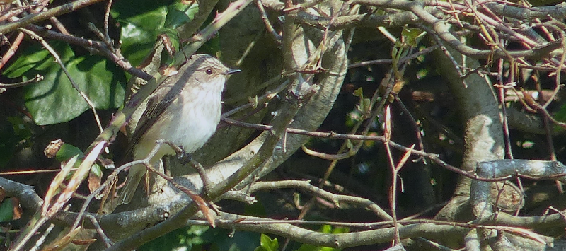
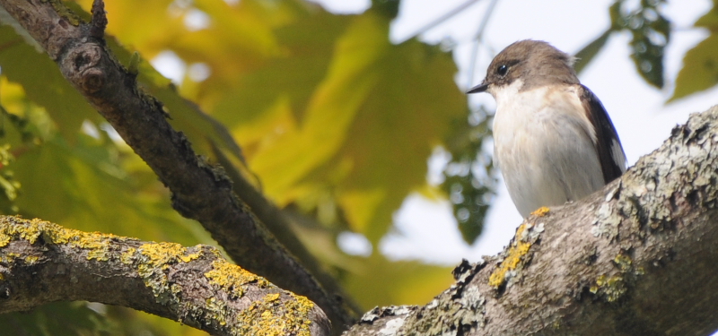
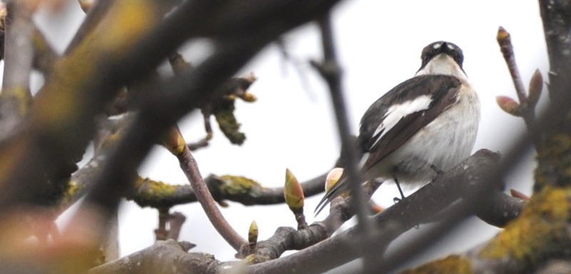
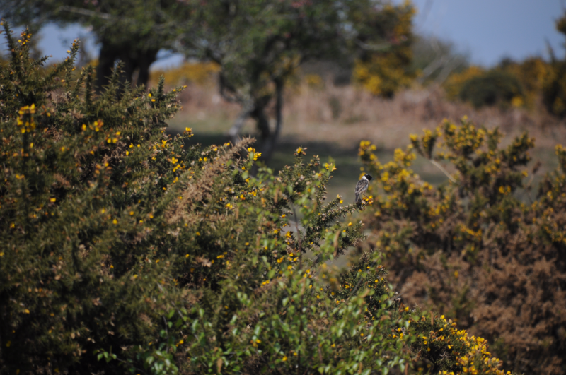
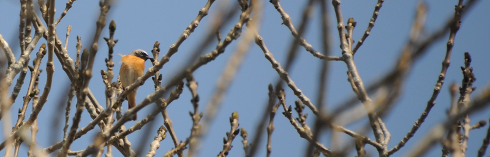
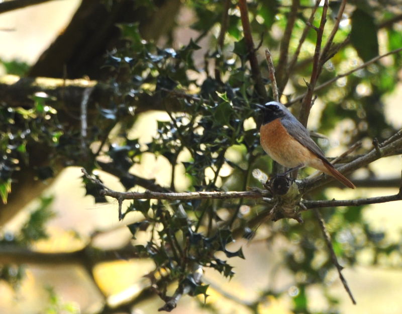

### Portland, Spring 2021, Part #4

To the island of Portland we have gone. In this post we recount the events
of day seven of the trip, May 1st 2021.

#### All good things...

And now we must go home. Boo. Before we do though, let's pay another
visit to Portland Castle; it was great yesterday, perhaps it will be
again.

Spoilers: it is. There are fewer Willow Warblers, but our Spotted
Flycatcher and Common Redstart friends still show very well, often
within a couple of metres of each other in the same hedge. 

<figure class="figure">
    
    <figcaption class="figure-caption text-center">
        The humble Spotted Flycatcher.
    </figcaption>
</figure>

A hurried looking birder turns up half-way through and asks us if we've found
Pied Flycatcher. We have not. They have apparently been reported
again. What are we missing here?

A tree to our immediate left, it turns out; in focussing on the bits
of the garden that we aren't near, we were apparently not paying
enough attention to the big tree sheletering the English Heritage
information hut. In which a male Pied Flycatcher is majestically
sitting. Just as we get on to it properly, it zips out of the tree,
and out of the garden entirely. Perhaps into the little collection of
conifers just outside. Interesting, that's not where I'd expect it to
be. We'll perhaps take a closer look in there in a bit.

Our hurried friend does a complete lap of the garden, car park and
outside in the space of half an hour and is then gone. Efficiency is
obviously on his mind! It isn't for us - we're definitely in loafing
birder mode. We have a trip round to the walled area to check on the
Willow Warbler lawn - it isn't quite as busy as yesterday, but it's
still pretty good.

As we return through the wall's portal, I make an attempt to
photograph one or two of the Willow Warblers feeding in the trees
above. This involves a lot of standing still and hope. And not a lot
of success. As I sidle through the portal though, a female Pied
Flycatcher suddenly alights on a twig perhaps three or four metres
away, and shows no signs of being perturbed by me pointing a camera at
her.

<figure class="figure">
    
    <figcaption class="figure-caption text-center">
        What a slice of luck that was!
    </figcaption>
</figure>

We do eventually have to leave the walled area and disturb the bird -
it flaps its way out of the garden entirely into the same conifers the
male did maybe forty minutes ago; our resolve to investigate is
strengthened.

We make our way back out of the garden and through the various gates,
then do a quick tour of the stubby little trees in the plaza
outside. What we find to start with are House Sparrows and Goldfinches
to start with, but, typically, in the last tree, we find the female
Pied Flycatcher again. She pokes about a bit, before switching to a
different tree - and in there we also find her counterpart. Well then.

After a while the male flycatcher hops out of the conifers and returns
to the hut guarding tree, satisfied that the garden can once again be
his undisturbed domain - we take a bit more time taking a look at him
in slightly better light before deciding we really ought to be making
tracks.

<figure class="figure">
    
    <figcaption class="figure-caption text-center">
        Love the anger here.
    </figcaption>
</figure>

#### A sneaky trip to the New Forest

We do manage one more little jaunt on our way home. We peel off the
A31 as we enter the New Forest, and head North, past Fordingbridge,
and the amusingly named Sandy Balls holiday village. A short drive
along the B3078 later, we're parked up on Godshill ridge with a great
view over some open heathy bits.

Our plan here is to walk out to Pitts Hill enclosure and back, with a
vague hope of catching up with long time bogey bird, Lesser-spotted
Woodpecker. Probably fat chance, but it's got to be tried.

We trundle out through the gorse and immediately come across multiple
Stonechat and Linnet on the tops. Good start. 

<figure class="figure">
    
    <figcaption class="figure-caption text-center">
        The gorse also smells great, as well as housing Stonechats.
    </figcaption>
</figure>

As we climb Cockley hill, there's a little thicket of trees to our left, and
as we approach, a male Common Redstart flaps between a standalone tree next
the the path and the top of one of the larger deciduous trees at the
edge.

<figure class="figure">
    
    <figcaption class="figure-caption text-center">
        Male Common Redstart.
    </figcaption>
</figure>

We keep track of this bird as it sings a bit from the top, then
descends into a more sheltered bit of cover in five or six holly trees
next door. It does some classic Redstart on a low-down dark twig
posing for us. A bit of activity higher up in the same tree finds us
the female, too. Redstarts. What absolutely solid little birds they
are.

<figure class="figure">
    
    <figcaption class="figure-caption text-center">
        Male Common Redstart in a Holly tree.
    </figcaption>
</figure>

Higher up there's more Common Redstart excitement - this time, a pair
of males are having a mid-air argument about which of them is the boss of an
even smaller clump of trees. We take a seat to watch this, and are left 
gobsmacked as person after person steadily ignores this spectacle,
and then eventually, one walks close enough to the fight to split it up. Is
this a normal thing for round here, or did all the bird curiosity on
the South coast get accidentally concentrated in Dorset?

We waltz on into the more heavily wooded and are greeted by a
Treecreeper. We also hear a Willow Warbler singing clearly, and remark
that it's a cool thing to have seen so many on Portland, but to only
hear one sing for the first time here. In the distance - a hint of
Cuckoo, perhaps?

We make our way through the wood, traversing a couple of areas at the
edge that look like they ought to be good for Redstart again. Nothing
doing though. Heading back in, we reach a fork in the path. Both paths
are good - the left one looks perhaps more sheltered, so we'll try
that way. Five steps down the path, a Cuckoo loudly calls from
somewhere off to the right. With much eye rolling, we reverse course
and take the right fork.

This path gently slopes downward. Off to the right, there's a slightly
more open area with a watercourse heading through it, and what looks
like a pond or two. Several birches at various stages of life are
unevenly distributed in it. The cuckoo calls again - it's still
further down the hill from us, we'd guess, in an area which is
screened from us by the considerably thicker trees next to the
path. We look down the path, and guess there might be a better view a
little bit further down.

The Cuckoo keeps calling as we walk behind the screen of trees, so
when we look out we know roughly where to look. "Cuckoo!" Ah - that'd
be it sitting on that dead birch tree over there then. "Cuckoo!
Cuckoo!" Ok, we get it. This isn't a bad view for a Cuckoo - you can
easily hear them all day and never see them - but it's still far
away. It changes trees a few times, still calling, but each place it
tries is too distant for even a hope of getting a photo. Still, to
clap eyes on one is always a treat.

Not a lot else happens in the wood - we spy a few Long-tailed Tits
high up in the canopy, but that's about it. Only a slightly tricky
crossing of a tiny stream in our path is worthy of mention on the
traipse back to the car.