### Portland, Spring 2021, Part #1

To the island of Portland we shall go, for a week of migratory excitement. Or
so we hope.

In this first entry, covering the events of April 27-28th, 2021, we have a
 bit of an explore.

#### A morning walk up the cliff

Day one starts with a walk up to the West cliffs of the bill from
our cottage in Fortune's Well. Dunnocks and their squeaky wheeled song are
_everywhere_, but we pick up our first Wheatears as we crest the hill.
 
From there we jink left, taking in the Tout Quarry (more Dunnock, some
Linnets also, signs of art, run away, run away!) and then the King Barrows
quarry (a pair of Stock Doves, more Linnets). This brings us out on
the coast path on the East side of the island. The little bushes between
us and the sea here are full of Blackcaps and what must be either Chiffchaff or
Willow Warblers - they aren't showy or noisy enough for us to be sure.

We descend back into town via the high angle battery and Verne
Common; have a quick look at Portland Castle, and then return to base - a good
little orientation walk.

#### An afternoon walk around the Bill

In the afternoon we head up to the Bill lighthouse. It is _windy_ -
despite the sunshine we both need our coats, hats and scarves on. We
find a sheltered place to pitch the scope and give the churning sea a
good staring at. A nautically inclined colleague later informs me this is an
 infamous [Tidal Race](https://en.wikipedia.org/wiki/Tidal_race).

There are the usual gulls hanging around the end, but
the rough weather has some treats for us. Gannets are passing by the
end of the bill semi-frequently. Manx Shearwaters carve by in groups
of five or six. A few Guillemot energetically flap past too. Once we
feel sufficiently wind-blasted, we decide to head North, along the coast path.

Immediately we get buzzed at by a pair of Stonechat. There's a hint of
what we guess is the male somewhere off to our right. Mrs. Stonechat is rather
more confiding, accompanying us up the path to the observation centre,
before returning to where we originally found her.

We continue up the coast path for a short way along here, dallying
briefly to have a look at perhaps six or seven Wheatear sharing a
field with some horses. We turn right just before...what even is this
not-really-secure secure looking facility? [A bit of digging](https://www.admiraltyhotel.com/?page_id=42) reveals
that it once was the Admiralty Underwater Weapons Establishment, a
research facility for, well, underwater weapons, we assume. Now it's
in mixed use - there's a hotel, an academy and several other
businesses taking up the same space. None of which apparently are that
interested in maintaining the giant fence at the Western edge. Take it
down maybe?

From here we skirt around the edge of Southwell and then head
ESE. More Wheatears here - another gang of five or six that start out
perched on a fence line, and then relocate to a daisy-filled field as
we approach. 

<figure class="figure">
    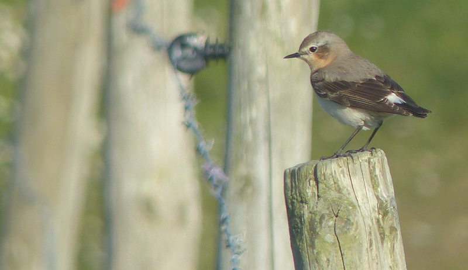
    <figcaption class="figure-caption text-center">
        Wheatear on a post.
    </figcaption>
</figure>

<figure class="figure">
    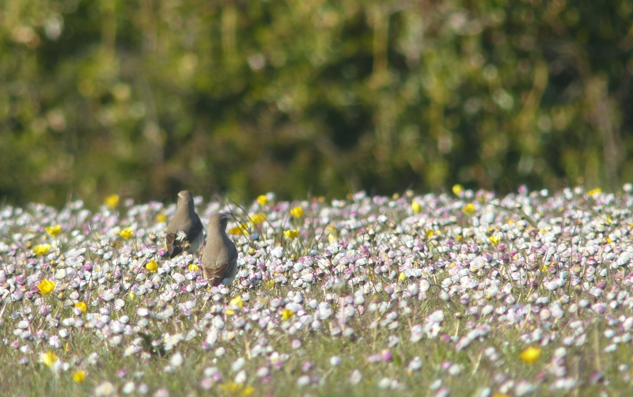
    <figcaption class="figure-caption text-center">
        Wheatear in a field. Shame they weren't looking.
    </figcaption>
</figure>

This path eventually takes us path the bird observatory, where there are
several Willow Warblers (we think).

<figure class="figure">
    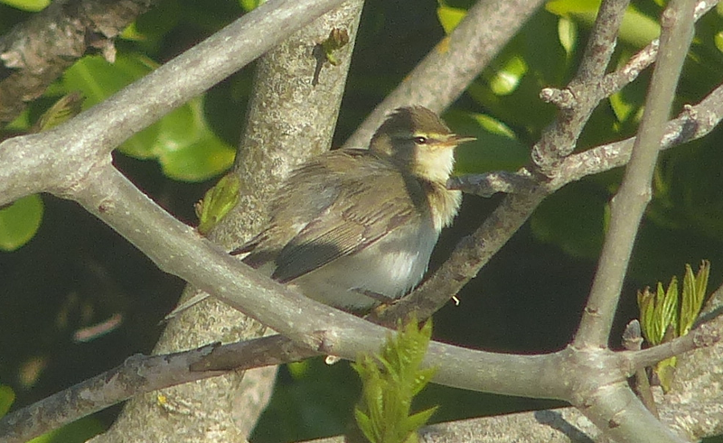
    <figcaption class="figure-caption text-center">
        This fluffy specimen was our favourite.
    </figcaption>
</figure>

At an opportune moment we take a right turn and start to head back
out towards the bill lighthouse. Nothing further of note, other than a
very pleasant half pint of Doom Bar from The Pulpit Inn.

#### Chesil Cove

A late start on day two, oops, but the sun is shining on, and the
tide is out, so it's off to Chesil Cove to see if we can catch up with the
Bar-tailed Godwits that are taking a brief rest there.

We decide to walk, and this is...a mixed choice. The road along the
bar that links Portland with the mainland is really quite busy; it
reminds me a _little_ of the [miserable road to RSPB
Dungeness](/features/a-200-bird-year/part-37-dungeness.html)
- thankfully today the weather is reasonably human friendly; warm in
the sun, not too windy.

The bar eventually widens to admit a sort of common area, on our right
as we walk back to the mainland. We make our way over to what looks
like a path through it, rather than walking along the road. This path
is quieter but harder to walk on; a mixed choice. We do get serenaded
by a Skylark or two though.

As we reach the car park at Chesil Cove we re-cross the road and make
a brief stop for cake at the café. Round the front of the café we take
heed of the signage urging us to keep to the edge of the mud, and edge
our way along what's about to become Ferry Bridge.

As soon as the mud-water boundary is visible, we can see that there
are indeed *loads* of Bar-tailed Godwit, with a fair few Dunlin
sprinkled amongst them too. Nice. A bit more looking around yields
some fishing Little Tern (one of the UK's few breeding colonies can be
found at Chesil) as well as some chunkier Sandwich Tern. 

<figure class="figure">
    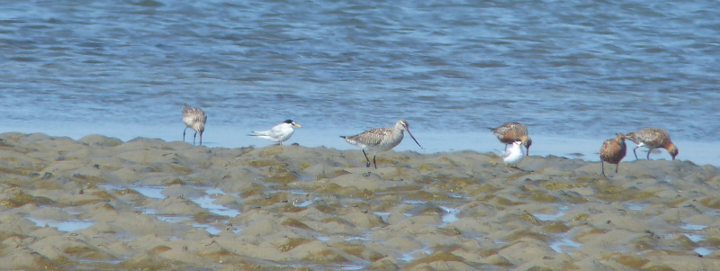
    <figcaption class="figure-caption text-center">
        Occasionally a Little Tern or two sat amongst the Barwits.
    </figcaption>
</figure>

We also find a flock of Ringed Plover higher up the mud.

<figure class="figure">
    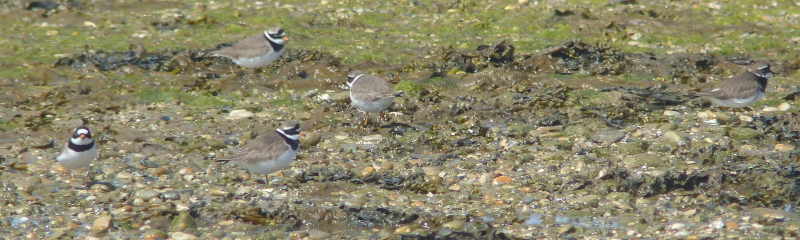
    <figcaption class="figure-caption text-center">
        Ringed Plover. We like them.
    </figcaption>
</figure>

We mess around trying to get our phonescoping equipment setup
satisfactorily. With little success. Another birder turns up, and requests a
quick primer on the available terns. Thankfully the two species present are
two we can easily separate, and are near enough for us to point out examples.

We toddle off back to base for some lunch. What a great little place
that was.

<figure class="figure">
    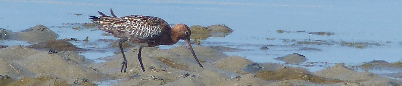
    <figcaption class="figure-caption text-center">
        This slightly better Barwit is still from the bridge camera.
    </figcaption>
</figure>

#### Radipole Lake RSPB

The afternoon takes us into Weymouth town centre - we decide to pay
Radipole Lake RSPB a visit as part of that. We've been here before,
maybe six years ago on a May bank holiday weekend, and we remember it
being full of Cetti's Warbler, and there being a Common Sandpiper on
the mud opposite the visitor centre.

<figure class="figure">
    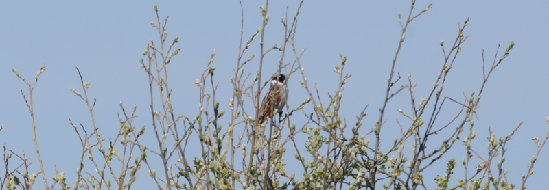
    <figcaption class="figure-caption text-center">
        Here, a Reed Bunting ignores us.
    </figcaption>
</figure>

The Sandpiper is absent but the shouts of Cetti are again
everywhere. We also catch up with Reed Buntings and Reed Warblers from
the little offshoots of boardwalk that occasionally sprout from the
main path. Otherwise, not much of note happens until we decide to
explore the right fork of the main path.

Here, an unlikely sign suggests the next path offshoot is a good spot
for Bearded Reedling. We are sceptical. Incorrectly, it turns out,
because there's a female one in the reeds not ten feet from the little
platform. We even manage to take a few photos of it, it's so close. A
pair of walkers trundle past, and we hear some of their chat
"apparently you get Bearded Tit there, but I've never seen them";
we're too engrossed to stop them though, sadly!

<figure class="figure">
    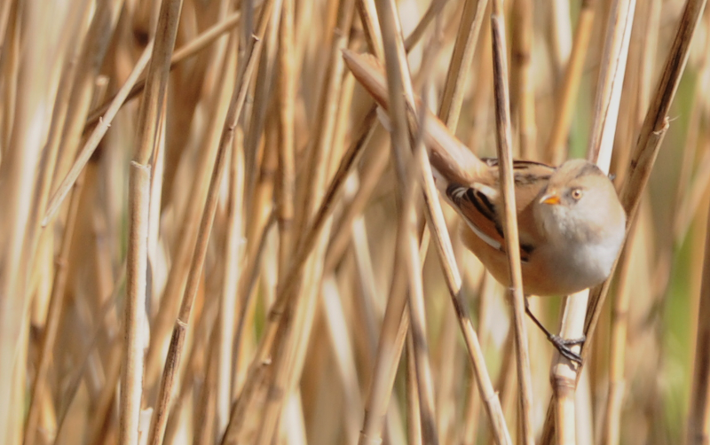
    <figcaption class="figure-caption text-center">
        Not quite sharp, but close enough; the best we've got, anyway!
    </figcaption>
</figure>

A bit further around the path we encounter the same pair and a chap on
a bike, peering at a wader on a muddy island in the pond to the
North. Is it a Curlew, asks bike man? It looks like one, but it is in
fact a Whimbrel; the crown stripe is quite clear in the afternoon
sunlight.

<figure class="figure">
    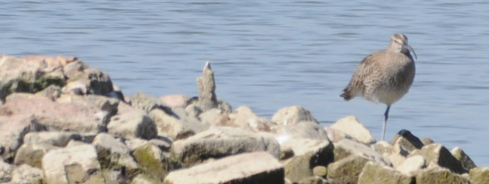
    <figcaption class="figure-caption text-center">
        A terrible photo, but enough to convince us it's a Whimbrel.
    </figcaption>
</figure>

We give out some standard Whimbrel facts, and further bird
chat ensues - we really need to get back to the car before our parking
ticket expires though, so we make our excuses and head back in that
direction.

We make it back in enough time to take another look at the mud
opposite the visitor centre, and just as we do, a Common Sandpiper
flits out on to it, and gives us a nice display of its bobbing
tail. Reliable!

<figure class="figure">
    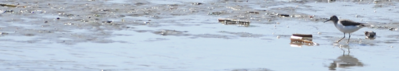
    <figcaption class="figure-caption text-center">
        We did not do well with cameras at Radipole.
    </figcaption>
</figure>

#### Evening Quarries

It's back to Portland for the last bit of the day - we're going for a
walk around a couple of the quarries to see if anything interesting
can be turned up. We start with an unproductive but very scenic walk
around Church Ope. We follow it up with an equally productive explore
of the quarry between Southwell Road and Weston Street. Well, this is
going well!

<figure class="figure">
    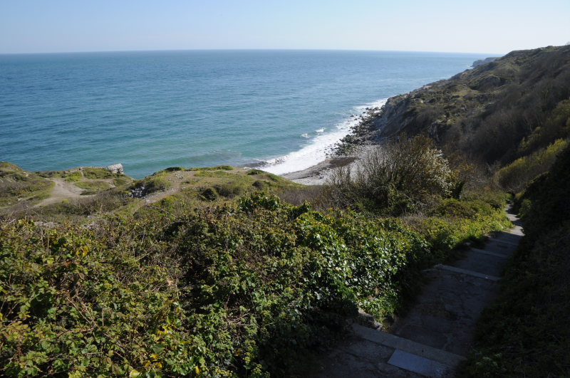
    <figcaption class="figure-caption text-center">
        Church Ope Cove is pretty though.
    </figcaption>
</figure>

Things start to improve as we move towards Portland's windmills. A
bramble in a field gives up a Whinchat. We take terrible photos of it
before it bails to a bigger bramble at the opposite side of the
field. We walk around to see if we can get a better view, but get no
joy. We do find three or four Wheatear in the same field from a
different angle though.

<figure class="figure">
    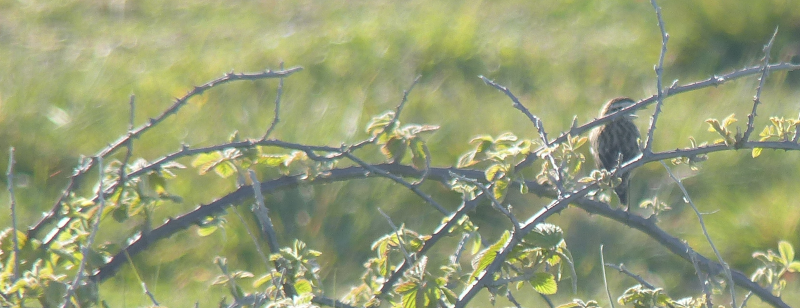
    <figcaption class="figure-caption text-center">
        Why are Whinchats such _utter_ gits?
    </figcaption>
</figure>

We walk up towards the South-Eastern windmill, disturbing a couple of
Wheatears and loads of House Sparrows. In a slightly elevated bit of
field-hedge-bramble, there's a browner warbler poking about in
it. Hmm. We can see it, so it can't be Garden Warbler, can it? We
rack our brains for alternatives but find none; Garden Warbler it must be.

From here it's a short trip back to the car, and thence back to base
in Fortune's Well.