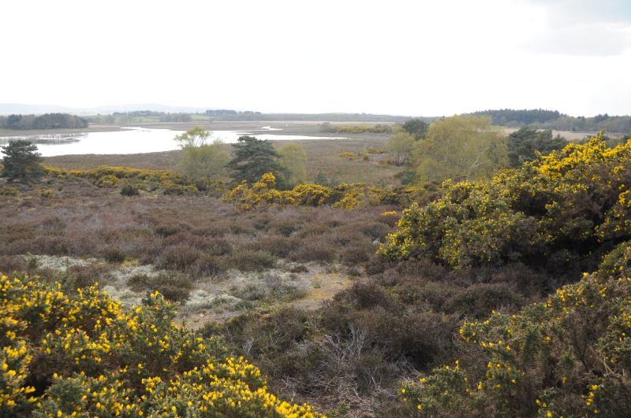
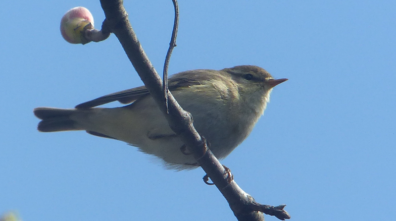

### Portland, Spring 2021, Part #3

To the island of Portland we have gone. In this post we recount the events
of days five and six of the trip, which were at the time known as the 29th
and 30th April, 2021.

#### A fly in the ointment

Plans for a day off the island do not start well when we discover a
note on our car informing us that a local bus has scraped the front
right wing. The damage looks superficial, but our previous experience
with damaging hire cars tells us we'd best get it assessed and fixed
before we do anything else. That takes us 'til lunchtime.

#### Arne - a reserve of two halves

This apparently is not pronounce like "Arnie" (as in Schwarzenegger) to AB1's
significant distress.

The first half is great for views, but, for us at least, not too great for
birds.

Despite the close attention of the bus to our car, we still have
plenty of time to head to our original planned destination of RSPB Arne.
We get there around half past one, park up, then head out onto the nearest
available trail in search of the first appropriate place to lunch. It doesn't
take long - we choose the Shipstal trail and maybe 200m in there's a couple of
plank style benches with a nice view over some gorse towards the harbour.
Sandwiches are eaten. Stonechats are seen. A distant Cuckoo calls.

<figure class="figure">
    
    <figcaption class="figure-caption text-center">
        The view from lunch. Not bad.
    </figcaption>
</figure>

The remainder of the trail is great for views but a bit quiet for
birds. We find plenty of Mistle Thrush in the fieldy bits, and there's
a Green Woodpecker yaffling somewhere, but otherwise, all is
quiet.
 
<figure class="figure">
    
    <figcaption class="figure-caption text-center">
        The back of a Mistle Thrush.
    </figcaption>
</figure>

Perhaps our timing is awry. The lack of birds is more
surprising when we get to the parts of the trail that border the
harbour. 

<figure class="figure">
    
    <figcaption class="figure-caption text-center">
        Where has everybody gone?
    </figcaption>
</figure>

Here the gorse just inland is thick, there are good trees
nearby - this ought to be full of birds. But it is not - where we
would expect clouds of Stonechat we find not even a single
Linnet. All we find is a frightened looking deer or two. Curious!

<figure class="figure">
    
    <figcaption class="figure-caption text-center">
        Hello.
    </figcaption>
</figure>
 
We trundle back to the car to stash the superfluous scope before heading out
to have a look at the Coombe Heath trail.

The Coombe Heath trail is sunny but also lacking in life - we find three
Stonechat rather than one, though, and a potential Tree Pipit was spotted.

<figure class="figure">
    
    <figcaption class="figure-caption text-center">
        Tree Pipit off to the left of here. Maybe.
    </figcaption>
</figure>
 
As we exit the circuit, a pair of folk quiz us on where they're most likely
to see the Ospreys. Ospreys? Apparently there's a nest on a stick
somewhere in the harbour that you can see from this trail. This is the
first we've heard of it, but we do know, at least, that this trail is
circular, and the watery bits are half way around, so _whichever_ way
they go they'll get there. Later on I remember the existence of [The Poole
 Harbour Osprey Project](https://www.birdsofpooleharbour.co.uk/osprey/) and
feel a bit silly for being so uninformed. Oh well.

#### The second half

Finally, we try the Hyde Heath trail. And this bit _delivers_. The vegetation
feels a bit more like heathland than where we've been so far - stands of
conifers, mixed gorse and short trees, but not too much of either. We're
reminded of our trip to [Thursley Common](/blog/surrey-circuit/index.html).
  
There's plenty of activity too - admittedly too distant to identify, but
stuff is at least about. We once again choose the positive (anti-clockwise) 
direction, and we're soon following a pair of Stonechat up the hill. Will this
find us a Dartford? Not immediately - we scan underneath wherever the Stonechats
sit for signs of activity but find nothing.

<figure class="figure">
    
    <figcaption class="figure-caption text-center">
        Stonechat.
    </figcaption>
</figure>

When we reach the top corner of the trail though, an odd scratchy song
kicks off. That is _not_ Stonechat. What is it, though? AB2 points out
_some bird_ sitting on a tiny shrub, and we stare at it. Female
stonechat? No, no, that's Dartford, look at that tail. And that's the
thing singing! It stays still long enough that we dare to dream of
photographing it, but inevitably this turns out to be completely
impossible. Worse than Whinchat for shyness.

We interrogate every further Stonechat for Dartford friends, but find
none. We do encounter a Siskin a bit further around though, which is a
nice surprise. It's "see you" call reminds us of our trip to Scotland,
where it went from "what the hell is that" to "aaaah, Siskin again"
over the course of a week or so. An unbidden memory of what turns out to
be something Russ Abbott related appends "Jimmy" to the "see you" call in a
terrible Scottish accent.

<figure class="figure">
    
    <figcaption class="figure-caption text-center">
        Siskin dropped in on the left hand side of this bit.
    </figcaption>
</figure>

The vegetation at the sides of the path starts to change from gorse
and sticky bushes to short trees only, and the birds change with
it. Four or five Tree Pipits are making song flights between these
treelets, and they _are_ photogenic enough for us to manage a capture
or two.

<figure class="figure">
    
    <figcaption class="figure-caption text-center">
        Tree Pipit (on a short tree; classic).
    </figcaption>
</figure>

Even better, there's a sharp winged bird of prey carving into
a collection of conifers at the bottom of the hill, and we're onto it
quickly enough to spot the hint of red trousers that means it can only
have been a Hobby (a bird of that shape heading into conifers
from a heathland to do some perching could be very little else).

We try to pick out the Hobby in the trees when we get a little closer,
but it is completely hopeless - we're too far away, and there are too many
possible perching branches for us to check. We'll have to make do with
the now constant plea for attention from nearby Tree Pipits, which are
just desperate to display for us in the evening sunshine. Barring a
brief break where we briefly fail to work out that the cause of a
weird noise is squirrels, there ended the birding of note at Arne, and
it was time for us to head home.

#### The 6th Day

We should never have mentioned Arnold. We haven't even seen that one.

For once, we haven't got much of a plan for the start of the day. We
consult twitter, and find some advice that Portland Castle might be a
place to start our day. 

<blockquote class="twitter-tweet">
    

        Portland Castle Pied Flycatcher, Spotted Flycatcher, Lesser Whitethroat, Blackcap and 3 Willow Warblers
    

    &mdash; Debby Saunders (@debbyseamist) 
    <a href="https://twitter.com/debbyseamist/status/1388037495905001472?ref_src=twsrc%5Etfw">April 30, 2021</a>
</blockquote>

We'll start out there then and see what happens.

#### Portland Castle

What happens is immediately pretty good - it feels like the hordes of
Willow Warbler from Wednesday are now congregating here, in the last
tiny green space before they have to take on the terrifying bulk of
the rest of the UK. I find myself in a strange state of sympathy with
them, now we're reaching the tail end of our time here. Do we have to
go back? Can't we stay here, where it's green, and things seem so
friendly?

We took only a brief look at the castle on our orientation walk and were put
off by the English Heritage hut, which we assumed would lead to eye
watering entrance charges. Today we are more curious, the hut is empty and
the path into the gardens attached to the castle appear to be open and
unguarded. We sidle in and park ourselves next to a giant gate, so the sun's
right behind us.

Things start to happen _very_ quickly. A Lesser Whitethroat is fussing in
the hedge to the right of where we came in. Another bird is sitting on
a smaller gate opposite us; it hops into the air, does a little
mid-air dance, and then lands on the lawn with its back to us with an
unmissable flash of red. Female Common Redstart.

<figure class="figure">
    
    <figcaption class="figure-caption text-center">
        Always so proud of themselves, and rightly so.
    </figcaption>
</figure>

In the trees above the wall, another bird hops out from a perch,
cavorts midair to catch a fly, and then returns to the same
perch. That'd be...Spotted Flycatcher then. Further to the right in some less
grandiose trees, a further spotty is doing the same thing. A supporting cast
of Willow Warblers provides activity towards the edges of the stage.

<figure class="figure">
    
    <figcaption class="figure-caption text-center">
        These were everywhere.
    </figcaption>
</figure>

This is great. There's always something a bit special about finding
flycatchers at any time, and in this perfect little secluded space at
the Northern tip of Portland that feeling is amplified. Wonderful.

Word is evidently out that this is the place to be - a pair of well-equipped
folks turn up and make a beeline for us. What have we seen?
We give a report of what we've found so far. "No Pied Flycatcher?" "We
haven't found one yet. Are you reading Debby's tweets as well then?"
"Yes". How brilliant is it that twitter turns out to be good for bird
news?

Having shared all our sightings, we feel compelled to try to find all
of them again for our new acquaintances, and we just about manage it,
even if our somewhat flowery descriptions of copper leaved trees as
"autumnal" isn't perhaps the most helpful. In return, we get some
excellent intel - there are apparently a pair of Black-winged Stilts
at Lodmoor! Well, we'll have to go there next then.

These folks have driven across from Wareham, but they haven't been to
Arne yet. They admit that this is what usually happens - they stay
near Wareham but end up on Portland every day. I can see why! We tell
them of our Arne experience; they tell us that they've long ago
stopped bothering with the Shipstal trail because they never see
anything there either. Well this is all very useful.

We eventually reach a point where we really ought to head out to find
the Black-winged Stilts, but before we do we want to have a quick look
at the parts of the garden that are hidden from us by the wall to our
East. We make our way through the Redstart gate and turn left, and
through a stone portal there's a small circular lawn
which...is...covered in Willow Warblers; there must be ten or fifteen
of them poking at it in hope of insects. Mad. What a place.

We head back out, say a quick goodbye to our new friends ("you managed
to send the Redstart right out to us, thanks") and hop back in the
car. To Lodmoor!

<figure class="figure">
    
    <figcaption class="figure-caption text-center">
        Portland Castle.
    </figcaption>
</figure>

#### Lodmoor
 
We park up on the residential road (not just motivated by
cheapness this time; our castle informants told us this is where to
go). Before we've even got any kit out of the car, three separate
groups of people (one of whom stops her car in the middle of the road)
ask us what's got everyone so excited. Are we just more approachable
than the twenty odd bescoped folks down the road in some? We happily explain, 
and offer a scoped view once we're set up if they're interested.

Once we're free of questioners, I make a beeline towards where
everyone else is standing and...oh my goodness the birds are basically
10m from the hedge. That's an _unbelievable_ view. I hurriedly get the
scope set up, but in the time between taking my eye off the birds and
on to the scope, they disappear. Did I imagine the whole thing? No -
they've just retreated to a more standard 50m or so, towards the back
of the area of water we can see from here. Humph. 

A less bothered AB2 catches up from a brief messing about in the car and is
unimpressed. "Was that your fault?". I do my best innocent face, and offer up
 a newly reconfigured scope pointing at where the Stilts now are.

We hold our horses on that while a few interested locals take a look
through the scope and make appropriate ooooh noises. The scene's
helped by a crowd of hirundines swooping around the same bit of
water. Perhaps they're also excited to see BWS up here. What a sight.

<figure class="figure">
    
    <figcaption class="figure-caption text-center">
        It's all happening.
    </figcaption>
</figure>

Our next stop is most definitely lunch, for which we'll briefly head
back to base.

### Bill walk

The afternoon rolls around, and it's time for another walk around the
bill. We park up in Southwell just as school is out, dodge the hordes
of children and parents on a quick tour of the estate, park, and the
quickly detour the path we'd planned to get out on to the cliff path,
away from the disturbance of everyone heading for home.

This turns out to be a good plan - we pick up a nice Stonechat on the
Northern edge of the business park, and a Kestrel heading along the
cliff edge (same bird as Tuesday maybe?). We consider heading down
Reap Lane on the advice of other recent tweets, but we decide we
prefer the look of Barleycrates instead.

This again turns out to be a good choice, because at the quarry towards the
end of that path, we come across a pair of Whinchat, and after an extended
period of trying really hard, manage some passable photos of. We also introduce 
a pair of passing folk to them; they're locals, and apparently this is the first
time they've seen one. Always a delight to hand out a life-tick!

<figure class="figure">
    
    <figcaption class="figure-caption text-center">
        Whinchat. We're getting closer. One day we'll take one we're proud of.
    </figcaption>
</figure>

At the end of Barleycrates we do a bit of staring at the sky. Are we
about to get very wet? We decide that the weather gods are going to be
on our side, and leave Portland dry, despite the evidence of the
occasional spot of rain on AB1's glasses. We decide to have a trundle
around the hump and the surrounding quarry. Mostly we find more Willow
Warbler and Linnet.

At a point where our path splits into three
though, we go for a bit of an explore and find some things of more
interest; a Kestrel preening on the quarry's edge. A Buzzard,
squeaking angrily at...itself? It seems keen to demonstrate that it is
_the_ Buzzard of the quarry, but looking up we find no other Buzzards
it could be trying to convince. Good to know Buzzards suffer from
egotism too.

Now and again there's a hint of a much more interesting sound - the
insectile reeling of a Grasshopper Warbler. It's impossible to place
it anywhere other than "distant" though. We try moving ourselves to
see if we can triangulate it, but the bird doesn't keep singing
consistently enough for us to get anywhere. That'll have to do.

We head back towards Avalanche Road to explore if the pub is open
yet. If it is, it doesn't appear interested in showing it. Humph. A
bit more walking then - we turn and head up Sweet Hill, to revisit
Sunday evening's Wheatear field. No Wheatears this time. More Linnet
though. Not a lot else. A quick pass by the bird obs; more Willow
Warbler. 

Our real target has always been the Pulpit Inn though. We
stop for a pint and a relax with the last of the light, then head back
to base via a curry from Easton.

<figure class="figure">
    
    <figcaption class="figure-caption text-center">
        A sunset view down to the observatory.
    </figcaption>
</figure>