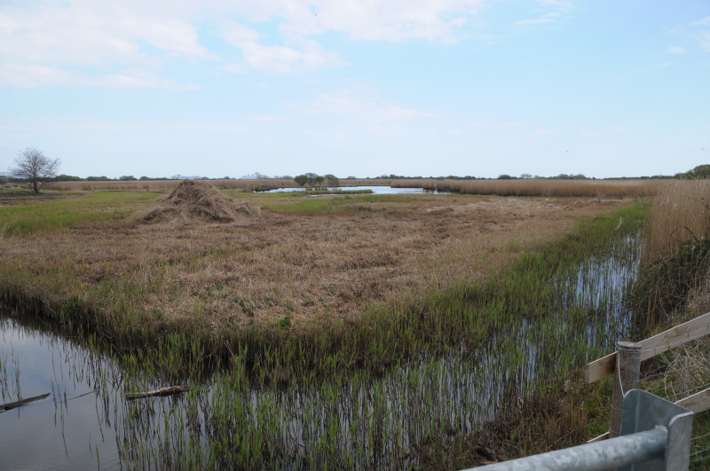

### Portland, Spring 2021, Part #2

To the island of Portland we have gone. In this post we recount the events
of days three and four of the trip, which were at the time known as the 29th
and 30th April, 2021.

#### A morning solo around the Bill

AB1 flies solo this morning; AB2 wants to get a few work based
thoughts out of her head and into some terrifying PowerPoint thing.

AB1's incredible tightness comes into play, and some
planning time spent on Google Maps has revealed that there is
plentiful free parking available at Southwell Business Park, which we
basically walked past on Sunday. We'll start there today.

This walk takes me back out through Sunday's Wheatear field; they're
noticeable by their absence this time. Instead of turning right
towards the obs as we did on Sunday, this time I go straight on
towards the coast.

The hedge along this part of the path is alive with birds - loads of
Whitethroat, and also several Willow Warbler. Once again, the Willow
Warbler are silent, and busy, flitting quickly between the hedge and
some stubby plants sticking out of the path. An attempt at a photo is
made, but then quickly abandoned.

The last field before the road is full of Skylarks and Wheatear; they pose
much more obligingly.

<figure class="figure">
    
    <figcaption class="figure-caption text-center">
        Skylark
    </figcaption>
</figure>

<figure class="figure">
    
    <figcaption class="figure-caption text-center">
        Wheatear
    </figcaption>
</figure>

The walk out along the coast path doesn't add much - nice quarries, a
Wren, a singing Sedge Warbler, yet more Linnet, a Rock Pipit or
two. As the path encroaches on the holiday huts I take a right back up
towards the road, so I can scour the greenery around the observatory
for birds of interest. Even before I get there I've picked up a
Stonechat and a Wheatear on the wire fencing of the fields below.

The trees around the observatory are again chock-full of Willow
Warbler; I pick up five or six as I amble round without even
trying. Lovely. There's not much else other than the Willow Warblers
though, so I toddle out to the bill proper. It turns out its
lunchtime, so a chip butty is acquired from The Lobster Pot, and a
brief break to eat it is taken.

Recharged, it's time to head out along the West coast path. Sunday's
pair of Stonechats chirp at me on my way up to lighthouse three. A
tremendously photogenic Kestrel poses above me perfectly for a few
seconds before heading further North along the cliffs.

<figure class="figure">
    
    <figcaption class="figure-caption text-center">
        Looking straight at some idiot with a camera. Quite pleased with this one.
    </figcaption>
</figure>

In the fields just before the beginnings of the dodgy fencing the
surrounds the business park, there's a few Meadow Pipits hanging
around on fencing. In a field with some excitable horses, a Yellow
Wagtail is briefly visible before flapping off South (huh?!) again.

Further along, I catch up with the confiding Kestrel. This time it's a
bit lower, and now, lower again. It dips into the vegetation on the
clifftop and lists off again with a vole! 

<figure class="figure">
    
    <figcaption class="figure-caption text-center">
        Spot the imminently successful Kestrel.
    </figcaption>
</figure>

It then disappears without trace in seconds; this is a Kestrel that knows it'll
get mugged if the nearby Ravens or gulls recognise it's just caught a tasty
morsel. A man walking a dog wanders up, and offers "well that Kestrel knows
what it's having for dinner" and we chat for a bit. Apparently his dog
catches a vole now and again and needs deworming monthly. I assume the two
things are related. Good to know. 

That's the last event of interest for this walk - I don't find
anything on the return to the car along Reap Lane, so back to
base it is to see if AB2's emptied her brain of enough slides to go out.

#### Lodmoor

We decide to explore Weymouth's second RSPB reserve over at Lodmoor in
the afternoon. Once again, prior internet reconnaissance has found
that we can park for free along the residential road that forms the
Northern perimeter of the reserve, so that's where we head.

We park up, and immediately we're cheered by a huge flock of Swallows,
Sand Martins and even the occasional House Martin over the
water. Spring is here. There are some nicely lit House Sparrows and
Dunnocks in the hedge, and a pair of Marsh Harriers are floating
about too. Excellent.

<figure class="figure">
    
    <figcaption class="figure-caption text-center">
        A handsome House Sparrow.
    </figcaption>
</figure>

We head out around the reserve's border path, going anticlockwise (the
best direction). We don't immediately pick up much, although we do
meet a very sociable Springer Spaniel. 

<figure class="figure">
    
    <figcaption class="figure-caption text-center">
        A view of Lodmoor from the Western end of it, looking East.
    </figcaption>
</figure>

As we head towards the Southern
corner of the reserve though, we do pick up some seriously well
camouflaged waders on a muddy patch at the back of one of the pools -
Bar-tailed Godwits, Oystercatchers, and, again, a solitary Whimbrel
surprise hiding amongst them.

The section parallel to the coast road is pretty dead, and we cover it
quickly. When the path turns back into the reserve away from the road
things start to improve again - one bush has all four of Chiffchaff,
Whitethroat, Reed Warbler and Cetti's in it, for a start. When we stop
at what we guess is a sluice between two ponds, a Water Rail spies us
and swiftly picks its way back ino somewhat deeper cover. Such shy
birds! After glaring at several reedbeds in hope of Bittern, we head
back to the car.

A brief unproductive stop at Chesil Cove notwithstanding (the tide's
in, so there's no visible mud to speak of, so no waders), the day ends
there.

#### A wet day

Rough weather overnight is a potential source of excitement. Previous
reading of the [observatory website](http://www.portlandbirdobs.com/)
suggests it could be, anyway. AB2 has more slides to write, so AB1
ventures out, hoping to find a gap in the rain.

This does not go well. A gap is sought but not found, and I get bored
of waiting for it and decide that the current shower is
"basically only a light drizzle, no worries" and head out on a
similar path to Sunday evening. 

This goes increasingly less and less well. The previously dry and limp
foliage is now wet, angry, and within approximately 4.5m of walking anywhere
near it, the entirety of my bottom half is saturated. Great.

Rather soggily, and utterly birdless, I squelch my way to the observatory and
hide in the rain shadow of an attractively decorated hut, to wait
more patiently for the next gap in the rain.

This takes some time; enough time to reflect that while it is wet, and
a bit windy, it isn't, thankfully, too cold. My jacket's claims of
being waterproof seem to be holding up, too.

As the rain fades, obscene numbers of Willow Warbler start poking
about in the trees and bushes near me. Everything that moves is a
Willow Warbler - there are often five or six birds in the same tree
jumping around. I guess they're pretty hungry after a channel
crossing! There are also several very wet looking Whitethroat. Some of
them might be Lesser but they're moving too fast for me to check, and the
usual plumage hints are harder to spot when they're soaked, it turns out. 

More human activity slowly emerges - some more sensible
birders who were waiting patiently in the observatory are
off out for an explore of what might have turned up. One picks out the
song of a Sedge Warbler.

I try to follow along behind the drier birders but fail - they're
going a different route to me it seems. At this point I'm too wet and
cold to muster much further enthusiasm, so I take a reasonably short
path back to the car via the West cliffs. Even more Willow Warbler
await me there; I later learn that the things they're flitting between
are Alexanders plants, and, indeed, there does seem to be [a warbler
per plant](http://www.portlandbirdobs.com/2021/04/28th-april.html).

From here it's only a short walk back to the car, and I retreat back
to base for the day to dry off. Foolishly we neglect to head back out
in the afternoon and miss quite a lot (see previous link). In my defence, I'd
have either wrecked a different pair of shoes or had to go out in wet ones.
The search for properly waterproof boots will have to be continued another
day.  