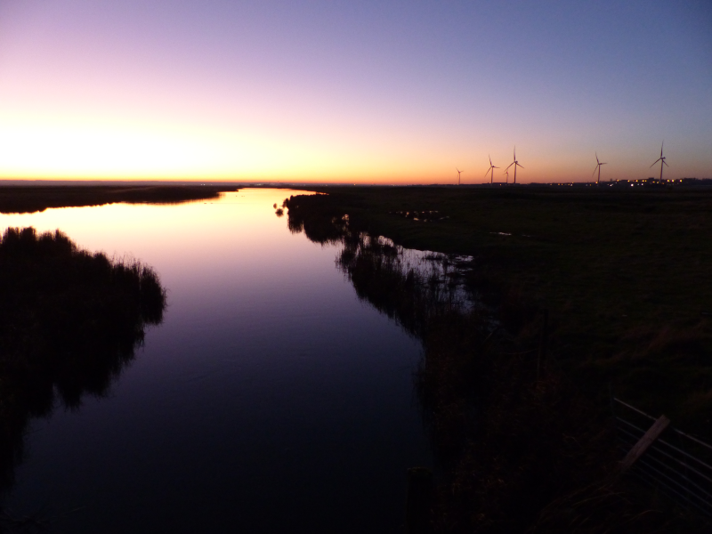
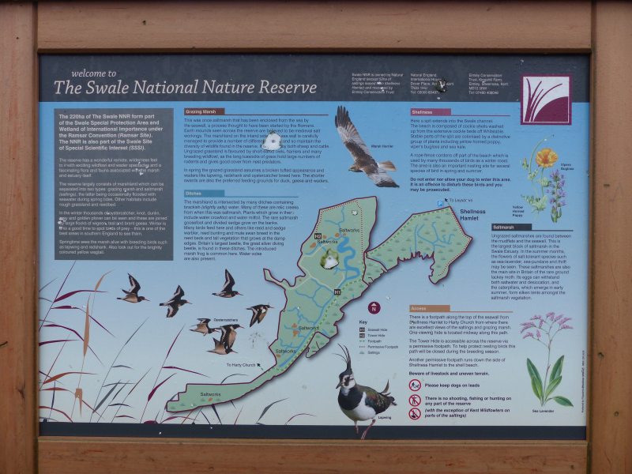
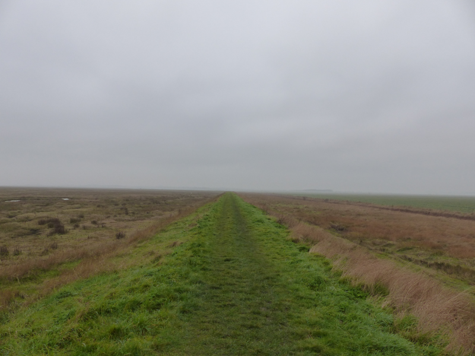
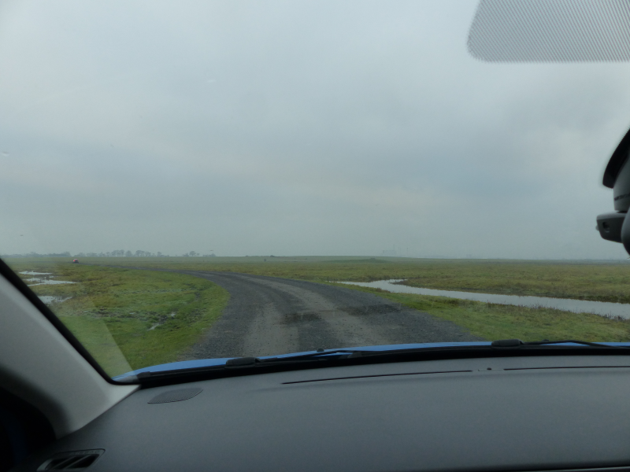
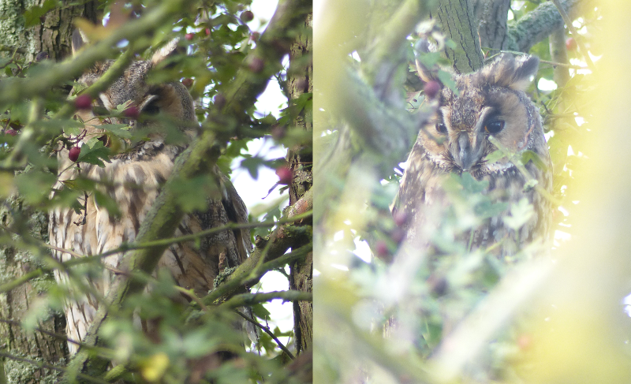
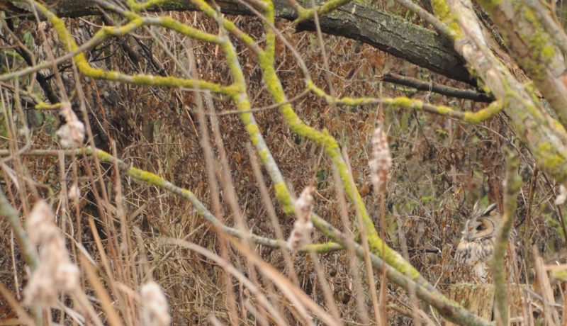
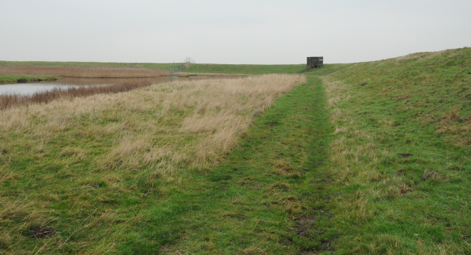
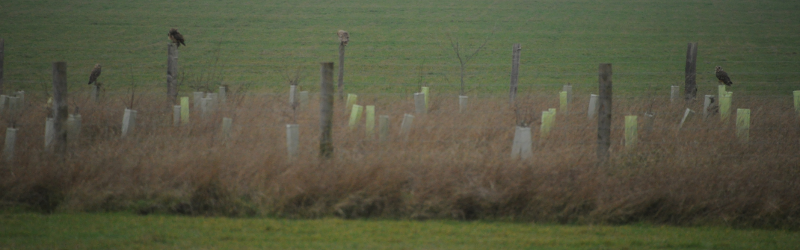

### Sheppey New Year!

After a whirlwind Christmas tour of AB1 and AB2's respective families, a tiny
window of opportunity arose for a trip to Sheppey before the inevitable return
to work.

#### Where even is the Isle of Sheppey?

It's off the North coast of Kent, features a 
[cluster](http://www.justice.gov.uk/contacts/prison-finder/sheppey-cluster-swaleside) 
[of](http://www.justice.gov.uk/contacts/prison-finder/sheppey-cluster-elmley) 
[prisons](http://www.justice.gov.uk/contacts/prison-finder/sheppey-cluster-standford-hill), 
a nudist beach, and, more interesting for us, a pair of National Nature 
Reserves covering it's southern half.

We decided to make the trip at quite short notice, and were delighted to 
discover that a well reviewed hotel in Queenborough, the [Queen Philippa](https://www.queenphillippa.com/) 
had availability over New Year. We were 
less thrilled to hear they had a party planned, but you can't have everything.

#### Day One: Arrival

We reach the island around 3pm on the 30th hoping to have a late visit to 
Elmley...but the volunteer at the gate turns us away - apparently the car 
park at the end of the track is completely full, and the track is also jam 
-packed. Word got out that three Long-eared Owls were on the reserve and the 
world and his wife have subsequently turned up.

Are they open tomorrow? No - Tuesdays are always closed. What about New 
Year's Day? Yep. Ok, phew - it'd be a shame to come all this way and not be 
able to visit, especially now we know there's a chance of LEO!

For now though, we've got a good hour and a half of daylight to spend. Where 
to go. Well, we haven't got enough time to get to the Swale NNR, so really, 
our only option is to try out the Capel Fleet Raptor Viewpoint.

We arrive in dire need of facilities. There are none. The site also lacks any
 sufficient cover from the five or six other resident birders for a shifty 
 wee. Thankfully, we've got at most an hour before it gets dark.
 
There's a hopeful RSPB sign with 12 (twelve!) raptors on it. I can believe 
that all of those have been seen from here, but I bet it wasn't all on the 
same day!

We manage a measly five: Common Buzzard (sitting on a post nearby), Kestrel (a 
very playful bird making its way up and down the wires alongside the road we 
arrived along), Marsh Harrier (thirty odd birds faffing about above a roost 
to the East) and, in the distance, Peregrine Falcon. No owls at all - humph!

<figure class="figure">
  
  <figcaption class="figure-caption text-center">
    A spectacular sunset on the way home makes up for the lack of owls
  </figcaption>
</figure>

#### Day Two Part One: The Swale NNR

We can't go to Elmley, so the other NNR it is. A twenty-minute drive with a 
five-minute crawl along the terrible road to Shellness village later, and we're there.

<figure class="figure">
  
  <figcaption class="figure-caption text-center">
    This handy panel greets us in the car park
  </figcaption>
</figure>

After a brief wander to look at the beach (Brent Geese and Oystercatchers 
mostly), we set off around the reserve. We're hopeful, again, for Short-eared
Owl, but there's also, from what [I've been reading](http://lettersfromsheppey.blogspot.com/2019/), 
the possibility of 
coming across some White-fronted Geese, or even a Bean Goose!
 
What we mostly get, however, is a continuum of Brent Geese. Flying over. 
Honking in the distance. Honking in nearby fields. Occasionally some Greylags 
are there too. Of other goose species, however, there is no sign.

<figure class="figure">
  
  <figcaption class="figure-caption text-center">
    It's clear where you have to walk
  </figcaption>
</figure>

Nearer the elevated path that skirts the reserve, we're inundated with 
Linnets and Reed Buntings. A large flock of the former follows us around the 
path (or possibly we follow them). Other than that, there's an occasional 
Mipit. Added to the scenery and the isolation of this place, that's plenty 
enough for us, even if the weather is a foggy, damp grey.

Not an awful lot of note happens; we come out of the reserve at a time 
unsympathetic for a lunch at the Harty Ferry Inn (shame, it was good the last
time we were here), instead taking a couple of right turns to set us up for 
an anti-clockwise circuit that leads us, eventually, back to the car. On the 
way, more Brent Geese (a flock of perhaps 600 odd at the bottom of a field 
adjacent to the track) and, as we return to the road, another confiding 
Kestrel.

As we return to the car park, a trundle down past the hamlet is considered. 
The path through is supposed to be permissive, but the signage is unfriendly,
 and the precise route very muddy-looking. No, instead, lunch, and a 
 whistlestop trip to Oare; a journey of less than a mile as the crow flies, 
 or, for us, close to an hour's drive!  

#### Day Two Part Two: Oare Marshes

We can't come to this bit of the country without paying this place a visit, 
even if it is a bit of a silly route from Shellness.

It's gotta be said though - this wasn't much of a fun visit. The East flood 
was inundated - the scores of waders that usually inhabit it were mostly 
elsewhere as a result. We found only a few Avocets and Godwits where we'd 
expect hundreds. Only a collection of very handsome-looking Pintail were 
available to distract us at any length; after one quick muddy circuit and a 
sandwich in the car park, we found ourselves on our way back to the Queen 
Philippa. Even Oare has average days, it turns out!

#### Day Two Part Three: The Best Pub In Kent

We avoid the New Year's Celebrations at the hotel and instead head to the 
[Admiral's Arm](http://www.admiralsarm.co.uk/) further towards the 
harbour. This is Kent CAMRA's pub of the year for 2019, and it's obvious why,
the beer is varied and delicious (whereas in most of the rest  Kent, it is 
Shepherd Neame and almost entirely devoid of interest). In some ways, it was 
quite good they shut early - had they been open 'til midnight I suspect our 
hangovers would have prevented such an entertaining day out on New Year's Day.

#### Day Three: Elmley, Finally

We're at Elmley for 0905, freshly furnished with sufficient food supplies to 
get us through the day. We are car three to enter, and I am excited.

If you've not been to Elmley, it's worth having a look at [their website](https://www.elmleynaturereserve.co.uk/the-reserve-information)
before you go. A previous version of their website advised as follows:
 
<blockquote class="blockquote text-center">
There is a two mile track to the reserve. You will find that your car makes a comfortable hide and there is fantastic wildlife to be seen on either side of the track.
<footer class="blockquote-footer"><cite>Elmley's website</cite></footer>
</blockquote>

<figure class="figure">
  
  <figcaption class="figure-caption text-center">
    Birding from your car
  </figcaption>
</figure>

As such, we're prepared for that two-mile drive to take us at least half an 
hour. Lapwings and Curlews hang around within a few feet of the track, other 
birds are flushed from drains, sit on gates and generally don't treat the 
cars as the same level of threat they would a human on foot; it's quite 
something. The track, amusingly, is still better quality than the last bit of
road prior to Shellness, and has easily enough road for gentle overtaking 
when the car behind you isn't quite as interested in looking at what you've 
stopped to gawp at.

Our only disappointment is that the light is still _rubbish_. The sun has 
been confined to quarters; it may even be incarcerated in the prison cluster.

<figure class="figure">
  
  <figcaption class="figure-caption text-center">
    Still enough light to show off this Lapwing, though
  </figcaption>
</figure>

After a greatly enjoyable track drive, we reach the car park. This is where 
we're going to have to try and find our Long-eared Owls; there's a collection
of trees behind the car-park's toilets where they tend to roost. This is, in
fact, _exactly_ where I last saw Long-eared Owl, in __October 2014__!

<figure class="figure">
  
  <figcaption class="figure-caption text-center">
    Taken after a half-hour fight with a bridge camera's manual focus in 
    October 2014
  </figcaption>
</figure>

These photos don't give anything like enough of an idea of how hard it was to
find those two birds. That year, I gave up, explored half of the reserve, 
and only found them after encountering someone who had already found them on
my way back up to the car park. As such, both of us are prepared for some 
serious staring at this little area of scratchy trees.

And some serious staring happens, and we find nothing. A small gang of us 
assemble guiltily near the toilets, not quite believing that none of us can 
find these owls. There's chat, instead, about the number of Short-eared Owls 
that have been seen in the afternoons in the newly planted trees on the other
side of the car park: after two-thirty is apparently when that starts to 
happen. Useful knowledge. We'd best be off to look at the rest of the 
reserve, so we can be back in time. We start assembling our day bag,
when there's a shout from the beginning of the track towards the hides - 
success?

Indeed! And, compared to last time, they're comparably out in the open. By 
this, I mean that there are perhaps five very specific places you can stand 
where both owls are visible, and just a foot either side of those places, 
they disappear again. Remarkable. Both Average Birders have a good gawp at 
the owls (a lifer for AB2!), and then reach for cameras. AB2's superzoom 
(responsible for the 2014 pics, and AB1's headache from desperately 
downloading a manual for it over EDGE) immediately runs out of battery with 
the excitement. AB1's trusty D90 will just have to do...

<figure class="figure">
  
  <figcaption class="figure-caption text-center">
    Q. There are two owls in the picture - can you find the second?
  </figcaption>
</figure>

A: It's in the top left hand corner, if you look carefully; the head's hidden, 
mind.

Great excitement. Now we can get on with having a look at the rest of the 
reserve.

Now. Even the nearest hide at Elmley is a decent half-hour walk from the 
car park. The options after that are perhaps a further fifteen minutes each. 
The daddy hide, though, at Spitend, is at _least_ an hour away, and there 
isn't even a circular walk back. The payoff? That no-one else goes there, so 
you get the place to yourself. And, without giving too much away, there are 
other benefits too.

And so we find ourselves on the trek to Spitend, resisting the urge to scale 
the sea wall (there could be rafts and rafts of ducks to look at on the other
side, but mustn't disturb them!), dodging the larger puddles, and generally 
wondering if we're losing our collective grip on reality.
 
<figure class="figure">
  
  <figcaption class="figure-caption text-center">
    Totally worth it
  </figcaption>
</figure>
 
It's totally worth it when we get there. Even on a grey day the view from
the hide is great. And there are boatloads of Grey Plover, which, after a brief 
consult with the bird book, will now forever be Beefcake Plover, because they
are such hilarious chunks compared to their Plover brethren. There's a 
good collection of other waders, too, and a few ducks off back in the 
direction we've just come from. Not enough to have made scaling the banks 
worth it, anyway :-). 

All the signs point to us being the first people to make it here in 2020,
but, just as we're starting to think about leaving, a terrifying thing 
happens. Two other people turn up. And, basically, they appear to be carbon 
copies of AB1 and AB2, but around five to ten years younger. This is too odd
to be borne, and so we flee back to the car park.

As ever, the return journey seems to take less time; it feels like barely 
forty minutes has passed before we're back on the gravel track between the 
first hides and the car park, and surely no more than ten minutes before we 
have the farm buildings within an easy glance.

A bunch of confused looking birders ambush us. "Is this where the Owls are?"
 Hmm. There's some ambiguity in that question. Which owls, we ask? "The Long
and the Short-eared ones." Oh. "Some bloke in a mac told us to wander down 
here and there'd be people looking." Ah. Well, that isn't us, but we can at 
least show you where the Long-eareds are!

As we climb back up to the farm, I'm keeping a very close eye on the newly 
-planted trees that are so famously good for Shorties. And, increasingly, I 
can see some huddled-up blobs sitting on posts that I'd expect Short-eared 
Owls to perch on. We're still too far away to be sure though and my glances 
through the binoculars are more suggestive of Buzzard than owl. Perhaps only 
the leftmost one of them is a Short-eared Owl? No, I'm totally wrong, all 
three are Shorties. Brilliant. We haven't even got to the Long-eared Owls yet
and the gang we've rescued are already very pleased with us. We deliver them 
to the small group of folks ogling the still present Long-eareds (how did 
they miss these people?) and then get on with our own session of gawping 
unbelievingly at the Short-eareds.

I cannot tell you how weird this is, to stand in a place where, in one 
direction, two Long-eared owls are sitting, and in the opposite, between five
and eight Short-eared owls are sitting/quartering/eating. It's out of this 
world.   

<figure class="figure">
  
  <figcaption class="figure-caption text-center">
    I think there are four here
  </figcaption>
</figure>

We hang around with this group until it starts to get dark - there are a 
couple of volunteer wardens who are generous with their extensive knowledge. 

One chap in particular has literally written a book about Short-eared 
Owls. He tells us that our experience of the last two days (i.e not seeing 
them at Capel Fleet or The Swale) is to be expected - those owls are 
basically nocturnal; the vole quality of their territory is so good. Even the 
warden at The Swale only sees them once or twice a season. Useful knowledge. 

He also tells us about the two big Marsh Harrier roosts; I guess one of those 
was the Marsh Harrier party we observed from Capel Fleet. 

A female warden (sorry to both wardens for immediately forgetting their names) 
has some more immediately useful knowledge - there's often a Hen Harrier that
joins the roost on this side around half three. Just as its getting dark, 
Merlin is a possibility on the entrance track on the way out. 

Little Owl can be found in the crumbling buildings towards the end of the 
orchard. Usually there'd be Barn Owl from the entrance track too, but the 
weather's been suitably unaggressive that they too are almost entirely 
nocturnal at the moment.

We hang about in the hope of seeing the Hen Harrier, but there's nothing 
doing on that front. Not that we're bored though - there's constant Shortie 
entertainment on offer. I also find a Peregrine perched on some gatelike 
furniture right at the Northern edge of the reserve. Eventually the light 
starts to give in, and it's time for us to head off. Of the Barn Owl there 
was, as expected, no sign. I catch sight of something that could well have 
been a Merlin streaking across the marshes as we drive out of the reserve, 
but it's a fleeting glimpse, and was it really the right size? Too late now, 
we'll never know.  
