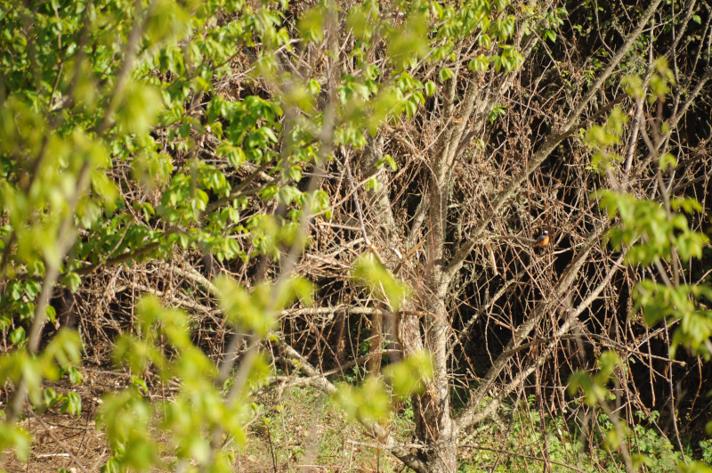
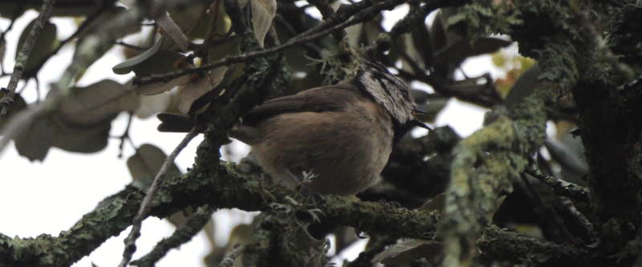

### Spring in Spain

Right. Enough waiting for the UK to warm up. It's off to Spain for some 
festivals and some birds.

This post covers events between April 15th and 25th, inclusive. Most of the 
birding happened in the Sierra de Aracena from the 18th to the 24th, mind...

### First, a trip to Seville

One of our favourite places. To cap it off, it's also Easter, and so there's 
all manner of exciting Catholic events to keep us on our toes. In the sea of 
tapas, cañas and tinto de veranos, we find a little gap to go for a tour of 
the roof of the cathedral.

Now, here's a thing you should know about the cathedral: it's the only 
building pictured in the Collins. And for good reason - it's home to a 
substantial team of Lesser Kestrels (as well as Common Swifts, and even a 
few Parakeets here and there).

<figure class="figure">
  
  <figcaption class="figure-caption text-center">
    The famous Giralda.
  </figcaption>
</figure>

It's worth visiting the wikipedia page for this thing, particularly [the 
Giraldillo](https://en.wikipedia.org/wiki/Giralda#The_Giraldillo) 
(weathervane) on the top - it's a fascinating building.

<figure class="figure">
  
  <figcaption class="figure-caption text-center">
    Sadly, its most famous avian inhabitants are challenging to 
photograph well!
  </figcaption>
</figure>

Yet to manage a visit to Seville and the birds hawking above 
the cathedral doesn't bring a grin to my face. What an excellent place.

We're car free this holiday, so our opportunities to explore other sites 
nearby Seville is limited. Once the festivities of Easter weekend draw to a 
close, we get on a coach to Aracena, for a week of walking in the Sierra there.

### Sierra de Aracena

Our first stay was in [Galaroza](https://goo.gl/maps/Esm2B5CjydT3313T8). Or, 
so we thought - the place we'd booked was shown as in the town when 
we booked it, but on contacting the owners before arrival, it turned out it 
was actually [here](https://goo.gl/maps/cMpgyuFwZT9AytZN8)! Thankfully the 
owners (who were in general, wonderful) were able to come and pick us up; 
we'd have just about managed to lug our kit up the hill, but it was nice not to.

All three of hosts/accommodation/associated dog (enormous!) here was 
excellent. More details [here](https://www.fincalavirinuela.com/).

Consulting [our walk map](https://www.amazon.co.uk/Sierra-Aracena-Tour-Trail-Maps/dp/1782750347),
we discovered we were 
already on at least a couple of the routes. A quick evening sortie on day 
one found us Redstart, Cirl Bunting, Serin and Nuthatch within very short 
order; how very exciting!

<figure class="figure">
  
  <figcaption class="figure-caption text-center">
    Continental Nuthatch has a few subtle plumage differences, but the 
same attitude.
  </figcaption>
</figure>

Our itinerary for the next few days is simple: get up; walk to a place for 
breakfast, walk to a place for lunch (or to a place to eat a sandwich), walk 
to a place for dinner, walk home (optional evening walk).

The terrain is reasonably consistent, lots of hilly Oak woodland - this is 
where the pigs that go into Spain's finest jamon grow up. The woodland 
density is really the only thing that changes; it rarely goes full on forest,
but it varies between the borders of that and a few emptier scrubbier areas.

#### Day one

On day one, we go via route 19 up to Castaño de Robledo, then head to Jabugo,
and then back to Galaroza via sections of route 17. We'd highly recommend a 
visit to Castaño; plenty of activity on the edges of town, a beautiful 
square, with excellent food and drink. Would struggle to 
recommend more than a drive by visit to Jabugo. Galaroza is lovely.

Bird wise, it quickly becomes clear that this is going to be another Chaffinch 
heavy trip; via the medium of [birdnet](https://birdnet.cornell.edu/) we realise just how varied 
their calls can be!

#### Day two

Route 20 to Fuenteheridos, followed by route 22 to Cortelazor, and then a 
bit of improvisation taking us back to Galaroza via Navahermosa. An 
excellent walk. An epic sandwich in Cortelazor.

<figure class="figure">
  
  <figcaption class="figure-caption text-center">
    A typical route shot; the paths were mostly dirt or cobbled roads - 
very easy going.
  </figcaption>
</figure>

Better birding - the sun came out and things were less shy.

<figure class="figure">
  
  <figcaption class="figure-caption text-center">
    Spanish Festoon butterfly (what a great name!)
  </figcaption>
</figure>

We saw Redstarts across the day and struggled to get good shots of them. As 
we climbed over a lump from Navahermosa to Galaroza though, one put on a 
show for us...

<figure class="figure">
  
  <figcaption class="figure-caption text-center">
    Redstart in context
  </figcaption>
</figure>

<figure class="figure">
  
  <figcaption class="figure-caption text-center">
    All the Redstarts knew we were there, and gave us a good stare.
  </figcaption>
</figure>

<figure class="figure">
  
  <figcaption class="figure-caption text-center">
    This one liked the attention though.
  </figcaption>
</figure>

<figure class="figure">
  
  <figcaption class="figure-caption text-center">
    Typical Redstart tail wiggle - this movement is often the first 
hint your eye gets of them.
  </figcaption>
</figure>

#### Day three

Changeover day: our hosts in Alájar pick up our luggage, we walk to Alájar 
via routes 21, 16, and a little short cut via the mirador took us into the town.

We got our first look at a Lesser-spotted Woodpecker (a much commoner bird 
here than in the UK) on the way over.

<figure class="figure">
  
  <figcaption class="figure-caption text-center">
    It's not an easy bird to find...
  </figcaption>
</figure>

<figure class="figure">
  
  <figcaption class="figure-caption text-center">
    This one sat still for just long enough.
  </figcaption>
</figure>

We also came across a co-operative Serin on the way over.

<figure class="figure">
  
  <figcaption class="figure-caption text-center">
    Many vague electronic squeaks were Serins.
  </figcaption>
</figure>

#### Day four

Our new hosts at [Posada San Marcos](https://sanmarcosalajar.com/) are also 
excellent, and their knowledge of the locality is excellent. They are mildly 
judgemental of our map, and their advice in addition to its routes on where 
to go was excellent.

Our first day is a bit of a washout though: it starts raining overnight and 
just won't stop. Water pours off the nearby hills into town; this is, 
according to Ángel, pretty standard. We have a read of a few of the books in 
the library, and then, spotting a gap in the weather, decide to have a walk 
to Los Madroñeros early afternoon.

This starts off well - the weather seems to have grounded a number of Spotted 
Flycatchers; we see five or six in the next hour and none for the rest of 
the trip. Shortly after reaching Los Madroñeros, though, the sky opens again,
and we realise we have made a grave error in venturing outside at all. This 
is one of those times where the distance between waterproof and 
water-resistant really comes to the fore, and it turns out our coats and bags 
are the former, but our shoes are the latter. Thankfully our bins and 
cameras survive the damp without incident; it's a bit of a battle to get 
things dry enough for day five though!

#### Day five

Alajar -> Linares -> Aracena and back, via Los Madroñeros.

Weather still recovering for yesterday's rain.

<figure class="figure">
  
  <figcaption class="figure-caption text-center">
    This Crested Tit would have looked better in the sun.
  </figcaption>
</figure>

The sun did eventually make it out, and warmed up things up enough that we 
found this mysterious tangle of snake-eating-lizard:

<figure class="figure">
  
  <figcaption class="figure-caption text-center">
    Not an ouroboros experiment.
  </figcaption>
</figure>

We had big plans to visit the caves in Aracena, but it involves queueing, 
booking and generally far higher levels of organisation than AB1 can stomach 
right now, so what actually happens in Aracena is we mooch about for a bit, 
get rained on a bit more, enjoy a pleasant lunch and marvel at how much more 
touristy Aracena is than places a few minutes drive away are.

On the way back the weather is all over the shop, but thankfully the rain 
remains quite light. A nightingale or two turn up to serenade us, but don't 
show well enough for a photo.

<figure class="figure">
  
  <figcaption class="figure-caption text-center">
    This White Stork, on the other hand, was easier to capture.
  </figcaption>
</figure>

Coming back into Linares, we also manage to get a lens or two on one of the 
several Firecrests that we've seen.

<figure class="figure">
  
  <figcaption class="figure-caption text-center">
    That supercilium doesn't half make them look cross
  </figcaption>
</figure>

There's no trace of the lizard/snake confusion as we march back to Alajar. 
Just before we get there, our ears tell us something new is about, and while 
we can't find it, Birdnet is super confident it's a Rock Bunting. 

#### Day six

Our last day. Sniff. We head out on a host recommended walk to a nearby 
waterfall, with an intention to return via our favourite square in Castaño 
de Robledo.

The walk West out of Alajar is mostly dominated by very excitable dogs. This 
gets tedious after dog three or four, and we stop counting at fifteen. We 
guess that having a guard-like dog when you're in the sticks is a reasonably 
common security method. Or perhaps folks around here just like dogs.

We don't see a lot of birds - our constant friend the Common Redstart pops 
up now and again though, and that does us very nicely.

We eventually reach the reason for this walk - [Los Chorros de Joyarancón o 
Cascada de Jollarancos](https://goo.gl/maps/amaHq7FE1P4FnxAG9) - there's an 
excellent waterfall and a pleasant, climbing _Sendero_ up to a place to view 
it. Along the way we're accompanied by scurrilous Sardinian Warblers. They 
are reasonably co-operative until a camera points at them, at which point 
they disappear without trace.

<figure class="figure">
  
  <figcaption class="figure-caption text-center">
    Excellent waterfall with nice Grey Wagtail accessory.
  </figcaption>
</figure>

The waterfall is worth the walk - it's only a shame that having got to the 
viewpoint, the path stops - we have to retrace our steps down the hill a bit 
before taking a left turn towards Castaño again.

The walk up the hill is nicely taxing - further _sylvia_s sing us up it in 
no time though. As the path switches from sparse shrubby trees into conifers,
we pick up a Firecrest or two - they're far less shy than in the UK here!

It's when we get near Castaño that we hit the jackpot though.

<figure class="figure">
  
  <figcaption class="figure-caption text-center">
    We didn't spot this Lesser-spotted until we were basically on top 
of it.
  </figcaption>
</figure>

<figure class="figure">
  
  <figcaption class="figure-caption text-center">
    This Nightingale blasted its song out from a tree as we crossed the 
river on the way into Castaño.
  </figcaption>
</figure>

We stopped for an extended lunch in Castaño; which was a popular choice - 
the square was packed! Somewhat later, and at a lower pace, we ambled back 
to Alajar. Few birds were seen - definitely into bird siesta hours for the 
duration.

#### Day seven

Back to Seville, to go home. We have time for a quick trip to look at the 
Kestrels again, but then it's time to head to the airport. What an excellent 
trip.