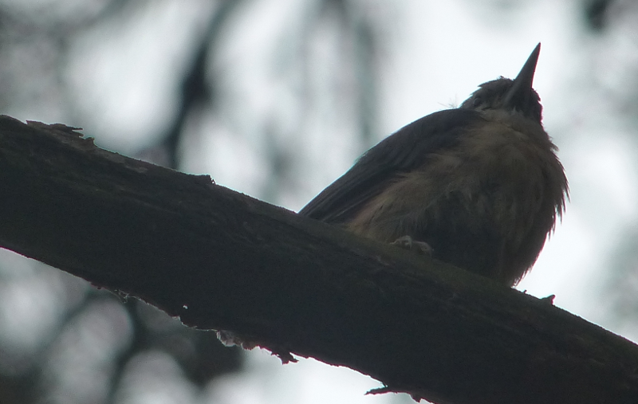

### A Surrey Circuit

COVID-19 lockdown has eased slightly. We've booked a car for two days and
on the second day (a.k.a Tuesday), we venture out into Surrey to see what we can
find.

Pronoun guidance: AB2 penned this entry, covering the events of June 30th, 2020.

#### Plan

The forecast looks mixed, but promises to brighten in the afternoon and, frankly, 
we're excited for a trip out in rain or shine. AB1 has a series of
locations in mind in Surrey, which, if the recce proves a success, could
become a circuit (is it actually a circuit? --Ed) to share with friends and
fellow birders in future seasons.

#### Destination 1: [Papercourt Meadow](https://www.surreywildlifetrust.org/nature-reserves/papercourt-meadows)

After a smooth run from North London to [Sam's Newark Lane Car Park](https://goo.gl/maps/Pn8kCqSaJaRD25VEA),
 albeit with a somewhat bumpy entry to the car park itself, we don macs and
backpacks and set off along the River Wey. We immediately meet a pair of
Egyptian Geese and are charmed by the idyllic outlook of the canal
punctuated by narrowboats going about their business.
 
<figure class="figure">
  
  <figcaption class="figure-caption text-center">
    This Sedge Warbler looks about as impressed with the rain as AB1 did.
  </figcaption>
</figure>
 
As the drizzle makes a more concerted effort at coming down, we spy a Sedge
Warbler and then, closer to the lock, a swoop of Swallows doing exactly that,
diving between the trees to catch insects before taking time to perch on a
leafless tree, giving us an excellent view of what looks like at least two
 generations of birds.

<figure class="figure">
  
  <figcaption class="figure-caption text-center">
    They were still having a great time; there was _plenty_ to eat.
  </figcaption>
</figure>

We also spot a Wren, and a Mistle Thrust family in the scrub beyond divert
our attention and result in a temporary confusion about which direction to
head. Following consultation of the map, we decide we need to cross the river
and a short trundle later we are into the meadow.

<figure class="figure">
  
  <figcaption class="figure-caption text-center">
    We love a good panel.
  </figcaption>
</figure>

Before long, it becomes difficult to ignore damp feet (buy better shoes! --Ed)
and there's a rising feeling that this stop, while picturesque, might be a
bit of a damp squib after all. However, our spirits are very quickly lifted
by sightings of Dunnock and Blackbird, even through optics rendered opaque by
condensation.

<figure class="figure">
  
  <figcaption class="figure-caption text-center">
    A beady-eyed Dunnock.
  </figcaption>
</figure>

Happily, the rain eases off and there's a humidity in the air that encourages
the insects back into flight and the birds follow suit shortly after. There
are Whitethroat, Reed Bunting and Reed Warbler, darting between trees and
chirruping in the reeds.

<figure class="figure">
  
  <figcaption class="figure-caption text-center">
    Looking back towards the stile. We were surrounded by Stonechat and Whitethroat here.
  </figcaption>
</figure>

We hop over a stile, the area beyond it yields Stonechats and more Whitethroats.
It quickly becomes impossible to move for birds: Song Thrush, Reed Bunting,
Dunnock, Sedge Warbler again and then family trios of Stonechat mixed in
with yet more Whitethroats.

With the rain now banished, we spend quite some time picking our way through
the meadow, having a good look at all the birds we spy through the
binoculars and taking photos of many of them, with varying degrees of success.

<figure class="figure">
  
  <figcaption class="figure-caption text-center">
    Stonechat and Whitethroat.
  </figcaption>
</figure>
  
Truly, we could spend all day looking at and photographing every one multiple
times, but there are other stops on the schedule and so we will ourselves on.
We double back over the canal and follow the lane back to the car park, before 
setting off for Frensham Little Pond, spurred on by plans for lunch
 in the Tern Cafe, which the internet reports has reopened with reduced hours.
 
<figure class="figure">
  
  <figcaption class="figure-caption text-center">
    Reed Bunting.
  </figcaption>
</figure>

#### Destination 2: [Frensham Little Pond](https://www.nationaltrust.org.uk/frensham-little-pond)

Arrival at the Tern Cafe proves internet reports are not always right; the
cafe is very much closed. Following a return trip to the car to retrieve the
sandwiches packed for supper, we set up on a bench next to the water and
enjoy Common Terns and Black-Headed Gulls carving about overhead. After
replenishing the reserves, we set off in search of our target species for
this location: Spotted Flycatcher. We decide to circle the pond in a
clockwise direction. First we spy spotted youths lurking on the other
side of the closed cafe, then we get spotted on by rain, before
finally being greeted by spotty dogs. But no Spotted Flycatcher.

<figure class="figure">
  
  <figcaption class="figure-caption text-center">
    It really felt like there ought to be one here.
  </figcaption>
</figure>

We catch glimpses of juvenile Nuthatch, and a tit flock passes overhead with a
flurry as we near the finish. It has been a pleasant walk, but not abundant
in the bird department. 

<figure class="figure">
  
  <figcaption class="figure-caption text-center">
    Ok, a silhouette of a juvenile Nuthatch.
  </figcaption>
</figure>

On the approach to the car park, we see a flit of
something flycatcher-shaped, but it's gone as we've seen it. We split up to see
if one of us can catch sight of it but reunite unvictoriously; AB1's
vision blighted by rain-splashed spectacles. Time to move on to our third
and final destination for the day.

#### Destination 3: [Thursley Common](https://www.gov.uk/government/publications/surreys-national-nature-reserves/surreys-national-nature-reserves)

We plan a diversion via M&S food to stock up on car snacks; this proves to be
a successful stop. We're aware that there was a large fire on the common
that started on 31 May and raged for four days, so we arrive with some
trepidation about how ravaged the place will be.

<figure class="figure">
  
  <figcaption class="figure-caption text-center">
    Another good panel.
  </figcaption>
</figure>

AB1 note: Incidentally, I think the map on that panel isn't on a website. The
only place I've found it is in the [Natural England PDF](http://publications.naturalengland.org.uk/file/4906826886807552).
Given the lack of detail on the OS maps of the same area, I'd strongly
recommend having a photo of it with you.

AB1 heads out to orientate himself and spots lots of Swallows disobeying
social distancing requirements. AB2 is collected from the car and we head
out to see which daytime species we can spot before returning to the car
for a picnic and heading out again to try for some dusk/night species. We're
hoping for Dartford Warbler, Common Redstart and Nightjar. Recalling a
previous trip to Richmond Park with promises of Dartford Warbler, AB2 is
dubious about their existence...

On entry to the reserve, it's clear the damage is extensive. It seems
little of the boardwalk remains or at least precious little to make it
possible to follow it anywhere; big angry signs warn us not to even think of
trying it, and we obey. The Dragonfly sculpture can easily be
picked out in the distance, with no heath or trees between us and it. 

<figure class="figure">
  <video controls width="800">
    <source src="shrike-hill-view.mp4" type="video/mp4">    
    Sorry, your browser doesn't support embedded videos.
  </video>
  <figcaption class="figure-caption text-center">
    View North from Shrike Hill. Much of the reserve survived, but also
    quite a lot of it did not. Eesh.
  </figcaption>
</figure>
   
We survey the scorching from Shrike Hill and hear the unmistakable churring
of a Nightjar; this prompts a degree of consternation on its behalf. Who
dares disturb it at such an early hour?

This first lap of the reserve produces conspicuous-looking and sounding
Stonechat. The first time this happens the Stonechat is accompanied by a
Dartford Warbler friend - reader, they exist! We're delighted the Stonechat's
chirping alerted us to the presence of its Dartford Warbler friend. 

<figure class="figure">
  
  <figcaption class="figure-caption text-center">
    The first Dartford was at the bottom of the bush this Stonechat was
    in.
  </figcaption>
</figure>

<blockquote class="blockquote text-center">
Stop taking photos of that Stonechat and look at the Dartford at the bottom!
<footer class="blockquote-footer"><cite>AB1, with some urgency</cite></footer>
</blockquote>

This happens on two more occasions as we work our way round the reserve, we
cannot believe our luck (not luck, [science!](https://www.researchgate.net/publication/261824967_Dartford_Warblers_Follow_Stonechats_While_Foraging) --Ed). 
We are less lucky when it comes to Redstart and don't see any in the places
we'd hoped to see them. AB1 blames the lack of sunshine.

The common is quiet, but not empty and we meet (at a distance) some cyclists,
runners and dog walkers on our circuit round the reserve. We take a wrong
turn somewhere and end up going a little further than planned and although
the second part of the route is somewhat devoid of birds, we wend our way
back to the car via the non-socially distant Swallows, before settling
down for a bite to eat.

AB1 has had success seeing Nightjar on Thursley Common before and so has a
plan up his sleeve about where to see one. We get to the appointed spot a
little earlier than planned and spend a little time checking out branches
that look to be at an appropriate angle to house a Nightjar. Nothing.
   
We decide to trot back to another area of trees with the hope of catching sight
of a Nightjar waking up and to warm ourselves up. We get a glimpse of female
 Redstart and another Dartford Warbler silently hopping from perch to perch
 , before deciding to head back to our Nightjar lookout point.
  
We're there for about 9pm and, as far as the eye can see, seem to be the only
 people on the Common. And then we wait. Not a lot happens.

Then suddenly, churring! The noise is coming from a tree we specifically
surveyed earlier on - how could we have missed it? It felt like we had
covered every inch of the tree with our binoculars when we looked earlier on.

    <iframe src='https://www.xeno-canto.org/578992/embed' scrolling='no' 
frameborder='0' width='340' height='220'></iframe>

Our first xeno-canto contribution, right there.

AB1 refers to xeno-canto and we deduce the unearthly sound was the flight call.
The light is fading now, of course, but we can still see the Nightjar flying
about the tree in loops, returning to a couple of visible perch points. Wow.

And then, wing slapping! Unreal. And then, it flies straight for us! It
feels as if the bird could have brushed us on the head with its wings. Whoa
. Then there are two of them, calling to each other. A pair, surely?

Another noise: “there”, says AB2, pointing to the sky, and we follow a pair
of birds with our binoculars. “Woodcock”, declares AB1. "Didn't know they
made that noise, huh". A life-tick, it turned out.

One of the Nightjar is back on one of the trees we originally found it on and
it is churring again. AB2 attempts a video and the Nightjar does another fly-by,
briefly obscured by the back of AB1's head. It's exhilarating how close the
Nightjar gets. Two more Woodcock fly over, victoriously. 

<figure class="figure">
  <video controls width="800">
    <source src="brief-nightjar-encounter.mp4" type="video/mp4">    
    Sorry, your browser doesn't support embedded videos.
  </video>
  <figcaption class="figure-caption text-center">
    It turns out that phone cameras take bad video of fast moving objects in
     the dark. How could we have known?
  </figcaption>
</figure>

With the light continuing to fade and replete with sightings, we decide to call
it a day and pick our way back to the car. What an experience - 10/10 day.