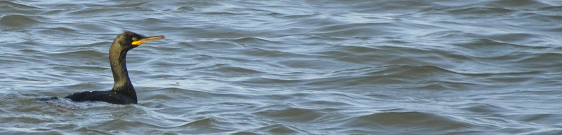
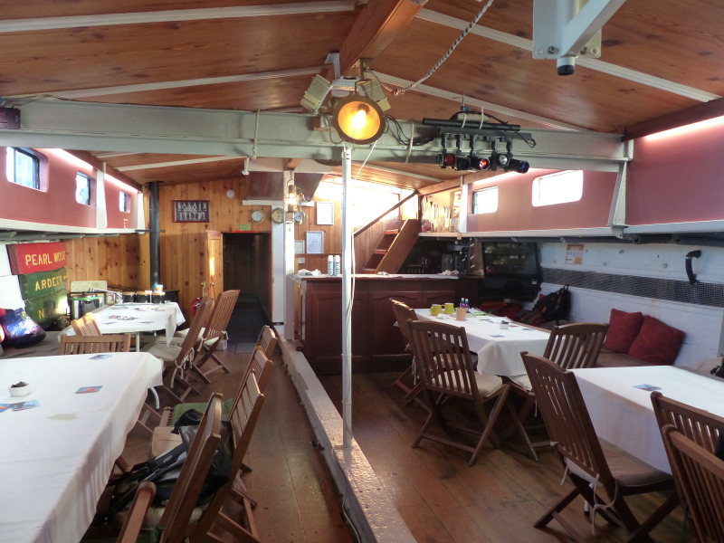
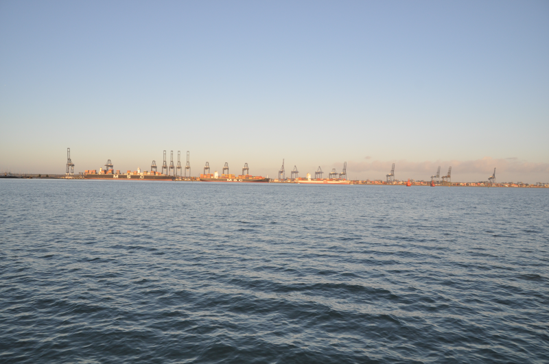

### The Eastest Of Essex

It is January 2020, and buying physical gifts for people is rubbish. So let's
take Mum & Chris on a tour around the Eastest of Essex.

Pronoun guidance: AB1's Mum.

#### Research

Proving that, occasionally, advertising is worth something, we spy a 
birding boat trip around the River Stour that happens to sail near Mum's 
birthday. This ties in nicely with our general plan to visit more of the 
coast to see which bits we like.

The ship sails from Harwich on the Sunday. This is inaccessible enough that we 
should make a weekend of it; heck, let's take a Friday off while we're at it.

Where else to go though? Well, on the way, we could perhaps visit Abberton 
Reservoir, the RSPB's Old Hall Marshes, or maybe Essex Wildlife Trust's 
Fingringhoe Wick. All three seem good options; time probably allows for only 
one of them to happen. We eventually plump for Abberton; it probably requires
the least walking (there's some definite birding from car available),
it has easy access to what looks like a reasonable pub, and there are several
reports from BirdGuides of things that might help Mum's year list off to a 
decent start.

On the Saturday, we'll go for a walk around the Stour Estuary RSPB reserve 
and then troll around Harwich's Maritime History trail. And then the Sunday 
will be the boat.

#### Friday

We make a reasonably speedy exit from London and make it to Abberton for just
after 12. After an unbelievable amount of faffing with layers and toilets, we 
head out into the freezing early afternoon.

Did I mention how cold it was? We're scuttling along at an unusually high 
pace as a result, in hope that the hides will spare us a bit of warmth.

We reach the first hide and are greeted with a vista of a million 
Great-crested Grebes. Or perhaps a fraction less than that. There are a lot 
of them, anyway. There are also tonnes of Wigeon and Teal, and, here and 
there, tens of Goosander. Already a good start.

<figure class="figure">
  
  <figcaption class="figure-caption text-center">
    Millions of them
  </figcaption>
</figure>

These are all good, but not particularly exciting - all four are found on 
Mum's home patch. What we would very much like to find are the Smew, 
Black-throated Diver and Long-tailed Ducks that have been reported on 
BirdGuides.

We don't have to wait long for the Diver - it surfaces maybe fifteen metres 
from the shoreline of the reservoir to our left. Once again I am struck by 
how swiftly these things shift; within two or three dives it is around the 
corner from us, and with one or two more it goes totally out of sight. 
Definitely Black-throated; that fifty/fifty black white split of neck/head, 
monochrome, no beak of death (so not Great Northern), not prissy enough to be 
Red-throated.

We give the Goosander groups a more serious look, as previous experience has 
taught us that occasionally, a Smew will hang around with them. There's one 
group up towards the Wigborough Road crossing/dam, and...

...hold on. What the hell is that thing swooping around the dam? That looks 
like a hirundine of some sort. I mean, let's be honest, it looks like a Swallow.
But it's January. What the hell is it doing here in January? It's so far away
 that even the scope has doubts about what particular hirundine it is, but 
 Swallow is what we settle on.

We head back outside. The second hide (proceeding anti-clockwise; the 
positive direction) yields two taciturn locals, who, after 
severe prodding, eventually give up that they might be on a Peregrine Falcon 
on the far side of the reservoir. They might be, but we don't get on it; 
their directions are about as helpful as they are forthcoming.

We spend a while glowering at huge chunks of reservoir and shoreline in 
search of Peregrine, Smew, or Long-tailed Duck and find nothing but Coot. 
Either perseverance or sheer hopelessness melts the frozen hearts of the 
local pair, and quietly, one admits "might have a pair of Long-tailed Duck".

This time the directions are better; look at that man-made bit with the 
building on the end that juts out into the reservoir. Now come back towards 
us. There.

Even then, this is not easy work; this is close to the limit of pur little 
travelscope, and the waves whipped up by the freezing cold wind outside hide 
both birds for significant periods. I wrangle the scope for a moment or 
two, and, after a few false positives, I pick up a pair of birds that are 
definitively Long-tailed Ducks - even at this range.

They are _utterly invisible_ with binoculars, however. And Mum has not had 
quite the level of scope practice we have had. I explain the concept of 
"decide you will see the bird, and then you will" and after we rebuff an 
attempt to give up and go back, she eventually gets on them. AB2 quickly 
follows suit, and the average level of victoriousness in the hide goes through 
the roof. The locals, unable to cope with this, go through the door; we thank
 them for their assistance.
 
It's not long before we realise just how close to lunchtime our birding has 
got us. We beat a swift retreat back to the car via the visitor centre, and 
head to [The Hare and Hound](https://www.thehareandhound.co.uk/) in Layer 
Breton for sustainance. I am delighted to find they have Crouch Vale's 
"Brewers Gold" (no, I have no idea where the apostrophe went; the [brewery 
webpage](http://www.crouchvale.co.uk/?page_id=24) doesn't either) on tap; 
this continues to be a universal sign of decent pub.

We leave the pub satisfied, but there's still some birding to do. We can have
a look at a bit more of the reservoir from the Layer Breton causeway. This 
yields only geese, and the wind quickly encourages us to move on.

Our penultimate stop is South of the Wigborough Road causeway. Lots of bird 
websites refer to this particular bit of the reservoir as "Billet's Farm 
Screen", without any reference to how to get there. Once you're in the area, 
there are potentially helpful signs, but to remove all possible doubt, park
[here](https://www.google.co.uk/maps/place/51%C2%B048'54.6%22N+0%C2%B050'54.7%22E), 
and from there, there's an obvious path to a screen that looks out over one 
of the reservoir's lobes.

A horde of gulls are angry that we have worked this out, and rise up in the 
air in protest.

<figure class="figure">
  
  <figcaption class="figure-caption text-center">
    Won't you pay my telephone gulls?
  </figcaption>
</figure>

We reach the screen unscathed by gulls and are treated to the first bit of 
sunshine of the day. The warmth is almost tangible. Almost. From the screen -
more wildfowl; huge rafts of Teal and Wigeon whistling, peeping and 
squeaking. They might not be uncommon but the sound of a huge flock of them 
is undeniably cheerful.

To the right; a sizable fleet of Goosander. Perhaps our Smew is amongst them?
Yes indeed! In the sunlight, too, and without the tedious frequency of 
diving that would make it difficult to get everyone on to it. Which is a 
relief, because despite the sunshine, we're all keen to get back to the 
car.

Only a brief sojourn at the Wigborough Road causeway to take a closer look 
at the suspected Swallow remains. We transform it into a confirmed but still 
really bloody odd Swallow and grab some terrible Goosander photos before 
rushing back to the warmth of the car and setting out for Harwich.

<figure class="figure">
  
  <figcaption class="figure-caption text-center">
    This one is the least bad. It was cold, OK?
  </figcaption>
</figure>

#### Saturday

We make it to the RSPB's [Stour Estuary](https://www.rspb.org.uk/reserves-and-events/reserves-a-z/stour-estuary/) reserve
for around half past ten; not a bad start for this group. Further progress 
temporarily flounders on exiting our vehicle, when we are assailed by 
busybodies. Allegedly, Grayson Perry's [house for Essex](https://www.living-architecture.co.uk/the-houses/a-house-for-essex/)
is visible from one route and other routes are very muddy. From what we can 
work out, however, for our schedule and level of enthusiasm, there's 
only one viable circular route, making this unbidden information of 
little use to us and, despite the clear confusion this 
causes our new car park companions, we head off in the direction 
we've explicitly been advised against.

Despite the name, most of this reserve is woodland rather than estuary. There
are two hides overlooking the estuary, but they're too far for us to 
walk today. There is a screen at the Copperas Bay viewing point that _is_ on 
our route and what a view it has! Loads and loads of waders; 
Black-tailed Godwits, Beefcake Plover, Dunlin, and after a bit of squinting 
through the scope, a few Knot as well. All welcome year ticks for Mum.

We don't tarry long though - it's not warm enough to stay still in the shade.
A slightly more open area alongside the water yields a pair of Buzzards, 
floating above the woodland inland. We walk past a collection of dwellings 
that look delightful, but that also yell "Flood risk" in my subconscious. 
Eventually the path turns left, and, as we cross the railway line, we finally
catch sight of a house for Essex, and make appropriate jokes (it doesn't 
look big enough to house all of Essex, etc).

We head back to Dovercourt for a lunch of baked goods, before heading into 
Harwich proper to walk our way around the [Maritime Trail](https://www.harwich-society.co.uk/harwich-maritime-trail-map/)
. If you've got a couple of hours to spend in the town, we would recommend 
this, not least because it will give you the opportunity to scout which pubs 
to visit later. We discovered the [Hanover Inn](https://www.hanoverinn.co.uk/)
was serving Colchester Brewery's [Brazilian Coffee Porter](https://www.colchesterbrewery.com/beer/brazilian)
- an opportunity not to be passed up.

We can also recommend Harwich Town as an excellent place if you like big 
boats. As we were finishing the maritime trail, a giant container ship was 
docking across the water at Felixstowe with the assistance of a couple of 
tugs - a spectacle worth watching.

#### Sunday

We turn up for the boat trip obscenely early; a poor plan, because this means
we end up hanging around on or near the boat freezing our arses off. At 
least if the boat was moving there would be distractions.

Yes, of course, despite everyone layering like nobody's business, it's a 
clear day, and that means it is absolutely arctic. The only people on the 
boat not constantly shivering are the professionals. They kindly only mention
that today's weather is better than average two or three times.

<figure class="figure">
  
  <figcaption class="figure-caption text-center">
    Off we go
  </figcaption>
</figure>
 
We finally set off. The format is as follows: we boat 'up' the estuary as far
as Mistley, and then all the way back again. A hot lunch is served in 
the galley (bit of ship talk for you there) around 1pm. Most of the time, 
there's one pro-birder calling out what's happening, and he has an assistant
with a scope scanning the water and generally working out what's of interest 
that's just out of eyeshot.

To start with, things are quiet; our host tells us instead about some of his 
extensive experience in conservation in the local area in the gaps, which is 
_fascinating_. After a while, some birds start to turn up. We bump into good 
numbers of ducks in Erwarton Bay; lots of Wigeon and Teal, and a sprinkling 
of Red-breasted Merganser; these continue to pop-up across the trip; great!

As we continue, the banks of the river get muddier, and we switch from ducks 
to waders, picking up Bar-tailed Godwit to add to yesterday's Black-tailed, 
plus more Knot, Dunlin, Redshank and Curlews.

Further up the river starts to widen again, and there's exciting news of 
Slavonian Grebe from the shore - probably from quite near where we were 
yesterday, in fact. Try as we might though, we can't find them; the best we 
get from our increased vigilance is an unexpected Shag.

<figure class="figure">
  
  <figcaption class="figure-caption text-center">
    Unexpected (but not unwelcome)
  </figcaption>
</figure>

<figure class="figure">
  
  <figcaption class="figure-caption text-center">
    Good for eating _and_ sheltering from the cold
  </figcaption>
</figure>

We disappear below decks to warm up with some lunch - sausage and mash; very 
nice. We reappear and spend some more time looking for Slavonian Grebe. 
Despite continuing reports of sightings from the South shore, we find nothing
. Eventually we begin to approach Mistley, and, excitement, as the channel 
starts to slim a group of Scaup are found floating off the starboard bow 
(that's the front, right? --Ed).

The closer we get to Mistley, the better things get - really good views of 
big groups of waders - lots of Avocet and Black-tailed Godwit in particular.

<figure class="figure">
  
  <figcaption class="figure-caption text-center">
    All of them got rather spooked by the boat, but the views were still good
  </figcaption>
</figure>

We're informed that the Co-op car-park in Manningtree has frequently been 
_the_ place for rarities along this bit of the coast. Filed for future 
reference!

The time comes to turn the boat around and head home. The search for 
Slavonian begins again in earnest - the shared boat scope is put to the test 
for extended periods, but still, no dice.

A quick trip belowdecks for further coffee (the warmest thing for a mile in 
any direction) and some more gawping at the House for Essex occupy provide 
some brief distractions from the cold.

<figure class="figure">
  
  <figcaption class="figure-caption text-center">
    Still doesn't seem big enough   
  </figcaption>
</figure>

As we start to approach Harwich and the end of our journey, we're treated to 
some flocks of Brent Geese flying across the water, and some more enormous 
boats on the Felixstowe side of the estuary.

<figure class="figure">
  
  <figcaption class="figure-caption text-center">
    Who doesn't like these?
  </figcaption>
</figure>

It's been a great trip - despite the cold, the novelty didn't wear off at any
point. A solid recommend for this if you happen to find yourself near Harwich
 in the Winter months. 

