### Two Essex Islands

We're off to Essex, the sun's out, and for once, high tide's at a useful hour. 
Let's go and look at an island or two.

This post covers the events of 4th-5th September, 2021.

#### Wallasea Island

We've got an hour spare after a toddle around Leigh-on-Sea before sunset, so
we head to Wallasea Island in the hope of catching up with some Spoonbills
someone had clocked and called in earlier.

This is the first time we've driven this way from the Southend area; it's
interesting to see how urban gives way to suburban, then to villages and
 hamlets, punctuated by increasingly featureless countryside. The
transformation from city to country isn't exactly continuous, but if you
drew a line of best-fit through all the points we measured it'd be quite
close to straight.

We reach Wallasea and, for once, are not immediately freezing cold or too
hot, as experienced on previous visits. The car park Corn Bunting spotted on
earlier trips is sadly not present to greet us, though. We decide that our
best bet, given limited time, is to head out to the school house viewpoint 
- apparently the Spoonbill have been seen in the marsh near there.

<figure class="figure">
  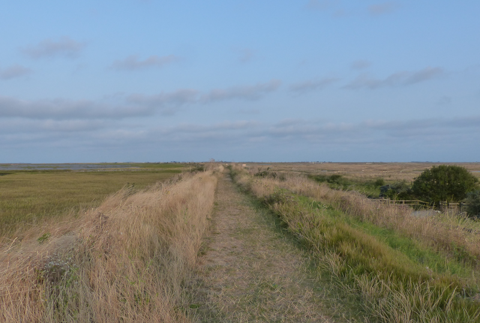
  <figcaption class="figure-caption text-center">
    The path along the sea wall.
  </figcaption>
</figure>

We've never had great luck on this reserve - it's a vast place, and there are
innumerable places for things to hide - and it feels like today might be
another day where we don't turn up much for the books. We do pick up a few
waders (mostly Redshank and Avocet) and lots of nicely-lit Shelduck. Yellow
Wagtail makes a predictable appearance also - it feels like we have a
constant airborne escort of five or six birds.

<figure class="figure">
  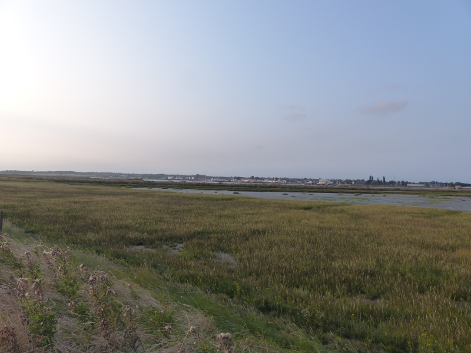
  <figcaption class="figure-caption text-center">
    The view towards Burnham from the sea wall.
  </figcaption>
</figure>

<figure class="figure">
  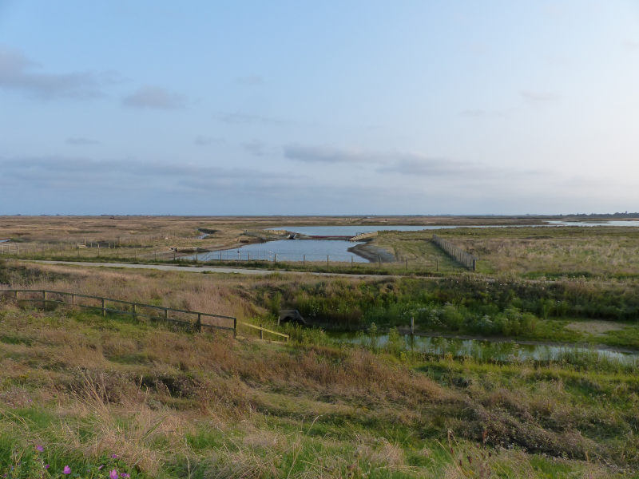
  <figcaption class="figure-caption text-center">
    The reverse view, looking into the reserve.
  </figcaption>
</figure>

We don't make it as far as the viewpoint - it's further than we think, and we
don't fancy getting locked in the car park - so we retrace our steps back to
the car. It's a good job we saw all those Spoonbills at Frampton!

<figure class="figure">
  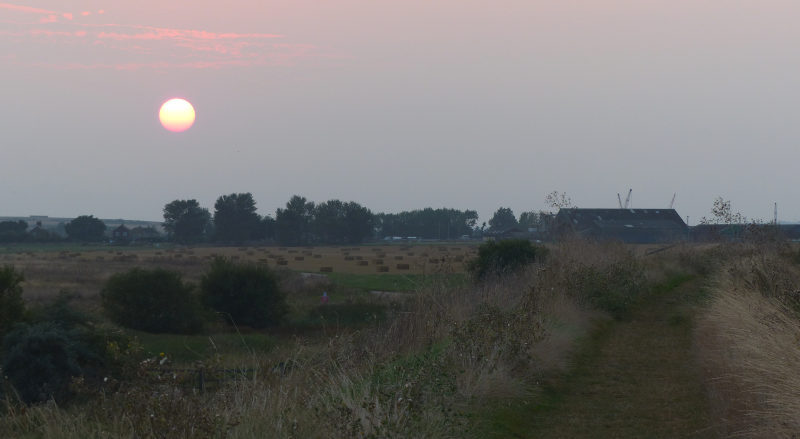
  <figcaption class="figure-caption text-center">
    The place is fabulously scenic, even if it can be hard to bird.
  </figcaption>
</figure>

#### Two Tree Island

Former landfill site, model aircraft flying zone and locale of recent flasher
reports, Two Tree Island juts out into the Thames Estuary where Leigh-on-Sea
comes to a conclusion.

The Western end is what we're here to visit - increasing numbers of 
Black-tailed Godwit have been reported and sometimes we're suckers for
quantity-over-quality birding. The sheer number of birds might manage to
keep two nieces, recently returned to the UK from half a decade of life
 overseas, interested as well.

We save some smaller legs the walk and park up in the free car park. A speedy
march to the end installs us in the excellent hide. There are, indeed, a
great many Godwits visible here.

<figure class="figure">
  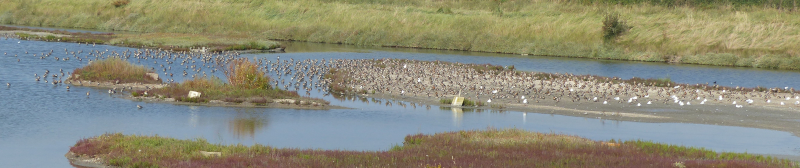
  <figcaption class="figure-caption text-center">
    Lots of Black-tailed Godwits.
  </figcaption>
</figure>

<figure class="figure">
  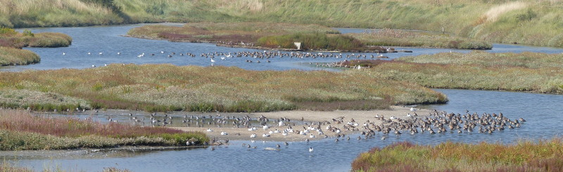
  <figcaption class="figure-caption text-center">
    Lots more Black-tailed Godwits.
  </figcaption>
</figure>

<figure class="figure">
  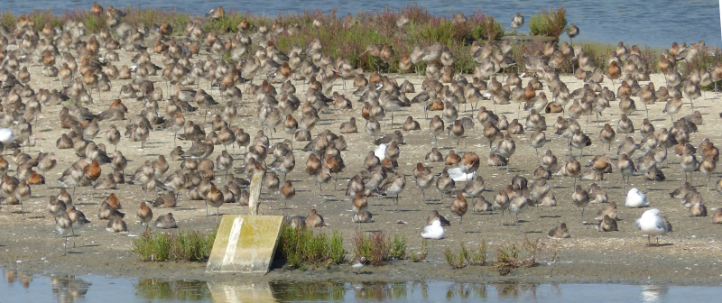
  <figcaption class="figure-caption text-center">
    Sleeping, mostly.
  </figcaption>
</figure>

There are a few other birds mixed in - some Avocets, most noticeably, along
with several Redshank, a few Dunlin, and, after a more careful look, one or
two Ringed Plover. The edges of the islets at the back look like they could
be hiding a Greenshank or two as well.
 
We pass our binoculars around so everyone can have a look - this proves
surprisingly popular; we don't get one pair back till we return to the car!
 
One bird though sticks out like a sore thumb - a mostly summer-plumaged Grey
Plover, sitting on an island looking rather lonely.
 
<figure class="figure">
  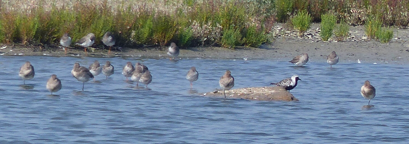
  <figcaption class="figure-caption text-center">
    They do look great in their summer kit.
  </figcaption>
</figure>

The scene is wonderfully calm - the vast majority of the birds are sleeping.
That is, until a family of paddleboarders decides to climb the bank on the
left-hand side of the enclosed area for a family photo, putting up basically
 every bird we can see. Unlike the birds, the boarders appear oblivious.

<figure class="figure">
  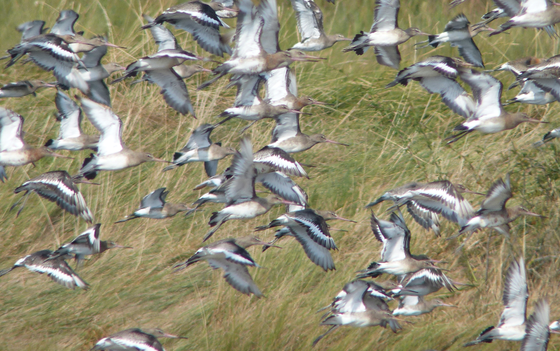
  <figcaption class="figure-caption text-center">
    Panic!
  </figcaption>
</figure>

<figure class="figure">
  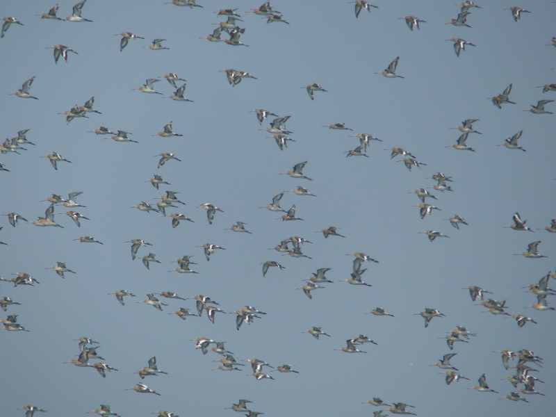
  <figcaption class="figure-caption text-center">
    Everybody up.
  </figcaption>
</figure>

The humans sit down on the bank, and the birds slowly return to their places.
The humans appear to ring someone - are they in distress, or are they
facetiming a friend? Not clear. After a while they decide their best
course of action is to return from whence they came. They manage to do this with
roughly the same aplomb with which they arrived, which, unsurprisingly, puts
everything up in the air again. Sigh.

Noticeably absent once things calm down again is the Grey Plover. We guess it's
up in the sky with several hundred of the birds that seem to have decided
that in flight is where they'd like to be for a while. A little bunch of
Dunlin and Ringed Plover put on a bit of a show on one of the nearer
islands and it feels like we should also be on our way.

<figure class="figure">
  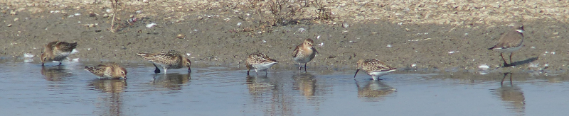
  <figcaption class="figure-caption text-center">
    The Ringed Plover is too cool to hang with these Dunlin.
  </figcaption>
</figure>

The walk back to the car is unexpectedly eventful - a possible Grasshopper
Warbler is spotted booking it into some appropriate-looking greenery.
Blackberries are picked and eaten. Then, most excitingly, on reaching the large
car park at the end of the island, we discover there are around 1,000
Curlew flying over the salt-marshy area that clings to the Eastern edge. As we
watch, they slowly descend into the marsh, and not a one is left visible.
Neat trick!

From here it's only a short walk back to the car. Thousands of Godwits (and
 Curlew!) seen. No complaints from either niece. We'll take that.