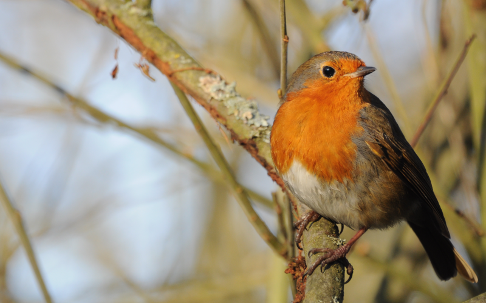
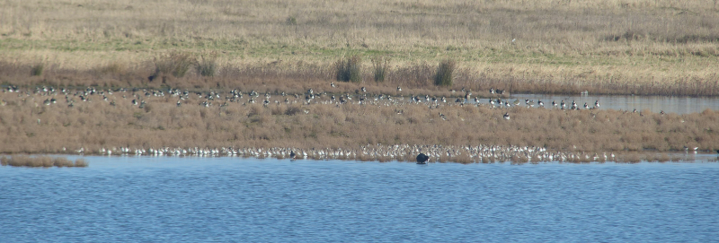

### Winter in North Kent

A much-better organised birding ally of ours corrals a dozen of us into a 
midweek stay at Elmley Nature Reserve. We round the stay off by extending 
our visit to Kent into the next weekend. Birds are seen. Sandwiches are 
forgotten.

This post covers the events of January 26th-30th, 2022.

### Elmley

Is our first stop. We pick up two and a half of the crew from the station 
and they get the usual introduction to the reserve - the track from the main 
road. The following creatures came out to greet us.

<figure class="figure">
  
  <figcaption class="figure-caption text-center">
    This fine set of Curlews.
  </figcaption>
</figure>

<figure class="figure">
  
  <figcaption class="figure-caption text-center">
    This collection of sheep.
  </figcaption>
</figure>

<figure class="figure">
  
  <figcaption class="figure-caption text-center">
    And, of course, a sentinel Stonechat.
  </figcaption>
</figure>

The trip has been sold on the strength of Elmley's owl game. Elmley is ready 
for us here, because as we reach the car park, there's one moodily surveying 
the orchard area.

<figure class="figure">
  
  <figcaption class="figure-caption text-center">
    Short-eared Owl.
  </figcaption>
</figure>

We slowly assemble the rest of the crowd and a few short orienting walks are 
taken around the reserve - we don't get further than the first screen over 
the Swale though. Vast quantities of chilli are consumed and early nights 
are had - we're going to try the walk to Spitend hide tomorrow.

We go for a quick explore in the morning to try to find the Little Owl pair 
that hang in a nearby ruin, but they aren't playing ball. We get everyone 
out of the house in surprisingly good order and march off toward Spitend.

<figure class="figure">
  
  <figcaption class="figure-caption text-center">
    View over the watery bit of the reserve.
  </figcaption>
</figure>

We make good time - as ever, there's not _that_ much going on, so 
distractions are few; a Stonechat or two, a flyover Grey Heron or Little 
Egret. The occasional distant Marsh Harrier is a tricky bird to get a mixed 
ability group on to.

We descend into the first hide for a snack, and a clinic on ducks. It's 
Winter, and we've got enough species here to beat the average park, and the 
light's good enough to pick out all of the diagnostics. There's also a few 
Common Snipe to find as a separate challenge. Levels of enthusiasm for this 
are mystifyingly high, and the rest of the trip suggests that some of the 
knowledge may actually have stuck. People can learn!

We plod on to the end, pursuing some brilliantly clichéd French teenagers; 
they each have a baguette stowed in the side pockets of their backpacks. We 
eventually get to Spitend, and discover

* There's some nice Reed Buntings in the reedbed
* We've forgotten our sandwiches, and this is _very_ irritating
* The teenagers have taken up residence in the hide and cannot be moved

Taking a look from the side of the hide though, we perhaps aren't missing 
much - previously the mud overlooked by the hide has been full of chunky 
Grey Plover, but even having arrived at the right point in the tidal cycle, 
there's only a small assortment of plovers, Knot, Dunlin and Curlew. I 
wonder where the rest of them are?

We traipse back to the cottage in time for an officially guided walk around 
the site as the sun goes down. It's a good walk, with excellent commentary - 
we learn a lot of things about the site which I immediately forget. Once we 
see our first Shorty in the orchard, owls are almost constant. The only owl 
interruption is by a shedload of Marsh Harriers coming into roost towards 
the paper mill; easily thirty or forty drop into the reeds in the ten 
minutes or so that we watch.

<figure class="figure">
  
  <figcaption class="figure-caption text-center">
    Golden hour SEO.
  </figcaption>
</figure>

Heading round into the fields on the East side of the orchard, more 
Short-eared Owls are patrolling at the fields edges off to our left. The 
guide tells us some more about this location. I'm not really paying 
attention though, because it looks like one of the more distant owls is a Barn 
Owl. We get almost everyone on that before it drops below some lumps in the 
land at the edge of the field. Top owling.

We retreat back to the cottage for more oversized portions of food.

The next morning arrives; further visits are made to the orchard 
(still no Little Owl) and the Swale screen. The colours from the sunrise are 
spectacular.

<figure class="figure">
  
  <figcaption class="figure-caption text-center">
    Sunrise view East from the orchard.
  </figcaption>
</figure>

<figure class="figure">
  
  <figcaption class="figure-caption text-center">
    Metallic skies over ducks on the Swale.
  </figcaption>
</figure>

<figure class="figure">
  
  <figcaption class="figure-caption text-center">
    Lapwings on the shore.
  </figcaption>
</figure>

<figure class="figure">
  
  <figcaption class="figure-caption text-center">
    View back to the farmhouse.
  </figcaption>
</figure>

<figure class="figure">
  
  <figcaption class="figure-caption text-center">
    A cloud of wigeon heads out for the day.
  </figcaption>
</figure>

It's with a small degree of sadness that we head back to the cottage to pack up.

<figure class="figure">
  
  <figcaption class="figure-caption text-center">
    The cottage; resplendent in the sunshine.
  </figcaption>
</figure>

<figure class="figure">
  
  <figcaption class="figure-caption text-center">
    This handsome Lapwing escorts us out.
  </figcaption>
</figure>

### Oare Marshes

We drop a few folks back at the station and head to another favoured haunt: 
[Oare Marshes](/sites/Oare_Marshes.html). There is, perhaps, less happening 
here than there might be in July or August but we do find some excellent 
Pintail and play the usual game of "Spot The Turnstone".

<figure class="figure">
  
  <figcaption class="figure-caption text-center">
    It's hard work being a Pintail.
  </figcaption>
</figure>

<figure class="figure">
  
  <figcaption class="figure-caption text-center">
    Spot the Turnstone.
  </figcaption>
</figure>

### Stodmarsh NNR

We find we still have time for one more visit and so head to Stodmarsh NNR - 
we're staying overnight in Canterbury, so its location is convenient. I also 
have a faint memory of coming here in 2015 and getting good views of Bittern.

We find our way to the Reedbed hide, which offers excellent views of a 
bloody great reedbed. It's here I previously found Bittern as the sun went 
down - we're a bit early for that, so we take a good look at everything 
(lots of Teal, a Marsh Harrier or two, a surprising number of Greylag 
Goose) before heading out elsewhere.

<figure class="figure">
  
  <figcaption class="figure-caption text-center">
    A very confiding Robin.
  </figcaption>
</figure>

We make for the Tower hide, briefly halting to consort with a very confiding 
Robin, and to peer hopefully into a stand of trees in the hope of an 
interesting finch or two. We do find a Treecreeper, but our finches are 
limited to a surfeit of Chaffinches.

The Tower Hide doesn't have a lot to offer other than a brief break from the 
cold, so after a quick snack, we explore a little more of the trail out to 
the river. We quickly decide that a slow walk back to the Reedbed hide 
(ideally via the wet woodland trail, in hope of Bullfinch) is all we've got 
left in us.

Our second visit yields an entertaining staged exodus of the geese - they 
leave in small groups; each group's exit is preceded by a couple of minutes 
of exciting honking while the geese work out who will make up the next 
cohort. The previously sleeping teal are undisturbed. There's no sign of 
Bittern, but we do pick up several Marsh Harriers coming in to roost.

<figure class="figure">
  
  <figcaption class="figure-caption text-center">
    Some sleepy teal.
  </figcaption>
</figure>

A roost is what we now seek, and we head back into Canterbury for vittles 
and lodging.

### Blean Woods NNR

This is rumoured to be a place where we can find Lesser-spotted Woodpecker. 
This has [previously](/features/a-200-bird-year/part-09-cassiobury-park.html)
been a bit of a bogey bird for us, so we're keen to clap eyes on one so we 
can verify its continued existence.

We go on a medium length circuit from the main car park (trying to find a 
copy of the trail map on the internet has proven fruitless, as ever). We 
spend a lot of time stopping and listening, scanning mixed flocks of tits 
and finches for more exciting interlopers.

The best we manage for the first hour or so is this excellent Nuthatch.

<figure class="figure">
  
  <figcaption class="figure-caption text-center">
    It spots us, too.
  </figcaption>
</figure>

By the time we've reached the high point of the trail and started 
descending back to the car, we've almost given up. On the incline though, we 
encounter the biggest foraging flock so far - all the usual suspects are 
involved, Blue, Great, Coal and Long-tailed Tits. There's even a wintering 
Chiffchaff involved. An extra bird that's none of those species flies in and 
emits a call we don't recognise. It is unbelievably hyperactive - we 
struggle to get eyes on it, never mind bins or a camera. Our original 
assumption of Goldcrest isn't right - it's too big, and the wrong colour 
palette. Eventually it stays still long enough for us to resolve that it's a 
Lesser-spotted Woodpecker. Bogey bird status: demolished. Passing dog 
walkers are perplexed by the little victory jig that follows.

Did we mention how ridiculously warm it is?

<figure class="figure">
  
  <figcaption class="figure-caption text-center">
    Brimstone in January.
  </figcaption>
</figure>

<figure class="figure">
  
  <figcaption class="figure-caption text-center">
    Comma in January.
  </figcaption>
</figure>

Mad.

To dispel the warmth, we head coastwards. A rapid trip to Swalecliffe 
(previously a site where I've found Snow Buntings) is made more rapid when 
we see that the beach area is overrun with people when they should basically 
be absent. The catatonic sea breeze doesn't help either.

Uncowed by this experience, we opt for one further site visit, to Reculver 
towers. This is just as windy, but the shore-line is less disturbed, and the 
marshy bit behind the sea wall has a wader or two to give up. AB2's distaste 
at the weather is tempered somewhat by the availability of Ringed Plover. We 
still don't manage long here before deciding a return inland in search of 
dinner is required.

<figure class="figure">
  
  <figcaption class="figure-caption text-center">
    These Goldfinches sung us back to the car.
  </figcaption>
</figure>

### Sunday: Cliffe Pools

We do, at some point, need to make our way home today. We opt for one last 
stop on the way at another favoured haunt: Cliffe Pools RSPB.

We take our preferred route out through the reserve, keeping the Radar 
and Flamingo pools on our right. Reaching Cliffe creek, we look back at the 
muddy edge of the Flamingo pool to see what waders lurk there. Several 
hundred Dunlin and Golden Plover, is the answer. Not a bad haul!

<figure class="figure">
  
  <figcaption class="figure-caption text-center">
    Distant Dunlins.
  </figcaption>
</figure>

<figure class="figure">
  
  <figcaption class="figure-caption text-center">
    Golden Plover.
  </figcaption>
</figure>

We complete the circuit via Mead Wall, where, as is traditional, we are 
greeted by a Stonechat.

<figure class="figure">
  
  <figcaption class="figure-caption text-center">
    Stonechat.
  </figcaption>
</figure>

We return to the car park without further incident. The weather's still 
ridiculous for late January, as evidenced by this view from the pinnacle.

<figure class="figure">
  
  <figcaption class="figure-caption text-center">
    View from the Pinnacle.
  </figcaption>
</figure>