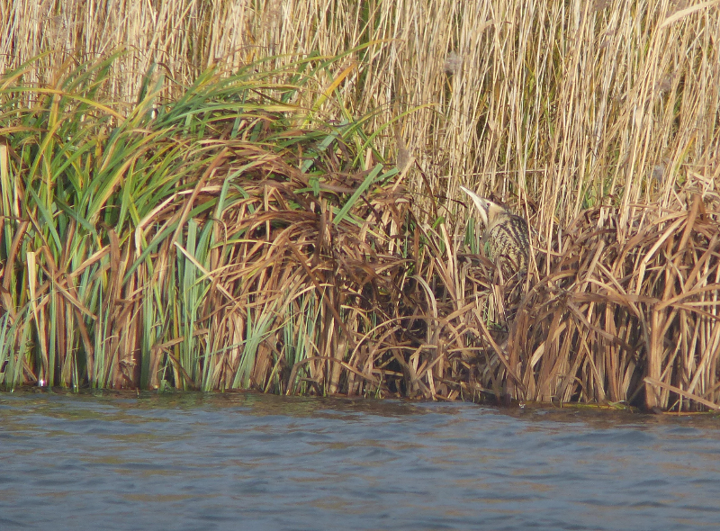

### A false start

Many birders are up bright and early on New Year's Day, eager to make
a start on a new list. The best laid plans of mice and men, however...

...are often besmirched by a soul-destroying hangover. The grand
schemes for a visit to Barnes or Rainham were ruled out by a malaise
that confined me to quarters until long after the best part of the day
had departed.

#### A walk in the park

I was escorted out of the house by Emma around four in the afternoon
for a walk around the Hampstead Heath extension and Golders Hill
Park. Neither of these are tremendous sites for scarcities or
rarities, but they do have some attractions in the Winter. Amongst the
Black-headed Gulls, a reliable few Common Gulls hang - not a bad tick,
given their inapt naming. The Heath extension yields some excellent
views of Redwing, and a Great Spotted Woodpecker made a quick flypast
as we reached the end of the extension and turned towards GHP.

The walk around GHP is hard work; I am struggling to keep my eyes open
when I should be interrogating the flocks of small birds for any signs
of a Goldcrest (or possibly even a Firecrest). A little band of
long-tailed tits flops across the path; something amongst them is
considerably chunkier; a finch rather than a tit. The usual suspects
don't match - this is a flecked grey bird with some green hints. My
unwilling brain loads up the 'less usual' finches datafile and offers
up "female Siskin?". The light is fading almost as fast as my ability
to stay upright; a consultation of the bird book before the mental
image confirms a wholly unexpected little treat to the first day's
list.

#### A walk in the woods

The week passes without any helpful species displaying themselves to
me on the cycle to work; daily sightings of parrot crossbills in
Broxbourne Woods frustrate me as I sit at work, wondering if they will
hang on until the weekend.

I manage to sell Emma a wintry walk in the woods. We link up with a
train to Bayford and set off in search off the crossbills from
there. I am pleasantly surprised by the amount of birdlife before we
even get near - the scenery is remarkable for a place only forty
minutes out of London.

A quick trot through Brickendon deposits us at the start of a footpath
towards the area of the woods where the crossbills have been seen, but
we get distracted by a noisy flock of colourful Siskins having a drink
at a small pond. Delightful. Another flock of finches commuting
between some shrubs and a hedgerow turn out to be mostly Brambling;
another pleasant surprise - they're a bird that might otherwise have
required a more directed bit of seeking out later in the year.

With all these distractions, we're a good ninety minutes later into
the woods than I'd hoped. We interrogate some serious looking
birders. The news isn't good; no-one's seen them today, and some of
these folks have been in the area for several hours. We follow the
directions given "keep going until you reach the crossroads" as best
we can. Precisely which crossroads is given away by the cluster of
well-equipped folks hanging around near it. They're clearly on full
alert, but all in different directions. Another bad sign. A few more
short conversations confirm that no-one's had any luck.

We hang about a bit, and our focus is rewarded. Not with crossbills,
but with treecreepers and goldcrests. Seemingly everything that moves
in the wood is one or the other - they seem to outnumber even the
usual tit suspects today. They're both year ticks, but even if they
weren't, the accessibility of them brings bit of cheer to an otherwise
cold and grey pause in a wood.

One birder towards the younger end of the spectrum marches off on a
brief trespass with crossbill calls emanating from his phone. We take
this as a clear sign that we should be off; we've got a decent circuit
ahead of us and I can already feel my stomach starting to anticipate
arriving at the pub at the other end. The treecreepers and goldcrests
follow us most of the way round, to our delight.

We stop in the Farmer's Boy for a late lunch, and to attempt to dry
out our shoes and socks; despite our efforts, the mud has penetrated
to our feet. The food is good, and the radiators effective; we head
back towards the station renewed, and pick up a bonus Mistle Thrush on
the golf course on the road there.

It's a successful trip; I've managed to combine a mild twitch with a
decent walk, a selection of year ticks, a decent lunch and a small
pleasant town. Emma is sufficiently entertained to allow the
possibility of heading to Barnes the next day.

#### A walk around WWT London

We arrive at Barnes (a.k.a WWT London) just after 10:30am with the
bright eyes and bushy tail that should have been deployed six days
previous. Why Barnes (and not Rainham)? I'll give you a clue: it's
cold, but the sun is shining, and there's only a slight
breeze. Rainham might yield a Bearded Reedling or two, or maybe a
Short-Eared Owl later in the day, but we're in Barnes to get a
potential difficulty out of the way as soon as possible; the Bittern.

<figure class="figure">
  
  <figcaption class="figure-caption text-center">
    Beady eyed Barnes Bittern (from a 2015 visit)
  </figcaption>
</figure>

Bitterns can be elusive, but Barnes has, for me, proved quite
reliable; I've seen two or three different birds on the reserve on
cold winter days. Occasionally they might even be describable as
confiding - on one occasion one even climbed up the front of the reed
bed in beautiful sunshine as if to pose for photos. For Emma though,
they've proven a bit of a bogey species; despite multiple attempts,
she's not seen one, and has started to question their existence.

Even without the Bittern, Barnes should yield most of the Winter
wildfowl species - there's almost always a pair of wintering Pintail,
and a smattering of Shelduck. We head out on to the reserve in good
spirits; there are already reports of a Bittern from the Dulverton
hide. The usual plan (Wildside, then back via the visitor centre round
to the Peacock tower) is put aside and we head there directly.

There's excitement in the hide as we enter; we squeeze in and set up a
scope on the right hand side, and by listening in on the more
experienced voices explaining what's going on, quickly get on to the
Bittern in the opposite reedbed. Well, that was easy! A few folks in
the hide are struggling to locate the bird, so after having a decent
look we put the scope out to public use. Our bit of public service is
brought to an end a few minutes later when the Bittern unceremoniously
pushes its way back into the anonymity of the reedbed. We escape
before we have to explain to any newcomers what they've just missed
and head towards the Peacock hide.

There have been reports of Water Pipit from here. I am doubly
sceptical; firstly of my ability to discern this bird from other
pipits, and secondly of its ability to stay within the parts of the
reserve where I'm going to be able to pick it out. As such, not a lot
of effort is extended scanning for it; the Water Pipit's existence is
roundly brought into question by all concerned, and we refocus.

A pair of Peregrine Falcons nest on Charing Cross Hospital every year,
and outside of breeding season they can often be seen on a couple of
favourite perching points. A glance through the bins finds a couple of
promising looking shapes, and a look through the scope confirms it;
Peregrine Falcon is, remarkably, the first raptor of 2018. The usual
Pintail pair are quickly located on the main lake to round off a
productive weekend; we head home to warm up.