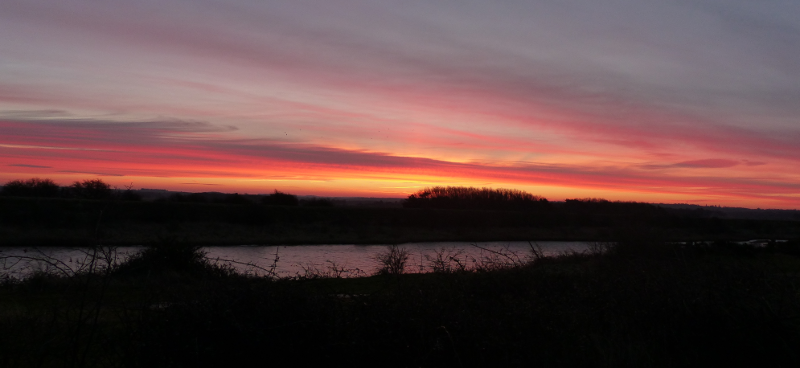
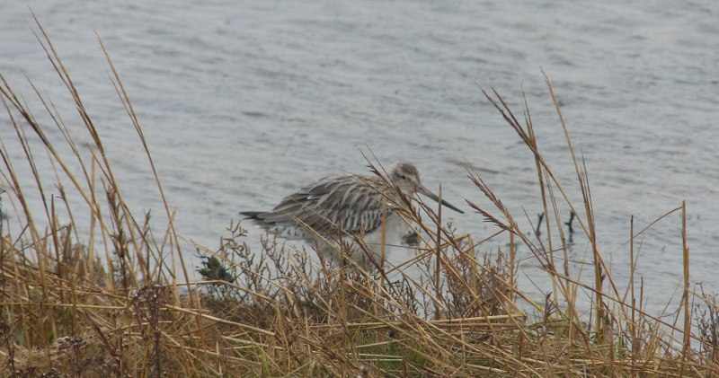
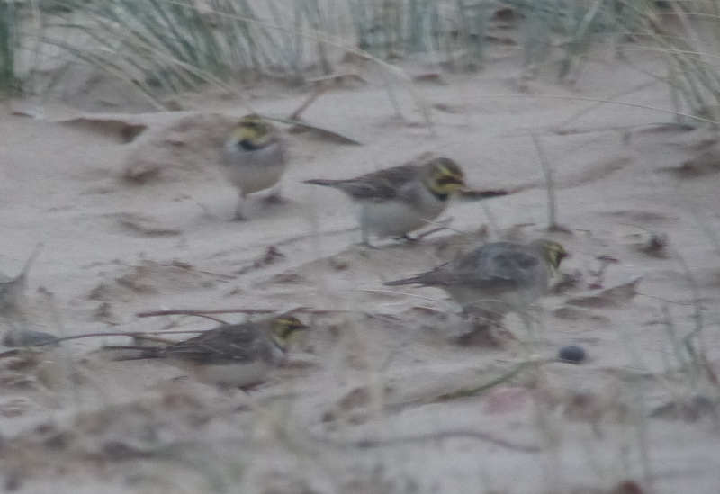

### North Norfolk Surprise

The next weekend stays mysteriously free. A short-notice winter trip
to Norfolk is hastily planned; we'll do our usual trip of picking up a
car from Stansted Airport and driving the rest of the way.

Pronoun guidance: as ever, AB1 is the nominated driver.

#### An inauspicious hostelry

After a gnarly drive from Stansted to King's Lynn in the dark (what is going 
on with A10 at Littleport?), we bed down in a room above the local 
Wetherspoons. The Brexit pamphlets are not nearly as amusing as being woken up at three in the 
morning by...is that someone coughing? Or maybe choking? Oh, no, that would be 
vomiting. Delightful. 

#### A Snettisham Spectacular?

We're up not too long afterwards. A busy day awaits us and we
need to be at Snettisham a good half hour or so before first light if
we're going to catch up with the Pink-footed Geese coming in off the Wash. 

AB2 is not at all convinced by this plan, but having bundled her into
the car, her mood improves (as a side note, I suspect the soothing
effect on AB2 of being chauffeured around is no small part of our
relationship's stability). We find the correct car park (one step
better than I managed the last time I was here), kit up and traipse
off along the trail towards the Wash. There's just enough light to not
need a torch.

I'm halfway between excited and fearful - the RSPB's website
maintains a list of the dates it is sensible to see this spectacle,
and while yesterday was listed, today is not. I'm hoping there's enough
noise in that schedule that we're going to be lucky; I'm going to be
in trouble for this early start otherwise.

It's a pleasant enough walk to the beach and we pick up the first Little 
Grebe of the year on the way. Otherwise, there isn't much about.

<figure class="figure">
  
  <figcaption class="figure-caption text-center">
    The sky, at least, was spectacular from the start
  </figcaption>
</figure>

We reach the beach and continue South towards the hides - a few waders that 
are new for the year (Oystercatcher, Knot) provide some distractions, but 
they aren't what we're really here for. Having adjudged that we've come far 
enough, I cup my ears towards the water. Not a lot. Staring at the horizon 
doesn't help much either - there doesn't seem to be anything happening. 

Oh dear.

A few minutes pass; I do my very best impression of someone who
remains convinced that something is going to happen. Thankfully, the
pretence isn't required for long; the excited honks and squeaks of a
few thousand geese start to reach the beach. It isn't much longer
before the first skeins (such a delight to deploy that word) start passing 
overhead.

This is the really good bit. There's something about the noise of the
geese; it's a party atmosphere; they're off for a banquet of beets
just inland, and every goose is invited. They all sound pretty excited about 
it, and the feeling is quite contagious; I suddenly realise I'm grinning like
an idiot. 

This lasts a good old while - there are thousands of these
geese on their way to breakfast, and it takes a good half an hour for
them all to get over us. I note with relief that AB2 is similarly
cheered.

We do a quick loop around pit four, taking in all the hides. I roundly
misidentify some Greylag Geese as Pink-footed for a short while in the
first of them (not enough sleep), but the rest of this trundle is more
productive. A Marsh Harrier is quartering over a reedbed to the
South. A Skylark comes to have a look at us. Two Red-legged Partridge
fly off in a panic when we get too near. Both partridges before the
end of January - not bad! We return to the car by around half past
eight and set out to find ourselves a well-deserved breakfast at the
[The Old Bank Bistro](https://www.theoldbankbistro.co.uk/).

#### Who _are_ these people?

Refuelled, we set out for Titchwell. It takes a gloriously small
amount of time; I'd forgotten how close together everything is in
North Norfolk. We park up, use the facilities and start to head into
the reserve, when a car entering the car park unceremoniously beeps at
us. We've not had much sleep, so this immediately raises our heckles:
Who _dares_ beep at us when we're not even in the way? Oh, it's Mum
and Chris. What are they doing here?

Well, obviously, the same as us. Mum had mentioned a trip to Norfolk
was happening, but as far as I knew, the scheduled window for it had
ended a couple of days ago. Evidently plans had changed, or (more
likely) I wasn't paying attention. Four pairs of eyes being better
than two, we join forces; surely nothing can stop such a birding team!

Apart from the weather. Which, as we progress further towards the
beach, slowly deteriorates from harmless grey to the light but
penetrating drizzle that doesn't feel that dangerous but will handily
soak you through in under five minutes of exposure.

We're restricted to some very brisk walks between extended stays in
the hides. Mum and Chris share details of their exploits over the last
couple of days; useful for our own planning. 

The visit ends up being short, but productive. From a year
perspective, the best find is probably Bar-tailed Godwit. It's
important because a) one doesn't see them often and b) discerning
the difference between Bar and Black-tailed is difficult.

<figure class="figure">
  
  <figcaption class="figure-caption text-center">
    Between us we decided this specimen on the tidal marsh was Bar-tailed.
  </figcaption>
</figure> 
 
A bit of scope deployment on the beach yields Common Scoter and
Red-breasted Merganser, (no Long-tailed Duck, though). A drake
Red-headed Pochard shows off on the freshwater marsh - not that
exciting, but good to have found it at this stage.

We part ways from Mum and Chris (who are off to see if they can find
Twite at Thornham) and continue our journey East. Our next stop is
Holkham; at this time of year there are reliable Shore Larks amongst
the dunes. In addition, there are reports of Bewick's and Great
Egret elsewhere in the area.

#### Hangry of Holkham

This is not the best timed visit. The weather is crappy. It's
borderline lunchtime. I deny any possibility that I might be hungry
and we march off towards the beach. We get to the beach. The beach is
big. Which way should we go? The instructions are clear, we should go East. 
But how far? What are 'saltings'?

We guess that the long lumpy barrier parallel to the sea and forming the
boundary between the beach and a marshy area is where we should
look. This yields some very confiding Sanderlings and Turnstones, but
no Shore Larks. A band of more serious rain turns up and we head back inland
to take cover in the woods, wondering if the whole Shore Lark thing is
a con. Perhaps it is someone's idea of a sure lark, ho ho. A few Goldcrest 
entertain us while we decide what to do.

<figure class="figure">
  
  <figcaption class="figure-caption text-center">
    We've seen this picture before somewhere...
  </figcaption>
</figure> 

Once the rain backs off a _little_, we have a bit more of an explore. The 
results, though, are similarly irksome. We poll a large group of
birders on our way back about their luck, and they've seen the
Shore Larks, _and_ the Great Egret. 

We head to the hide where the egret was seen, and, as we open the door, 
something that looks the right shape and size is flying off to the extreme 
right of what is visible. It drops down behind some reeds as I sit down. Hmm.
Not good enough for the list - I'm sleep deprived and hungry, I could very well
be making it up at this point. Of non-Mute Swan species, there is
also no sign. Still, at least the hide has got us out of the rain.

We trudge back to the car once the rain eases off further to lick our
wounds, and, more importantly, go in search of food. A fish and chip
shop in Wells-next-to-the-Sea is chosen and we hoof down the oversized portions 
with gusto. 

That's better. With blood sugar returning to sensible levels,
the never-say-die ultra-birder in my head has re-examined the OS map
and decided it might be worth having another bash at Shore Lark from
the Wells end of the beach.

On my side is the pleasing aspect of the Wells end, and an improvement
in the weather. A murky trek in a freezing gale this is no longer; now
it's a pleasant stroll in the sun along a most attractive bit of sand,
with cute little beach huts perched at the border of the beach and the
woods behind.

We quickly reach the eastern end of the lump we were following from
the other end and agree: we're going to walk along here for fifteen
minutes, tops. Only a couple of minutes pass before my keen scanning
of the next 100m or so picks up a flock of eight birds that aren't the
right shape to be either the Sanderlings or the Dunlins from
earlier. They sit down on the beach side of the long lump (salting?)
and disappear.

Keen not to frighten them off, we move towards the sea from the
salting before moving in their direction. This works quite nicely, and
the birds graciously decide that they're going to scuttle towards
us. As they get closer it's obvious they are the Shore Larks - the
head is unmistakable. 

We stay still in the hope of getting a photo or two, but a combination of 
their scuttling speed and the dreadful light conditions (on reflection, I 
perhaps exaggerated how improved it was in a haze of fish and chips) make 
it a bit tricky. Still, great success! They do exist after all.

<figure class="figure">
  
  <figcaption class="figure-caption text-center">
    Barely deserving of the title of record shot, but it'll have to do
  </figcaption>
</figure> 

#### Exit, Stage Right

At this point, it feels like we ought to be done for the day. Even
with the early start, the light is starting to fade. We've got a
reservation just beyond Cromer and we should start to make our way
there. I console myself that, in the darkness, the various reports I
am driving past aren't really things I am missing out on. It's been an
excellent day, in any case, the Pink-footed Goose party and the Shore Lark 
search in particular.

An enthusiastic host greets us at our B&B in Cromer. We are once again
starving and it turns out I've planned the birding parts of this trip
brilliantly, but the logistical parts less well. A nearby corner shop
is visited, two pot noodles are acquired and then clandestinely
consumed in our room. Tomorrow is another day.