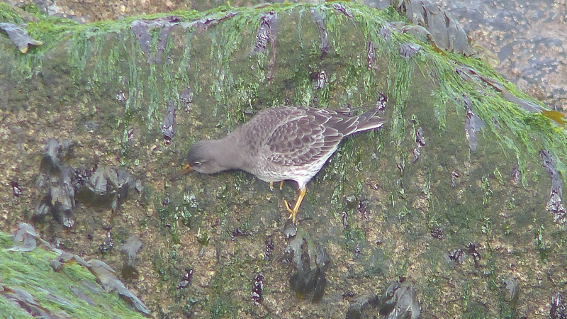
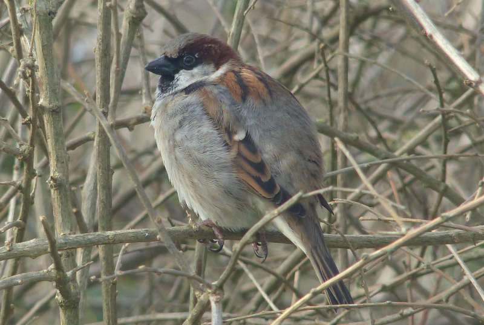
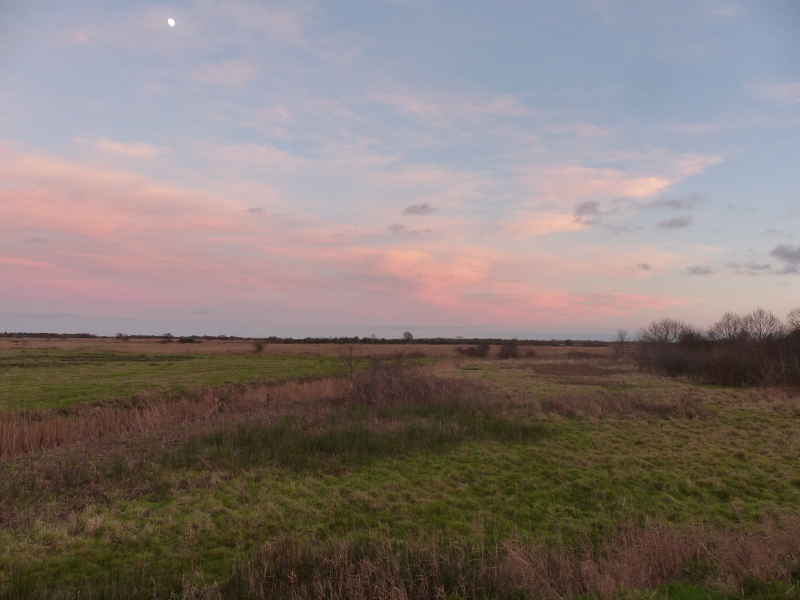

### Broadly Acceptable

With no equivalent goose chase on offer near Cromer, Sunday has a considerably 
more leisurely start.

Pronoun guidance: AB1 still driving. This entry covers the events of Sunday 
January 28th, 2018. 

#### Sheringham

We head to Sheringham to see if we can catch up with
either the Black Redstarts that have been intermittently reported
there, or the apparently reliable Purple Sandpipers that frequent the
front.

Sheringham is a curious place. A real mish-mash of new and old
architecture. Neither of us finds the overall effect particularly
convincing. The sea wall and promenades are to our liking though.

Our search for the Black Redstart is rather half-hearted. Our previous 
attempts at seeing one in this sort of place have been fruitless. Furthermore
we've developed a more casual attitude on the back of 
yesterday's successes, and the effects of Friday night's 
sleep deprivation have started to kick in a bit. We just don't
really believe it's going to happen - after a good hour of poking about, we 
give up.
 
We agree that a search for a Purple Sandpiper is more likely to yield fruit, 
particularly after consulting with a bunch of seawatchers who confidently 
direct us East along the promenade. They haven't seen the redstart either, hah.

With these instructions, we quickly find a purple friend conspiring
with a group of Turnstones on a rocky promontory at the Eastern end of
the promenade. We spend a fair old while marvelling at its tremendous
grip on some very slippery looking rocks: It's a life tick, it needs a
bit of savouring. 

<figure class="figure">
  
  <figcaption class="figure-caption text-center">
    Even the sandpiper found conditions tricky
  </figcaption>
</figure>

On the way back, I attempt a bit of seawatching. There are 
definitely some divers out there, but which of Red-throated, Black-throated 
and Great Northern they are is not discernible to my novice eyes, even 
through the scope.

#### Strumpshaw

Our next stop is Strumpshaw Fen RSPB. Well, nominally. We've been
following the blog of [Marcus
Nash](https://norfolkbirdtours.wordpress.com/) and he frequently
manages to find Bean Goose in the area. 

We arrive without enough time to explore the reserve _and_ hunt for Bean 
Goose, and, staying in relaxed mode, opt for a
_very_ muddy walk around the reserve, picking up the first
Common Snipe and Stonechat of the year.

<figure class="figure">
  
  <figcaption class="figure-caption text-center">
    A very confiding House Sparrow from a hide at Strumpshaw
  </figcaption>
</figure>

This was really only a filler visit anyway; we're headed South and East from
Cromer because, by the end of the day, we want to have made it to Stubb Mill.

#### Stubb Mill

We're here for one near-certainty and a couple of hopefuls. From the
watchpoint (quite a pleasing walk from the car-park, punctuated only
by criticism of the tour organiser's management of nutrition across
the weekend), Eurasian Crane should be nailed on. Hen Harrier and Barn Owl 
should also be possible.

There are quite a few folks at the watch point; good - we've no idea
what we're doing. Our only experience of this sort of roost watch has
previously been at Wicken Fen; a much easier prospect because the area
to watch is just so much smaller. At the watch point, the land around just
opens up; I'd guess you can see at least 5km in every direction. It's
a bit daunting; pick the wrong point at the wrong time and you could
see nothing. With a group of seven or eight scopes, we'll hopefully avoid that.

<figure class="figure">
  
  <figcaption class="figure-caption text-center">
    The view from the watch point
  </figcaption>
</figure>

We're early. Nothing happens for quite some time. This is birding, that's 
sometimes what happens. Further complaints are registered with the tour 
organiser with regard to the temperature and the amount of waiting around. 
Finally, a crane flaps over in front of us. All is forgiven at the 
appearance of this giant and its soothingly smooth flapping. Like the rest 
of the cranes we see over the next hour, it drops down out of sight somewhere 
in the far distance.

After the wait for the first one, suddenly cranes are everywhere; almost the 
default bird we see for the next half hour. Tremendous.

In the gaps between the cranes, I'm eyeballing all the harriers
I can find. They all stubbornly remain Marsh, rather than Hen. A flock of ten
cranes lands far off the left. Subsequently, one of the pros calls out
"male Hen Harrier". Directions are shared out. Even with the scope the
harrier is difficult to pick out; it's basically at the horizon, but as it 
swaps between a sky backdrop and the land, it's unmistakably the silvery grey
 of a male Hen Harrier. A great view it is not, but a year tick it still is.

The encroaching cold encourages us to head back to the car; no Barn
Owl this time. We agree that, while the cranes were good, for a
freezing your arse off in midwinter experience, we prefer Wicken.

January total: 90. We'll be done by mid March at this rate. Hah.