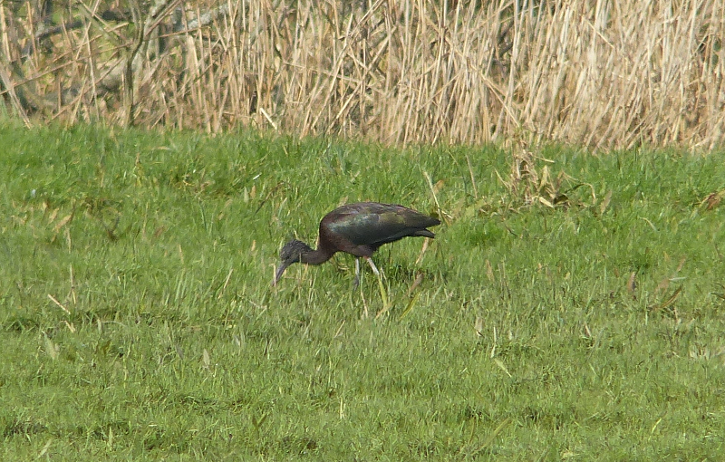

### Suffolk

Or: Out East, again: Circumstances conspire to bring us back to Stansted to 
pick up a different car the following weekend. 

Dad's just turned 65, and is triumphantly retiring. We're meeting up with 
family in Aldeburgh to celebrate, taking the Friday off to allow for a bit of
gentle birding on the way.

Pronoun guidance: AB1 __still__ driving. This entry covers the events of 
February 2nd-4th, 2018.

#### Hazlewood Marshes

The omens are good - before we've left the environs of the airport
we're two ticks up; there are Rooks in the car park, and a Sparrowhawk
flaps over the road on the way out of the car hire village (definitely
a thing). I briefly attempt to turn it into a Goshawk, but my heart
isn't in it.

Did I mention the gentle bit? I should emphasise it. Last weekend we
overdid it; too much driving, not enough meandering. We're not going
to go on giant detours to find things this time; we'll just pick up
what's on the way. Our first stop is Hazlewood Marshes, where there are
reports of Coues' Arctic Redpoll. I am ignoring the "Coues'" part, to
be honest. A Common Redpoll would do nicely, any old Arctic would be a
luxury; it wouldn't be unusual to miss the entire species across the year.

That turns out to be a sensible bit of expectation setting, because of
anything other than Common Redpoll there is no sign. After a cursory
search, we decide to walk down to the hide that's perched on the edge
of the river Alde. Well, 'river'. We're in Suffolk, and the land is
flat. The river is close to 1km across here. There are a few waders
and wildfowl to see from the hide (along with the year's first Meadow
Pipits), but the best thing is the tranquillity of the place. Thursday 
suddenly seems like a very long time ago. What a place.

There is still no sign of the C-A-R on the way back, and we feel
thoroughly vindicated in our decision to go for an explore
instead. Onward to Aldeburgh...

#### Aldeburgh (and Slaughden)

...where we quickly run into the rest of the family. Fortuitously, the dogs 
(two giant labradoodles with perhaps half a brain between them) need a walk, 
and the elected route takes us South from Aldeburgh towards the Martello 
Tower at Slaughden (have fun convincing your friends this is a.) a place and 
b.) pronounced however you want it to be). 

After a section of shingle beach scrambling hell, we reach a more stable 
track, and go on the alert for Snow Buntings. They ought to be obvious, but 
they aren't. We walk to the limit of what's publicly accessible, then turn 
for home - it really isn't that far. As we near the tower on the home leg, 
Dad, having poked his nose in the bird book earlier for a clue, reckons he's
found them. He's right. Dad has gone from not knowing what a snow bunting 
looks like to finding one before me in under fifteen minutes. Oh well, they 
all count.

#### Minsmere

The next morning, we split into two teams; one is heading to Minsmere,
the other is going shopping. The Minsmere team is AB2, Dad and I. The
best bird we see is, in fact, just outside the reserve - there's a
Glossy Ibis bimbling around in the fields just before the
road-with-the-terrifying-bumps in.

<figure class="figure">
  
  <figcaption class="figure-caption text-center">
    Glossy enough for us
  </figcaption>
</figure>

Dad is mostly here for Marsh Harrier, and there are enough of them to 
prove satisfactory. We pick up our first Whooper Swans of the year from the 
Bittern hide, and additionally some Siskins from the woodland behind, but little else.
We do a quick lap around the beach route (Stonechat the only saving grace) 
before scooting off to rendezvous with team shopping in Dunwich.

One day I will visit Minsmere at the right time and see all of the things, I 
declare. In my mind. Convincing no-one. Least of all the birds.

There's a plot to go walking along the shingle beach at Dunwich after
lunch. I decline - yesterday's shingle exploits have done something
really quite painful to my feet, and I am really not up for making them any
worse. I give the raft of Common Scoters off to the North a bit of a
staring at, but there's no way I'm going to pick out a Velvet
interloper at this range. 

On the landward side of the beach though, a giant white bird that can
only be Great Egret is flapping about. I remember visiting Dungeness
the last time I was year listing and having difficulty working out
whether I was looking at a swan the first time I came across one of
these birds. Now a seasoned Great Egret veteran, I can happily tick it
from this range.

Sunday is a birding write-off, but a walking triumph - we overcome a
foul Northerly wind to walk to Thorpeness for a delicious lunch. Afterwards, 
there only remains the drive back to Stansted to drop off the car, and a
sleepy National Express coach ride back to Golders. Not as many ticks
as our previous weekend, but a very pleasant trip.