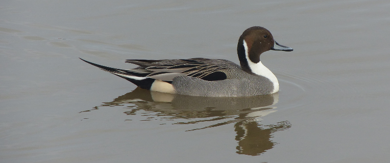
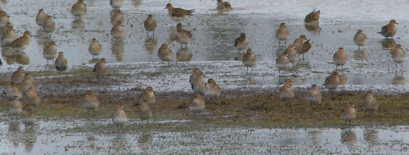
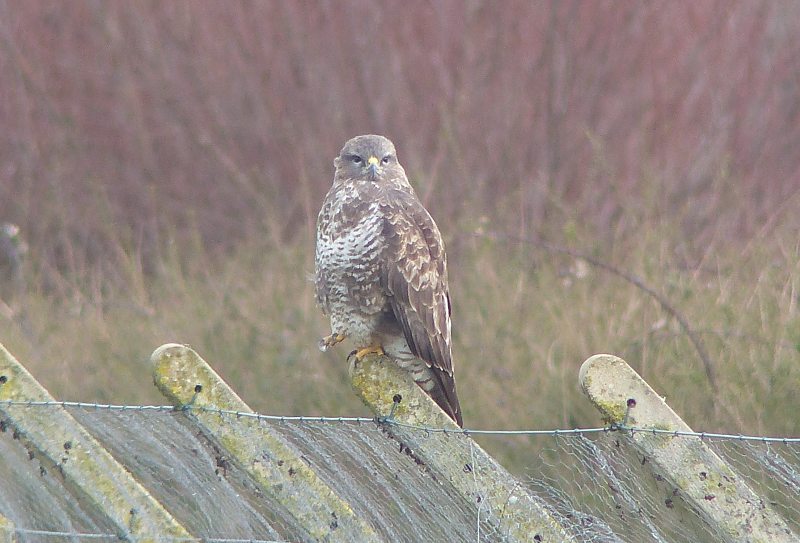
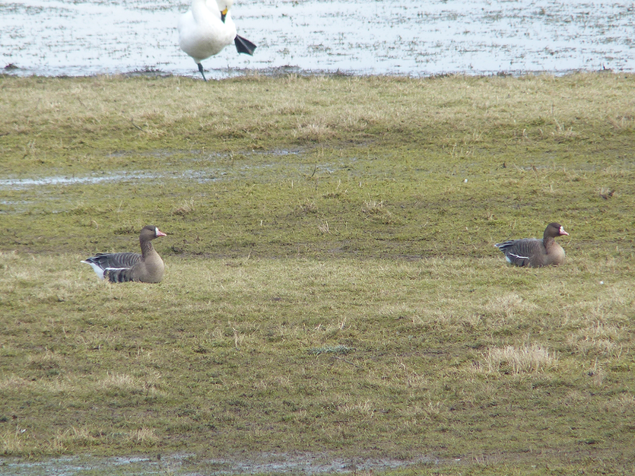
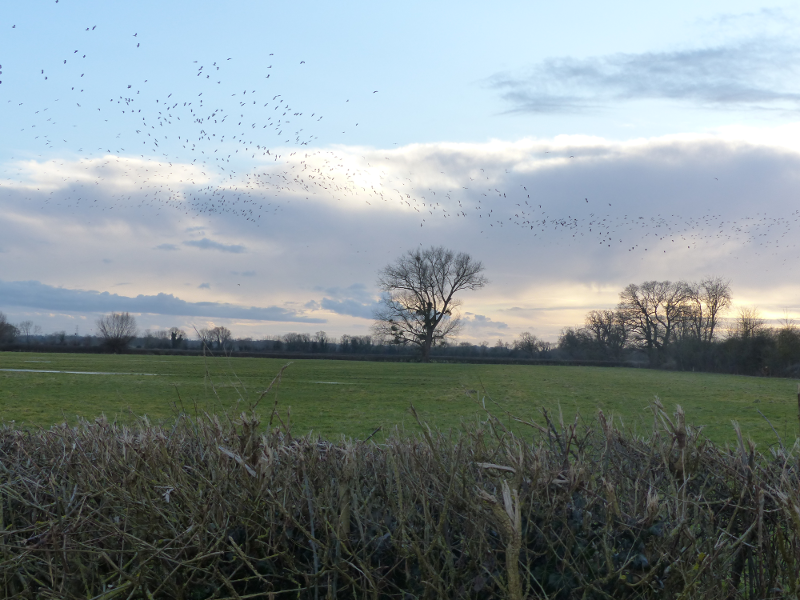
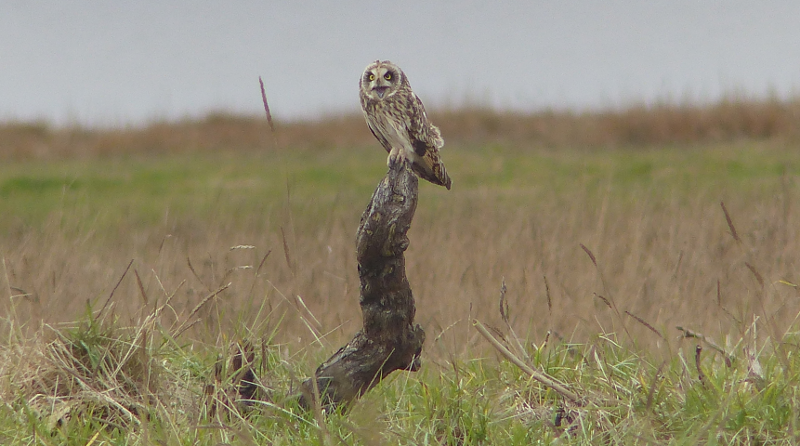

### A Bristol Weekend

A couple of weeks pass. We have a growing collection
of people (spawners, indeed!) we know in Bristol that require a visit. Planning 
occurs.

Having bumped into Mum and Chris in January, plans are afoot for a further 
trip with a less coincidental teaming up.

Pronoun guidance: AB1 did the planning, for once. This post covers the 
17th and 18th February 2018.

#### Where to go?

What's near Bristol and worth a visit at this time of year? There's one 
obvious candidate, and that's Slimbridge. While its trademark cranes are 
already on our list, they aren't on Mum's, and there are _plenty_ of other 
things we might catch up with.

#### To Slimbridge, then!

Luxuriously, we are collected from London on the Friday evening and
driven to Slimbridge. Well, not quite - we're staying in the
gargantuan Tudor Arms nearby. After a sizeable breakfast (choose just
the bits you want) we set off. I've read somewhere that the fields
either side of the road between the canal and reserve proper are worth
a solid look, so we're on foot. Indeed, the fields are full of waders
and geese. Very nice. No ticks though.

The reserve itself is busy. Our plan is simple - wander down to the
Tower hide that overlooks the Severn, making a stop in each hide along
the way. The first hide is jam-packed; it becomes clear why - roughly
four square feet of it currently has a view of a Little Stint. We wait
our turn; by the time it turns up we're almost alone again, so we get
a good look. We also pick up Bewick's Swan here. Leaving the location
of the stint in the hands of some newcomers, we move on.

<figure class="figure">
  
  <figcaption class="figure-caption text-center">
    Smart
  </figcaption>
</figure>

The next hide has a view over a much larger area of wetland. It sets
the tone for the trip - the _number_ of birds is the impressive bit;
wodges of Wigeon, gaggles of Greylag Geese, plenty of Pintail (a very
smart duck, all told). Gallons of Golden Plover? (That's enough alliteration 
- Ed).

<figure class="figure">
  
  <figcaption class="figure-caption text-center">
    <a href="https://www.youtube.com/watch?v=2aJ2Vh_e2dQ">These are greasy 
    plovers (they'll get a hold on you; believe it!)</a>
  </figcaption>
</figure>

There's a flock of several hundred Golden Plover that wheel around now and 
again; it's quite something. A Ruff (well, a Reeve, technically) or two amble 
around the muddy edges. Several Redshank are examined under suspicion of 
being of the spotted variety, but they're all found not guilty. A Common Buzzard 
chilling out on the fence to the extreme right of the area provides a nice
break from the watery lot.

<figure class="figure">
  
  <figcaption class="figure-caption text-center">
    Imperious
  </figcaption>
</figure>

Onwards again; the next real stop is the Tower hide. Again, it's
_very_ busy. How is Slimbridge more jam-packed than WWT London? I'm
torn between being pleased that there's so much birding enthusiasm and
feeling mildly claustrophobic.

Mum doesn't seem comfortable either. Although this may be because the 
surfeit of Greylag Geese has brought into focus the total lack of 
any of the white-fronted variety. Having stuffed myself into a seat at the 
side of the hide, I happen across a remedy - a bunch of six White-fronted 
Geese flies in and lands. There's something quite prideful about a goose and
the white around the beak this lot have seems to amplify it. This is _our_
reserve, we'll have you know.

<figure class="figure">
  
  <figcaption class="figure-caption text-center">
    Side note: What is that Bewick's doing?!
  </figcaption>
</figure>

In other goose news, there are a few Barnacle spotted around in the mud in 
front of us; probably wild, according to the professionals in the hide. To 
complete Mum's target list, there are also several cranes poking about.

We beat a retreat from the Tower hide and, after a brief discussion,
from the reserve itself; we have a lunch plan to make and some more
exploring to do - birding-wise not a lot happens, but we can recommend
[The Red Lion](http://www.redlionarlingham.co.uk/) if you're in need
of a meal and the world and his wife (+ several large dogs and 
inappropriately large vehicle) have already flooded Frampton.

<figure class="figure">
  
  <figcaption class="figure-caption text-center">
    We sneaked out to have another quick look before sunset...
  </figcaption>
</figure>

#### Aust Warth

We trespass further on parental time the next day by commandeering a
lift to Bristol. There's a hook though; we're going via Aust Warth,
where, by all accounts, there ought to be a Short-eared Owl or two for
us to catch up with.

Aust is between the two Severn bridges. The land feels quite broken up
- "it's neither fish nor fowl" cries AB2; a remarkably unbruised idiom, for 
her vernacular. I'm reminded of various Pratchettian descriptions of parts of Lancre.
The RSPB would probably describe it as having 'big skies' (please, make it 
stop). It's definitely wild. And a bit grubby. 

There's a reedbed at the North East end (the M48 crossing), and an old ferry 
crossing. We park nearby (it seems to be the only appropriate road) and have 
a bit of an explore.

There's no sign of the owls, but the place is sufficiently interesting
to not matter. Some inquisitive Stonechats pop up to say hello - a year
tick for Mum. A Water Rail makes a brief appearance; annoyingly I
completely miss it. We make our way out to the old jetty and stare
into the distance a lot. Still no owls. Humph. Back to the car; we're
supposed to be meeting parent/newborn combo #1 in half an hour.

Just as the car pulls away, Mum triumphantly spots an owl off to the
right. It floats around over the wasteland between us and the river and is 
already worth the wait; how cool are owls in flight? Utterly effortless. 
The owl tires of quartering before too long, and alights on an 
agreeable open stump a hundred metres or so away. The car is stealthily 
manoeuvred alongside, and we have a good look at it. 

It's a fine beast, and before long it treats us to a bit more
surverying of the general area, and a bit of squawking.

<figure class="figure">
  
  <figcaption class="figure-caption text-center">
    Such personality. Much wowl.
  </figcaption>
</figure> 

A second owl makes an appearance. It considers getting in the first one's face
briefly, but then thinks better of it, heading to a perch a safe
distance away. These owls, apparently, know how to share. We spend a
good quarter of an hour drinking in the behaviour of these birds
before it becomes plain to us that, sadly, it's time to make a
move. Given we'd given up, we're now all the more appreciative of the
treat we've just had.

February total: we're up to 109. A mid-March finish may have been
overly optimistic.