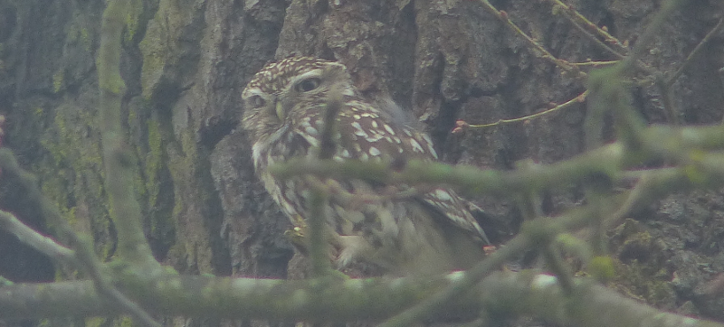

### Cassiobury Park

Our first trip this month ends up being a bit closer to home. I decide,
arbitrarily, that this is the year I am going to track down Lesser-spotted 
woodpecker.
 
Pronoun guidance: AB1 arbitrarily decided.

#### Lesser-spotted Woodpecker 

I've never seen one, and, according to all the
usual sources, the signs point to it getting harder to do so (the
annual breeding evidence of this bird is in decline).

A bit of research points strongly at Cassiobury Park in Watford as the
place to go. Apparently there's a patch of trees next to the car park
that are a reliable haunt for said woodpecker. There are even [YouTube
videos](https://www.youtube.com/watch?v=8MaHpGp-9Ss) from roughly this time 
last year; including some excellent drumming (the Lesser variety drums for 
considerably longer, in case you were wondering).
 
Also, the park looks like it ought to have enough paths to be a nice walk, 
and the metropolitan line out there makes it a convenient trip. We make a 
pact to avoid falling into the trap of referring to woodpeckers as 'peckers',
because the giggling would, eventually, get old.

#### Jog on, Park Run

We get to the park and it is disappointingly busy. There's some sort
of park run happening; we guess it probably kicked off about an hour
before we arrived, and the stragglers are still making their way
around. The old mantra of "everybody's got to be somewhere" comes to
mind, followed by the usual riposte of "but did they really all have
to be here?".

The promising copse next to the car park doesn't yield any
woodpeckers, but it does have a pair of obliging Nuthatches, and some
unhelpful Starlings that do a very good job of looking like several
other species. There's a pair of Stock Doves showing signs that they
might nest here, too.

We decide to have a wander around the rest of the park in case the
woodpecker is out on tour somewhere. This means getting closer to the
running groups, and the overenthusiastic marshals. Humph. We circuit
the East end of the park remarkably swiftly as a result, pausing only
to marvel at the endless Redwings poking about in the undergrowth.

We pass by the modern-looking coffee shop and playground, to explore
the part of the park that's denominated as a nature reserve; it's
delineated by the river Gade on one side and, what we guess is, the
Grand Union Canal on the other. There are some charming footbridges to
allow access, which is enough to convince us to take a look.

Unfortunately, being surrounded by water has made much of the reserve
unnavigable by anything other than ducks; the main path across is
completely flooded. We do at least pick up a Green Woodpecker,
yaffling in some trees near the flooded area. We squelch around what
we think is a path South; a Goldcrest squeaks angrily at us. We
assume, from the evidence shortly forthcoming, that it is trying to
warn us that further flooding has made this way impassable as well.

We reverse back to the bridge that brought us in and try a path
Northward. This seems more hopeful; there are a couple of anglers who
have made it, and before we know it we're on the canal towpath. We
consider a more strenuous walk across the golf course and around the
woods beyond, but change our minds halfway; we'd rather head back to
the park for a coffee and a cake. There's a Little Egret risking life
and limb by poking around on the golf course's fairways.

After a quick stop for coffee (AB2) and brownie (AB1), we return to
the car park. Two serious-looking birders are in the thicket we
previously explored. Alas, even they haven't been able to find our
LSW. They have found a Little Owl in a pair of ancient trees that we
may or may not have totally ignored on our way back. They give us
detailed instructions on where the bird is, and show us a couple of
excellent photos they managed to take.

We traipse over the to big trees. Immediately I wish I had been paying
a bit more attention to the instructions. All I've managed to store is
"left hand tree, about three quarters of the way up". I'm looking at
the left hand tree around three quarters of the way up. Whole lotta
tree. Not a lot of owl. Let's not give up just yet though; we can only see 
perhaps a third of the tree from this angle. We start to circle around
the tree at what we guess is a distance at which we won't disturb an
owl.

That does the trick; halfway round, the shape of an owl perched near
the trunk becomes clear to me. In the binoculars, it seems I am clear
to the owl as well; a step left or right from me is tracked very
carefully. I signal to AB2, and after a minor argument over how
terrible my directions are, she gets on to it. The only mild
disappointment is that this specimen is both solitary and rather sleepy; the 
charm of Little Owl is enhanced greatly when there's two or three of them
hopping about.

<figure class="figure">
  
  <figcaption class="figure-caption text-center">
    Is it small, or is it just far away?
  </figcaption>
</figure>

We conclude that we're either too early for an LSW, or that its
existence is a fabrication. Perhaps we'll have another go later in the
year.