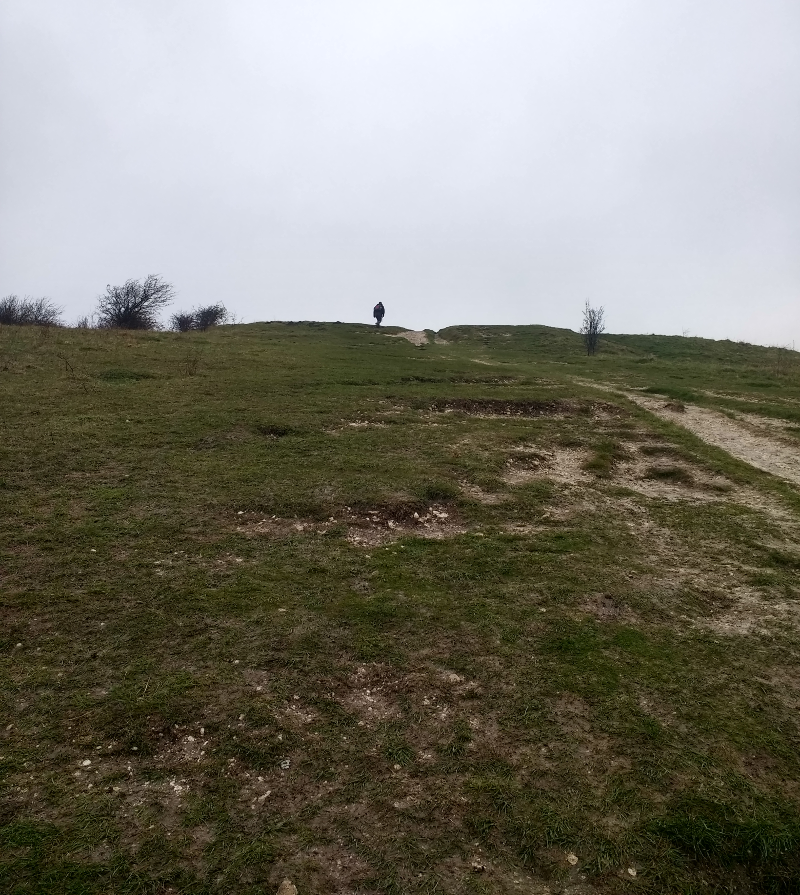

### A Ring Quest

The weekend of the 7th arrives. I am on call on the Saturday; I need
to stay near an internet connection. AB2 disappears off to meet some
of our friends for a night out in South London. Trouble. 

Pronoun guidance: AB1 would never agree to go for a night out in South London
. This post covers the events of 7th-8th April 2018.

#### Saturday: Effective altruism

We're in prime Ring Ouzel territory, and I'm hoping to get to Ivinghoe Beacon
tomorrow; there's no chance of that happening if this night out turns out to 
be a big one. There's only one thing for it; now any chance of a call has
gone, I'm going to have to brave the trip across the river to show
willing.

This is a trendy group. I am informed they are somewhere within
Peckham Levels; getting in should be simple. I arrive around
9pm. There are around a hundred people queuing. A little light
questioning reveals that it is one in one out. I make contact
with an ally on the inside, and they begin to canvass the group for the
possibility of leaving. Thankfully, I've brought a book.

At some point, a mildly tipsy AB2 emerges to find me in the
queue. She carries no information as to the plans of the remainder of
the group, but the gesture is much appreciated. Until she realises
she's left her things inside, and the bouncers won't let her fetch
them.

Eventually, the group inside decides it's time to move on. One of them
brings AB2's things; phew. We relocate to a pool club that doubles as
a night spot. It's grubby but serviceable, but woe betide you if you
are foolish enough to consider leaving any of your bags on the utterly
dance-free dancefloor. The energy of the group is waning. I quietly mention 
to AB2 that leaving shortly would allow us to get the last train home. That 
does the trick. We're asleep before 1am; all is not lost.

#### Sunday

It's a slow start the next morning, but it _is_ a start. We need to go
into central in order to go out, so it's Northern line to Euston
followed by national rail to Tring. Arriving at Tring, we're straight
onto [the Ridgeway](https://www.nationaltrail.co.uk/ridgeway) towards
Ivinghoe beacon. At least three Ring Ouzel were seen there yesterday
on their way North; we should be in with a fighting chance of seeing
one ourselves.

The weather hasn't been on our side during the week - the path is
sodden. It takes some fancy footwork to stay upright; it's neither a
particularly flat or wide trail at this point. There are unhappy
complaints from just (actually, increasingly) behind me on this very
subject. Thankfully, we've tried this route before, and so it's with a
very honest face I can turn around and say "once we're into this wood
it gets a lot better".

A Red Kite sheltering on the edge of the wood provides a further
distraction, and the general mood improves. On the exit of the woods,
we start to climb Pitstone Hill. It's here that the landscape starts
to open up a bit, and my radar tells me this isn't the last place we
might find an Ouzel. I blitz up to the top of the hill to obtain the
best view, and to the North, sitting on a fence, is a blob of roughly
the right size and colour. Probably just a Blackbird. Nope; there's
that patch of white on the chest; my first ever Ring Ouzel. Woo. AB2
catches up; the bird obliges her with a decent view as well.

We're now back into solid walk territory - we might as well get to the
end of the trail at the top of Ivinghoe beacon. I push my luck by taking the
steep descent down the North side. More complaints ensue. 

<figure class="figure">
  
  <figcaption class="figure-caption text-center">
    AB2's view as AB1 disappears uphill
  </figcaption>
</figure>

An attempt at lunch in Ivinghoe fails; yet another country pub that only 
serves food between 12 and 2; we sit and fume into our drinks and eat packets of
crisps in record time.

A pair of Little Gulls have been frequenting the nearby Wilstone reservoir, 
but that's too far for us today; even my non-hungover feet protest at the 
thought. After a brief cameo from the first Swallow of summer, all that 
remains is a return walk down the utterly lifeless grand union canal.