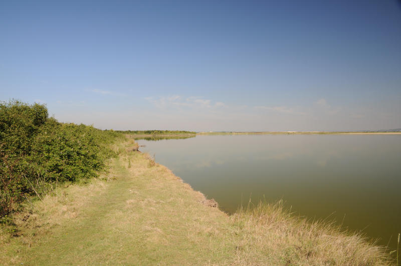

### An Estuary Excursion

The week rolls round, and another weekend brings another birding
scheme. The traditional Spoonbill sighting has been reported at Cliffe
Pools, so it's time to get the scope in the mulepack, and stuff myself
and my bike on HS1 to Gravesend. 

Pronoun guidance: AB1's on his bike. This post covers the events of April 
14th, 2018. Front page photo is, hilariously, of a Spoonbill on Fuerteventura.

#### Decisions, decisions

At Gravesend, I've a choice to make; do I bike from here or wait for a 
connection to Higham? I opt for the former; it looks like a pretty solid bike
path with a chance to link up with the Saxon Shore Way.

This is...a mixed choice. Getting out of Gravesend on the bike is
difficult. The cycle path is, indeed, excellent. The option to join
the Saxon Shore way is a foolish one; it's a dyke between the Thames
and the farmland, and the surface of it is immeasurably keen to get
stuck to all the surfaces of my bike. 

When I get nearer the reserve, I turn off on a footpath to escape the
mud hell. In fact I replace it with a twisty bramble hell, followed by
a sandy hell as I head through the arse end of a quarry. I then
proceed to attempt to enter the reserve by another tiny path that
isn't suitable for bicycles and then, having entered the reserve,
start trying to go round it the opposite way to which I'd planned.

#### Cliffe Pools

I pause to take stock. Am I hungry? It's a possibility. I trundle up
to the top of one the reserve's marked mounds and take a seat to eat a
snack. The islands visible from here are flooded with gulls. They make
a phenomenal racket. Among them a few Mediterranean Gulls give the distinct
impression of being deeply unimpressed by their noisier black-headed cousins.

Refuelled, and redirected, I head to the causeway that cuts through
the reserve's multiple pools. A couple of folks are giving the second
pool on the right a good staring at. I dismount so I can have a look
at whatever they're looking at. As I do so, there's an explosive bit
of song from the scrub on my left. A brown bird with a tell-tale
rufous tail flits back into the undergrowth. Nightingale! I wasn't
expecting that! Although, according to the others, I should be -
Cliffe is supposed to be a reliable place to find them. This specimen
pops up from the bushes to sing for us once or twice more before
reverting to type and becoming invisible but still audible.

<figure class="figure">
  
  <figcaption class="figure-caption text-center">
    A view of the Flamingo pool in 2014; Nightingale alley is behind and to the left
  </figcaption>
</figure>

I have a good stare at the back of the Flamingo pool; the usual flocks
of Avocet are there, and one or two Ringed Plover, if I look _very_
carefully. No sign of any Spoonbill; there are a few Little Egrets
spotted around that are doing a reasonable job of not-quite-resembling
them _just_ far away enough to cause some doubt. Spoonbills they
aren't.

I continue on towards the Thames; I'll do my usual route of causeway,
and then the potholes of death around the back of the reserve, past
Black Barn pools. There are _much_ better Ringed Plover views from the
Thames end of the Flamingo pool, so I tarry there for a while. Love a
good plover. Still. Must be going. Spoonbill to not see, potholes to
be terrified by.

#### The return leg

The potholes are as a I remember them; everywhere. I weave a winding trail 
between them. Mostly. At one point a tractor appears behind me to add to the 
pressure; I find a wider bit to take refuge in while it goes past. A few reed
warblers chirp at me while I wait. I consult the RSPB trail map; apparently 
there are two more viewing mounds on this path that I've somehow missed. 
There is a gate that looks like it might offer decent views of a bit of radar
pool that I neglected earlier, so I poke my nose over.

There are those Little Egrets again. Only this time, one of them is a
Spoonbill! It's even putting on a show of typical Spoonbill behaviour,
sweeping its bill from side to side in the water. I get set up with
the scope to take a proper look, but it's too close to the bank and is obscured 
from view. I try to get a better angle on where the bird should be from further 
up the path, but by the time I get there, it's disappeared. Oh well, it was a
good view while it lasted.

I successfully navigate the remainder of the potholes and exit the
reserve via a more sensible route. I decline the option of pub on the
way out, I remember being looked at kinda funny in at least one
establishment along here in the past. Instead I head straight for Higham
station to pick up the next train back to Gravesend.

Typically, I miss the half-hourly service by about five
minutes. Angrily glaring at the common or garden species in the trees
behind the platform opposite does nothing to transform them into
anything more exciting.

#### Gravesend Ferry

Still, the day is still young. Not for nothing did I start early; it's
only just approaching 3pm, and some top level google maps sleuthing in
the week revealed a handy little birding trick; there's a ferry from
Gravesend across the Thames. From there, it's a short train trip (or,
assuming I miss the connection by the usual few minutes) a twenty-minute 
cycle to Rainham Marshes. After a brief stop in Gravesend for what is, even 
for Mcdonalds, a pretty average quarter pounder, I board the ferry for Tilbury.

It's a genuinely excellent little boat ride, even if the banks of the
Thames aren't at their most picturesque at this point. The river is a
good width, so there's enough time to relax into the feeling of being
(almost) at sea.

We arrive at Tilbury and I immediately miss a train. It turns out it's
a twenty-minute cycle... if you know where you're going. In the
end, I bodge my way to Grays just in time to pick up the connection to
Purfleet (saving all of five minutes). I arrive at Rainham with around
half an hour to find the Black-necked Grebe that's been reported on
Aveley pool (side note: wouldn't it be great if we lived in a world
where these urban reserves could open up unstaffed?).

#### Rainham Marshes

The volunteers in the visitor centre doubt my claims that I can
appreciate the reserve in under half an hour, but I put on my most
charming face and convince them otherwise. I try not to get distracted
by a very showy Chiffchaff as I set off; I've got ten minutes to get
to the back of the reserve, ten minutes to find this grebe and then a
further ten to get back.

A brisk walk gets me to a good viewpoint in eight minutes (hah - I
reckon I could do a full circuit in half an hour if I were so
desirous). The light could not be any less helpful; it's _right_ in
front of me, transforming everything in my view into a silhouette. All
is not lost - even in profile, I think I can probably pick out a BNG
if it's visible.

Which, water pouring from my eyes, it most certainly is not. The clock
on my phone tells me my time is up, so I head back to the visitor
centre. We're not quite done yet - there's still a good hour of
daylight, and the path alongside the reserve next to the Thames is a
cycle path. I come across a bunch of fairly serious birders a
kilometre or so down the path. While most of them are now heading off,
one is hanging about in the hope of Short-eared Owl.

We discuss our various birding days: they've been in the area all day,
checking out the gulls at the nearby barges, walking the reserve and
have just been checking out the river area for Wheatears; and, you know,  
there's one _just there_. Introductions are made, names are immediately
forgotten. Even worse, I'm pretty confident I've met this chap before.

We hang about for a while; I briefly entertain the possibility that
from this angle the light will be good enough to discern the
grebe. It's a ridiculous notion; it would be a dot from here, even if
it was playing ball. A Short-eared Owl does, as predicted by my new
companion, float over the reserve within fifteen or twenty minutes.

We head further down the river to have a good stare over the reserve
from a slightly different angle. On the way, my memory is jogged by my
companion's deep knowledge of Rainham, and his attachment to his
camera; I've spoken to him on the reserve before, in the hide where
you can see the Kingfishers. Well, that's a relief. Perhaps I might
remember his name the next time we cross paths.

Two further birders are at this watchpoint. I feel in danger of being
the odd one out, but it turns out that honour has already been given
to the slightly less reserved gentleman of the two we've just
encountered. This is getting a bit weird. A few straggling raptors
drift over; a couple of Marsh Harriers and a Buzzard. A consensus is
reached that it's probably about time to head home. Rainham station is
slightly closer from here and the way is almost entirely segregated
cycle path, so that's the way I head. A brief change on to the
overground at West Ham and a solid day of birding is done.