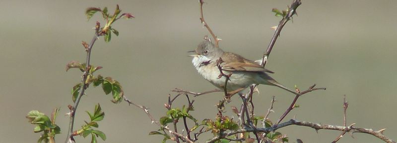

### Cuckoo

The next weekend finds us further out along the Thames estuary in
Leigh-on-Sea, where AB2's parents reside. There are plans for
Saturday day, but there is a small window available for a bit of
birding early on the Saturday morning.

Pronoun guidance: AB1 flies solo. This post covers the events of April 
21-22, 2018.

#### An early start

I swoop out of the house around 6:45am. That should be early enough. Today's
target is Cuckoo, and the venue is [Two Tree Island](https://www.essexwt.org.uk/nature-reserves/two-tree-island), a landfill site that was 
filled long enough ago to have transitioned back into a nature reserve. It's 
either a forty-minute walk, or two ten-minute walks and a little wait at 
Chalkwell station to get there. It turns out I am lazy; it probably helps 
that the station platform at Chalkwell has a beautiful view over the giant 
mudflats that extend from the beach out into the estuary.

I alight at Leigh-on-Sea and march along the raised path alongside the
waterway that separates the island from Essex proper (the Essex
mainland?). I can hear a Cuckoo already. The reason I'm here is
because Two Tree tends to be a place where you can _see_ Cuckoos, as
well; I've managed six before 8am on previous trips.
 
I cross on to the island. The Cuckoo is, by my ears, on the
Eastern half, so at the first opportunity I turn left off the
road and into the reserve.

The other good thing about Two Tree is that it is compact. Within a
couple of minutes I'm near the main feature of the East side of the
Island (a small pond surrounded by reeds; at one edge, a makeshift
hide/blind sits). The Cuckoo sounds very close indeed from here, but I
still can't see it. 

A few Reed Warblers are making their uncomfortable little scritchy noise in 
the reeds; they're not friendly enough to make an appearance though, sadly. A 
Whitethroat jumps around in a tangle of bushes off to the right. "Cuckoo! 
Cuckoo!" yells a bird on the treeline behind it. Not a trick of the
sound then; the bird is at most fifteen metres away - that's flat out 
confiding for Cuckoo. The bird poses for long enough for me to take a 
couple of photos of it, and to my surprise, is enough of a performer to 
cuckoo once or twice when I work out how to take a video of it, too (since 
lost; photo import process apparently fails to consider possibility of video;
 gutted!).

<figure class="figure">
  
  <figcaption class="figure-caption text-center">
    Cuckoo!
  </figcaption>
</figure>

Target achieved, it's time to move on. The other hopeful I am after
today is Grasshopper Warbler; I picked one up here the last time I saw
Cuckoo here, so hopefully lightning can strike twice. I follow the
path around the South side of the island and cross the road over to
the West side of the reserve; the mixture of grassland and pockets of
bramble and stubby shrubs feels like the right place to be.

Despite a lot of standing around, the sound of a Grasshopper Warbler
reeling is remarkable only by its absence. It's a very distinctive
song, and it carries a long way; if I can't hear one, there probably
isn't one here.

<iframe src='https://www.xeno-canto.org/312351/embed' scrolling='no' 
frameborder='0' width='340' height='220'></iframe>

  
I'm not too downhearted; there's a couple of other places I might be able to 
catch up with it over the next month or so. It's also very hard to be 
downhearted when, even without a Grasshopper, spring has arrived, and every 
other bird you see is a Whitethroat, having not seen any for seven or eight 
months. Even if none of them are Lesser, the pedant in me adds.

<figure class="figure">
  
  <figcaption class="figure-caption text-center">
    Lots of these around
  </figcaption>
</figure>

#### A migratory surprise

There are a couple of hides at the Western limit of the island; one of
them looks out on to a scrape where there are often some excellent
waders. I wander in to find a couple of folks already in residence. I
settle down into a seat and have a good scan. There's a decent number of
Avocets, and plenty of Redshank and Oystercatcher too. A few ducks are
floating about; none of them particularly remarkable.

My two hide companions have questions: what is _that_ bird over there?
It's a redshank with a very muddy beak. What about that one?
Oystercatcher. And that one? Canada Goose. Boom. I can cope with this level
of questioning _all_ day. The problem is this: I've found two waders at
the back that definitely aren't Redshank, Oystercatcher, or
Avocet. These two folks are not going to be able to help me work out
what they are. A scope view would make things much easier, but I've left
mine back in London.

Thankfully, the two birds in question aren't in a hurry to go
anywhere. They poke about around one of the islands at the back of the
scrape, gently circuiting it. A Redshank flies in to sit next to
them. Excellent. Now I have enough size and colour context to give me
the answer. My mysterious avians are just a tad lankier than the Redshank,
but they are much paler. In the brief moments where they are well
illuminated I'd say their legs were of a sort of grey-green hue. They
can, therefore, only be Greenshank. 

This is an excellent tick. Greenshank won't breed anywhere near here -
they pass through once in Spring on their way to breeding grounds much
further North (read: Scotland) and then again, in the Autumn, on the
way back. I explain all of this to my hide companions and they make
positive noises, but are otherwise unmoved. I make some excuses about
breakfast and head out. After a third Greenshank is poking about in
the creek as I round the North-Western corner (having seen two, this
one is easier to pick out), the rest of the walk is uneventful; my
attempts to transmogrify all Whitethroat into the Lesser variety all
fail. Still. Two solid ticks and a very nice walk before breakfast.

#### Sunday

There's a trip to Barnes on the Sunday. We do our usual route, the only bird 
of note is a Willow Warbler that we find around the back of the sheltered 
lagoon; the first of the year. It's all about the length of those primaries.

