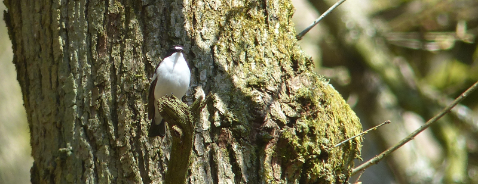

### Padley Gorge

May arrives, and its time to catch up with Mum; both in person and
hopefully in bird count. 

Mum lives on the outskirts of Nottingham. More relevantly, she is no more 
than five minutes away from Attenborough Nature Reserve; probably one of the 
best birded places in the middle of the country, and for good reason; it's an
excellent place. 

Mum has already seen all four of the warblers I missed in April, so a weekend
visit featuring a walk or two around the reserve should bear fruit. In 
addition, Mum's keen to hop over to the Peak District to a location that's a
reliable source of Pied Flycatcher.

Pronoun guidance: AB1's Mum. This post covers the events of May 5-6, 2018.

#### Early morning Attenborough

Mum and I manage to sneak a quick morning visit to the reserve; we're
both quite early risers, our partners prefer a more leisurely start to
the weekend. We don't have long, but it's time enough to pick up Reed
Warbler and the first Common Tern of the year. Mum points out all the
places she's seen Lesser Whitethroat (and Garden Warbler) along the
way. This is the third or fourth annual performance of this "they're
usually here, and here, but of course, they aren't today, the little
gits" performance, and it loses none of its charm in repetition. One
day I'll see Lesser Whitethroat atop these little bushes near the
bridge, but today is not it.

#### Padley (via Chesterfield)

We return to pick up the remainder of the crew and set out towards
Padley Gorge. Only Chesterfield stands in our way, and its fiendish
traffic systems are mysteriously navigable on this occasion. We park
up at Grindleford station, somehow resist the tremendous fatty smells
emanating from the cafe and cross the railway bridge.

This first part of the walk is rather strenuous; up a residential road
(track?) and then through into the start of the woods proper at the
top. On the way, we pass a serious birder, and make enquiries. Yes,
one or two Pied Flycatcher, says he, but not a lot else. Hopes for
Common Redstart and Wood Warbler had better be toned down somewhat, then.

We encounter further experts a little way in, and they give us some
more exact directions: when you reach some walls off to the right of
the path, have a look for a numbered nest box; there should be a pair
around there.

Walls are subsequently located. Are they the right walls? Perhaps we
should have asked for further identifying details. We snake our way
through them and come to a stop where it feels like there is no path
any more. At this point, we start to hear a call that we don't
know. None of us know what a Pied Flycatcher sounds like, but we've
all got a reasonable index of the other birds we'd hear in this sort
of wood, and this call sticks out. If we weren't paying attention before, we 
are now.

A nest box is located a few feet up a nearby tree. Mum squeaks: "got
one". A mild frenzy of description follows, which is hopeless for me,
because from where I'm standing it turns out there is a tree in my
way. A few steps to the left and the directions make sense, there's a
female Pied Flycatcher sitting a few feet above the nest
box. Excellent.

It's not long before the male turns up too. Both birds show off some
typical behaviour (i.e fly-catching) interspersed with visits to the
nest box, and some very photogenic perching. It becomes clear that
they aren't the only pair; there are two others a few trees back, as
well. Luxury.

<figure class="figure">
  
  <figcaption class="figure-caption text-center">
    The least bad of the photos we took
  </figcaption>
</figure>

We manage to peel ourselves back on to the walk a few minutes
later. Very slow progress is made; almost every bird we see (and hear,
now we know what they sound like) is another pied flycatcher; the
numbered nest boxes are a big hit. We guess we've probably seen
somewhere between seven and ten pairs by the time we emerge from the
woods at the top of the gorge (we guess our first serious birder was
too early, before the insects they feed on were active), as well as a
fair few Willow Warblers that stoutly resisted any attempts to be
turned into Wood Warblers.

On exiting the wood, the scenery opens out a bit; there's still a few
trees here and there, but mostly we've got a sort of mixed
woodland/grassland/moorland border. If we're going to see Redstarts,
I'd expect to see them here. We don't. I blame the not insignificant
numbers of picnicking tourists and the overpriced ice-cream van.

#### A bonus tick on the way back

We cross the stream that cuts through the gorge and start the return
leg. This is significantly less remarkable in terms of flycatchers: we
don't see any. A moment of brief excitement is afforded when the path
plunges down to a tiny waterway that's emitted from a bridge the road
goes over at the top. The opportunity for stepping stones is declined
by Mum (dodgy hip) and AB2 (solidarity) but enthusiastically taken on
by Chris and I. We are duly rewarded when a chubby brown bird that can
only be a Dipper drills up the tiny valley and perches on a set of
rocks not ten feet from those we just crossed.

Urgent signalling towards the road-route-takers follows. Mum and AB2
arrive after what seems like an eternity and we enter the "you two are
making stuff up zone" while we wait for the bird to
reappear. Thankfully, within a minute or so it does, and puts on a
reasonable hopping about on rocks performance before flying off, this
time up the gorge proper, with what looks to us like a degree of
finality.

Barring a few encounters with the usual suspects, the rest of the walk
passes without event. One rather bizarre lunch at The Chequers later,
and we're ready to head home.

#### Another Attenborough Attempt

The next day, we're back at Attenborough to try and find a few more of
these pesky warblers. The weather's still not on our side; what looked
grey and overcast quickly turns into heavy rain, and we take cover in
the tower hide. This would typically be a decent spot for warblers;
from the rear there's a decent grassy area that has some cracking
bramble patches. We'll have a good look once the rain stops, but until
it does, the gravel pit in front of the hide needs examining for the
pair of Garganey that were reported yesterday.

This is not an easy task - what light there is comes from behind the
pit, and there's a lot to search. Just as I give up with the
binoculars, two ducks land at around 2 'o' clock. Hmm. Hint of
eye-stripe on one of them? Perhaps the scope will make it
clearer. Hmm. Yeah, even in this deeply average light, that's a Garganey. 
And, yes, the other arrival is a Garganey too. A bit of scope tightening
to let everyone have a go later, and we've all seen a Garganey for the
year.

When the weather backs off a bit, the year's first Sedge Warbler pops
up on the other side of the hide. A welcome break from the tirade of
Reed Warblers, whose racket, while another pleasing harbinger of
spring earlier in the year, now quickly grates.

Having given up on the existence of Lesser Whitethroat, the last hope
for the day is that one of the reserve's Grasshopper Warblers might
grace us with a brief appearance. The sun comes out, and as we walk
out of the tower hide we catch a hint of a Gropper reeling back
towards the start of the marsh path. A little bit of scurrying later,
and we've joined a small team of be-anoraked birders staring at
another giant bramble patch just off to the right of the path that
heads to the Trent.

There are intermittent spurts of unmistakable Gropper, but exactly
whereabouts in this bush is unclear. And there's a lot of bush to
check. We circle around the edge of it in the hope of
triangulating. No joy. The growing anorak (they are actually all
wearing anoraks, this isn't a slur) team make themselves useful
pointing out a very cryptic Garden Warbler having a disagreement with
a pair of Blackcaps. I've never managed to clap eyes on this precise
LBJ before, and it's clear from this example why!

A good twenty minutes of staring hopelessly into brambles bears no
further fruit; we head home via the little piece of reserve behind the
visitor centre to pick up the reliable Tree Sparrows that abide there.
