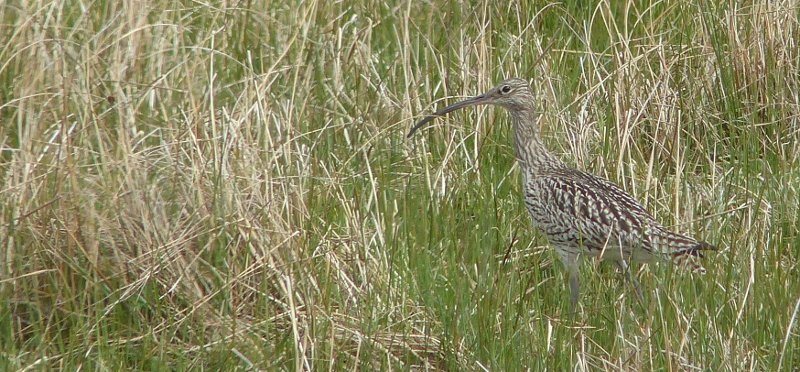

### A Northern Experience

It's time to get out of the London - there's a royal wedding happening. Let's
away to the North. Specifically, the North East.

This post covers the events of May 17th 2018. Pronoun guidance: AB1 doesn't 
fall asleep.

#### To Newcastle

This trip's been in the calendar for a long time. We skilfully avoided 
the previous royal nonsense by being in middle of nowhere in the Lake 
District, we'll try the same trick again, this time in the North East. We're
taking Thursday and Friday off to make a long weekend of it, and we've
been suitably organised to get some seriously cheap train tickets (to
Newcastle upon Tyne).

Our outbound train renders our organisation moot by being more than an hour 
behind schedule; we get a complete refund of our £30 tickets and lose an hour
of sleep; not a deal we'd take if we had the option. A short taxi ride later and
we reach the new abode of the Dixons (Kate and Stephen). To bed! For we rise at
6:30 for 7.

#### The North Pennines

The next morning arrives and we're and in another taxi on the way back
to the station; we need to be on the Hexham train that leaves just
before 8. We've arranged to go on a tour of the North Pennines with
Martin of [Northern Experience Wildlife Tours](https://www.northernexperiencewildlifetours.co.uk/), 
and that's where we're going to start. Our main targets are grouse: Black 
(tricky) and Red (should be easy). We know little to nothing about where to 
find the former, so we thought we would enlist professional help.

After a short period of uncertainty (we don't know what Martin looks
like, or what he'll be driving), Martin appears in a well-labelled
vehicle, we get in, and immediately we're off up into the hills. We're
in good hands - Martin car-birds as enthusiastically as we do; we're
already a decent birding team after only a few minutes.

We make our first stop near the crest of one of the numerous hills,
and stare over the drystone wall into the field beyond. A Curlew
trills as it circles upwards at the left hand side. I feel unsuitably
warm and dry; that sound is more often a harbinger of being on the
coast (usually in Wales) on a cold grey day with squally showers. We
get out of the car to have a look around, and that starts to work on
the temperature part of that feeling, at least.

I've given this field a good scan and found a great many Lapwings,
some Oystercatchers and a couple more Curlew. Martin does rather
better and finds two Black Grouse sitting on the the wall at the rear
of the field. Well. That was quick. It's quite nice to find a target
bird this early - it takes the pressure off the rest of the trip, we
can relax into it and enjoy the scenery a bit more.

<figure class="figure">
  
  <figcaption class="figure-caption text-center">
    With barbed wire, at the back of a field, but still, a black grouse it is
  </figcaption>
</figure>

The ensuing drive yields a great many Meadow Pipits, and, as we get
higher, sporadic Red Grouse. These all attempt the same trick as the
Grey Partridges from January; getting as low to the ground as possible
once they feel under threat. They have mixed success; the ones on the
near side of the fences and walls adjoining the road aren't really
afforded enough cover to make it work and end up looking rather
foolish. Those on the moorland disappear without trace.

<figure class="figure">
  
  <figcaption class="figure-caption text-center">
    Red Grouse escape options: Bumbling flight, or, er, ineffective self-burying. Is it any wonder birds of prey feast on them?
  </figcaption>
</figure>

#### Cow Green Reservoir

Our next major stop is at Cow Green reservoir. There are plenty of Red
Grouse here too, but it's the moorland flora that is most interesting;
there are some things that grow here that are not found anywhere else
in the UK (Spring Gentians). After a bit of encouragement we even manage to 
find one or two of them, and, even more remarkably, don't immediately tread them
into oblivion.

We walk as far as the dam of the reservoir, then take a left,
descending down the torrent being emitted from it. This is bolted-on
Dipper territory. A Grey Wagtail immediately pops up to confirm this,
but strangely, of Dipper there is no sign. 

<figure class="figure">
  
  <figcaption class="figure-caption text-center">
    Soundtrack: thundering water with occasional ungodly bird of prey squeals
  </figcaption>
</figure>

An otherworldly raptor squeak disturbs the otherwise watery soundscape, but 
we can't pick it up; a chap on the way down had seen a Peregrine, perhaps it was
that. 

<iframe src='https://www.xeno-canto.org/447133/embed' scrolling='no' 
frameborder='0' width='340' height='220'></iframe>

We stare at a few possible Dipper spots without success before heading back 
to the car park for a brief picnic.

<figure class="figure">
  
  <figcaption class="figure-caption text-center">
    Always a cheering sight
  </figcaption>
</figure>

#### Black Grouse Lek?

As the day wanes, Martin takes us back to a site where he's hoping to
find us a Black Grouse lek. It's in a beautiful valley with mostly
undisturbed grassland on both sides. There's an area next to the
stream at the bottom of the valley that usually acts as the setting
for the lek. We park up in a spot on the opposite of the valley with good 
sight lines to where the action might happen.

But not a lot happens. The Meadow Pipits that have been our constant
companions look on from nearby fenceposts, confused.

<figure class="figure">
  
  <figcaption class="figure-caption text-center">
    Confused? I'm just not speaking with my mouth full
  </figcaption>
</figure>

A Golden Plover skips over at speed, peeping. One or two Curlew make their 
presence known. I manage to spot a bird of prey just as it starts bombing it
down the valley towards us; by the time it gets into identifiable
range it can only be a Peregrine. Despite the lack of lek, this is remarkably
relaxing. So much so that AB2 drifts off into a snooze in the back.

<figure class="figure">
  
  <figcaption class="figure-caption text-center">
    Charming young Curlew
  </figcaption>
</figure>

Eventually we give in; no lek today, it seems. Not a problem - this is a 
wildlife tour, not a zoo, and with that there's an expectation that wild 
things won't always be where you expect; that's why it's interesting!
 
Our final stop is another, steeper walled valley, which manages a Common 
Sandpiper, a Redshank and a playful Wheatear or two. Still no Dipper; they're
obviously all hiding today. Back to the car - time to call it a day. Martin,
handily, is heading back past Newcastle so drops us off at the Dixons'. A 
most excellent Northern Experience it was too.