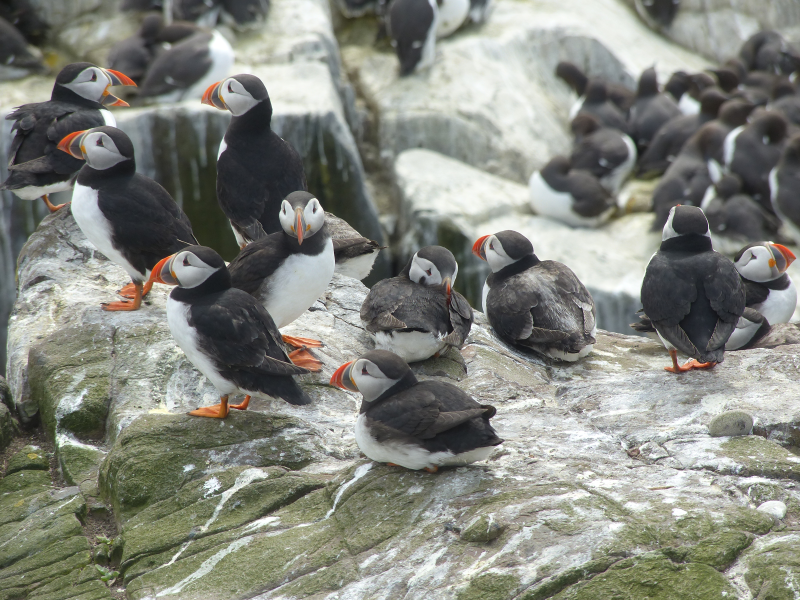
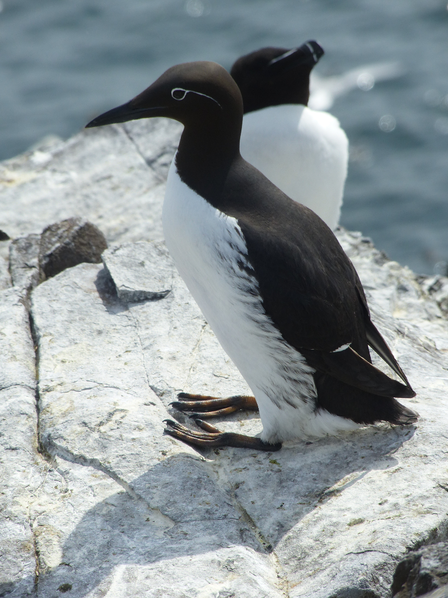
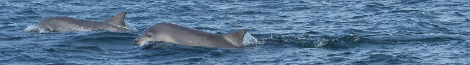
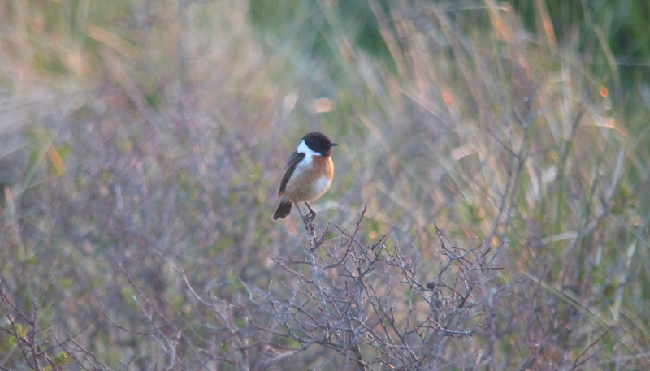

### The Farne Islands...and more!

Continuing our avoidance of any mention of republican unfriendly events in 
the capital, from Newcastle we travel to Beadnell. And from there, well, 
there's a place we really have to go...

This post covers from the evening of May 17th through to May 19th 2018. 
Pronoun guidance: AB1's bird tourettes make him no nautical friends.

#### Thursday night

After a united effort phone-nagging from AB2, Kate and I, Steve
returns from work. We shove all manner of useful bedding into a car
(note to self: shoving large amounts of bedding into a small car can
make a journey a lot more comfortable) and set off North.
Kate's side of the family have a place in Beadnell Bay that they've
kindly let us borrow for a couple of nights.

It's a drive of two halves - the first, a speedy but forgettable jaunt
up the A1. The second; a gentle mosey around quiet country roads as
the sun sets. What a treat to be driven around all day! 

Despite a concerted campaign of snacking on the way, a trip for further supplies
is deemed necessary before we bed in for the night, so Beadnell is
temporarily bypassed in favour of Seahouses. Parking is difficult, so
a daring drop off manoeuvre of AB2 and Kate is performed. I stick
around to keep Dixon company. 

By which, I mean, to mischievously disappear off to the pub in the harbour 
for a quick pint (well, it _was_ the only place we could park). A quick bonus
tick is obtained (every time I've been here there have been Eider in the harbour and
this visit is no exception).

After a brief period of amusing vexation (a WhatsApp message arrives
"Oi, husbands. Where are you?"), our respective other halves appear
with supplies, and we head for Beadnell to consume our co-operatively
sourced pizzas in excellent spirits.

#### A tardy Friday morning arrival at Seahouses.

The next day, we're back in Seahouses. In a hurry. We're booked on the
10am boat to Staple Island. At around half past nine, we read the
small print on the booking that reckons we should attempt to be there
around half an hour before that time, i.e now. Much haste ensues. "I'm
in the car" is shouted at various times to chivvy folks along. Steve,
in the rush, forgets his binoculars. Honestly.

We career back into Seahouses with moments to spare, only to be told
that the boat isn't going to land on Staple Island at all - there's
too much swell, and it isn't safe. We're advised to try the boat just
after 12 instead; alrighty then. We rearrange our plans; the afternoon
trip to Bamburgh now becomes the morning trip to Bamburgh. 

The Grace Darling RNLI museum is duly visited (Steve, Kate and I wait
outside for several hours while AB2 reads every single item of text
within it), and the castle (universally agreed to be overpriced) is gawped at
from the car park. We return to Seahouses in time to pick up lunch items 
from Trotter's Family Bakers (enough for four people for under a tenner; we 
are gobsmacked) and then pile back to the harbour in plenty of time to catch 
up with the later sailing.

#### Staple Island

The boat heads out towards Staple Island, stopping off to look at the
seal colony on the way. I make a minor nuisance of myself by pointing
out a few Puffins and Gannets (both right next to the boat, phwoar)
before the man in charge of the PA system does; I can't _quite_ tell
if the rebuke I receive is in good cheer or not so I take the safe
option of being quieter.

<figure class="figure">
  
  <figcaption class="figure-caption text-center">
    Oh, yes, there are plenty of seals as well.
  </figcaption>
</figure>

We get a good look at the stacks of Staple Island from the boat; the flat 
sections of the cliffs are covered in Guillemots, Razorbills and Kittiwakes. 
The smell and the noise vie for the award of 'most in your face'. Oddly, I 
find that acrid guano smell quite relaxing - it hasn't got anything like the 
immediate heaving power of, say, dog poo.

It's only when we've circuited more than two thirds of the island that
I realise that there is a subtle difference to the later sailing - it
lands on Inner Farne, not Staple Island. That's mildly upsetting as
the views of puffins are superior on the outer island, but this might
actually be better for the bird list.

We've already seen all three auks, plus Fulmar, Kittiwake and Gannet - Staple
Island will only give us better views of those birds. Inner Farne, on the 
other hand, will get us both of Arctic and Sandwich Tern; neither of which 
are too tricky to find across the year, but why not find them today?

#### Inner Farne

We alight on Inner Farne and are not immediately attacked by hordes of
angry Arctic Terns. We guess that only starts to happen once the
chicks are hatched; the last time we were here a couple of weeks later
in the year. 

<figure class="figure">
  
  <figcaption class="figure-caption text-center">
    Strangely non-aggressive.
  </figcaption>
</figure>

A circuit of the island is made - we pick up Rock Pipit
as well a both of the tern species we were after. I spend a while
trying to photograph Fulmars in flight; good practice, but no good
results.

Oh, and there are a lot of puffins.

<figure class="figure">
  
  <figcaption class="figure-caption text-center">
    Puffins
  </figcaption>
</figure>
<figure class="figure">
  
  <figcaption class="figure-caption text-center">
    Puffins
  </figcaption>
</figure>
<figure class="figure">
  
  <figcaption class="figure-caption text-center">
    Puffins
  </figcaption>
</figure>

We could go on. So we will.

<figure class="figure">
  
  <figcaption class="figure-caption text-center">
    Puffins
  </figcaption>
</figure>
<figure class="figure">
  
  <figcaption class="figure-caption text-center">
    Puffins
  </figcaption>
</figure>
<figure class="figure">
  
  <figcaption class="figure-caption text-center">
    Puffins
  </figcaption>
</figure>

Yes, the views are even better on Staple Island. A few other species were 
also worthy of a snap or two:

<figure class="figure">
  
  <figcaption class="figure-caption text-center">
    Kittiwake
  </figcaption>
</figure>

<figure class="figure">
  
  <figcaption class="figure-caption text-center">
    Guillemot
  </figcaption>
</figure>

<figure class="figure">
  
  <figcaption class="figure-caption text-center">
    Rock Pipit
  </figcaption>
</figure>

<figure class="figure">
  
  <figcaption class="figure-caption text-center">
    Razorbill
  </figcaption>
</figure>

<figure class="figure">
  
  <figcaption class="figure-caption text-center">
    Bunny!
  </figcaption>
</figure>

<figure class="figure">
  
  <figcaption class="figure-caption text-center">
    Shag
  </figcaption>
</figure>

We pause for a brief nap by the picnic tables near the lighthouse while AB2 
introduces herself to some nesting Eider ducks. One gentle walk to the jetty 
later, and, uh, is that our boat leaving? Oh. Whoops. 

<figure class="figure">
  
  <figcaption class="figure-caption text-center">
    The Dixons and AB1 stare balefully at the boat the just missed.
  </figcaption>
</figure>

I guess we'd better do another circuit then. One more brief nap and attempt 
at Fulmar-snapping later, we manage to board an alternative boat home.

<figure class="figure">
  
  <figcaption class="figure-caption text-center">
    This heavily doctored attempt is the best I managed
  </figcaption>
</figure>
 
It turns out we errored correctly - for this one 
encountered a pod of dolphins on the way back to the harbour, so we get a 
bonus display from them as we go.

<figure class="figure">
  
  <figcaption class="figure-caption text-center">
    Sometimes being late is well rewarded
  </figcaption>
</figure>

We return to Seahouses for four or five; we treat ourselves to a pint after 
some further excellent Eider views.

<figure class="figure">
  
  <figcaption class="figure-caption text-center">
    With apologies to Chris Packham, Eiders are the best duck.
  </figcaption>
</figure>

<figure class="figure">
  
  <figcaption class="figure-caption text-center">
    With bonus cute overload
  </figcaption>
</figure>

...and let's get some Eider sounds as well (these were even recorded in 
Seahouses!)

<iframe src='https://www.xeno-canto.org/343114/embed' scrolling='no' 
frameborder='0' width='340' height='220'></iframe>

Brilliant.

#### Long Nanny at dusk

We're not quite done for the day - we've got one Tern species left to
find. The National Trust look after a reserve at Long Nanny, which,
conveniently, lies a half hour walk from Beadnell Bay. We set off
along the beach in the hope of catching them before it gets dark.

We reach the part of the beach where there are a great many signs
warding us inland - the parts of the beach where Brunton Burn ebbs
into the sea is an area reserved for breeding birds, and humans are
kindly asked to stay off it. One curiously dressed individual has
decided these signs aren't for him and marches obstinately straight
across. We can't work out if he's drunk or stoned; hopefully the birds
won't have minded his incursion too much.

<figure class="figure">
  
  <figcaption class="figure-caption text-center">
    The days are lengthening, and it's bloody great.
  </figcaption>
</figure>

As we head off the beach, we enter a small village of Stonechats;
delightful. Our next landmark is the bridge across the Burn, and then,
with a bit of luck, there'll be a warden on duty at the reserve who
can point us at some Little Terns.

<figure class="figure">
  
  <figcaption class="figure-caption text-center">
    Always confiding, these birds
  </figcaption>
</figure>

<figure class="figure">
  
  <figcaption class="figure-caption text-center">
    What about me?!
  </figcaption>
</figure>

On the way to the bridge from the beach, there's a distraction. A lamb
has managed to get itself out of a collection of fields and is in some
distress. I take a laissez faire attitude: if it can get out, it can
get back in. Unfortunately, both Dixons are scout leaders, and this is
not a situation they can allow to continue. 

Just before we start attempting to corral the lamb into a corner, however, I 
spot a pale shape floating off South at the back of the fields. Barn Owl! I try,
unsuccessfully, to distract anyone else from the lamb before it disappears; 
the best anyone else gets is a fleeting glimpse as it ghosts off into the 
distance.

After a few failed capture attempts, the team splits in two: AB2 and
I head off to the reserve before it gets dark, Steve and Kate go after
the lamb. I wonder out loud if we'll ever see them again.

We cross the bridge and scoot into the reserve. There is indeed a
warden, equipped with the usual scope. A lot of chat follows, but none
of it is tern related, so I get my own scope set up and have a stare
down at the large group of terns sitting on the edge of the
beach. 

There are, handily, two disparate groups, and the one slightly
further away is a bundle of perhaps twenty Little Terns; I can just
about pick out the beak colouration from here, and they are tiddly in
comparison to the mixture of Common and Arctic Terns in the group to
the immediate right.
 
AB2 and I swap roles; I do the talking for a bit while she has a look at the 
terns. To our surprise, the Dixons then arrive, having successfully deposited
the stray lamb back in a field (it isn't clear which). 

The Dixons proceed to have an identical conversation with the warden, which, 
for everyone other than them, is completely hilarious. Eventually we 
extricate ourselves from the warden and head back to Beadnell by the light of
our mobile phones; we really did let it get a bit too late.

<figure class="figure">
  
  <figcaption class="figure-caption text-center">
    Looking towards the ranger camp from the bridge on the way back.
  </figcaption>
</figure>

What a day!
 