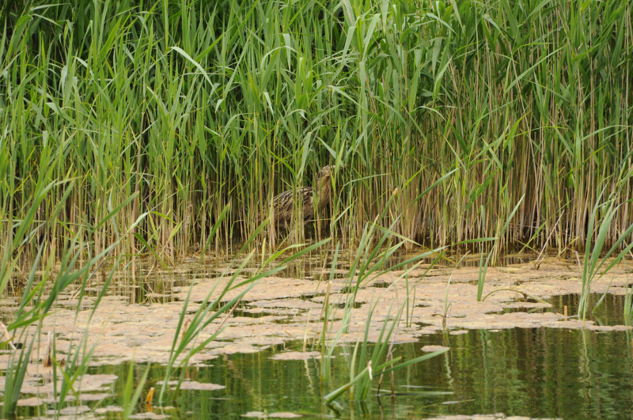

### Fenlandia

June begins with a trip out to Cambridgeshire, ostensibly to visit
family. They do live conveniently near some good birding spots
though.

Pronoun guidance: AB1's family. This post covers the events of June 1-3, 2018.

#### The Journey
 
We obtain transport in North London - a red Fiat Panda via
easycarclub - and drive up on the Friday night. The drive is remarkably
quiet; having set off at 7pm I was expecting to hit the "let's all get
out of London for the weekend" mayhem, but we make pretty decent
progress and arrive in Chippenham not too much more than an hour and a
half later.

#### The Early Bird...

Remarkably, I'm up in time to walk the dogs. Must be something to do
with the not-drinking. Dad and I go for a march around Chippenham
Fen. The first part of the walk is where all of the Skylarks in the UK
live, from what I can work out. I can see why - most of what I can see
is long, undisturbed grass; perfect for ground nesting birds. They're
remarkably tame too - many of the birds peck about on the path until
we're just a couple of feet away. It feels almost a little like
trespassing.

Eventually we cut left out of the grassland and onto a path that
leads between two hedges. On one side is the fen proper - there are
reeds and, Dad claims, a Marsh Harrier, most mornings. We cut right
to have a look at an old farm building. "There's often a barn owl
sitting at the back" says Dad. "Doesn't look like it-" WHOOSH. A barn
owl rockets out of the open face of the building, as if launched by a
ballista. It passes at most ten feet away from us, and I do some loud,
surprised exclaiming, and feel bad for having disturbed it. Well, that
was exciting. Dad has obviously planned this walk well as, just as we
reach the end of it, the fabled Marsh Harrier floats over.

#### Lakenheath

We reach home; there are some signs of life from AB2. Breakfast and,
eventually, an exit towards our first proper site of the day:
Lakenheath RSPB. Not before we've had an argument about whether we
left in an unnecessary rush, though. Thankfully, the left-behind
clothing items turn out to be rendered unimportant by an improvement
in the weather.

We get to the reserve, and immediately dip a Red-backed Shrike. The
finder has pictures but the bird, once found, disappears forever,
despite a solid effort by a bundle of excited birders. It's only later
on that I discover the finder on twitter; 
[here](https://twitter.com/sh4rpy/status/1002968249552850944)'s the
bird we missed.

Oh well. That would have been a bonus, but it definitely isn't what
we're here for. We're a bit late, but Lakenheath's Hobbies are the
thing we've come to see. Yes, we could see them elsewhere, but why not
see how _many_ we can see at once?

Lakenheath is a long, thin reserve - a five-minute walk from side to
side, but a good forty-minute walk from visitor centre to the
furthest viewpoint (if you don't stop). We stop a lot to have a good
stare at mostly unrewarding reedbeds. Well, that's unfair - just as
earlier I was in the land of the Skylark, Lakenheath is the land of
the Reed Bunting. One pops up from one set of reeds and down into
another every few seconds; we get tired of remarking on it, it's so
consistent. 

After a while, a substantially bigger bird looms past to our
right. Bittern! Bittern, flying in the sun! Not skulking in a reed bed
100+ metres away! It makes a thorough inspection of the watery area it
took off from, before deciding that a change of hiding place is called
for, and dropping into some reeds ahead of us. We're still getting
over this when it happens again five or so minutes later.

Did I mention the Cuckooing? When we aren't trying to ignore Reed
Buntings or getting buzzed by Bitterns, it's all we can do to not
scour all possible perching points for them. Unlike the birds I've
found at Two Tree Island though, these ones are more cryptic, using
the poplar plantations to conceal themselves. While scanning for one
though, I do pick up our first Hobby alighting on one such poplar. Not
a tremendous view; hopefully the viewpoint at Joist Fen will have
better.

A brief stop in a hide (brief enough to realise there are no seats,
and no chance of movement - this is a birding group who have just sat
down for their lunch), our third Bittern encounter (we're used to it
by this stage) and a flyover Cuckoo (good to clap eyes on one) later,
we reach the viewpoint.

<figure class="figure">
  
  <figcaption class="figure-caption text-center">
    An uncharacteristically uncryptic Bittern from a 2019 trip.
  </figcaption>
</figure>

#### Joist Fen

Upwards of fifty Hobby can be seen from here on a good
day. Evidently, this is not one of those days. I was hoping for _at
least_ two or three hunting dragonflies above the reedbed, but even
that, it seems, was too optimistic. I wonder if it is too hot, or too
cold, or too soon after rain. After a brief sulk, I decide I am going
to see another Hobby by sheer will. Far-flung horizons are sought out
with the scope. A distant heron is scrutinized; could it be standing
in front of a hobby? No.

In the end, I remember some advice from the last Hobby-related
conversation I had: "Look up". Now we're getting somewhere. There's a
bunch of swifts directly above us. A little above them, though, are
three birds that are unmistakably of the Hobby variety. A bit more
eye-straining yields four or five more - all gently sweeping along
what I'd guess is the path of the river, traced a couple of hundred
metres above the waterline. AB2 is (perhaps rightfully) unimpressed;
good numbers, but a pretty shabby view.

The sun is definitely out now, and we are hot. A flat walk back along
the river bank is called for. We're obviously hungry, as we get
unnecessarily cross with the uneven ground. We have another
speculative look for the shrike when we near the visitor centre but despite 
some serious staring at bushes its location remains a mystery.

#### Weeting Heath

Our next stop is Weeting Heath. Correction. Our next stop is
*lunch*. There's a pub that has reasonable ratings in
Hockhold-cum-Wilton, we'll try there. Nope, chalk up another casualty
to the "pubs that serve lunch for only five minutes on a Saturday"
fail. Thankfully there's a village store with no such qualms about
people eating lunch after 2pm, so we feast on cobs in the car
instead. Delicious.

Weeting Heath is only a short drive from here. There is disagreement
between our information sources as to which side of the road the
visitor centre (and more importantly the car park) is on. A gentle
approach gives us enough time to spot the car park (on the right, for
the record), we park up and head into the visitor centre.

The visitor centre is small but functional; the person taking the
money is also the person that knows where everything is. Beyond the
mildly icky feeling that I'm paying for bird information, this is, at
least, efficient. We follow the advice we've received and head towards
the West hide, where two Stone Curlew have apparently been putting on
a bit of a show.

We reach the hide. It is empty. Not a good omen. Still, the view is
beautiful; a rolling view of the heathland, bordered on two sides by
forest. A Curlew (Eurasian; the first time I've been required to refer
to it as such) flaps over the right hand edge.

Despite the lack of occupants, it turns out the advice was
correct. Near some odd-looking equipment (some sort of remotely
operated camera?) there are a couple of birds looking
awkward. These are definitely Stone Curlews, even just with binoculars. The 
scope offers a better view - the manic, beady eye becomes obvious, and the 
scuttling around is too. What odd creatures they are. Are they waders? I 
suppose they are, given where they are in the bird book, but what would you 
say is their nearest wadery relative? Perhaps some sort of giant grass 
plover? It's not clear. We have a great time watching them poke about in 
front of us; having not seen them before it's a treat to pick them up so 
simply and so well.

We tear ourselves away in the end - the possibility of Woodlark or
Tree Pipit in the woods on the other side of the road is just enough
of a temptation. That turns out to be a red herring; conversations
with birders returning from the route lower our expectations
appropriately, thankfully. An encounter with a distant Song Thrush is
the best we manage.

Our main achievement is to follow the occasionally
ill-signed path almost all the way around this area; when we near the
road again we fashion our own escape route through an area where the
nettles are a bit thinner. The Yellowhammer that sang at us as we
crossed the road the first time is still going, but we can't pinpoint
where it is; possibly due to the level of focus we're investing in not
getting run over.

We safely return to the car. It is hot. We get through the last of our
water and snacks and have a breather; we've done a fair amount of
walking at these two reserves with non-trivial baggage. Should we have
a look at the East hide?  No. Communications are reaching us from the
rest of the family that they are heading home from their day's
outings, and that a barbecue will likely be imminent. We drive back
via Thetford Forest (with a brief look at Lynford Arboretum's car
park (nice Grey Wagtail), for future reference).

The Sunday brings no birding opportunities, and we head home after a
pleasant lunch. To Hobby and Stone Curlew, we add a third tick -
one attached itself to my left leg, presumably on the Saturday
morning. It hasn't done a great job of feeding though; it's still a
pinprick. I follow the recommended tweezers approach; it seems to
work, Lyme disease will hopefully not follow.