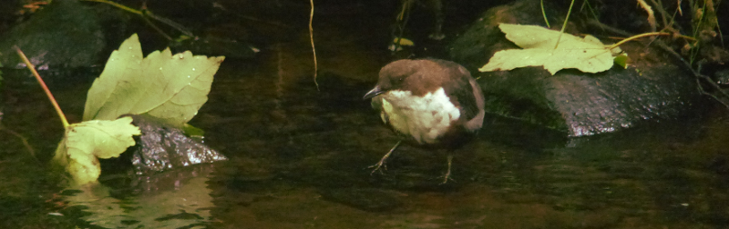
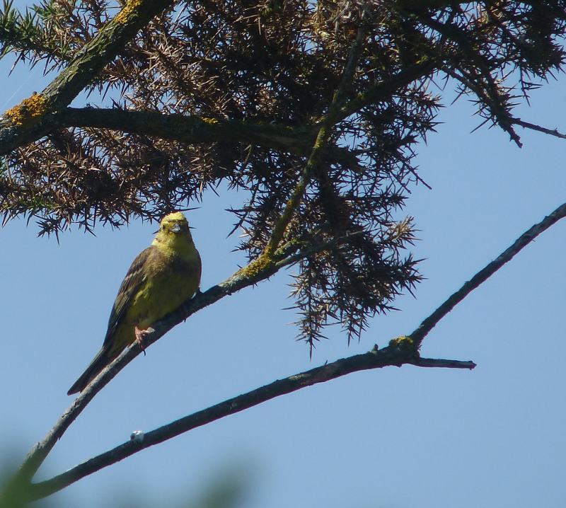
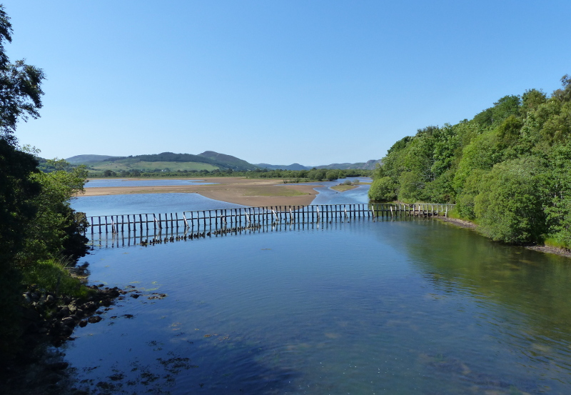
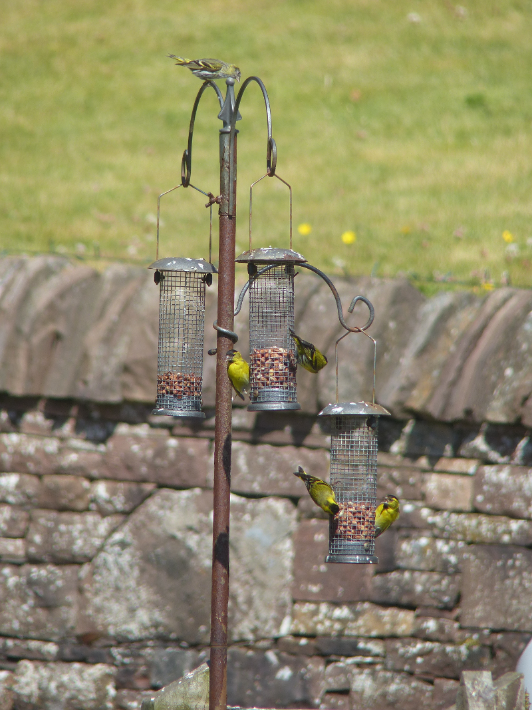
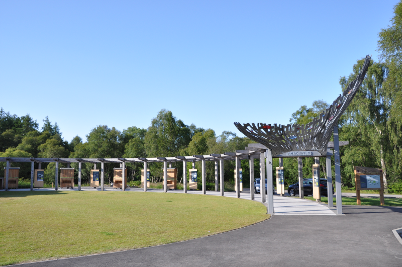
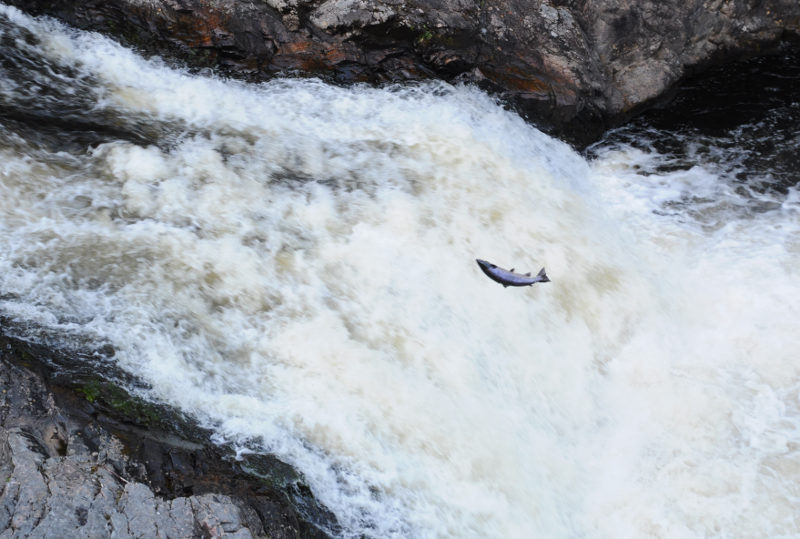
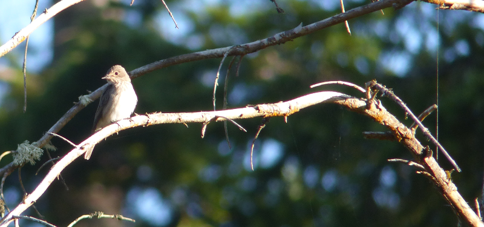
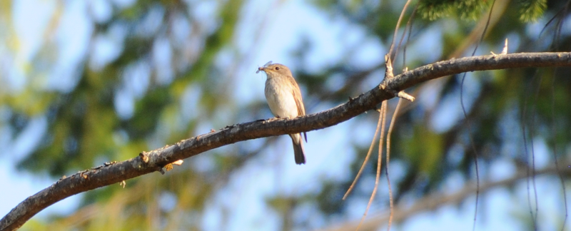
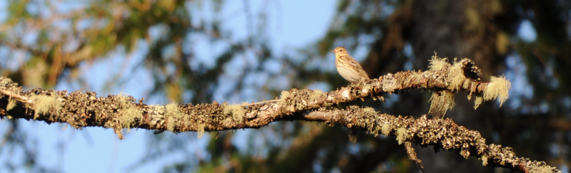

### An Osprey Spectacular

It's time to go to Scotland, and I am _very_ excited.

The plan is to drive from Inverness up to the North Coast, then down
the West coast, overnighting at various campsites. Depending on how
long that takes, we'll improvise with whatever time we have left.

Pronoun guidance: AB1 is excited. This post covers the events of June 29-30th
, 2018. AB2 is excited too, to be clear.

#### More plan details.

Camping is a bold plan. AB2 and I have camped before, but only for a
night or two; this holiday is going to involve up to eight nights in a
row. How we'll cope with this is anyone's guess; a test erection of
the tent in the back garden only generated one mild argument (over how
to put the tent away without getting the dry bits wet), so I'm
unusually optimistic.

We spend the first night in a modest B&B near the airport - we arrive
too late to get much further, and even the drive to this place is
borderline entertaining, along considerably tight roads in pitch
darkness.

#### Stage 1: Inverness to Fairy Glen

The next morning we are up and about...reasonably early - we've got a
pre-booked shop to pick up from Tesco, and, it turns out, some
additional camping-related items to pick up from a local Go
Outdoors. From there, we finally make a start, driving North out of
Inverness on the A9. As we cross the Beauly Firth, I start to
relax. The year _outside_ birding's been taking its toll; it's a
marvellous sensation to feel some of the layers of stress shedding
away, and being replaced by excitement.

We've been to the Black Isle before - so we skip the Black Isle
Brewery tour (worth a visit if you're in the area, the heather honey
one is very nice) and Canonry Point (cold, windy, impossible to park,
no sign of promised cetaceans) and head instead to RSPB Fairy
Glen. Gordon (the author of the book) tells us this is a great place
for a Dipper. Yes, we have Dipper already, but one should never turn
down an opportunity to see another. We also have no idea how good
Gordon's advice is going to be; this is an ideal test.

We trot off up the path; we've gone barely 100m before a Dipper pops
up for us. Excellent. Ten points to the book. Bonus - the popularity
of this walk means it is accustomed to people, and doesn't immediately
fly off upstream, as Dippers are wont. We spend an inordinate amount
of time taking what turn out to be fairly average photos (the light
wasn't tremendous, in our defence) before deciding that making
further progress North is more important to us than the remainder of
the walk up to the falls.

<figure class="figure">
  
  <figcaption class="figure-caption text-center">
    A rather dapper Dipper, we must say.
  </figcaption>
</figure>

#### A terrifying car ferry

Did we mention the weather? It is _spectacular_. As a result, the
views over the firth from the remaining route to Cromarty are
phenomenal. From Cromarty we're going to get the ferry over to
Nigg. 

This is somewhere between entertaining and terrifying. Before the
ferry even arrives I've got myself into a state; having parked the
car I realise there are enough road markings to
tell me I am in completely the wrong place. Escaping it will require
something akin to reverse parking; my least favourite manoeuvre,
particularly in a car I don't know, and this car, in addition, has one
of those _useless_ proximity sensors that goes into
heart-attack-fetch-the-defibrillator mode when the sensor is briefly
washed over by an imaginary breeze. 

The ferry turns up. It carries two cars, if you can park them
within about 1mm of each other. Getting on to the ferry is no great
drama; we're well directed by the steward. I put the handbrake on with
great glee, exit the car and enjoy the ride across, safely separated
from the more social side of the boat by the two cars on board. I'm in
denial about what's going to have to happen at the other end; I am
inventing mechanisms by which the boat will magically flip around on
mooring so I can drive off the same way I drove on, i.e in first gear,
rather than reverse.

No such luck. Worse, we have to watch some stereotypically efficient
Germans easily manhandle their giant SUV off first. In the end, it
isn't as tricky as I'd feared - one only needs to reverse straight
off, and do it slowly to let the weight of the boat keep the ramp
reasonably steady. Barring one non-actionable piece of advice from the
co-driver, we make it off the ferry alive, and make quick work of the
short drive to RSPB Nigg Bay.

#### RSPB Nigg Bay

This is a marvellously simple reserve; a small car park, 150m of path
to a hide. Excellent interpretive panels. Before we get to
that though, lunch. Cold Spanish omelette in burning hot sunshine. Perfect. Two
or three Yellowhammer serenade us while we eat. The beginning of a long search
for Whinchat begins - I could easily imagine one in the foliage on the
other side of the road, or on the telephone wires. No joy though.

<figure class="figure">
  
  <figcaption class="figure-caption text-center">
    Haven't we seen this Yellowhammer somewhere before?
  </figcaption>
</figure>

Ok, yes, we cheated, last post's Yellowhammer image was actually from here
, sorry.

Once we've finished our car-based feast, we trundle down the track to
the hide, accompanied by Linnets and Reed Buntings. The hide is glass
walled, and, as a result, stiflingly hot. No-one has told this part of
Scotland that the weather is supposed to be terrible all the time.

The view from the hide is marred by another side effect of the weather
- anywhere with significant land between us and the water has a
seething heat haze on it. The bunch of waders on the far shore are
rendered unidentifiable. I'd guess mostly Curlew and Redshank
based on size, but they could all be Long-billed Dowitcher for what we
can see. Giving up on birds on the ground, I look up. Gordon claims we
should see Osprey here, and, unlike Dipper, that would be a tick.

There is a bird of prey flopping about at the end of the channel that
runs on the landward side of the sea wall. In the moments where it's
above the heat haze, but below the horizon, its lighter parts indicate
it is an Osprey. This is borderline unbelievable. Other site guides we've read
offer almost guaranteed disappointment; Gordon, so far, is two for
two.

#### Loch Fleet

<figure class="figure">
  
  <figcaption class="figure-caption text-center">
    Loch Fleet Nature Reserve, looking towards Lairg. Told you the weather
     was good...
  </figcaption>
</figure>

Back to the A9. Another gorgeous crossing follows, this time across
the Dornoch Firth. Our next stop is another bridge; or maybe it's more
of a causeway. Yes, we're at Loch Fleet. There's only a limited amount
of exploring to do here, but we make a good go of it. First, we poddle
across the smaller bridge, where Swallows are zipping around it and Siskins
are mobbing some well-tended birdfeeders in a garden across the way.

<figure class="figure">
  
  <figcaption class="figure-caption text-center">
    Five siskins having a feast.
  </figcaption>
</figure>

Returning to the original side, we get the scope on the contents of
the muddier side of the Loch, which is festooned with Curlews. We
spend a lot of time getting very excited by a completely
unidentifiable bird sitting on the mud, until it stands up and reveals
it is a juvenile Black-headed Gull with most of its face covered in
blood. Nice.

Just as we're rolling out of the car park, three birds of prey float
in. Oh balls. Those are Ospreys! The car is unceremoniously ditched, optics are
fetched out again and a less heat haze mangled view of Osprey is duly
had. Wow.

The next stop isn't much further as the crow flies - the car park to
access it, is, however - we drive all the way Golspie only to do a 300
degree turn back towards Littleferry. Believe it or not, we're still
on the same nature reserve. This side is considerably more
wooded. Gordon claims Redstart and Crossbill are possibilities here,
as well as yet more Ospreys. A beautiful walk through the woods
yields, amusingly, two more of the third only; and these Ospreys we
_hear_ as well as see. Woodland birds are a bit thin on the ground; a
small band of Long-tailed Tits and some very proud Chaffinches.

#### Making camp in Lairg

That's enough Loch Fleet - we're starting to get into late afternoon,
and we promised ourselves that we'd get to the campsite and pitch in
time for some dinner. We head back towards the Mound end of the
reserve, but this time, turn North West along the A839 towards Lairg.

This is an _unbelievably_ scenic road; it follows the River Fleet's
valley back up into the the hills until it disappears under a
forest. It also appears to be home to a double digit percentage of the
UK's Pied Wagtails. They are all over the place!

Our first campsite is just North of Lairg, [Pondside Camping](https://www.pondside.co.uk/). AB2 ferrets out someone from
reception to pay, we drive into what we guess is an area we can pitch
and get the tent up. Excellent work, all round.

We realise that, given it's 6pm, we have another four to five hours
of daylight. That's more than enough time for another solid bit of
exploring, so we set out towards the Falls of Shin. According to all
of our sources, there should be: a) a waterfall; b) salmon jumping
up it; and, c) a nice woodland walk.

#### The Falls of Shin

The capitalisation, it turns out, was warranted. We were expecting a
car park and a (probably already closed) cafe, but everything is shiny
and new, there's a visitor centre worthy of the name and a restaurant
attached to it that _almost_ manages to tear us away from the picnic
we've got ready in the car. This is the sort of place I can imagine a
coach tour turning up; I'm suddenly very glad we aren't in the school
holiday period.

<figure class="figure">
  
  <figcaption class="figure-caption text-center">
    This is cutting edge modernity for a visitor centre.
  </figcaption>
</figure>

We decide to explore the falls to check the veracity of the salmon
claim. We are sceptical; fish jumping, we suspect, only occurs when Grizzly 
Bears and a BBC wildlife camera team is present. To our great surprise, salmon are
demonstrably (if intermittently) trying to jump up the falls; we see
one within the first couple of minutes. It's quite something! 

The fish are not small - a good couple of feet long, I'd guess, and they often
stay airborne for a good second or so, thrashing at the air
ineffectively. AB2 makes some excited "wheeee" noises. We guess that
under the surface, more success is had - each fish we see go airborne
seems to go backwards. We spend a good fifteen minutes failing to
photograph this event before deciding we really need to eat some food.

<figure class="figure">
  
  <figcaption class="figure-caption text-center">
    Actual jumping salmon! Yet no Grizzly Bears. You lied to me, BBC.
  </figcaption>
</figure>

Back up the ramps to the car park, there is a well-tended picnic
area for this very purpose. After a quick lie down in the sun (I've
been driving all day, and I'm still not _totally_ relaxed; I've found
that being connected to the ground in as many places as possible
helps), we examine the interpretive panels in hope of figuring out a
suitable circular walk.

It turns out there are several - we pick the intermediate one, which
should take us somewhere in the region of forty minutes. We've gone
all of five before we're _surrounded_ by bird song. Bird song that
falls into the "interesting" bucket: definitely not the usual
suspects. Annoyingly, this coincides with standing on an area of path
that is being swarmed by flies. Perhaps this explains what the first
noise is: a family of Spotted Flycatchers (a later check on
[xeno-canto](https://www.xeno-canto.org) tells us what we were hearing
was the begging call of the juveniles). The parents are flycatching
between three or four of what we guess are their favourite perches.

<figure class="figure">
  
  <figcaption class="figure-caption text-center">
    A spotty in the sunshine.
  </figcaption>
</figure>

We perform a strange dance of looking at the birds, sprinting 10m
while flailing our arms at the flies, stopping for another look and
then returning to the first point in the same fashion. This either
goes unnoticed by the flycatchers, or they find it amusing enough to
not be too bothered by it, because this technique yields some lovely
views, and to our later surprise, some not totally awful photos.

<figure class="figure">
  
  <figcaption class="figure-caption text-center">
    The clue is in the name!
  </figcaption>
</figure>

As we move onwards, the second unidentifiable noise gets louder, and
then gets resolved - this time we've got a family of Willow
Warblers. They're hopping about in the lower shrubs; making steady
progress - they cross the path and then, without seeming to go too
quickly, are out of sight and earshot in under a minute.

On their own, these encounters would be enough to make this a
worthwhile walk, but we soon realize that these two species are the
two standard birds for this piece of woodland (or, at least, they are
on a summer evening); we see several more groups of both as we go.  If
we were counting, we'd have lost count of both species by now.

As the path heads uphill, the wood thins and becomes more heath-like;
the path traces the border between the two. A few scattered chats do
their usual perching routine, they are all Stonechat though. On the
wood side, something that is neither flycatcher nor warbler is sitting
on a branch. It looks a bit like a Meadow Pipit. I get excited; a
meadow pipit sitting in a tree is probably a Tree Pipit. After
checking the bird book, the more diagnostic differences (thicker beak,
finer streaking on flanks, etc) are also present.

<figure class="figure">
  
  <figcaption class="figure-caption text-center">
    Also, you know, it's in a tree...
  </figcaption>
</figure>

For a woodland walk to yield such density of birds is quite
unusual. Most woodland birding, in our experience, verges from 'mostly
bird free, with occasional flocks of the usual suspects' to 'dour,
walk through ostensible dark (and possibly dead) forest'. This walk
has been neither of those; what a delight.

#### Raven's Rock Gorge

Back to the car. Hours of daylight remaining: two. Jeez. How do people
cope with all of this time? We consult with Gordon. Apparently one of
the UK's highest rated woodland walks is a short drive away (Raven's
Rock Gorge), and, as a bonus, it has a giant sculpture of a bear at
the end of it. We might also hear Long-eared Owl there. Worth a go! 

In the end, the walk ends up rather shorter than we expected - fifteen
minutes either way - and, wildlife wise, it is somewhat
underwhelming, with Grey Heron the only bird of note. Perhaps we're just a bit
late, or a bit tired, or we went the wrong way. 

The drive there was lovely, mind - spectacular views along the Kyle of
Sunderland. Oh, and the bear sculpture provided some small entertainment. We
probably don't wait until late enough to hear the owl - at some point AB2
and I wordlessly agreed it would be nice to get back to the campsite soon, i
.e before it gets dark.

#### Back to the campsite

We get back to the campsite for just before 10pm. There's still plenty
of light. There are also plenty of midges. The 'Pondside' should
probably have warned us of that. I can hear a Grasshopper Warbler
reeling somewhere in the field on the other side of the pond. Time for
one last tick? It's worth a go.

Finding this little brown job turns out to be much harder than I'd
hoped. The open landscape makes the sound not that useful in getting a
fix on the bird. We do a lot of wandering around with our hands cupped
behind our ears; all this does is convince us the bird is further away
than we thought. 

As this field rolls away from the campsite, it gets progressively
damper, ending up in a tiny burn. As it dampens, the foliage gets
deeper - a mixture of longer grasses and small shrubs. If the bird is
below the grass layer this is hopeless; so we just need to scan the
things sticking up from it. A first look at these yields no
fruit. AB2 decides that the midges/bird ratio has dropped below
critical and heads back to the tent ("I have faith in you" she says,
cryptically, on her way off). I hang about a bit. The reeling stops. I
start to follow AB2's footsteps, and after a few seconds it
restarts. Oh, we're playing that game are we? Well. Well then.

I decide the bird is, once again, further away than originally
thought. I move further along the field, where an area of the drier
grassland juts out into the denser stuff. The reeling continues,
seemingly still right in front of me. Another scan of the bushes and
shrubs yields nothing. The reeling stops. I start heading back to the
tent again, to see if that has the same effect. The reeling begins
again. Back we go. 

This time I try varying where I stand between multiple scans of the
various plants sticking out of the long grass. There's the little
brown beast; barely a couple of inches above the vegetation line, on a
tiny offshoot of what looks like a thistly tree (botany isn't my
strong point, sorry). It won't stop reeling now, with it's mouth wide open the
whole time, giving the impression that the whole bird is vibrating. Perhaps
it is; the percussive nature of sound and Newton's 3rd Law suggests it might
be.

I return triumphantly to the tent and collapse into one of the best
sleeps I've had for ages. Fourteen hours outdoors. Six Ospreys. Four year
 ticks. What a day!