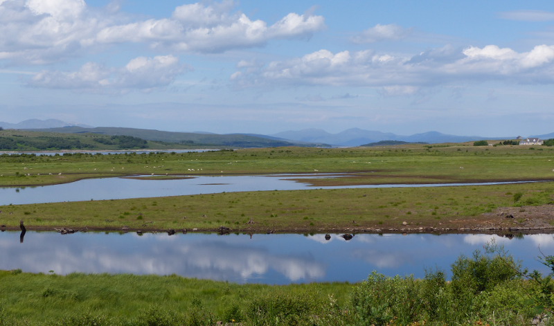
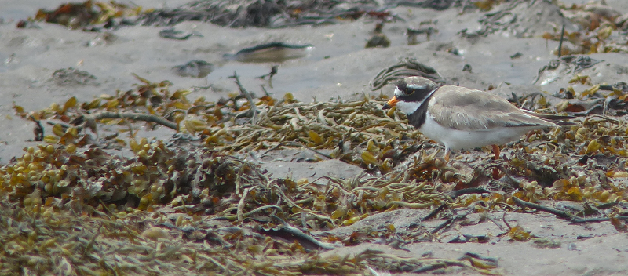
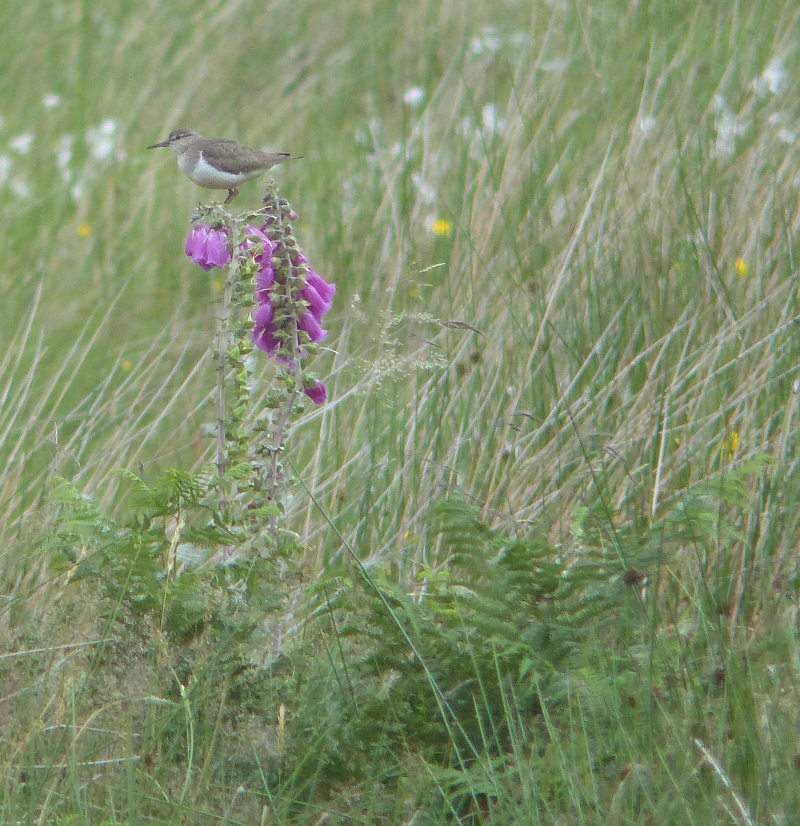
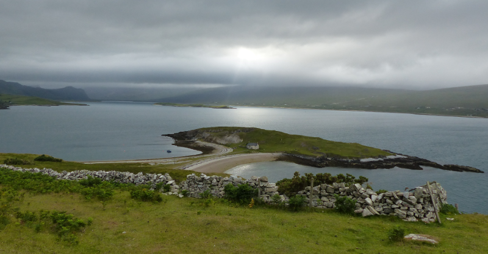

### Distant Diver

Day two in Scotland can't rival the first, but the views get pretty close.

Pronoun guidance: AB1's beer. This post covers the events of July 1st, 2018.

#### Location location location

<figure class="figure">
  
  <figcaption class="figure-caption text-center">
    View from the Dalchork Bird Hide.
  </figcaption>
</figure>

The next day has some excellent locations, but only one tick. We
encounter Stonechat (no Whinchat, mind) and Redpoll (a little flock
flitting between three areas of silver birch) on a very pleasant walk
from the Ferrycroft Visitor Centre. 

We enjoy excellent views of Redshank and Ringed Plover (as well as the
mountains behind Loch Shin) from the famed Dalchork Bird Hide. A picnic
alongside Loch Loyal is rather briefly held - rain briefly attempts to
intrude; we retreat to eating in the car.

<figure class="figure">
  
  <figcaption class="figure-caption text-center">
    There's always time for a Ringed Plover.
  </figcaption>
</figure>

Our planned campsite at Tongue is being renovated. We don't much fancy
pitching in the tiny area leftover from the building site, so we
decide to fast forward to our next location in Durness. From the
second carpark on the crossing of the Kyle of Tongue we do pick up a
distant Black-throated Diver, though; an excellent tick to find so
early on - despite the fact they breed in basically all of the bit of
Scotland we plan to visit, they are not the easiest birds to see.

<figure class="figure">
  
  <figcaption class="figure-caption text-center">
    OK; for this part, the weather did look a little threatening.
  </figcaption>
</figure>

A brief trip down a very tiny road takes us to the path up Ben Hope -
we decide against a hike up - there isn't time, and the weather looks
a bit shifty. The atmosphere's not helped by a family of Peregrine Falcon
otherworldly screaming somewhere up towards the tops. We do, however, enjoy
the sight of a very bold Common Sandpiper down in the valley below.

<figure class="figure">
  
  <figcaption class="figure-caption text-center">
    Foxglove Common Sandpiper.
  </figcaption>
</figure> 

The drive from there to Durness is highly scenic,
helped by some fairly apocalyptic light - thick cloud occasionally
being penetrated with summer sunshine, but barring the constant Pied
Wagtails and a few auks on the various sea inlets (We spend a few
stops looking for other divers, or a better view of Black-throated),
we don't see much in the way of birds.

<figure class="figure">
  
  <figcaption class="figure-caption text-center">
    Apocalyptic views over Loch Eriboll.
  </figcaption>
</figure> 

We find a place to pitch, strategically placing our car to act as a
windbreak - the weather is still sub-par, the wind has a bit of bite,
and we don't remember if our tent is a budget special or something
more substantial. We take residence in the campsite's pub to plan the
next day's activities and get our first reminder that there's some
sort of world-footballing event happening. 

After a first beer in something like five months, we decide to add our weight
to the ballast keeping the tent in place and get an early night; the clouds
have brought the day to an end a bit earlier than usual.