### Cape Wrath

We wake to the smell of bacon sandwiches; there's a food wagon on site
and it makes breakfast from 7:30. The sun is out, and the breeze has
lightened; good, we've got a packed itinerary to get through today.

Pronoun guidance: AB1's loon-fu is insufficient. This post covers the events
of July 2nd, 2018.

Editor's note: this was another ridiculously good day. Prepare yourself.

#### Early morning mustelids

I go for a quick stare at the sea with the scope. On the way, I am
greeted with the question "so you like wildlife then?". Uh-oh. Am I
breaking some sort of telescope rule? I opt for embarrassed honesty:
"yes, wildlife, that's me". "Well, if you walk about 20m that way,
there's a family of weasels playing in that gully". Amazing. 

The gully's full of twisty grasses and shrubs, so the view is of an
occasional brown shape shooting in and out of the top of it, but what joyous
little things they are. Are they weasels, though? I'd potentially say they
were big enough and dark enough to be stoats, but I'm not even a novice here
, so who knows.

<figure class="figure">
  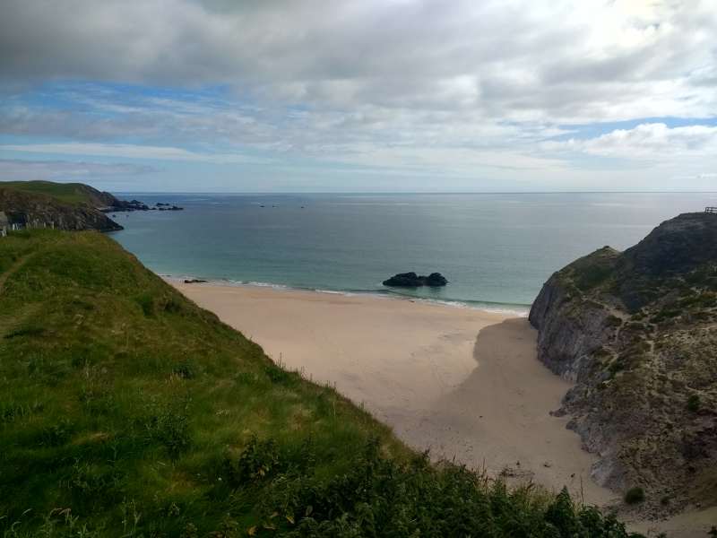
  <figcaption class="figure-caption text-center">
    Picture postcard quality Sango Sands.
  </figcaption>
</figure> 

The view over the sea is phenomenal - this area of the UK is famous
for its pristine beaches, and Sango Sands is definitely one of
them. Bird wise, I am struggling - the sun is still quite low over the
sea, so I'm staring at a bunch of silhouettes. I can tell two of them
are divers, but my loon-fu isn't sufficiently elite to discern which
sort.

Back to the tent for a well-behaved breakfast of yoghurt and granola
(we both want a bacon sandwich, but having brought food with us, to
let it go off would be unacceptable). A short drive to Balnakeil beach
followed by a short walk around the promontory between there and
Durness is the first item on the agenda.

#### Durness circuit

<figure class="figure">
  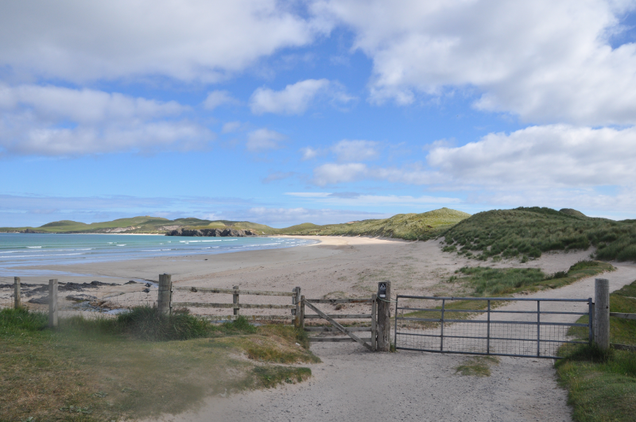
  <figcaption class="figure-caption text-center">
    Yet another postcard view at Balnakeil beach.
  </figcaption>
</figure> 

Gordon tells us that the area around a lake roughly half way through
this walk is a possible Corncrake site. That may well be true, but our
chance of seeing one at this time of day is zero in any case. Instead,
we enjoy the views of Fulmar from the cliffs - I get some more time to fail
to take any decent flight photos of them.

<figure class="figure">
  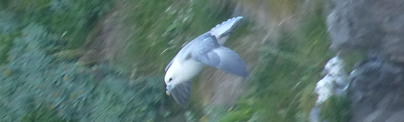
  <figcaption class="figure-caption text-center">
    This one had just launched itself off the cliff.
  </figcaption>
</figure>

<figure class="figure">
  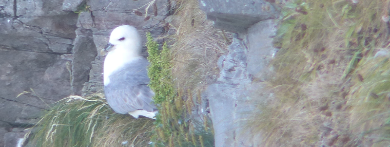
  <figcaption class="figure-caption text-center">
    Fine, I'll just take a photo of you on the nest then.
  </figcaption>
</figure>

In the grassland, we encounter a family of Wheatear, with some fluffy
youngsters. We also find what we think are a pair of fluffy Lapwing chicks
, and, slightly easier on the ID front, we pick up the trip's (and the year's
) first Ravens.

<figure class="figure">
  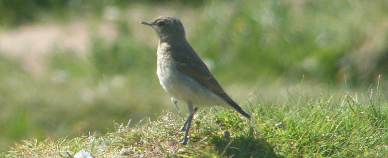
  <figcaption class="figure-caption text-center">
    It took a parent arriving to help us out with the ID here.
  </figcaption>
</figure>

<figure class="figure">
  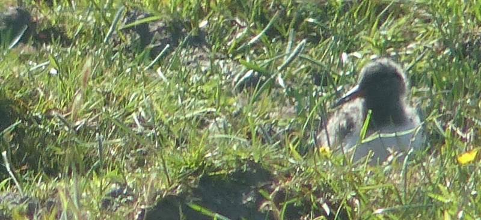
  <figcaption class="figure-caption text-center">
    Juvenile Lapwing. We think.
  </figcaption>
</figure>

In the reedbed North of the lake, we also pick up a Sedge
Warbler; notable only for how far North we are - Gordon lists a site
considerably more Southern than here as his most Northerly, so we're
mildly triumphant that we've exceeded that.

<figure class="figure">
  
  <figcaption class="figure-caption text-center">
    Weather status: back to incredible.
  </figcaption>
</figure>

We turn our walk into a circuit by walking back down the road to the
beach. AB2 hives off into the craft village while I collect the car -
an ideal separation of responsibilities.

<figure class="figure">
  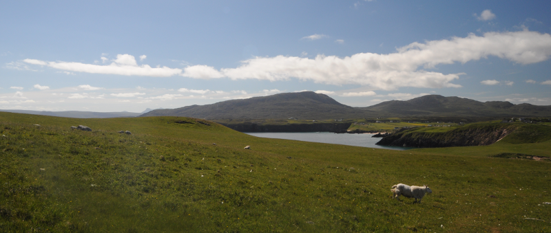
  <figcaption class="figure-caption text-center">
    The view back to Durness. Plus bonkers sheep.
  </figcaption>
</figure>

#### Cape Wrath

Our next stop is Cape Wrath. A very metal sounding place. We park up
(badly) near the shore of the Kyle of Durness and await the ferry. The
weather, at this point, has transformed into "full on awesome". The
visibility over the mountains to the South and South East is
jaw-droppingly beautiful; we think we can see Ben Hope's peak and
wonder whether climbing it today might have been a good plan.

The ferry trip is short, over some of the clearest water I've seen in
the UK. On the other side, two minibuses await to take us along the
road to the lighthouse at the end of the Cape. We barrel in to the
front seats of one of these as fast as we can; sticking me in the back
of a minibus over forty minutes of rough track is a sure-fire recipe for vomit.

The minibus driver is also our tour guide. He's a veritable mine of
information about the goings on of the Cape (it's mostly used as a
military range, but its remoteness also makes it a haven for nature),
and has a keen sense of humour. Our choice to sit in the front means
we can hear everything he says: bonus. We can also hear grousing in
the back about being unable to hear anything. Schadenfreude
bonus. Another front seat perk: we see Arctic Skuas before anyone else
- a group of four circling above the track. Life tick. Get in.

We stop around two-thirds of the way along in the hope of a better
Skua view: a couple of pairs nest of some mounds right next to the
track. They are absent at time of passing; we'll have another look on
the way back.

Eventually the tour guide runs out of facts and starts to ask us about
us. It turns out that he used to live about ten minutes away from
where I grew up, and, hilariously, his son went to the same school as
me (and, after a bit of thinking later, was even in my year
group). We're still getting over precisely how bonkers this is when we
pull into the car park at the lighthouse.

<figure class="figure">
  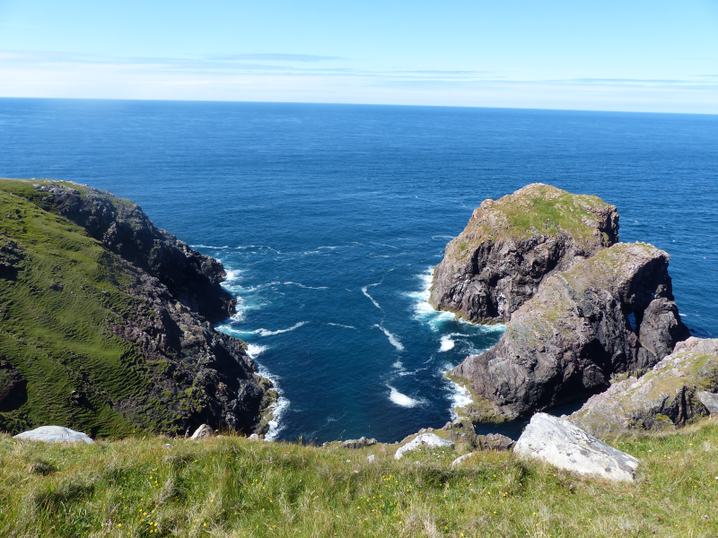
  <figcaption class="figure-caption text-center">
    Not pictured: the sound of the sea.
  </figcaption>
</figure>

I could stay in places like this lighthouse for a very long
time. There's something about the combination of green grass, cliffs
and the sea bashing into them that really grips me. I can see
why the lighthouse café operator has been out here for so long.

<figure class="figure">
  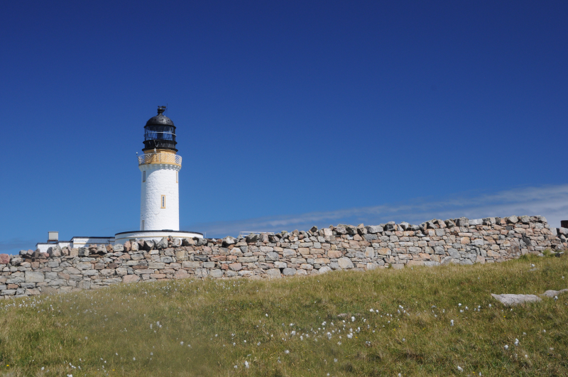
  <figcaption class="figure-caption text-center">
    The lighthouse.
  </figcaption>
</figure>

The grounds of the lighthouse and its outbuildings are perfect
Wheatear territory, and true to form, there are two or three of them
commuting between their favourite perch points. The cliffs and sea
surrounding the point are dotted with auks, including Puffins. What a
tremendous place. A shame we have only an hour here - it zips past
in what feels like mere minutes.

Back to the minibus. On the way back, the Skuas are on show; handily,
there's one light and dark morph, so I can get out my one Arctic Skua
fact.

<figure class="figure">
  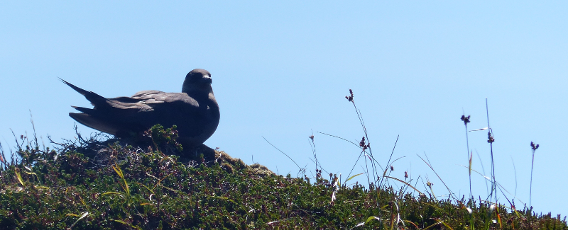
  <figcaption class="figure-caption text-center">
    Arctic Skua in the Summer sun.
  </figcaption>
</figure>

Barring a few Stonechat, a highly idiotic sheep and some seals
lounging on a newly exposed sandbank in the Kyle, the journey back is
otherwise uneventful. Something about the temperature and the
roughness of the road takes me back to our tour of the Pantanal of
around a year ago, and I am awash with sleepy nostalgia.

<figure class="figure">
  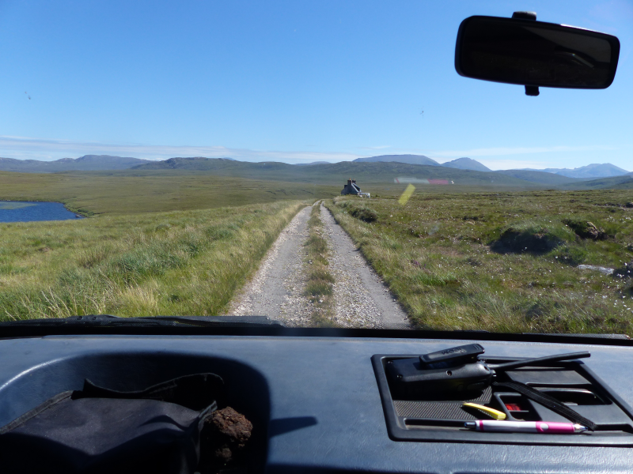
  <figcaption class="figure-caption text-center">
    It's worth getting in the front...
  </figcaption>
</figure>

The ferry back across the Kyle provides yet more opportunity for
gawping at the scenery. What a pleasant trip.

<figure class="figure">
  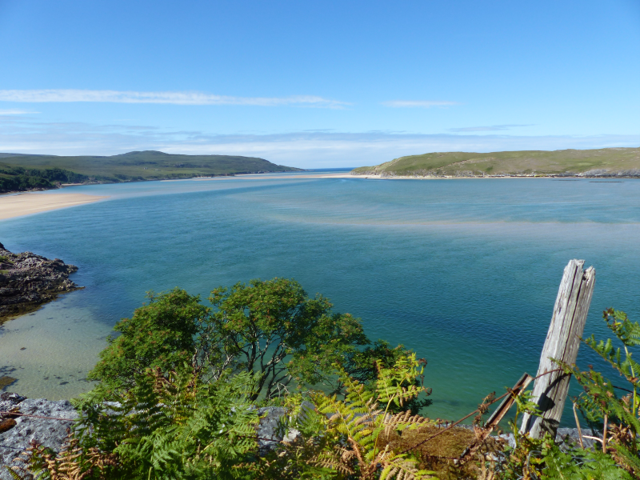
  <figcaption class="figure-caption text-center">
    The view North from the Cape side, up the Kyle of Durness.
  </figcaption>
</figure>

<figure class="figure">
  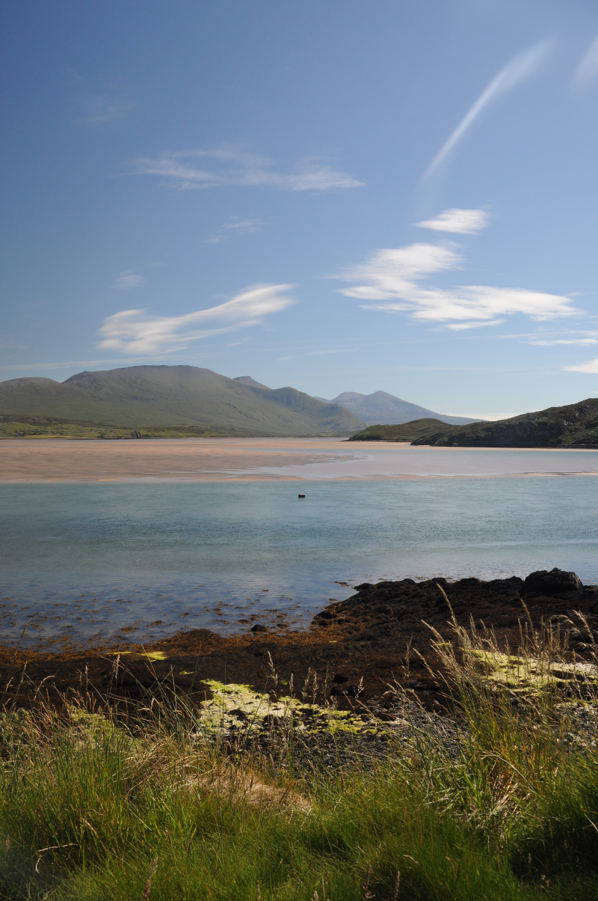
  <figcaption class="figure-caption text-center">
    The view South East from the harbour, towards Ben Hope.
  </figcaption>
</figure>

#### Oldshoremore

We've one place left to visit today - the beaches of Oldshoremore. This
is ostensibly a scenery jaunt, but Gordon tells us the crofts around
the beaches are a potential place to find Twite.

The drive there is full of more amazing geology - you can see why the
whole North Coast 500 has been a marketable ploy. Eventually we arrive
at a tiny bay (mildly stressed by tiny roads and local drivers). We're
one bay further round than we ought to be, but it looks like a nice
walk, so this will do.

The nice walk turns into a bit more of a scramble than
intended. Borderline coasteering. It does inadvertently deliver some
lovely views of Red-throated Diver, Shag, and Black Guillemot, which briefly
appeases AB2, who is unhappy at the quality of navigation on
offer. No sign of any Twite though.

<figure class="figure">
  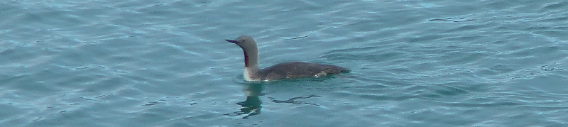
  <figcaption class="figure-caption text-center">
    Red-throated Diver. (There was a pair, but this single is the best image)
  </figcaption>
</figure>

<figure class="figure">
  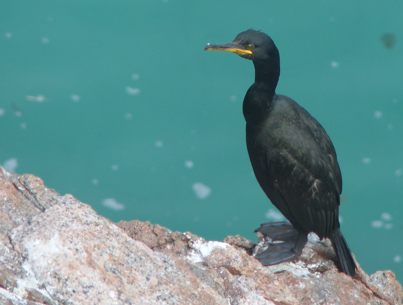
  <figcaption class="figure-caption text-center">
    Shag.
  </figcaption>
</figure>

<figure class="figure">
  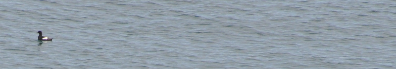
  <figcaption class="figure-caption text-center">
    Black Guillemot. Barely a record shot, but it'll do.
  </figcaption>
</figure>

<figure class="figure">
  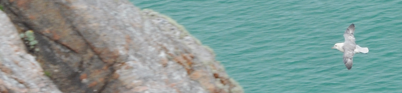
  <figcaption class="figure-caption text-center">
    Oh, and there was time for another flying Fulmar attempt.
  </figcaption>
</figure>

We eventually make it round to the intended beach; again, stunningly
beautiful; we worry we're going to get inoculated to this level of scenery
if it keeps going.

<figure class="figure">
  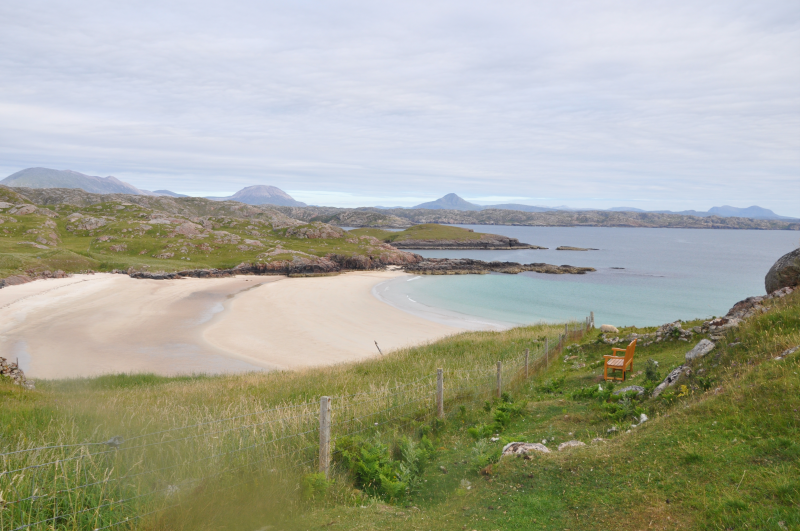
  <figcaption class="figure-caption text-center">
    This is just getting silly.
  </figcaption>
</figure>

#### Scourie

The return journey to the car is less eventful: we
manage to cut across between the bays rather than walking the coastline
this time, so it takes five minutes rather than half an hour. We
negotiate the tiny roads back to, well, slightly closer to civilisation
and eventually end up on a campsite in Scourie, where AB2 persuades the
attached bar to give us enough boiling water for a Pot Noodle each. 

What a day. To cap it off, here's the campsite view.

<figure class="figure">
  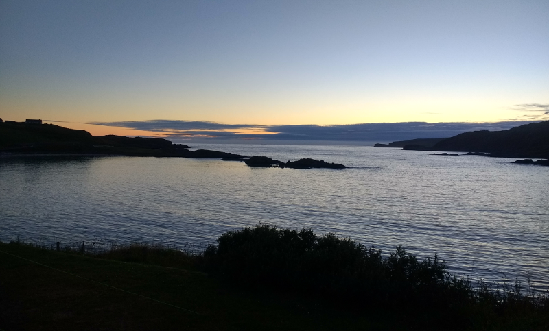
  <figcaption class="figure-caption text-center">
    Goodnight!
  </figcaption>
</figure>