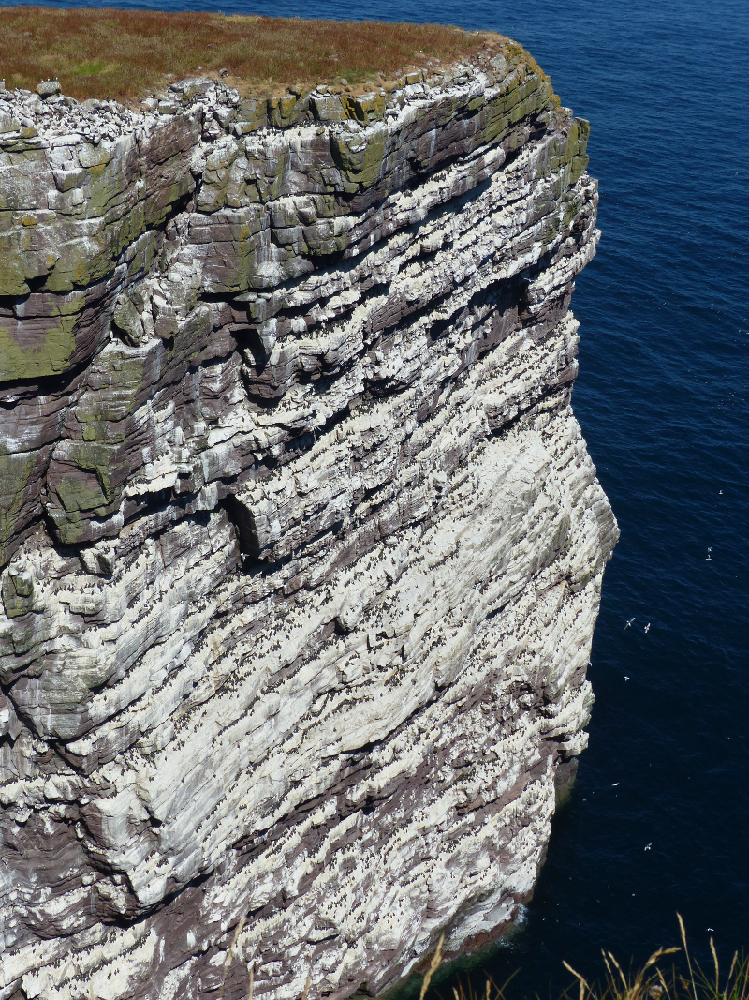

### Handa

The next day's itinerary is less busy: the only item on the agenda is
Handa. As a result, the start of the day is a bit more relaxed;
there's plenty of time to gawp at the pair of Red-throated Divers
looking for their breakfast in the bay.

<figure class="figure">
  
  <figcaption class="figure-caption text-center">
    A nice way to start the day.
  </figcaption>
</figure>

Pronoun guidance: AB1 is up early enough to spot the divers, as ever. This
post covers the events of July 3rd, 2018.

#### Tarbet

Handa island is just off the coast, ferries sail from Tarbet during the
warmer months, which corresponds to the island being full of birds.

<figure class="figure">
  
  <figcaption class="figure-caption text-center">
    The view in Scourie.
  </figcaption>
</figure>

After a brief morning constitutional around Scourie, and a minor debate about
the level of hurry required (there are only limited boat spaces, AB1 hates
queuing, etc), we make it to Tarbet in reasonable time. We won't be on the
first ferry of the day, but the second looks hopeful.

As we wait next to the jetty, a Great Skua floats over. That's a bit of an
anticlimax; the whole Handa trip is to see Great Skua; they nest there. Still, a
tick, can't complain.

The ferry arrives, and we undergo the usual land/sea transition of
"it's nice and warm today" to "you know what, with the spray and the
wind I'm glad I brought my jacket". A few short minutes later, and we're there.

#### Handa Island 

We arrive on another ridiculously good-looking beach. This does manage to
fill our shoes with sand on our way to the information hut, unfortunately.

After a brief use of the facilities and some stashing of unnecessary
layers in the hut, we head off on the path towards the centre of the
island.

<figure class="figure">
  
  <figcaption class="figure-caption text-center">
    The facilities.
  </figcaption>
</figure>

The path is _deadly_ for birders. To stop it interfering too much in
the drainage of the island, frequent canals a foot across and deep have
been cut into it. I spend the first ten minutes narrowly avoiding
them. Finally, with a fit of swearing, a misstep drops me in
one. Walking and looking are going to have to be strictly separated activities
for a time; and that's difficult given how much is going on.

<figure class="figure">
  
  <figcaption class="figure-caption text-center">
    Great Skuas. Well-named birds.
  </figcaption>
</figure>

It's not too long before we're alongside an area that's pockmarked
with nesting Skuas. They're highly territorial, but unlike the terns
on the Farnes, have managed to work out that nesting right next to the
path and that territoriality is incompatible. The sky is full of skuas that
look like they could attack at any moment, but they conspicuously don't.

<figure class="figure">
  
  <figcaption class="figure-caption text-center">
    Action skuas.
  </figcaption>
</figure>

The views are very good. We're both struck by the oddness of
going from "never seen this bird before" to "everything I can see is
this bird". This includes the birds soaring in the air above us,
too. Mad.

<figure class="figure">
  
  <figcaption class="figure-caption text-center">
    There's always time for a Stonechat photo.
  </figcaption>
</figure>

We just about manage to tear ourselves away from this area and further
up the hill to the West. A cheerful pair of Stonechat accompany us,
and another pair of skuas peer down from a rock at the top. Once we're
at the top we're probably five or ten minutes from the first
cliffs. More skuas. This time having a bit of a barney while floating
about on a lake. For variety, one or two Red-throated Divers perform a
flyover.

<figure class="figure">
  
  <figcaption class="figure-caption text-center">
    This one is Arctic Skua.
  </figcaption>
</figure>

<figure class="figure">
  
  <figcaption class="figure-caption text-center">
    Arctic Skuas also enjoy posing on rocks.
  </figcaption>
</figure>

We reach the clifftop. Time for a sit down and a snack. Below us,
thousands upon thousands of birds do the same. The smell and the noise
is overwhelming. More time is spent taking terrible photos of Fulmar
fly-bys.

<figure class="figure">
  
  <figcaption class="figure-caption text-center">
    Now, imagine there are thousands of them, all doing this...
  </figcaption>
</figure>

The scale of the cliff colonies here is hard to describe. We walk
around the West side of the island and it's non-stop; the cliffs look
like futuristic cityscapes, but the residents are birds and the
lighting is mostly guano. This is BBC nature documentary quality wildlife.

<figure class="figure">
  
  <figcaption class="figure-caption text-center">
    Phwoar.
  </figcaption>
</figure>

<figure class="figure">
  
  <figcaption class="figure-caption text-center">
    Phwoar.
  </figcaption>
</figure>

<figure class="figure">
  
  <figcaption class="figure-caption text-center">
    'This is like a bird cathedral' -- AB2.
  </figcaption>
</figure>

Our state of whelmedness is probably not being helped by the
continuing unScottish sunshine; it's not a flat walk, and we've been
on the go for a couple of hours already. The second half of the walk
feels (and is) quicker, to our relief. There's much less to look at -
a pod of dolphins offshore is the only event of note. Searches along
the coastline for White-tailed Eagle is made rather tricky by the
extensive heat haze. We feel like we've seen what we've come here to
see, and want to get on.

<figure class="figure">
  
  <figcaption class="figure-caption text-center">
    Less to look at, but not nothing to look at.
  </figcaption>
</figure>

This isn't helped by us missing a boat back to the shore by about two
minutes. Oh well. A brief paddle in the sea from the "no-one will ever 
believe this is in Scotland" beach won't do us any harm, I suppose.

<figure class="figure">
  
  <figcaption class="figure-caption text-center">
    Yes, this beach is in Scotland.
  </figcaption>
</figure>

The boat back cools us down nicely, and we settle down on a picnic
bench above the harbour to have lunch proper. The crofts around the
picnic area once again fail to contain any Twite, despite Gordon's assurances. We're starting to wonder if they exist at all.

#### Bits and pieces

<figure class="figure">
  
  <figcaption class="figure-caption text-center">
    Maybe this bird flew over to Kylesku from Scourie.
  </figcaption>
</figure>

The remainder of the day is tickless, but still worthy of comment. Two
further Red-throated Divers and a stupendous view are obtained in
Kylesku. A pleasant walk in the sun ("I am too hot now; why did you
let me wear this outfit?" - AB2) occurs on one of the nature reserves
in Little Assynt. Lochinver is roundly ignored (it's neither lunch nor
dinnertime) and a herd of cows are the only real impediment to our
progress via "the wee mad road".

<figure class="figure">
  <video controls width="800">
    <source src="27-wee-mad-road.mp4" type="video/mp4">    
    Sorry, your browser doesn't support embedded videos.
  </video>
  <figcaption class="figure-caption text-center">
    It's hard to tell cows they don't have right of way.
  </figcaption>
</figure>

We exit said road onto the Coigach peninsula and head West. A
Short-eared Owl buzzes us as we drive along Loch Osgaig! We just about
keep the car on the road surface. A passing caravan driver glares at
us from the other side of the road. Ahem.

A little further along, Gordon advises us to scan a pair of Lochs for
Black-throated Diver. The nearest one, Loch Ra, delivers. This time
the light is behind us, and the plumage is properly on show. What a
smart looking bird! One of the main reasons for a Summer trip was to
catch the bird in its breeding plumage; this quality of view
vindicates that part of the plan, at least. Further admiring oohs and
aahs occur once we have the 'scope set up; it's still too far away for decent
photos though.

A short drive round to Altandhu, an abortive attempt at seawatching
(be warned, Reiff is rife with people who are hostile to anyone not
from Reiff ever managing to park there) and a remarkable penalty shoot
out victory are all that remain in the day.