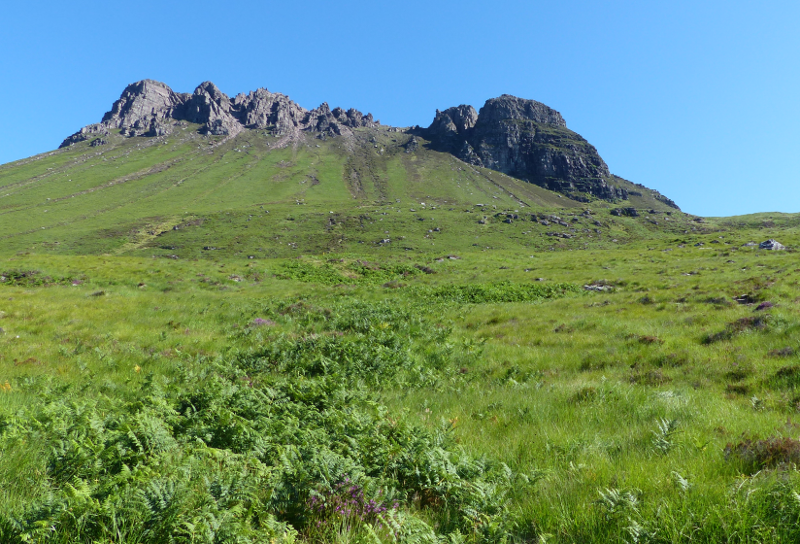

### Coigach to Gruinard Bay

We're up early the next day, and are disappointed by the lack of loons
in close proximity to the campsite. Perhaps that isn't always a
feature?

Pronoun guidance: AB1 is an elite hillside scanner. Not. This post covers the
events of July 4th, 2018.
 
#### Stac Pollaidh 

<figure class="figure">
  
  <figcaption class="figure-caption text-center">
    Short and sweet, this climb.
  </figcaption>
</figure>

A quick blitz up Stac Pollaidh yields no Rock Ptarmigan, and
staring at the mountains in the distance yields no eagles. Gordon's
advice for the rest of the day is as follows: stop in Ullapool to pick
up Twite, stop in a few places along the coast to look for
White-tailed Eagle.

<figure class="figure">
  
  <figcaption class="figure-caption text-center">
    The view from around the back.
  </figcaption>
</figure>

#### To Ullapool!

We take a brief diversion up an incredibly well-surfaced road to enjoy a
coffee at [Elphin Tearooms](https://www.elphintearooms.co.uk). We help a
fellow camera amateur with a lens, and karma repays us with a decent view of
some deer hanging about at the top of the hill.

<figure class="figure">
  
  <figcaption class="figure-caption text-center">
    Deer on the horizon.
  </figcaption>
</figure>

Ullapool is delightful but Twite-free. We manage a very pleasant walk around
the town and take the opportunity to top-up on supplies, we're starting to
run out of essential foodstuffs (scotch eggs, spanish omelette and pot
noodles).

#### Badrallach

We take a small detour up the Eastern side of Loch Broom to visit Badrallach.
The views are excellent, but blighted by cleggs; several sea eagles could fly
by in the time we're spending flailing at them. Our walk from
Badrallach is particularly disrupted, although a young Cuckoo does
briefly pop up below where we're walking, we quickly decide that a speedy
return to the car is a better plan than continuing to fight an unwinnable war on
 cleggs. 

#### Gruinard Bay

Gordon instructs us that this area of the West coast is all good for White-tailed Eagle. 
We become elite scanners of remote hillsides, but it earns us only
crows. Gruinard Island is keenly scanned for sea eagles pretending to
be rocks. None are found.

We arrive at tonight's campsite in Laide, and it immediately goes in our bad
books for designating tents an area with no sea view. All the views are given
over to static caravans and parking for fully motorised campers. Humph. To
add to our disgruntlement, a flock of birds feeding in a meadow behind the
campsite stubbornly remain Siskin, rather than Twite.

<figure class="figure">
  
  <figcaption class="figure-caption text-center">
    Not Qwite.
  </figcaption>
</figure>

We hoof some dinner down and speed off to Mellon Udrigle (MU); it looks like
there should be a decent circular walk from there, and there's a tiny, tiny
possibility we might spot a Petrel or two (Gordon tells us they're active on
Priest Island).

#### Mellon Udrigle

Thankfully, the beach at MU is straight out of the tourist guide, and
the light when we reach it is pretty impressive too. There's a
campsite next to it: why didn't we stay here? A pair of Ringed Plovers
do an excellent 'broken-wing' performance for us; we back off to see
if we can spot the chicks, and find two. Super cute.

<figure class="figure">
  
  <figcaption class="figure-caption text-center">
    I don't think both are in this frame. Or are they?
  </figcaption>
</figure>

We set out towards the bit of the land that juts closest to the Summer
Isles, and when we get there, set up in the wind-sheltered lea of the hill
for a bit of staring at the sea. Amusingly, at this point, we're only
around 15km away from where we started this morning; we've probably
driven more like 150km.

<figure class="figure">
  
  <figcaption class="figure-caption text-center">
    Mellon Udrigle was very pretty.
  </figcaption>
</figure>

Not much success is had, and any ideas of staying until darkness are
(rightly) pooh-poohed. An attempt will instead be made at a circular-looking
 walk. After a couple of false starts (we weren't quite as far
West as we thought) this goes rather nicely.

<figure class="figure">
  
  <figcaption class="figure-caption text-center">
    What's this idiot doing?
  </figcaption>
</figure>

As the last light of the day is just leaving, we happen upon a chubby-beaked
passerine clinging to a rocky outcrop. Now, _that_ could be Twite. With a
bit more light, it could _obviously_ be Twite, but we're now far enough South
that five past ten in the evening is twilight rather than daylight. 

We take a lot of terrible photos, but having spent much of the day
familiarising ourselves with the bird book, we're pretty sure we've
got our bird. After a re-examination back at the car, the only
diagnostic we're short of is an obviously yellow beak, and some
pictures on the internet convince us that isn't always
forthcoming. The thing that really sells us is the jizz; the low to
the ground pose depicted in the book is _identical_ to how it's
sitting in our images. A late tick; not as late as Pondside's Gropper,
mind!

<figure class="figure">
  
  <figcaption class="figure-caption text-center">
    Definitely Twite.
  </figcaption>
</figure>

We roar back into the campsite at 10:30pm, widely disregarding the
10pm curfew and the plea for quiet. Bad luck static/motorised
caravanners, you'll just have to salve your ears with the beautiful
view in the morning.