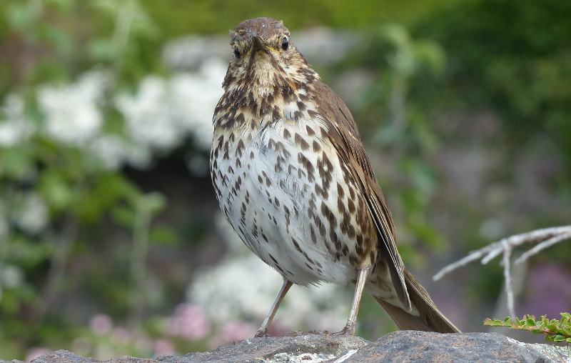
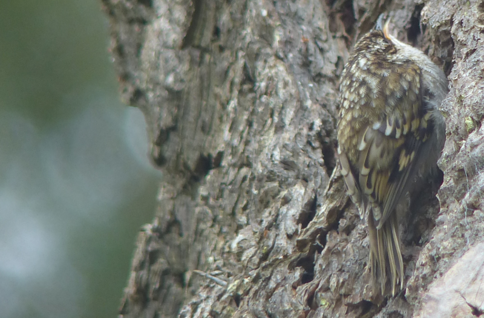
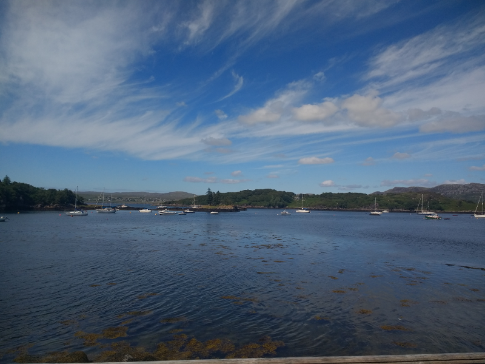
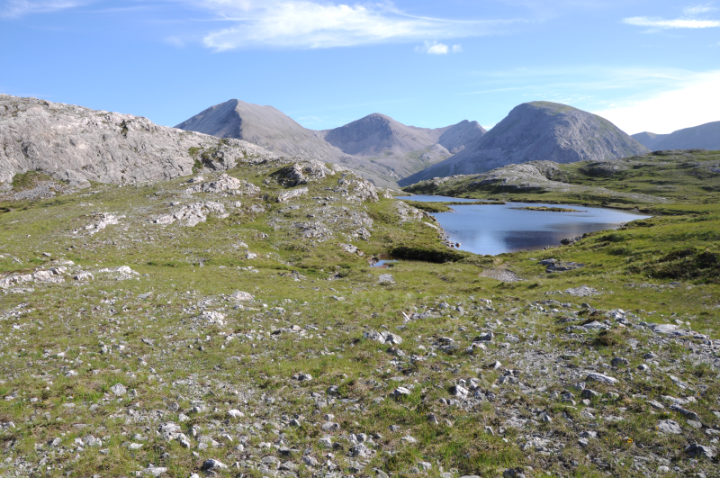
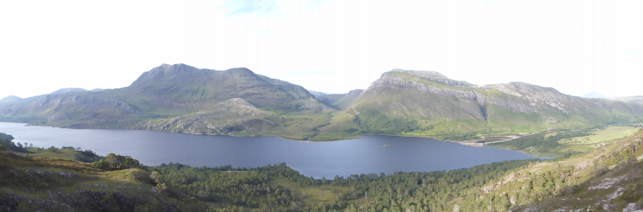

### Inverewe and Loch Maree

This post may not by the most productive of the Scotland trip, but on the
 average size of new birds ticked, its a winner for the year.
 
Pronoun guidance: AB1 keeping his eyes on the road. This post covers the
events of July 5th, 2018.

#### Inverewe Gardens

The next day begins with a trip to Inverewe Gardens. Now. Strictly, no
ticks occurred here, although we did come across a very friendly Song
Thrush and a family of Treecreepers. 

<figure class="figure">
  
  <figcaption class="figure-caption text-center">
    Very friendly indeed.
  </figcaption>
</figure>

<figure class="figure">
  
  <figcaption class="figure-caption text-center">
    Also reasonably confiding was this Treecreeper.
  </figcaption>
</figure>

That said, this was still an eye-opening place; the range (and vivacity) of
what's grown here is borderline unbelievable, given the latitude, and the
clever tricks the original designers pulled to make it all work are equally
captivating. If you're in the area, go.

#### Inverewe to Badachro

We leave Inverewe rather later than we'd expected. Having planned to
take in lunch in a pub for a change (there's only so much Spanish
Omelette one can eat in a week), we know we've got around ninety
minutes to get from Inverewe round to the Badachro Inn. That gives us
around an hour of leeway for exploring. Gordon instructs us that the
road following the Western shore of Loch Ewe isn't a bad bet for
White-tailed Eagle, and that's basically right next to Inverewe
itself, so we give it a go.

The first part of this drive North is alongside the parts of Loch Ewe
we've already given a lot of scanning time too from the gardens. As
such, we don't pay an enormous amount of attention. The Loch widens
out as we get past the Isle of Ewe, and the view from the road does
too. We agree that this area needs focus, and that AB2 should be
chief Eagle focusser, given the necessity of keeping the car on the
road falls to AB1.

Barely five seconds later, AB2 pipes up. "What's that?" A quick
glance away from the road yields a couple of gulls are meandering
around on the right; but before I can raise an eyebrow to open a round
of the "you're making it up" game, a larger shape a bit higher up hoves into
view. I bring the car to a halt in what must be the world's best
placed passing place and have a proper look. Yeah, that thing is
_bloody enormous_; all the talk of flying barn doors that I've heard
now makes a bit more sense. 

The car is swiftly exited to obtain a better view; binoculars only though
- this eagle isn't hanging about. It quickly gains several hundred metres
worth of altitude and then effortlessly floats off to the North-West. From
barn door to barely visible in a couple of minutes; I can see how other
folks have been unlucky enough to not cross paths with these birds.

A very pleasant lunch in Badachro follows, most notable for the
reverse in our usual fortunes. For once, we are the organised people
arriving during the half hour of food being served. An angry couple
turning up just as we're served ("how come they're getting food
then?") provide us with some additional schadenfreude.

<figure class="figure">
  
  <figcaption class="figure-caption text-center">
    The view was excellent. The food wasn't bad either!
  </figcaption>
</figure>

The food gives us enough time to think about plans. The West Coast, at
this point, probably isn't going to offer many more opportunities for
the year list. There will likely be some epic scenery on offer
(Torridon/Applecross is supposed to be spectacular, and Skye is
supposed to be pretty special too), but the only thing we might pick
up there that we haven't already is Golden Eagle, by our
interpretation of Gordon and some close examination of BirdTrack
records. Alternatively, we could head back East and have a crack at a
more varied set of environments - the Glens, Loch Ruthven, Findhorn
Valley, Cairngorms, etc.

#### Go East!

We decide East, and set out that way as soon as lunch has had time to
settle. A first stop on the edge of Loch Maree provides a decently
effortful walk up to the tops. There are no Ptarmigan there, but the
views are something else. It's also _deserted_; we see perhaps two
other groups of people across four hours of walking. At this point, I
am glad the readership of this journal will be limited; I'm not sure I
want to share this hill with anyone else when we go back. 

<figure class="figure">
  
  <figcaption class="figure-caption text-center">
    I could tell you where this is, but then I'd have to kill you.
  </figcaption>
</figure>

A mildly perilous descent keeps us entertained on the way back to the car.

<figure class="figure">
  
  <figcaption class="figure-caption text-center">
    Some steep descents were more than a match for my shoes here.
  </figcaption>
</figure>

A long (but enjoyable) drive gets us to Beauly, and our least friendly
campsite of the journey so far. Hmm. Well, at least it positions us
nicely for the first part of the next day, i.e...