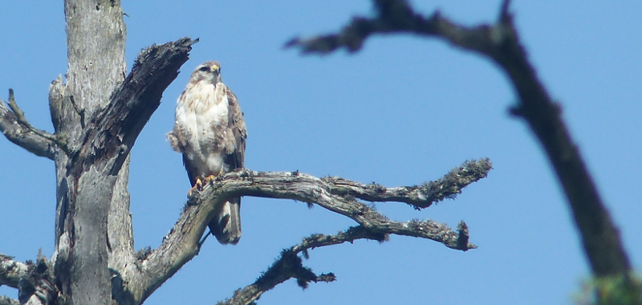
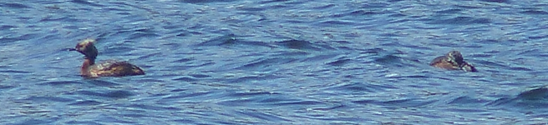
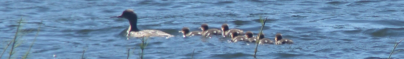
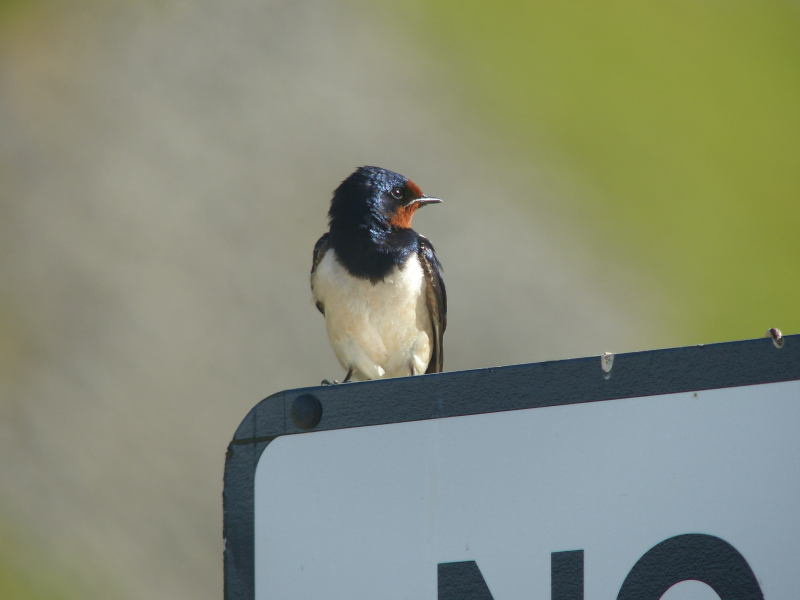
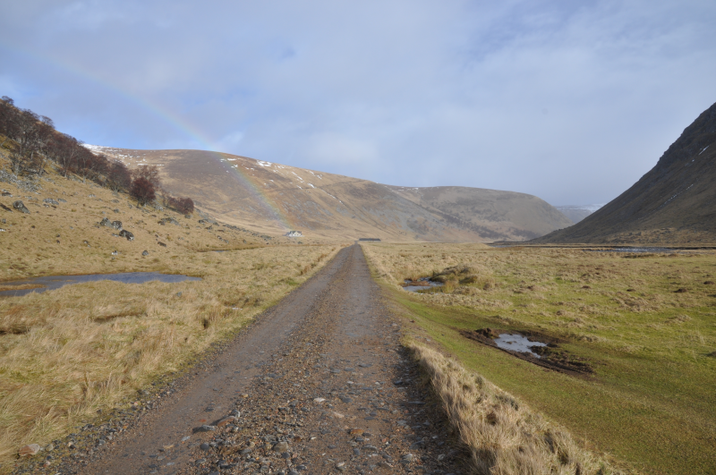

### Glens and Grebes

GLENS! Yes, glens! Specifically, Glen Strathfarrar, which Gordon
reckons is the underrated one.
 
Pronoun guidance: AB1 leaves the car in a poorly chosen place.

#### Strathfarrar

It has the added bonus of having a token based entry system, operated by a
delightful (read: on the surface, polite, but boiling over with anger at
being required to perform the duty assigned to her; what did we do wrong?) lady
with a gate. We take token three, and head up into the valley, hopeful of
finding Whinchat, Wood Warbler and possibly even a Crossbill.

We get a _lot_ of Stonechat, doing their usual confiding perching on
wires, tall bits of foliage, bushes, etc. We struggle a bit to know
what to do; should we be birding from the car? Or making jaunts from
the car up into the wooded areas around the sides? In the end we end
up making lots of short stops, some with a bit of exploration
attached. Plenty of interesting littlies distract us during these
jaunts; we use our previous encounters across the two weeks to quickly
identify the majority of them as Siskin; the others are the usual
suspects.

More driving. Now, _that_ was a Whinchat, wasn't it? Bigger, hint of a
supercilium, although a bit worn. It's off to the right of the
track. We bring the car to a halt to have a better look - lots of the
Stonechats were in family groups; is our Whinchat going to lead us to
the rest of the family? 

It hops about between a few tall stalks; we quickly work out that it wants us
no closer than 20m; surprisingly cautious for a chat. This is far enough (and 
the foliage thick enough) that it takes us a while to work out we're actually 
watching at least a pair of birds; and a little longer to pick out a juvenile. 
And even longer discussing whether there's a second. It isn't particularly
clear, even with the scope. Not the greatest Whinchat we've ever seen, but we'll 
take it.

Post Whinchat, we continue onwards. I've been promised hydroelectric
artifacts at the end of the public part of the drive. Our only company
is a pair of cyclists (who we trade places with repeatedly as we stop
and start to look at things) and a small army of vehicles from the
electricity company. 

One wonders how many people are really required
to be on site at this dam, and whether working in such a terrific
location is a cushy option jealously guarded by those who have it. We
don't see much, wildlife wise; a Buzzard and a couple of giant
butterflies. The faster flowing areas of the stream at the base of the
Glen refuses to give up a Dipper.

<figure class="figure">
  
  <figcaption class="figure-caption text-center">
    A very handsome buzzard it was too.
  </figcaption>
</figure>

We reach the dam, and I park up. AB2 falls asleep (it's very warm,
and the gentle drive has proven soporific). I launch off on a walk
around the dam (lots of water jetting around at high pressure, Bond
villain capable outbuildings; this is no time for sleeping!). It isn't
clear whether public access is allowed beyond it, so I decide to do an
experiment: if I walk up the road on the South side of the dam, will
anyone shout at me?

Not immediately, it seems. Although amusingly, having set off and
discovered the walk is not explicitly disallowed, I feel disinclined
to continue much further - I'm not going to manage the circuit of the
loch above the dam in the time we've got allotted here, so any step I
take forward I'm going to have to retrace soon afterwards.

Instead, I set up camp on an exposed corner to give the loch and
surroundings a good glaring at. Nothing of note. I wonder if "too hot
for raptors" is a thing; the horizons have been barren!

Back to the car. AB2 is awake, and is not enjoying the precarious
slope on which I parked. Oops. A bit of manoeuvring sets us up with a
view of the dam's outflow, which makes the area cool enough for a spot
of lunch.

Lunch brings a decision: one glen is enough. We don't know what we're
doing, and we suspect the right thing to do is drive in early, go for
a hike for several hours from a well chosen point, and then head out
again, a level of investment we're not ready for.

We return the token to the polite (but still awkward) lady at the
gate, pause for a refreshing beverage and a wee in Cannich, elect not
to revisit Corrimony RSPB (*great* cairn, but desperately needs a
circular walk) and soon we're on the A82 back to Inverness.

#### Loch Ruthven

Is our next stop, for what should be a nailed on Slavonian
Grebe. And, indeed, it is, albeit a rather more distant view than we
had hoped for. And the plumage is a bit faded, as we're towards the
tail end of breeding season.

<figure class="figure">
  
  <figcaption class="figure-caption text-center">
    Not our finest work.
  </figcaption>
</figure> 

Still, life tick, mustn't complain! The Loch doesn't provide a great deal
more of interest (barring a nice Red-breasted Merganser family, approximately 
forty thousand Coot, and some sunbathers who are rather surprised to find 
themselves sharing a space with birders), so we make ourselves scarce.

<figure class="figure">
  
  <figcaption class="figure-caption text-center">
    With all the mallard cuteness with the bonus of being a far higher quality duck.
  </figcaption>
</figure>

<figure class="figure">
  
  <figcaption class="figure-caption text-center">
    This swallow posed beautifully on a nearby 'No Parking' sign.
  </figcaption>
</figure> 

#### Monads ahoy

Birders who know this area can probably have a reasonable guess at our
next destination. The Monadliath mountains are to our East, and the
small town of Farr (possibly a hamlet?) is only 5km away.

Yeah, it's Findhorn Valley (or Strathdearn, to give it its technically
accurate name) time. Not before we traverse the road to it from Farr,
though. Gordon has built up the terror of this route
substantially. Can't be any worse than the wee mad road though, right?

All seems well until we spy a giant caterpillar truck heading towards
us. Uh. Even in a passing place there's not going to be enough room
for that thing to go past us. Surely the driver knows that? Why have
they come this way? We plough on, confused, and mildly
terrified. There is hope though - perhaps the truck is on some access
route to the power line maintenance that seems to be happening off to
the North of the road. A few more nervous seconds and we're confident
that unless the truck decides to ram a couple of walls between it and
us, we should be alright.

We enter the valley intact and triumphant. We ignore advice to stop and look
for littlies - our Glen experience has taught us that we're just not
patient enough. We drive as far as a public vehicle is allowed to and
then park up. I suppress the desire to fill a backpack with snacks and
head off up the valley on foot for a serious explore: What's at the
end of this track?

We have the place to ourselves. That probably isn't a great omen, is
it? Gordon tells us the Autumn is best. Oh well. This is better than our
last visit - a cold, grey February day with intermittent rain versus a warm
Summer day with wonderful early evening light.

<figure class="figure">
  
  <figcaption class="figure-caption text-center">
    A previous visit. Don't be fooled; it's freezing cold, and the rainbow tells you what happens next.
  </figcaption>
</figure> 

The horizon is scanned, no, _scoured_ for raptors. There are, at least, several
Buzzards in the distance. These are checked for signs of being more
interesting, but Buzzards is what they are.

There's a squeak from the top of the hill immediately in front of us
(another win for Gordon - that's where he says you should look). I
swing the scope round and find...nothing. The binoculars pick up a
couple of sharp-winged raptors swooping around. These are Peregrine
Falcons. We should probably have worked that out from the noise - it's
the same as what we heard near Ben Hope. They continue to mill around
near the top of that hill before skidding off to the left into
nothingness.

We take turns keeping an eye on that same hill. Result: more
Buzzards. One is briefly mobbed by a Kestrel (definitely a Kestrel,
not a Merlin, sadly) which provides some brief entertainment. I find,
strangely, that I don't mind the lack of new-for-the-year raptors.

We eventually start to get hungry. That seems as good a trigger as any
to depart and attempt to find shelter for the evening.  This proves
rather more difficult than it has done elsewhere - it's Friday night,
and, apparently, this area is popular as a weekend getaway. We
eventually concede defeat and head for a hotel in
Grantown-on-Spey. This turns out to be a total victory; it has a
kettle (pot noodle #2 of the trip) and does an excellent
breakfast. Hard to argue with for the price we paid!