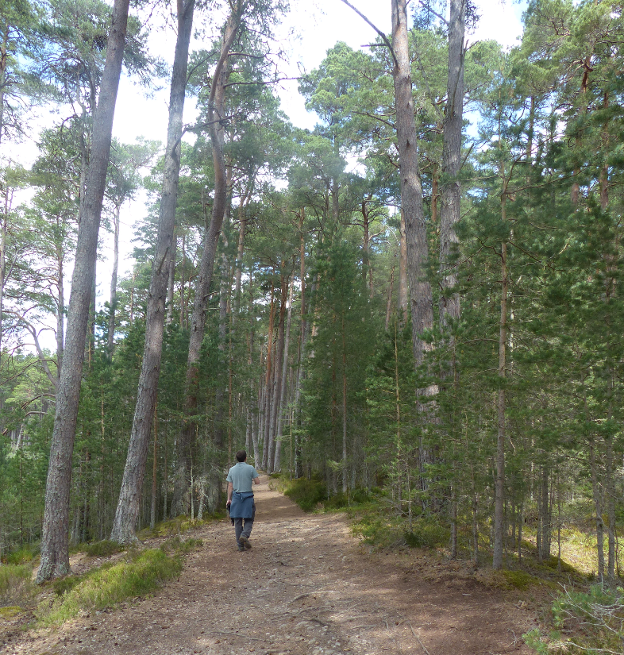
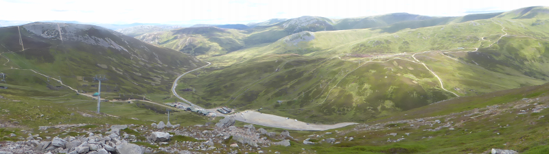

### The last days in Scotland

We've got two days left in Scotland - let's see if we can distract ourselves
from the impending return to work by filling those days with activity.

Pronoun guidance: AB1 makes poor footwear choices. This post covers the
events of July 7-8th, 2018.

#### Loch Garten 

It's a gentle start the next day - we eventually rock up at Loch
Garten RSPB for around 10am. We're on a mission to find Crested
Tit. This is _the_ place to see them. We would also accept Crossbills
in their place, or potentially Common Redstart.

We take Gordon's claims on the frequency of sightings (claims of car
park ticks for both species) with a pinch of salt; this is going to be
woodland birding - a lot of sound, a lot of flitting, not a lot of
time to get a good look and a positive id.

We start with a trip up to the hide where the reserve's more famous
residents are usually on view. Hilariously though, the usual Ospreys
have made an absolute hash of breeding and have buggered off in a
huff. We gain some very limited intel on our targets and lower our
expectations.

We return to the car park to set out on the woodland walk. Usual
suspects abound: Coal, Blue, Great and Long-tailed Tit, Goldcrest,
Treecreeper, Siskin (this is, we have determined, a usual suspect up
here). We also pick up what we think is another Tree Pipit (whose shady photo
is the thumbnail image for this post). We talk to two other roaming
bands of birders who haven't had much joy. Our only hope is that they've been 
negligent - there's some evidence of this, as their lists lack the final three 
of what we've started to consider as par for the course.

We're also starting to be able to discern by sound whether something
is of interest or not; we start to tune out the Siskins and the more
standard Tit calls. We're almost at the zenith of the circuit when
both Ems and I are stopped in our tracks by a flock of three or four
birds all emitting a call that is novel.

...and, once we get our bins on them, they look novel too. Those
little quiffs are unmistakably the hallmark of Crested Tits. Without
the sound and a good view through the bins, they could well have
skipped by unnoticed, perhaps written off as Blue Tits; we feel pretty
smug to have discovered them, a feeling that amplifies as we see no
others on the remainder of the walk, and no other birders who have
encountered them! The way back also has some excitement - a giant
anthill, a possible Redstart (that escapes before we can convince
ourselves) and a collection of Siskins hanging about in the canopy in
an unsuccessful attempt to making us think they're Crossbills. They
succeed only in giving me a sore neck from all the up-gazing.

<figure class="figure">
  
  <figcaption class="figure-caption text-center">
    AB1 listening out for Crested Tit.
  </figcaption>
</figure>

We return to the car exuberant in our hard earned woodland birding
tick. And also hungry, and a bit hot; the fine weather is persisting
and the temperature, remarkably, is heading into the high twenties.

#### Tulloch Moor

We attempt an off piste stop on the advice of Gordon and one of the
RSPB wardens, at Tulloch Moor. This mostly just leads to aggravation -
we don't really know where we're going, and it's borderline too hot to
move around in direct sunlight. A switch to flipflops helps a bit to
start with, and then proves to be instantaneously idiotic as soon as
we enter the moorland, as my feet are scratched by several species of
heather, gorse, and god knows what else. We (well, me) quickly tire of
this plan and retreat to the car to shed a layer of clothing and apply
snacks.

We think we've had enough of this area (compared to the rest of our
trip, its altogether far too full of people), and decide an expedition
considerably further South might be in order. We set out for the other
side of the Cairngorm range, which, as the crow flies, might be twenty
miles, but in a car is more like fifty.

#### Linn of Dee

Our original aim was to have another crack at Ptarmigan by taking the
chairlift at Glenshee ski centre, but we miss the last one by a matter
of minutes; after a few unproductive minutes of horizon staring, we
decide to return the next day. Instead, we redirect to the Linn of Dee
for a highly pleasant evening walk in the woods. It isn't particularly
productive, but the light is fabulous, and the drive back delivers
some very well lit Buzzards, and delightfully, a bonus Osprey.

We retire to a B&B in Kirkmichael (some room confusion, a _very_ noisy
party, not our favourite overnight stay) and try to avoid thinking
about going home the next day.

#### The last chance for Rock Ptarmigan

<figure class="figure">
  
  <figcaption class="figure-caption text-center">
    From the top of the ski lift at Glenshee.
  </figcaption>
</figure>

The next day's progress is briefly postponed by a forgotten
jumper. Once retrieved, we speed back to the chairlift for one final
"there's no such thing as a bloody Rock Ptarmigan, is there?"
session. This one, at least, requires little physical effort, thanks
to the chair lift. The operators make positive noises ("oh yes,
there've been two or three around recently") that unfortunately come
to naught - all we see is a family of Red Grouse on the way up.

#### Glen Tanar

We've got time for one last stop, and we choose to take it at Glen
Tanar. There's an off chance of picking up Crossbill or perhaps
Redstart here. I'm not that hopeful for Crossbill (despite Gordon's
"possible from the car park" exhortations), but a brief read of the
Birdtrack map suggests Redstart could happen.

The car park could well work for Crossbills - if we had a bit more
time we'd give the woodland paths some serious attention. We drop into
the visitor centre to see if there is someone clueful inside. It is,
unfortunately, deserted; we're on our own. A mixture of time and
laziness pushes us to take path three up to the Knockie viewpoint.

After a brief unwalkable section of gravel, we're suddenly in a
different type of area - the trees are mostly deciduous (providing
some occasional much-looked for shade - it's still unbelievably
sunny), there's forest nearby, but we're very much at the edge of it,
and there's some open grassland nearby. The words "this has got
Redstart written all over it" manage to escape my mouth before I have
the sense to stop them. That's probably torn it. 

Wait, no it hasn't, there's one sitting on that fencepost. Unmistakable. 
It bobs about a bit, before deciding we've got too close and
darting off into some nearby trees. We disturb it again a little further
along and it returns to its original post, taunting us, staying far enough
away to prevent us from taking even the most terrible photos of it.

I spend most of the rest of the walk in a state of disbelief that it's
possible to say something so hilariously definite and have it not blow
up in your face. We just about manage to avoid treading on an Adder sunning
itself on one of the gravel paths. Before we know it, we're back in the car
and it's time to head back home, via Inverness and Luton.

#### Epilogue

A bumper haul of _*eighteen*_ ticks from the trip brings us to
188. Even with my pessimism, 200 is starting to transition from
'possible' to 'likely'.