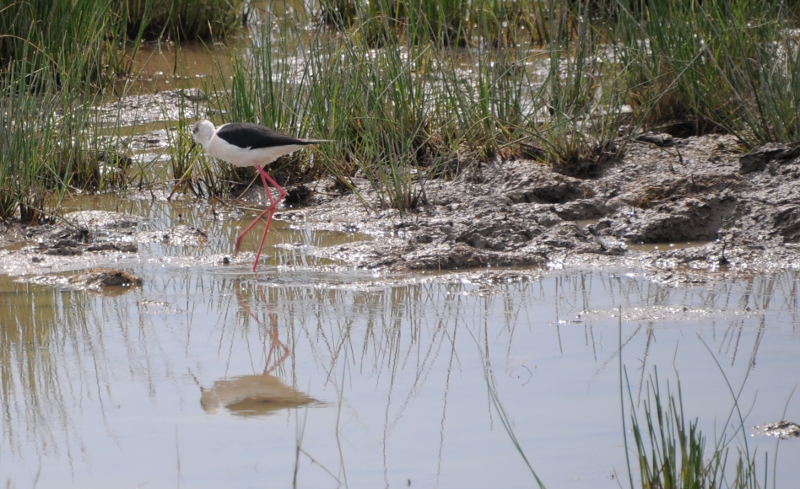
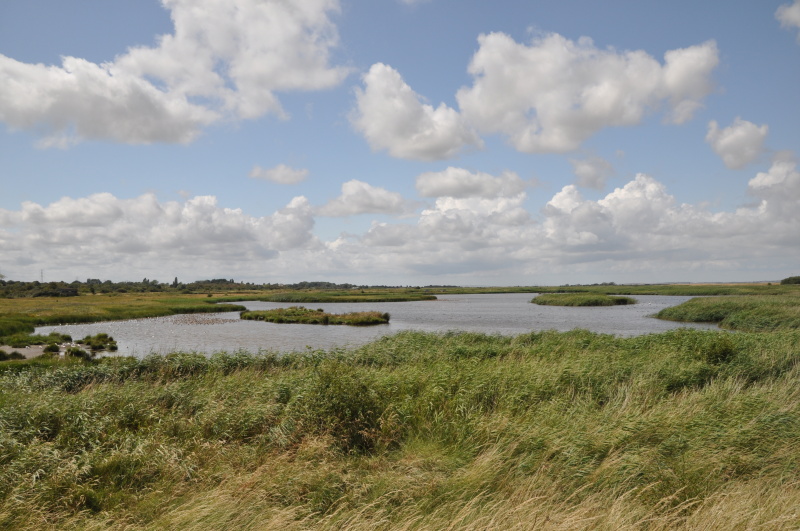
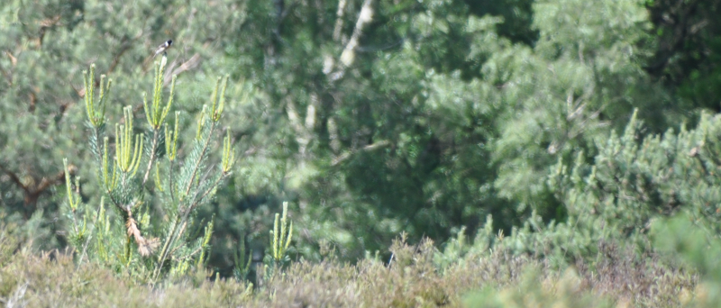
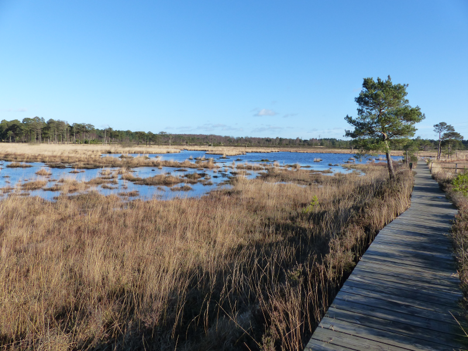

### An Epic Day Out

With twelve birds to go, we could be forgiven for taking our foot of the gas
a little. No fear.

Pronoun guidance: AB1 flies solo. This post covers the events of July 14th
(yes, just one day!), 2018.

#### The plan

A back-to-back birding opportunity opens up to me - the annual Bonaparte's
Gull has returned to [Oare Marshes](/sites/Oare_Marshes.html), bringing with it
levels of attention that have brought the reports of several other rarities. 
In addition, e-mail arrives from Nigel Dodd - there's a trip to Thursley
Common with the West London Bird Club happening, and due to its particular
focus, it only starts mid-afternoon - I only need to be in Ealing for 2pm
or so.

#### An early start

As such, I make a reasonable go of an early start - I'm out of the
house before seven, equipped with scope and a surplus of sandwiches,
and I'm chatting with the medium-early bird crowd at Oare just before
9am (the _early_ crowd, in July, have already made their first circuit
and started on their second). It's a mixed start - I've _just_ missed
a White-rumped Sandpiper, but on a tiny mudflat in the centre of the
East Flood, I've found one (well, a pair, to be precise) of Oare's
signature birds, Curlew Sandpiper.

News from the other birders - Napoleon is in town, and has been seen,
as ever, migrating between the mud bordering the Swale and the East
Flood. I'm a past master of finding old boney, so I don't worry overly
about finding him immediately. The report I'm really keen to catch up
with is Black-winged Stilt - a family of them have been frequenting
the reserve all week. The intel from the group I ask is that they are
also around, but not visible from right here - try from the South
side, or the sea wall. I set off with a couple of other interested
parties in search of them.

We give the South hide a try - it's usually a bit of a write off,
viewing only a tiny fragment of the East Flood that isn't visible from
the sea wall or the road. For once, however, it delivers - two of the
Stilts are messing about in one of those areas. Their presence gives
the already hot morning an extra hint of Mediterranean charm. The
temporarily gathered Stilt team sit and we enjoy their antics, before
they float off, legs flimsily dangling, back to a place more easily
viewed from elsewhere.

<figure class="figure">
  
  <figcaption class="figure-caption text-center">
    We'll reinforce the hint with this image of Black-winged Stilt from Majorca.
  </figcaption>
</figure>

Onwards in search of White-rumped Sandpiper, then! Surely it must be
visible from the sea wall, if it is here at all? "You'll be lucky",
three gentlemen already scanning from there tell us. "The last we
heard, it disappeared off down the Swale with the Godwits when the
tide changed". Mixed feelings - I could, I suppose, have got here even
earlier, but at what cost to my ability to keep my eyes open? I wonder
at what stage of the aging process getting up obscenely early starts
to be natural again and have further mixed feelings about not having
yet reached it.

Well, sans WRS, I suppose we can at least give the rest of the flood a
good look. We find the Stilts again, this time, the whole family. We
guide a newcomer on to the Curlew Sandpipers, which, although further
away from here, are more easily spotted, as the sun is behind us. A
couple of flocks of Black-tailed Godwit fly in and cause a bit of a
stir; some Bearded Reedlings ping at us from the nearby reedbed. It
would be very easy to set up camp here and while away most of the day
- with some effort I remind myself that this birding double-header
requires me to spend no more than three hours here, and I'm coming up
to half that time already. Time to find Napoleon.

<figure class="figure">
  
  <figcaption class="figure-caption text-center">
    A view from the sea wall in 2019 around the same time of year.
  </figcaption>
</figure>

A brief moment is spent at the corner hide checking the flats for the
sandpiper, or, perhaps, a Spotted Redshank, but this is a fool's
errand, and I quickly abandon it. I continue to walk back along the
sea wall, sternly asking every Black-headed Gull I see "etes-vous Bonaparte?"
 
Amusingly, Bonaparte's head is more black than Black-headed Gull (whose head 
is more of a chocolate colour), and, in this light, that will be considerably
obvious, and, funnily enough, there it is, around five metres from the shore
of the Swale. I help a few other folk onto it who are struggling a bit (I'm
fortunate enough to have seen it on a previous Summer visit, so I know 
what I'm looking for, for once) and then go for a brief wander beyond the
road on the Saxon Shore Way to collect my thoughts. 

A tricky week, the effects of which are mostly already erased by
this bit of birding. A little more walking pushes some more of it
away. Now, to head back to see if any more news has been dug up by the
growing group of birders collecting on the road.

Still nothing more of the White-rumped Sandpiper - that's going to
have to go down as a dip. Also, several folks here haven't found the
Curlew Sandpipers yet, so some time is spent remedying that. The group
swells further, this time with some professionals; my status rapidly
dwindles from "Curlew Sandpiper and Bonaparte's Gull specialist" to
anonymous nobody as they spot the return of the Black-winged Stilts. And then,
just as I'm having a look at them again, I miss Water Rail off to the
right somewhere. A very helpful birder does his very best to direct
me, but the little sod (the rail, not the birder) has already disappeared into 
the reeds. How daft would it be to reach the end of the year without seeing one?

The crowd thins a bit as a bundle troop off to the Swale to find
Napoleon. Just as I'm about to try exploring the typically
unproductive West side of the reserve, someone pipes up "think I've
found a Spotshank", and, you know what, they have. It's near enough to
the road that all the diagnostic material is obvious; it's even
standing next to a standard Redshank for contrast. Oddly, it's the
greyness of the bird that picks it out first - the size difference and
the slight droop in the beak come second. Still, very smart bird, and
a fourth tick before the sun's over the yard arm; take that, Scotland!

Time's up - time to head back to Faversham and start making my way
towards Ealing, where a lift to Thursley Common awaits me.

#### Thursley Common

I'm nervous about this - I'm borderline allergic to organised outings of more
than one person (faffing tends to increase with numbers of people). This
outing has been _very_ well organised, but worrying I think at least ten folks 
will be in attendance. I make it to the designated
pick-up point in Ealing, which turns out to be Andrew Peel's house! Free of
his RSPB officiating, Andrew turns out to have a devilish sense of humour and
 all round general good egg.

Similarly, Nigel's enthusiasm, when he arrives, is contagious,
and there's little to no sign of any faffing about. Perhaps organised
birders have some sort of magical faff banishment spell.

The journey to Thursley takes longer than I expected - there's
something about getting out of London to the South-West that manages
to suck in time. Perhaps it has a swampy metric. The section around
the M25 has a nice surprise for us - just after Heathrow there are
thirty odd Red Kites floating around.

Eventually we pull up in the car park, where the group swells
further (inner AB1: "Christ, this is nearly twenty people; what a disaster").
Lots of introductions are made. I am reminded of some stand-up where
the comedian successfully represents the reality of this situation,
with the names entering into one ear, and then immediately falling on
the floor, with a clang. Oh well. There's an understandable bit of
waiting around while we see if anyone else is going to turn up, but
it's mercifully short, and soon we're off.

#### Mosquito Trail

We head out onto the common, taking a South-East sort of path,
marked by waypoints with a mosquito design on them. A memory of when I
was last here is keyed on this - I can see an impressive
mosquito sculpture in my mind's eye. I don't think that's too for
away.

We make reasonable progress for a group of this size, causing
only minor grief to those trying to go in the opposite direction on
the same paths. No-one falls off the boardwalk, despite the level of
focus being applied to any avian movement; this group is seriously
keen.

Before long, we're in a heathy bit of the common rather than a boggy
bit, and every other bird is a Stonechat. We check them diligently in case of
Whinchat, but after the first three or four, I start to save my energy - 
anything of that shape that's so confiding is already on the list!

<figure class="figure">
  
  <figcaption class="figure-caption text-center">
    This happens a lot. Check for Dartfords nearby!
  </figcaption>
</figure>

I've neglected to mention one further bit of news - there's been a
Red-backed Shrike here for at least a week. This particular route is
supposed to take us straight past it. Much examination of possible
perch points meets with little success.

We encounter a pair or bescoped birders heading the other way. They
are _very_ cheerful. Is it because they've just seen it? Yes. Just
around the corner, apparently. The group marches on with a bit more of
a spring in their step. I've gently manoeuvred myself to the front (no
shoving required) in case the sight of such a big group spooks it.

The path curves clockwise around the base of a mound. Off to the right
are disparate clumps of scrubby trees and bushes, which are
occasionally close enough to the path to obscure the view out. Each
time the view is clear we take a moment to scan. On the third time of
asking, we find the Shrike sitting in a tree not ten metres from the
path. As predicted though, the wave of excitement this washes through
the group spooks it, and it bails diametrically away from us.

Those of us at the front with an unobscured view keep our eyes on it
for long enough to see it land; only another twenty or thirty metres
off, but in a tricky to describe bush that, from some angles is
invisible from the path. Great rigmarole follows to ensure everyone
has a good view, but it's worth it - those who missed the first view
are greatly cheered when they catch on.

<figure class="figure">
  
  <figcaption class="figure-caption text-center">
    The boggy areas of Thursley (this image is from December 2014).
  </figcaption>
</figure>

We eventually roll on, taking in more boggy sections (not a lot
happening here barring some temporarily distracting detritus), more
heathy sections (Stonechat, a few Goldfinch) and some sandy coniferous
areas (usual suspects, tits, Goldcrest, Treecreeper). The group breaks
up a bit in these areas and needs some diligent policing to get it
back together.

#### Dartford? Almost.

We soon start to near the Northern branch of the path we set out
on. Thickets of Gorse guard one side of it - we approach as near as we
can from the West, but we'll have to spot further North to get round
the giant Gorse wall in our way. As we approach, I glimpse a very
Dartford Warbler-like shape (long tail, some hints of the colouration)
flitting from the impenetrable gorse barrier to a smaller bush a little way
towards us. Either I totally imagine this, or it flitted further than
I thought; an intensive search of any sprig within a few metres of
where I thought it landed yields no fruit.

I look around, mildly peeved to not have had any help, but everyone else is
looking at something else on the right, and making quite a lot of noise about
it. I pay a bit more attention. A quick look finds me a
Stonechat. Surely not that? There's a scruffy-looking lark-like bird a
bit further back. Commentary from the right is starting to suggest it
might be Woodlark. Excitement - that's a bird I've basically written
off for the year, assuming that, after a brief visible period during
spring passage, it would have disappeared into any available wood to
breed, becoming utterly unbirdable in the process. I get out the bird
book to see what I should be looking for; the diagnostic we're after
is a white-black-white border at the base of the wings.

This bird behaves admirably, sitting still in perfect light for long
periods. We have plenty of opportunity to pick out the wing pattern,
and to discuss the slight shabbiness of the crest (possible, late in
season, the book says). This is without doubt a Woodlark. Life tick!
The Dartford near miss is a distant memory as we link back up with the
path and move South again.

That is, until someone else spots one, and their specimen performs the
same vanishing act mine did. They seem confident with their id,
despite much joshing; good on them! Well, if there are two Dartfords,
perhaps there will be a third. I'm suddenly on a cricket pitch, with
burly enthusiasts shouting "one brings two" encouragingly after my
bowling has taken a wicket (not a frequent occurrence). What a wonderful device 
the memory is.

#### Time for tea

We arrive back near the car park and set up for a picnic next to a
pond-lake hybrid. Someone's brought some delicious home-grown
cherries; they disappear very quickly. By the time we're ready to head
out on our second loop, the light is starting to fade. I stash my
scope paraphernalia in Nigel's boot - I've been carting it about for
nearly twelve hours and my shoulders are starting to complain - and we
head back out onto the common.

We mostly follow the same path we took the first time, but at a
particular point we must have turned right, rather than left, because
I suddenly find that we're on a path I don't recognise. We get briefly
distracted by a Goldfinch showing signs of being exciting, and then,
after a series of curvy paths, we do it again, with the same bird.

We come across a family of Redstarts in some thin woodland edge.
This time Andrew Peel is the surprisingly accurate predictor of their
appearance - he does his best to reassure us that these aren't magical
powers, but that he's seen them in this exact place several
times. This matches Mum's experience; her Redstart was sourced from a
local birder who was able to give very precise directions to it.

The thin woodland breaks down into heathland again, and we're
surrounded by little spiky bushes. There's a Stonechat in at least two
of them, of course. "Dartford!" Eh? That's a Stonechat, isn't it? "No,
same bush, lower down". Aha, with you, yes, thank you! Definitely a
Dartford. The group enters a mild panic trying to get everyone on it;
perhaps the slightly more switched on half succeed. The bird vanishes
after twenty or so seconds. That's about par for the course with
Dartford Warbler; to see it at all is not easy, as our three brief
sightings (in a group of decent birders in an environment where
they're supposed to be common) perhaps shows.

The light is seriously struggling as we reach a sandy crossroads in a
more open area. There are thickets and copses nearby, but nothing too
dense. Now we wait. Hopefully not for too long, as my earlier
coat-free decision is slowly starting to appear foolish. More experienced
members of the group were even clever enough to bring a seat; I am jealous.

The encroaching darkness sharpens our ears, and we start to pick up
faraway hints of what we're after. The sound of a Nightjar sounds
almost mechanical - one of two frequencies of a whirring (or possibly
clicking?) sound. I'm not going to do it justice - go and have a
listen on xeno canto, and then try and imagine hearing that sound from
two or three directions, in a wild heath. Right - you're here.

<iframe src='https://www.xeno-canto.org/573543/embed' scrolling='no' 
frameborder='0' width='340' height='220'></iframe>

Unfortunately, the rules as agreed require me to see a bird; even if
its call is totally unmistakable. How tricky will
that be, I wonder. Much staring into the murk follows. The diligent
Andrew Peel yet again comes to the rescue, finding a bird book example
of a Nightjar sitting in a nearby birch tree.

I needn't have worried. As we walk back to the car park we see several
more, mostly in flight in the lightly wooded areas, making their
clicky whirring sound as they go. Tremendous.

We return to the car park somewhere between eight or nine. I remember
approximately two minutes of the return journey to Ealing, so I'm
guessing I was almost instantaneously asleep - hardly surprising,
having been out and about all day. What a day though - eight ticks,
two lifers; marvellous.