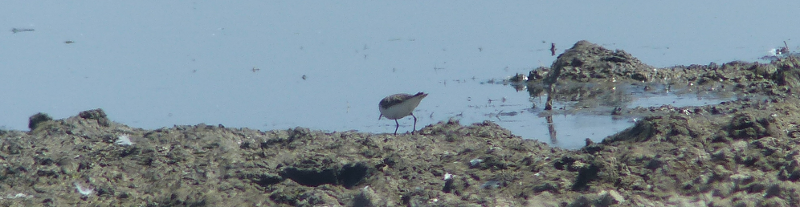
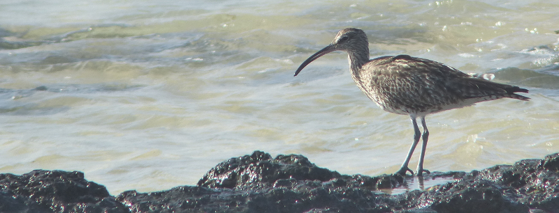

### Oare, Once More

We're so close! With our last trip the scoreboard ticked over to 196. Can we
finish the job with a further trip to [Oare](/sites/Oare_Marshes.html)?

Pronoun guidance: AB1 ropes in AB2.

#### HS1 again, again (, again?)

Another week has flown by, and we're back at Oare marshes. Where would this
year list be without the HS1 link out from St. Pancras to North Kent? 

This time we're looking for a Temminck's Stint. I've even managed to rope AB2
into this jaunt, having convinced her that we may as well be
in North Kent for the early part of the day, given we're going to see her
brother in South-East London later on.

As a result, we arrive at a rather more leisurely time than last week: just
after noon, rather than before nine in the morning. There's still a
substantial group of birders occupying the parking spaces on the road
that splits the East and West flood; a good sign, as that's where I'd
guess we're most likely to pick up the Temminck's.

The group is mixed ability and mixed motivation - some are looking for
Black-winged Stilt. Others are in search of Napoleon. A few need
directing to the Curlew Sandpipers, which are still on the same muddy
island as last week. We eventually find a couple of professionals who
have seen the Temminck's today - their advice is to keep an eye on the
edge of the mud that protrudes out from the road, so we do.

This protrusion (could it be called a spit?) is long and thin, and
covered in various other waders and a good number of roosting
gulls. There's some distraction as someone works out that one of them
is the Bonaparte's, which, in only a week, has already started to
moult into slightly less obvious plumage.

We track the boundary between the mud and the East Flood's water. On
the left site of the arm of mud extending into the water, there is a
tiny wader dibbling about that could well be our bird. We have nearby
professionals, and we choose to use them. "Folks, is that the
Temminck's mucking about on the left there?" After a bit of extra
directional prodding, we get confirmation, indeed, that is it. 

<figure class="figure">
  
  <figcaption class="figure-caption text-center">
    Hilariously, this photo of its arse is the best we managed.
  </figcaption>
</figure>

#### Three to go

Well, that was easy. What to do now? Well, we might as well have a tour
around the reserve; it's a lovely day for it. Perhaps we'll bump into
last week's dipped White-rumped Sandpiper?

We make our way round the back of the East flood, encountering,
humouring, and finally abandoning some dragonfly enthusiasts on the
way. We have a good look at the Stilts from the sea wall, and the
reedbed once again refuses to give up any Bearded Reedling. From the
corner hide, we find some Ringed Plover (always an AB2 favourite) and
admire some Curlew. Ah, there's something we can do - we should check
to see if any of these Curlew are actually Whimbrel, as someone on the
kentos website has reported seeing one or two along the Swale.

This is a good way to lose several hours of your life - these two
species can be tedious to separate. The two pictures in the bird book
showing Whimbrel versus juvenile Curlew are basically identical
barring some tricky to discern head markings on the Whimbrel. Still;
having seen a Whimbrel in Fuerteventura earlier in the year, I feel a
bit more confident that I might be able to pick one out.

A good hundred yards West along the mud is what I think is a
reasonable candidate. We'll get a bit closer and have a better
look. Lots of murmuring and staring at the bird book. The bill looks
right (not too big, curving suddenly at the end rather than in one
graceful arc), and the bird certainly has a more slender air than some
of the (borderline chunky) Curlews nearby. A little bit closer, and
with the sun shining on it just right, and I can see the humbug
colouration on its head. I think we're ready to call this a
Whimbrel. We rope in a fellow telescope wielder and he
agrees. Excellent.

<figure class="figure">
  
  <figcaption class="figure-caption text-center">
    They still look like they're embarrassed that they aren't Curlews, even
     if they're in Fuerteventura, like this one is.
  </figcaption>
</figure>

In exchange, we put our Whimbrel-confirming friend on to
Napoleon (who is, once again, very near the slipway end of the mud)
and head back to the road view of the East flood to see if there's any
more news, and to get a final view of the Temminck's before we head
off.

#### Two to go

(Also a fine episode of Buffy --Ed.)

There isn't a great deal more news, everything is where we left it. A
grass snake has a swim in the shallows - probably cooling off; it's
really rather hot at this point. A family of Water Rail make an
appearance off to the left, and, having missed it last week, I nearly
deal myself a neck injury with the speed at which I snap round to see
them. Needlessly, it turns out, as they make very leisurely progress across the
front of the reeds before deciding that's enough exposure for this week. If
we labelled Water Rail as 'Easy' on the spread sheet we were overconfident.
They can be such secretive sods that even in places where they turn up week
in/week out you can miss them.

Another valuable trip to Oare - for me, probably the UK's best birding
place per square metre - comes to an end. We head back to Faversham to
connect with a train back to London, via a refresher at the Railway
Arms, as we discover the next one is more than half an hour away.