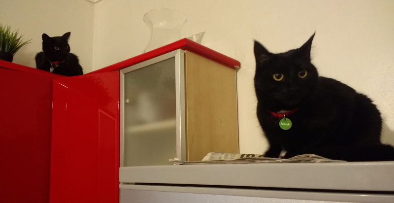
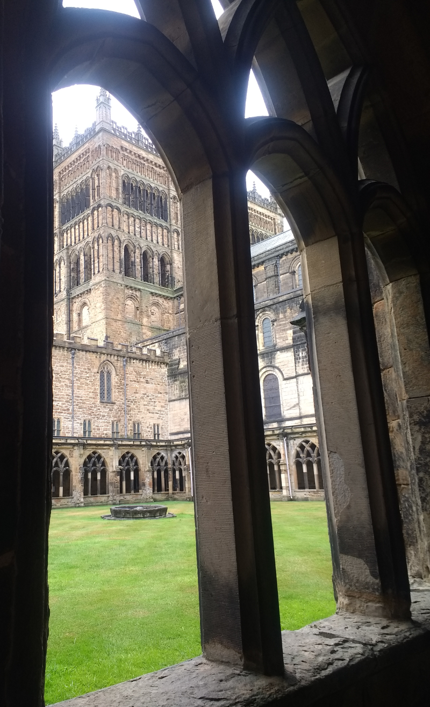

### Dixons, Cats, Durham and Children

An only mildly delayed train to Newcastle sees us arrive at the
Dixons' for just after half past ten on the Friday.

Pronoun guidance: AB1 predicts faff is proportional to the number of children.
This post covers the events of 28-29th July, 2018.

#### A speedy escape 

In the house also are the family Eccles; the smallest of whom is thankfully fast
asleep. We all celebrate this fact with a quiet glass of
wine. Tomorrow, the Ashforths arrive (with another small child) and
social events (and, I predict, _unbelievable_ levels of faff) will occur.

Having seen several editions of "spending the morning with your
friends and their ~2 year old" and also having found an interesting
possibility of a tick a short Metro journey away, Saturday morning finds me 
exiting house Dixon like a shot. I'll catch up with everyone once the Ashforths 
have arrived and everyone has got organised.

#### East Boldon Flats

Within an hour, I'm already at the most salubrious location of East
Boldon. Nearby, at East Boldon Flats, there's been a report of three
Wood Sandpiper. This is, without question, the least glamorous place I
am likely to bird this year. The exit to the Metro station is guarded
by an average looking pub and some low density commercial buildings. A
pizza place hiding within it looks cheerful, mind. 

The walk to the flats is equally unappealing, there are no pavements and a
grass verge of only limited width, next to an A-road with national speed limits
(60mph). It's also starting to rain, and the signs are that it's going
to really cane it down in an hour or so. I hope the waterproof I've
borrowed from Dixon holds up.

The reserve itself is almost totally inaccessible and can only be
viewed from a pair of laybys. There are two cars parked in one of
them; a couple next to the nearest one have set up a telescope. I can
see evidence of someone trying to scope from inside the second car (a
worthy but nigh on impossible feat).

I don't immediately feel like asking for assistance - having reached
the arbitrary 200, I can afford to dip a few species in the name of
becoming a better birder. One would hope that the sheer worthiness of
venturing out to this unfriendly place in such miserable weather is
already helping on that front.

The site itself is a shallow watercourse that's probably a couple of
hundred metres square. It has extensive muddy edges that look
excellent for waders. I'm going to need these sandpipers to be on one
of the nearer shores, but ideally on the right or left edge, as the
front is obscured by foliage. There are the usual Lapwings and Redshanks
poking about (occasionally the Lapwings misidentify a fly as a raptor
and, en masse, take to the sky, protesting noisily). I wonder if
Lapwings are mostly becoming red listed just by being the thickest
birds on the scrape.

A few minutes of searching and I can happily rule out the areas I can
easily see. Humph. Ok, time to try the front edge - perhaps something
will gambol far enough out to be identified.

A Redshank does make a brief foray out of the undergrowth, with some
friends. The friends are smaller. Interesting. They make their way
left until, after some time. I can see that their legs are in no way
red; they are perhaps a yellowy colour. As I look more, the hallmarks of 
Wood Sandpiper start to become clearer - the gently speckled chest, the
supercilium. Not pale enough for Green Sandpiper, no armpits (so not
Common Sandpiper), too small and again, not pale enough for
Greenshank. Also, there are three of them, which matches the
BirdGuides report. Wood Sandpiper they are!

This is an excellent turn up for the books, and a well timed one too,
because the rain now arrives big style. I shelter under a ridiculously
small (yet strangely effective) bush until we're back to drizzle rather than
downpour, and then head back to the Metro station. I check my phone to
see if the child-bearing party has got its boots on, and find an empty
WhatsApp. I end up having enough time in the town centre to run a
couple of errands before everyone else arrives. A delightful day of
museums, sitting about and chatting follows.

<figure class="figure">
  
  <figcaption class="figure-caption text-center">
    The Dixons' cats, Jungle and Mumble. They are great. And also the only
     thing I have a photo of from this weekend. Oops.
  </figcaption>
</figure>

#### A trip down memory lane

The next day, it is decided that the group is going to
Durham. Precisely what will happen there is left ill-defined. To a
point where, as the car with us arrives in it, we decide to disrupt
the plan and go on a walk around the city centre rather than visiting
the effective garden centre the forward party decided to head
to. This, remarkably, turns out alright - the garden centre crew have
a jolly time there, and we get to walk up the bailey and give the
cathedral a bit of a walk around.

<figure class="figure">
  
  <figcaption class="figure-caption text-center">
    Arty cathedral shot from AB2.
  </figcaption>
</figure>

This is only the second time I've been back to Durham since
graduating, and walking the Bailey triggers some strong muscle
memories. On these cobbles a wallet flew out of my coat as I sprinted back to my
room - why was I sprinting? Who knows. I'm sure it wasn't warranted. A
pretty girl in my year picks it up and returns it to me with a smile as I sprint
back up, I accept it and flee, in fear that it's a precursor to giggling.

More cobbles. Another memory, clearer this time, "don't rush here, you'll
fall over". Hmm, it is rather a soggy day, and those cobbles do look very
slippery - just how many times did I fall over here to make that such a clear
warning? The concrete bunker of the DSU hoves into view, and my mind's eye replays a
poorly attended Biffy Clyro gig and some effort to obtain some terrible
Smirnoff merchandise. Oh dear. Wasn't there a Peters' bakery
over there once? And didn't we try to steal that sign one evening? Hmm.

We head to the Court Inn for a late lunch - much wrangling with smalls
follows, but some adult conversation is just about maintained.

#### A last minute adventure

Eventually, we say goodbye to both Eccleses and Ashforths, and are left in
Durham with the Dixons. Who, it happens, are ripe for a bit of adventure
before our train, which I can happily provide, in the form of a quest to
Blackhall Rocks, on the coast. Why? Well, there's a raft of a few hundred
scoters there, and, amongst them are both Velvet and Surf Scoters, both of
which would be life ticks.

Having convinced everyone this is an amazing plan, I'm now somewhat
tense. I don't have a scope, and I suspect I am going to need one. I
also have little idea of where we're going once we get there. I am
hoping there are going to be other birders to make it clear.

There are _plenty_ of other birders. And, handily, my compatriots are
less fussed about identification than I am, after a bit of ribbing,
the Dixons disappear off to a nearby bit of beach, having realised
this is _serious business_. We're on top of a short cliff, perhaps
twenty metres above sea level. The scoter raft is perhaps a couple of
hundred metres out.

It's the biggest raft I've ever seen - easily three hundred birds,
perhaps four with the little flotillas disjoint from the main group. In them 
we're going to need to find two or three that have slightly different plumage
and head shape. I tune my ears into the chat of the seven or eight birders 
with scopes perched on the top to try to reduce the area I need to look in.

This is a struggle - the top of this cliff is windy, and the
differences we're looking for are small. The Surf Scoter has a
maniacal looking pattern of colours on its bill and a couple of white
patches on its head. The Velvet cousin has a white 'wink' of an
eyepatch, and a white patch on its flank. We're looking for two of the
latter, and one of the former.

My eyes are watering with the strain of focussing on these birds; just
as with the Wood Sandpipers, they're right at the edge of what can be
reasonably looked at. That said, I'm pretty confident I've found the
Surf Scoter - it's at the left hand side of the largest group. One of
the 'scope wielders takes pity on me - "I've got it, have a look". A
thousand thank yous from both of my eyes. I was right though - that is
the Surf Scoter. I yield the eyepiece to Ems and make gracious
noises. The other birders also offer up their scopes - we've
definitely landed amongst a most charitable group; we must have passed
some regional hazing test by being prepared to stare for so long with
just binoculars.

Confidence restored by the confirmation of the Surf, I'm energised to
try and find the Velvets with the bins as well. Heh, and, you know
what, I can - they're actually not far from the Surf - although
describing this precisely is challenging. It's quite remarkable how clearly 
they show up once you've found them - the eye is clear once you've picked out
the flank/wing pattern.

We'd better go and find the Dixons - they'll surely be making trouble
wherever they are. Indeed. Steve is finding large rocks and flinging
them at the sea on a nearby shingly beach. That Geology degree was worth 
every penny. Some further scoters are lounging nearby - it's quite remarkable
how close in some of the subrafts are - this is _easily_ the best view I've 
ever had of them. We mess about on the beach for a while longer, leave once, 
return to find Kate's phone, and then it's back to Newcastle (and, for us, 
London).

July ends. 203 is the count. A gentle August will surely follow.