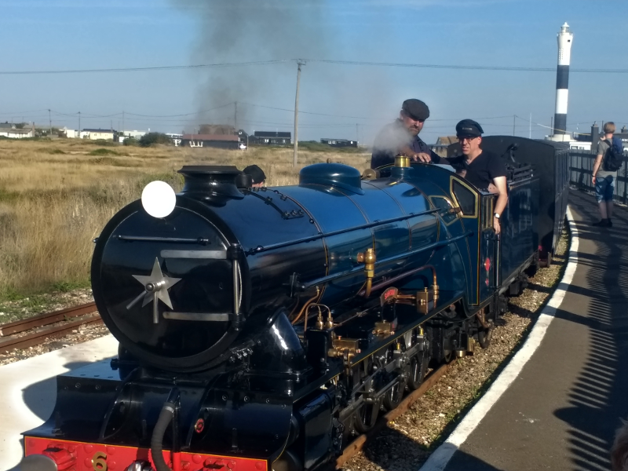

### Dungeness

September rolls round and I am blessed with a renewed resolve. Through good
behaviour and a cunning deployment of miniature railways, I also am gifted with
an AB2 who is prepared to try a Dungeness outing.

Pronoun guidance: AB1's resolve is renewed. This post covers the events of
the 1st September, 2018.

#### A distant carrot

It's a good job there's a miniature railway involved - the journey
would be unsellable otherwise - Northern to Pancras, HS1 and change to
tiny Kentish station (tm), taxi, and finally, [Romney, Hythe and Dymchurch railway](https://www.rhdr.org.uk/) for the final leg.
It really is a remarkably small train! Exactly (really? -Ed) half-way between
Hornby and actual train. 

You sit in pairs, on mildly uncomfortable seats. There's possibly a foot of
headroom on cars that are roofed. Views over the surrounding countryside are
good, but not particularly elevated! No trolley service, but one of the
middle stations has ice creams on the platform. Smart.

As well as being small, the train is _slow_ - it takes 75 minutes to
traverse the 20 odd miles to Dungeness. My inner cyclist is itching at
such a slow pace, particularly when I see several railway-side paths
aggressively labelled as not for cycling.

#### Dungeness arrival

We arrive in Dungeness. It is seriously hot. It is also perilously close to
 lunchtime, and once we set off on our walk the opportunities for food will
  be rather limited. We dive into a nearby
pub (The Britannia Inn) for a rapid fish and chips, and easily the
worst pint of the year so far. Kentish pubs. Sort your pipes out. Shepherd
 Neame. Sort your beer out.

#### The sea and the desert

Post pub, we give the sea a brief staring at. Nothing of note. The
famed sewage outlets are sufficiently gulled, but not by any species
of particular distinction.
 
<figure class="figure">
  
  <figcaption class="figure-caption text-center">
    Dunge, dunge, dunge, dunge Dungeness is bleak (to the theme of 'Thundercats')
  </figcaption>
</figure>
 
 We turn inland, heading for the bird observatory. Plenty of activity there,
 but unfortunately, all of it is human - lots of people looking, and not
  finding. A few are mucking about with nets.

A conversation or two yields no exciting news - the rough 'desert' ENE
of the observatory has apparently had a group of Whinchat in it. The
internet has also told tale of several Lesser Whitethroat. We shall
see.

We head in that general direction and immediately encounter
Wheatear. Always a pleasure. It finds several Wheatear compatible
perch points: old concrete block, tick; railway sleepers, tick; patch
of grass near a fence, tick. Lovely.

Next, we descend into a strip of trees. These are almost entirely
silent. No movement. We hurry on through, a single Common Whitethroat
our only accompaniment.

The path, such as it is, opens out into less densely shrubbed scrubby
stuff. This is chat territory. Off to the left there are several
watercourses, and some bramble encrusted willows bordering. Several
tit flocks are peeping their way along them.

<figure class="figure">
  
  <figcaption class="figure-caption text-center">
    This delightful Comma butterfly did punctuate the walk, though
  </figcaption>
</figure>

Nothing much else happens for at least a kilometre, and then
_everything_ kicks off. One or two Stonechats multiply into many more,
perhaps getting into double figures. We check them diligently for
Whinchat - having been starved of anything to look at we've got plenty
of focus to spend. Several Common Whitethroat are sharing the same
tangled shrubs, so we get stuck here for several minutes.

A pair of Whinchat are eventually differentiated - and they're in
pretty good nick - noticeably cleaner than the birds we saw in
Scotland. Still not the pinnacle of Whinchat occurrences though - I'm
mindful of a trip to Wanstead where we saw seven in the space of a
couple of minutes, at considerably closer quarters and (just as
importantly) less far from home!

I take a brief break from chats and give the treeline running parallel
to the waterline a bit of a look. There's a couple of birds making
their way along it; more Common Whitethroat? A look through the
bins...does not confirm. They might even be Lesser Whitethroat, you
know - there's none of the warm colour palette common would have.

They're rather too far away to be sure. The pair seem unfazed by our
approach, so, after a brief attempt with the scope, we get near enough
to pick out the details just with the binoculars. Yep. Lesser
Whitethroat. They exist. That wasn't even difficult. Apart from the
three plus hour journey to get here, and the fact that we're in
Britain's only desert, on one of the year's hottest days. Easy.

#### Road to hell

We eventually exit the desert on to the main road that leads to
Dungeness RSPB. This road is _miserable_ - straight, flat, exposed,
featureless and with nowhere for pedestrians, and therefore not at all
safe. I have walked it once before in almost opposite conditions -
wet, cold, and blowing a gale and I struggle to say which was
worse. Amusingly, that other walk was for the same bird - Cattle Egret.

This time, the bird has been reported on the RSPB reserve; previously
I had to skulk across the reserve and then up to some farm buildings
even further away. There should even be time to do a quick circuit of
the reserve in question, although, eesh - given how long it's taken us
to get here, it'll have to be rapid. The RSPB map reckons we need an
hour. 

#### RSPB Dungeness

That should be plenty; while the reserve is well-maintained and has
some excellent hides, it is often better in the Winter, when it boasts
spectacular wildfowl numbers. We briefly tarry in one of the hides and
spot a pair of Black Tern (_so_ glad to have spent a day failing to
get a view half this good on the Thames the other week) and admire a
flock of hirundines feasting in the sunshine. And, to be honest, enjoy
walking along something that isn't that bloody road.

The end of our circuitous walk brings us back to the reserve's
entrance track. We've walked this one-way already. Now for the return
journey. Cattle Egret, can, apparently, be found with the cattle off
to one side of the entrance track. We gave this field a decent look on
the way in, but, to be completely honest, were too much in need of
refreshment to look properly.

I suspect we'll have more luck now - two cars are parked up on the
track, and a group well-equipped with 'scopes is gathered near
them. We set up camp within earshot and tune in to what appear to be
the primary birder's commentary. The egret is, apparently, moving with
the cattle, from right to left. At the moment, it's obscured by two or
three cows. There are hints of it between legs now and
again - a flash of white in a sea of yellows and greens. Eventually
the gaps between cows is perfect, and the whole bird is visible.

<figure class="figure">
  
  <figcaption class="figure-caption text-center">
    Fencepost Kestrel
  </figcaption>
</figure>

Ok, excellent, great. Unfortunately, we have to go; less than an hour
remains before the last train back to civilisation, and according to
Google Maps it will take us three quarters of an hour to get
there. Along that sodding road again. Ugh. I hypnotise myself into a
marching rhythm, only interrupted by an excellent fencepost Kestrel.

Eventually we make it back to the miniature railway terminus, and
recover from our latest baking with a fizzy drink. We bag seats in one
of the open-top cars on the way back, which cools us off nicely.

<figure class="figure">
  
  <figcaption class="figure-caption text-center">
    _Exactly_ half-way between Hornby and actual train
  </figcaption>
</figure>

#### Conclusion

That was hard work. Trying to do both the NNR and the RSPB reserve
using the railway was a bridge too far - neither really got the
attention they perhaps deserved. We totally ignored the sea bar a very
quick look, too. I leave with the same impression as last time, that
this site would be better experienced in a car, having stayed in a
place not too far away.
