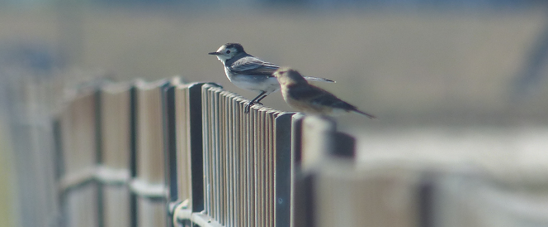
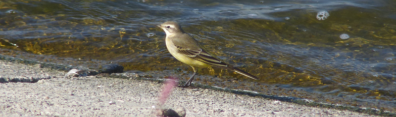
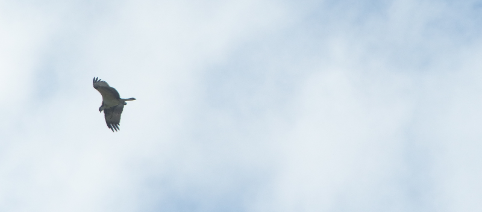

### Staines Wagtails

We reach the middle of September and a few more species start to make
a break back to the continent. We catch up with two of them.

The swifts have already made a hasty disappearance. Swallows and martins are
on the move too. More excitingly, reports from Staines Reservoirs bring news
of a good twenty-odd Yellow Wagtails gamboling around on the causeway.

Pronoun guidance: AB1 is sceptical of wagtail reports. This post details the
 events of September 16th, 2018.

#### Overenthusiastic Reporting

Now. Yellow Wagtail is reported a lot on passage, often in ones and
twos. I have, in previous entries, completely omitted all mention of
this happening, because they are _never_ there. The closest we've come
to picking up Yellow Wagtail somewhere it's been reported was at Oare,
where an overenthusiastic birder tried to make a very worn Pied
Wagtail into a juvenile. Most reports are flyovers, we suspect, and so
we've got into the habit of dismissing them out of hand.

#### Quantity _and_ Quality

Twenty, though? Twenty might be worth the pain in the arse journey
that Staines is from home. I quiz the reporter on twitter; he confirms
that the birds are both numerous and on the ground. It's a beautiful
day, let's get out there.

A couple of hours later, we find ourselves at the Eastern entrance to
the causeway. One small bonus of the route: a McDonald's just before
the reservoirs, which provided some suddenly much-needed sustenance.

I suddenly realise AB2 probably hasn't been here before, so provide a
quick briefing on the weirdness of the site, remind her of its
hallowed status as bird 200 provider, etc. Unusually for a trip to
Staines, we're (hopefully) not going to be spending huge amounts of
time staring at the water in search of our quarry, and it's not the
middle of the Winter.

We get up to the causeway, and for the first time ever I am glad of
the constant wind it receives - the sun is hot and its rays are unimpeded by
clouds, and without the cooling breeze the heat would be borderline
unpleasant.

#### Wagtails. Thousands (Ok, hundreds) of 'em

It's immediately clear there are large numbers of wagtails on the
causeway. Even from here, I'm guessing there are at least 100
scattered about - some sitting on the fences, others picking about at
the base of the reservoir, some just have a sit down in the middle of the path.
 All I've got at the moment are Pied, however.

<figure class="figure">
  
  <figcaption class="figure-caption text-center">
    Oh, and a linnet or two.
  </figcaption>
</figure>

A closer look would help. Heck, we're planning to go and explore
Staines Moor afterwards anyhow, so we need to make our way across
the causeway. We reach the non-annoying area of fencing and take another
look. We're surrounded by wagtails now - some that we disturbed have
retaken their positions behind us, and many we are yet to bother
ahead. Both groups, now we are nearer, obviously contain several
Yellow Wagtail (despite the variance between different YW subspecies,
it's very clear how they differ from the pieds). Excellent. I dash out
a quick message to the original reporter to say thanks; the sheer
number of birds present has already made this a worthwhile journey.

We spend a while taking terrible photos of the wagtails (they aren't
quite tame enough to let us get close enough, and the heat haze adds
another unwanted blur filter on top of that), before moving on to
Staines Moor.

<figure class="figure">
  
  <figcaption class="figure-caption text-center">
    This one posed rather nicely, though.
  </figcaption>
</figure>

#### To the moor

Once off the causeway, we're into one of the less glamorous parts of
this trip - walking up the road dividing Staines reservoirs from the
neighbouring King George VI reservoir. The boredom is briefly lifted
by yet more Yellow Wagtails (a group of six are making their way along
the fence line at the top of the KGVI), but it's still otherwise a
straight and featureless bit of road. Fortunately it is short (unlike
the Dungeness one), and before too long we're on a scruffy little
footpath cutting between the KGVI and the village of Stanwell Moor.

I've encountered Little Owl in the farmland adjacent to the path here
before, so I am reasonably alert, scanning suitable perch points for
any sign of them. Nothing doing though.

The landscape opens out in front of us and a little information panel
tells us we have reached Staines Moor. This is easily the best I've
seen it look. One could almost forget the M25 borders it.

#### A mystery raptor

We're not far into the moor when we spot two large birds carving
around in the middle of it. They're basically silhouetted against the
summer sky. My initial thought is Red Kite. Indeed, one of them, when
turning, shows off a forked tail. Probably both Red Kites
then. Hmm. Or not. The other seems a different shape. Best to keep
watching.

The definite kite and the mystery go their separate ways at this
point, the kite heading South-East, and the mystery, usefully, along
the River Colne, towards us. It's not just a heron, is it? That might
have tried to mob a kite, I suppose. No. Wrong flap.

The bird drops down a bit so it's below the skyline; the contrast
reveals some of its colours, and more of its shape. Bloody hell,
that's an Osprey!

A hurried few seconds are spent convincing AB2 (who sensibly thinks I
am making stuff up) of this fact. Any doubt is swiftly erased by the
bird diving into the river in an attempt to catch a fish not fifty
yards from us. Amazing! We scoot around a little so that the bird
spends more time with us between the sun and it. What a tremendous
sight it is - all of the detail of the bird is revealed; the curve in
the beak, the yellow eye, the white of the underside. 

Our only failure is in capturing any of these details; we're far too excited
to take any decent photographs! We manage a decent few record shots that will
later briefly propel us to South-West London/Surrey birding stardom, but
none of them really convey how bloody brilliant it was to find such a showy
Osprey in the middle of a moor next to the M25.

<figure class="figure">
  
  <figcaption class="figure-caption text-center">
    This was the best we managed.
  </figcaption>
</figure>

We put out the news. The Osprey knows how that works, and buggers off
South over the bypass at the earliest available opportunity. I'm glad
we have photographic proof. We check in with another birder who has
been making his way around the opposite side of the river with more
serious photographic equipment. He's done rather better than we have
in the contrast stakes (i.e there is some contrast), but his
excitement seems muted. We let him be and head towards the bypass
ourselves; the path back to the station goes underneath it.

#### An eventful return

I'm expecting an uneventful remainder of walk at this
point. Incorrectly, it turns out. Our crossing of the river is barred
by an assortment of horses. They do a mixture of staring at us and
ignoring us, but show no sign of getting out of the way. We decide to
break the deadlock by walking directly at the bridge - slow panic
ensues; the group retreats twenty odd metres upstream and then plunge
into the water, before resuming the staring contest from the other
side of the bridge. Helpful.

We cross the bridge, and they've had enough of being near us at all,
and stalk off towards some cattle off to our right. Another pair of
Yellow Wagtail are mucking about around the cattle on our way; props
to them for having read the bird book.

We exit the moor under the bypass and cross some sort of
canal. Looking along it, there's a well-concealed Buzzard in the trees
off to its right. Definitely a Buzzard, and not the Osprey again, we
make sure. From here a delightful but dank path along another river
(the Wraysbury?), a brief tour through a retail park (we decide against a
second McDonald's), and a secret passage alongside the railway line take us
back on the train home.